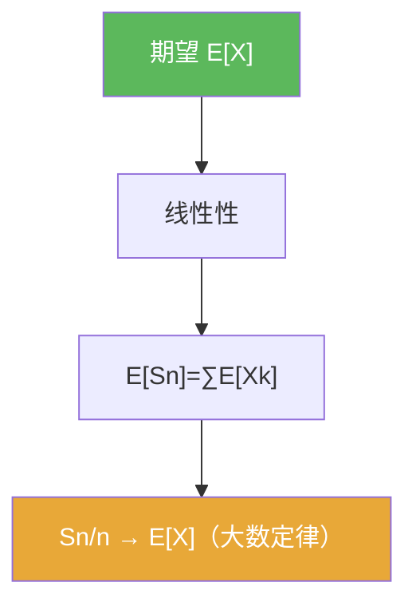

# 期望

> [!abstract] 概述
> ==期望==是“平均值”的抽象化：它把随机变量映射成一个确定数，并且满足可加性。  
> 在本章里，期望的可加性给出部分和 $S_n$ 的主尺度 $\mathbb E[S_n]=O(n)$，从而引出“大数定律”的归一化 $S_n/n$。

## 定义

> [!def] 期望（离散直觉版）
> 若 $X$ 取可数值且 $\sum_x |x|\mathbb P(X=x)<\infty$，则
> $$\mathbb E[X]=\sum_x x\,\mathbb P(X=x).$$

> [!def] 期望（一般版提示）
> 更一般地，$\mathbb E[X]$ 是 $X$ 关于概率测度的积分（细节依赖测度论框架；本章只需掌握可加性与常见计算）。

## 核心性质（命题工具箱）

| 性质/命题 | 表述（可直接引用） | 用途（做题时怎么用） |
|---|---|---|
| 线性性 | $\mathbb E[aX+bY]=a\mathbb E[X]+b\mathbb E[Y]$ | 处理部分和与中心化 |
| 部分和均值 | $S_n=\sum_{k=1}^n X_k$ ⇒ $\mathbb E[S_n]=\sum \mathbb E[X_k]$ | 识别 $n$ 尺度、构造 $S_n-n\mu$ |
| Bernoulli | $X\sim\mathrm{Bernoulli}(p)$ ⇒ $\mathbb E[X]=p$ | 0/1 模型的入口 |

## 关系网络

## 章节扩展

### 第05章：概率论基础

- 5.1：Bernoulli 模型下的期望：[[5.1 Bernoulli试验#二、核心思想]]
- 5.2：部分和的中心化：[[5.2 独立随机变量的和#二、核心思想]]

## 补充

> [!info] 常见误区
> “期望存在”是一个条件：并非所有随机变量都有有限期望。做题时若要使用 LLN/CLT 的某些版本，需要先检查可积性或二阶矩存在。
>
> **参考（权威外链）**
> - https://en.wikipedia.org/wiki/Expected_value

## 参见

- [[方差]]
- [[大数定律]]

