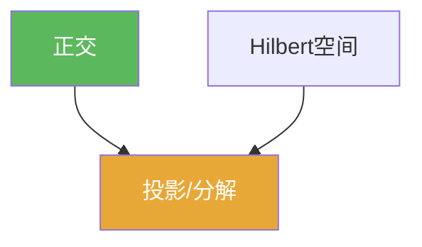

# 正交

> [!abstract] 概述
> ==正交==把“垂直”推广到抽象空间：在内积空间中，$\langle x,y\rangle=0$ 表示 $x$ 与 $y$ 正交。  
> 做题时正交最常用的意义是“把最小化/最佳逼近转成正交条件”，以及“用勾股把误差拆开”。

## 定义

> [!def] 定义
> 在内积空间 $H$ 中，若 $\langle x,y\rangle=0$，则称 $x\perp y$。

## 核心性质（命题工具箱）

| 性质/命题 | 表述（可直接引用） | 用途（做题时怎么用） |
|------|------|------|
| 勾股定理 | 若 $x\perp y$，则 $\|x+y\|^2=\|x\|^2+\|y\|^2$ | 误差平方可加：最小化/估计中极常用 |
| 正交投影判别 | $m\in M$ 是 $x$ 到闭子空间 $M$ 的最佳逼近 $\iff x-m\perp M$ | 把“求最小距离”问题转成“正交条件” |
| 正交系展开 | 正交（规范）系便于做 Fourier/谱分解 | 进入 Hilbert 算子与谱论的核心语言 |

## 典型例子与非例子

| 类型 | 例子 | 提醒 |
|---|---|---|
| 典型 | $\mathbb{R}^n$ 中标准基两两正交 | 最直观的模型 |
| 典型 | $L^2$ 中不同频率的三角函数正交 | 为 Fourier 分析与谱论提供基础 |
| 非例子 | 在一般赋范空间里没有“正交”概念 | 正交依赖内积，不是任意范数都支持 |

## 关系网络

## 章节扩展

### 第01章：度量空间

- 1.6：正交概念与内积几何：[[1.6 内积空间#二、核心思想]]

## 补充

> [!info] 常见误区与来源
>
> - 误区：把 $\langle x,y\rangle=0$ 当作“互不相关/独立”等概率含义。这里是纯几何/分析概念。  
> - 误区：在非内积空间中强行使用“正交直觉”。此时可用其它工具（如对偶配对）替代。
>
> **参考（权威外链）**
> - IITG MA641 notes（含正交投影与投影定理）：https://fac.iitg.ac.in/rksri/MA641%20Operator%20Theory%20in%20Hilbert%20Spaces%20lecturenotes%202020.pdf
> - Wikipedia: Orthogonality: https://en.wikipedia.org/wiki/Orthogonality

## 参见

- [[Hilbert空间]]
- [[内积空间]]
