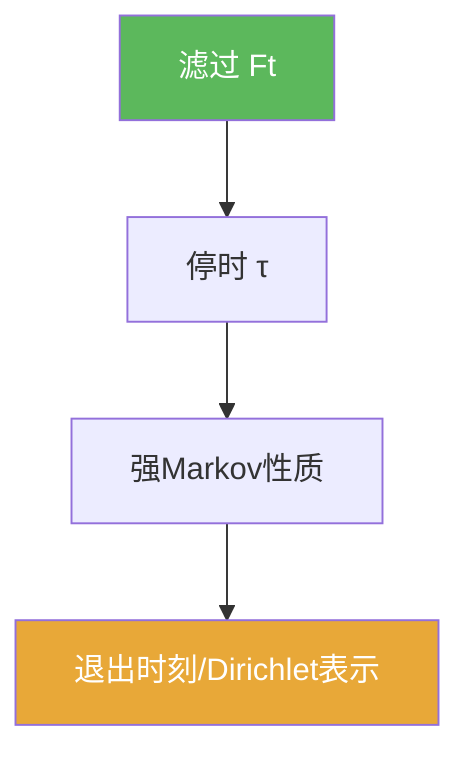

# 滤过

> [!abstract] 概述
> ==滤过==是“信息随时间增长”的形式化：$\mathcal F_t$ 表示时刻 $t$ 可观测到的信息。  
> 在 Brownian 理论中，停时与强 Markov 的所有量词都围绕滤过展开。

## 定义

> [!def] 滤过
> 一族 $\{\mathcal F_t\}_{t\ge 0}$ 称为滤过，如果对 $s\le t$ 有 $\mathcal F_s\subset\mathcal F_t$。

> [!def] 自然滤过（Brownian）
> 对过程 $B$，自然滤过常取
> $$\mathcal F_t^B=\sigma(B_s:0\le s\le t).$$

## 核心性质（命题工具箱）

| 性质/命题 | 表述 | 用途 |
|---|---|---|
| “只用过去信息” | 事件属于 $\mathcal F_t$ 表示它可由 $[0,t]$ 的信息判断 | 检验停时、构造策略 |
| 停时定义依赖滤过 | $\{\tau\le t\}\in\mathcal F_t$ | 强 Markov 的前提 |
| 强 Markov 以 $\mathcal F_\tau$ 为条件 | 条件于“停时的过去信息” | 断开未来与过去 |

## 关系网络

## 章节扩展

### 第06章：Brownian运动引论

- 滤过与停时入口：[[6.1 框架#二、核心思想]]
- 强 Markov 的使用口径：[[6.5 停时和强Markov性质#二、核心思想]]

## 补充

> [!info] 参考（权威外链）
> - https://en.wikipedia.org/wiki/Filtration_(probability_theory)

## 参见

- [[停时]]
- [[强Markov性质]]

