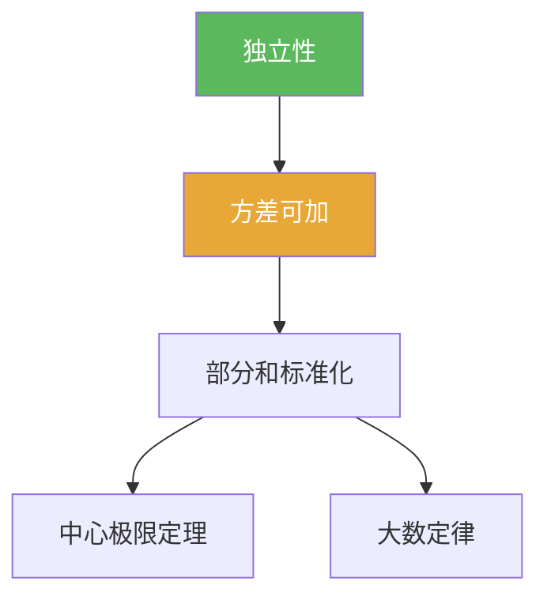

# 独立性

> [!abstract] 概述
> ==独立性==是本章“可加性 + 极限定理”成立的关键假设之一：它让“不同次数的随机扰动互不影响”，从而方差可加、部分和可标准化，并通往 LLN/CLT。

## 定义

> [!def] 事件独立
> 事件 $A,B$ 独立指 $\mathbb P(A\cap B)=\mathbb P(A)\mathbb P(B)$。

> [!def] 随机变量独立（有限维）
> 随机变量 $X_1,\dots,X_n$ 独立，指对任意 Borel 集 $B_1,\dots,B_n$，
> $$\mathbb P(X_1\in B_1,\dots,X_n\in B_n)=\prod_{k=1}^n \mathbb P(X_k\in B_k).$$

## 核心性质（命题工具箱）

| 性质/命题 | 表述（可直接引用） | 用途（做题时怎么用） |
|---|---|---|
| 协方差为 0 | 独立 ⇒ $\mathrm{Cov}(X,Y)=0$ | 解释方差可加的来源 |
| 方差可加 | 独立且二阶矩存在时：$\mathrm{Var}(\sum X_k)=\sum\mathrm{Var}(X_k)$ | 识别 $\sqrt n$ 尺度 |
| 两两独立不足 | 两两独立不必推出相互独立 | 避免偷换条件（尤其极限定理） |

## 关系网络

## 章节扩展

### 第05章：概率论基础

- 5.1：独立重复试验的直觉入口：[[5.1 Bernoulli试验#二、核心思想]]
- 5.2：独立随机变量之和与尺度识别：[[5.2 独立随机变量的和#二、核心思想]]

## 补充

> [!info] 常见误区
> 不相关（协方差为 0）不必推出独立；“两两独立”也不必推出“相互独立”。做题前先检查题设的量词与独立口径。
>
> **参考（权威外链）**
> - https://en.wikipedia.org/wiki/Independence_(probability_theory)

## 参见

- [[方差]]
- [[中心极限定理]]
- [[大数定律]]

