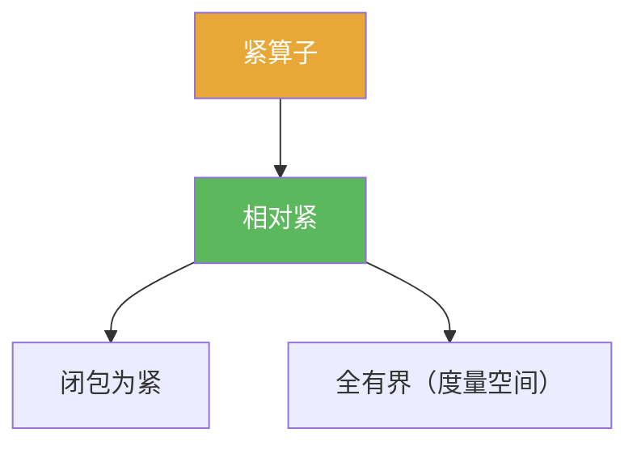

# 相对紧集

> [!abstract] 概述
> ==相对紧==表示“闭包是紧的”。  
> 在紧算子理论中，“$T(E)$ 相对紧”是核心语句：紧算子把有界集送到相对紧集。

## 定义

> [!def] 相对紧集（预紧集）
> 在度量空间 $(X,d)$ 中，集合 $E\subset X$ 称为相对紧，若其闭包 $\overline E$ 是紧集。

## 核心性质（命题工具箱）

| 性质/命题 | 表述（可直接引用） | 用途（做题时怎么用） |
|------|------|------|
| 序列刻画 | $E$ 相对紧 $\iff$ 任意序列 $(x_n)\subset E$ 有收敛子列（极限在 $\overline E$） | 做题时用“抽子列”替代开覆盖 |
| 与全有界/完备 | 在度量空间中：相对紧 $\iff$ 全有界；若再加闭性或完备性可推出紧 | 用“有限覆盖/ε-网”证明相对紧 |
| 紧算子定义 | $T$ 紧 $\iff$ $T(B_X)$ 相对紧 | 把“对任意有界集”降到“只看单位球” |

## 典型例子与非例子

| 类型 | 例子 | 提醒 |
|---|---|---|
| 相对紧 | $\mathbb{R}^n$ 中任意有界集 | 有限维里有界即相对紧 |
| 非相对紧 | 无限维 Banach 中的闭单位球（典型） | 解释“紧性稀缺”现象 |

## 关系网络

## 章节扩展

### 第03章：紧算子与Fredholm算子

- 3.1：紧算子定义直接使用相对紧像集：[[3.1 紧算子的定义和基本性质#二、核心思想]]

## 补充

> [!info] 来源
> - Wikipedia: Relatively compact: https://en.wikipedia.org/wiki/Relatively_compact

## 参见

- [[紧集]]
- [[全有界]]
- [[紧算子]]
