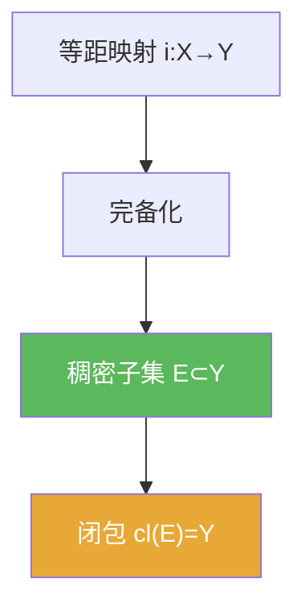

# 稠密子集

> [!abstract] 概述
> ==稠密==是“可逼近性”的刻画：集合 $E$ 在 $Y$ 中稠密意味着 $Y$ 的任意点都能被 $E$ 中点任意精度逼近。  
> 在泛函分析里，稠密性经常用来把结论从“好处理的子空间/简单函数”推广到整个空间（例如：先在稠密子空间上证明，再用连续性延拓）。

## 定义

> [!def] 定义
> 在度量空间 $(Y,\rho)$ 中，$E\subset Y$ 若满足
> $$\forall y\in Y,\ \forall\varepsilon>0,\ \exists x\in E:\ \rho(x,y)<\varepsilon,$$
> 则称 $E$ 在 $Y$ 中 **稠密**。

## 核心性质（命题工具箱）

| 性质/命题 | 表述（可直接引用） | 用途（做题时怎么用） |
|------|------|------|
| 闭包刻画 | $E$ 在 $Y$ 中稠密 $\iff \overline{E}=Y$ | 用闭包/邻域语言改写“逼近”条件，便于证明 |
| 开集交集刻画 | $E$ 稠密 $\iff$ 任意非空开集都与 $E$ 相交 | 用于“存在性”证明：只需证明在任意开集里能找到点 |
| 完备化中的稠密 | 完备化要求 $i(X)$ 在 $\overline X$ 中稠密 | 保证新增点都是“Cauchy 极限补全”，而不是随便加点 |

## 典型例子与非例子

| 类型 | 例子 | 提醒 |
|---|---|---|
| 稠密 | $\mathbb{Q}$ 在 $\mathbb{R}$ 中稠密 | 任意实数都可被有理数逼近 |
| 稠密 | 多项式在 $C([a,b])$ 中稠密（Weierstrass） | 典型“先在简单对象上证明，再推广”的套路 |
| 不稠密 | $\mathbb{Z}$ 在 $\mathbb{R}$ 中不稠密 | 相邻整数间有空隙，无法任意精度逼近 |

## 关系网络

## 章节扩展

### 第01章：度量空间

- 1.2：完备化定义中的稠密条件：[[1.2 完备化#二、核心思想]]

## 补充

> [!info] 常见误区与来源
>
> - 误区：把“稠密”理解成“集合很大/测度很大”。稠密是拓扑概念，与测度大小无直接关系（例如 $\mathbb{Q}$ 稠密但测度为 0）。  
> - 误区：把“稠密子集”当作“几乎处处”之类的测度概念。
>
> **参考（权威外链）**
> - Wikipedia: Dense set: https://en.wikipedia.org/wiki/Dense_set

## 参见

- [[完备化]]
- [[等距映射]]
