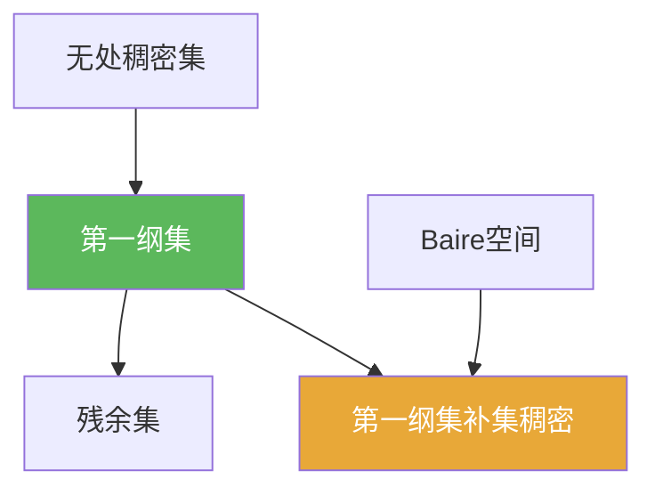

# 第一纲集

> [!abstract] 概述
> ==第一纲集==（meagre set）是范畴语言里最典型的“很小”集合：可数个无处稠密集的并。  
> 在 Baire 空间中，第一纲集的补集是稠密的，因此常用来表达“典型性质”：一个性质若在补集上成立，就称它在范畴意义下“几乎处处”成立。

## 定义

> [!def] 第一纲集
> 在拓扑空间 $X$ 中，若集合 $A$ 可写为
> $$A=\bigcup_{n=1}^\infty A_n,$$
> 其中每个 $A_n$ 都是无处稠密集（$\overline{A_n}$ 内点为空），则称 $A$ 为==第一纲集==。

## 核心性质（命题工具箱）

| 性质/命题 | 表述（可直接引用） | 用途（做题时怎么用） |
|---|---|---|
| 第一纲集“很小” | 第一纲集是可数个无处稠密集的并 | 把“坏性质集合”拆成可数多个“稀薄坏集”即可 |
| Baire 中补集稠密 | 若 $X$ 是 Baire 空间，$A$ 第一纲，则 $X\setminus A$ 稠密 | 推出“好性质典型” |
| 残余集 | 残余集定义为第一纲集的补集 | 用于表述“范畴意义下几乎处处” |

## 关系网络

## 章节扩展

### 第04章：Baire纲定理的应用

- 第一纲/残余的直觉入口：[[4.1 Baire纲定理#二、核心思想]]
- Besicovitch 作为“反直觉示例”的定位说明：[[4.5 Besicovitch集#三、补充理解与易混淆点]]

## 补充

> [!info] 范畴 vs 测度
> 第一纲集讨论的是“拓扑稀薄”，与“测度为 0”互不蕴含；两套语言经常并行出现（尤其在分析与动力系统中），但不要混用。
>
> **参考（权威外链）**
> - https://en.wikipedia.org/wiki/Meagre_set

## 参见

- [[Baire空间]]
- [[Baire纲定理]]
- [[Besicovitch集]]

