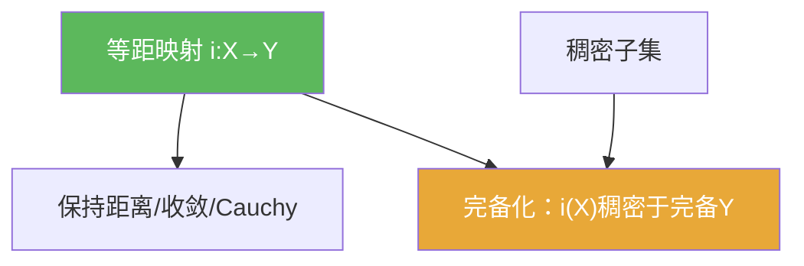

# 等距映射

> [!abstract] 概述
> ==等距映射==严格保持距离，是“把一个度量空间嵌入另一个度量空间”的标准方式。  
> 做题时它最常用的意义是：一切只用距离表述的性质（收敛/Cauchy/完备性等）都能在等距映射下“原样搬运”。

## 定义

> [!def] 定义
> 设 $(X,d)$、$(Y,\rho)$ 为度量空间。映射 $i:X\to Y$ 若满足：
> $$\rho(i(x_1),i(x_2))=d(x_1,x_2),\quad \forall x_1,x_2\in X,$$
> 则称 $i$ 为等距映射（等距嵌入）。若 $i$ 还是双射，则称为等距同构。

## 核心性质（命题工具箱）

| 性质/命题 | 表述（可直接引用） | 用途（做题时怎么用） |
|------|------|------|
| 保持收敛 | 若 $x_n\to x$，则 $i(x_n)\to i(x)$；反之若 $i$ 为嵌入，也可用像空间收敛判断原空间 | 把收敛问题搬到更方便的空间（例如完备化） |
| 保持 Cauchy | $(x_n)$ Cauchy $\iff (i(x_n))$ Cauchy | 在构造完备化/证明完备性时最常用 |
| 完备性关系 | 若 $X$ 完备，则 $i(X)$ 在 $Y$ 中是完备的（以继承度量） | 常用结论：完备性可以“在像集里”继承 |
| 完备化框架 | 完备化：$i$ 等距嵌入且 $i(X)$ 在 $\overline X$ 中稠密 | 识别“这是补全还是只是嵌入” |

## 典型例子与非例子

| 类型 | 例子 | 提醒 |
|---|---|---|
| 等距例子 | $\mathbb{Q}\hookrightarrow\mathbb{R}$（欧氏距离） | 保持距离但像集在 $\mathbb{R}$ 中稠密 |
| 等距例子 | 赋范空间中平移 $x\mapsto x+a$ | 距离不变：$\| (x+a)-(y+a)\|=\|x-y\|$ |
| 非例子 | 单纯的连续单射但不保持距离 | 连续/单射不等于等距，不能搬运 Cauchy/完备等性质 |

## 关系网络

## 章节扩展

### 第01章：度量空间

- 1.2：完备化的等距嵌入框架：[[1.2 完备化#二、核心思想]]

## 补充

> [!info] 常见误区与来源
>
> - 误区：把“等距”当作“保持范数/保持内积”。在一般度量空间里只有距离概念；在赋范/内积空间里才有进一步结构可谈。  
> - 误区：忽略“稠密”条件，把任意等距嵌入都当作完备化。
>
> **参考（权威外链）**
> - Wikipedia: Isometry: https://en.wikipedia.org/wiki/Isometry

## 参见

- [[稠密子集]]
- [[完备化]]
