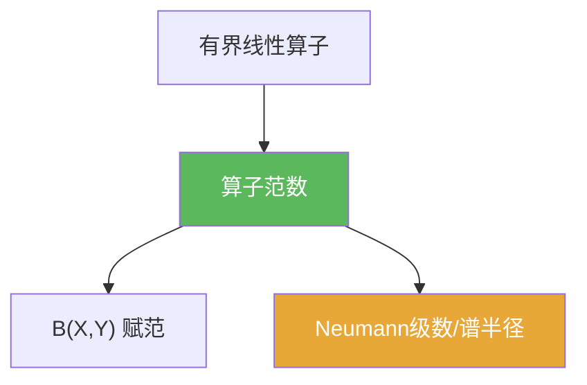

# 算子范数

> [!abstract] 概述
> ==算子范数==把“线性算子对向量长度的最大放大倍数”数值化。它是 $B(X,Y)$ 的自然范数，使得“有界/连续”与“存在全局估计 $\|Tx\|\le C\|x\|$”完全等价。

## 定义

> [!def] 定义
> 对 $T\in B(X,Y)$ 定义
> $$\|T\|=\sup_{\|x\|\le 1}\|Tx\|.$$

## 核心性质（命题工具箱）

| 性质/命题 | 表述（可直接引用） | 用途（做题时怎么用） |
|------|------|------|
| 最小常数 | $\|T\|=\inf\{C:\ \|Tx\|\le C\|x\|,\ \forall x\}$ | 找不到“最好 $C$”时，先用上界估计 $\|T\|$ |
| 次可加 | $\|S+T\|\le \|S\|+\|T\|$ | 估计扰动项，常用于稳定性分析 |
| 次乘性 | $\|ST\|\le \|S\|\,\|T\|$ | 控制迭代/幂次：$\|T^n\|\le \|T\|^n$ |
| 与预解/Neumann | 若 $\|T/\lambda\|<1$ 则 $\lambda\in\rho(T)$，并有 $(T-\lambda I)^{-1}$ 的级数表示 | 谱论估计中最常用的“可逆判据”模板 |

## 典型例子与非例子

| 类型 | 例子 | 提醒 |
|---|---|---|
| 可计算例子 | $X=Y=\mathbb{R}^n$，$T$ 为矩阵 | 不同向量范数会给出不同的算子范数 |
| 估计例子 | 积分算子/卷积算子 | 通常用不等式（如 Hölder）给出 $\|T\|$ 上界 |
| 非例子 | 非有界线性算子没有算子范数（记为 $\|T\|=\infty$） | 先判定有界性，才谈范数 |

## 关系网络

## 章节扩展

### 第02章：线性算子与线性泛函

- 2.1：给出定义并用于“连续⇔有界”的等价：[[2.1 线性算子的概念#二、核心思想]]
- 2.6：用 $\|T/\lambda\|<1$ 推出 $\lambda\in\rho(T)$（谱的圆盘包含）：[[2.6 线性算子的谱#二、核心思想]]

### 第03章：紧算子与Fredholm算子

- 3.3：紧算子谱结构的推导会复用 $\|T/\lambda\|<1$ 等范数判别：[[3.3 紧算子的谱理论#二、核心思想]]

## 补充

> [!info] 来源
> - https://faculty.etsu.edu/gardnerr/Func/notes/2-4.pdf  
> - https://en.m.wikipedia.org/wiki/Operator_norm

## 参见

- [[有界线性算子]]
- [[线性算子]]
- [[Neumann级数]]
- [[谱半径]]
