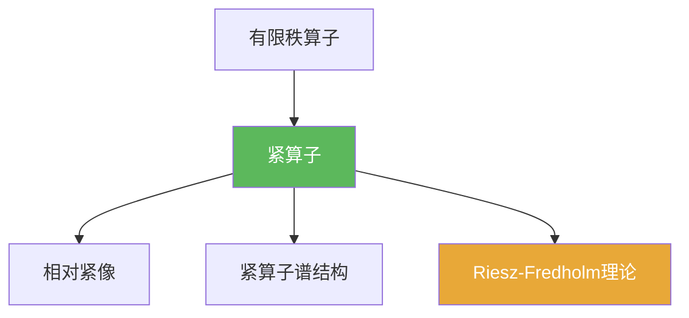

# 紧算子

> [!abstract] 概述
> ==紧算子==是“把有界集压缩成相对紧集”的有界线性算子。  
> 它把无限维中的不可逆性限制在有限维层面，从而产生 Riesz–Fredholm 理论与紧算子谱结构。

## 定义

> [!def] 紧算子
> 设 $X,Y$ 为赋范线性空间，$T\in B(X,Y)$。若对任意有界集 $E\subset X$，集合 $T(E)$ 在 $Y$ 中相对紧（闭包紧），则称 $T$ 为紧算子。

## 核心性质（命题工具箱）

| 性质/命题 | 表述（可直接引用） | 用途（做题时怎么用） |
|------|------|------|
| 序列刻画 | $T$ 紧 $\iff$ 对任意有界序列 $(x_n)$，$(Tx_n)$ 有收敛子列 | 证明紧性首选工具 |
| 有限秩包含 | 有限秩算子一定紧 | 用逼近/有限维化处理紧性 |
| 闭性 | 若 $\|T_n-T\|\to 0$ 且 $T_n$ 紧，则 $T$ 紧 | 处理极限与算子范数收敛 |

## 典型例子与非例子

| 类型 | 例子 | 提醒 |
|---|---|---|
| 典型 | 有限秩算子 | 最基本的紧算子来源 |
| 典型 | 某些积分算子（合适空间与核条件下） | 常用于 PDE/积分方程 |
| 非例子 | 无限维 Banach 上的恒等算子 | 有界但通常不紧 |

## 关系网络

## 章节扩展

### 第03章：紧算子与Fredholm算子

- 3.1：定义、序列刻画与基本性质：[[3.1 紧算子的定义和基本性质#二、核心思想]]
- 3.3：紧算子谱结构：[[3.3 紧算子的谱理论#二、核心思想]]

## 补充

> [!info] 常见误区与来源
>
> - 误区：把“像集有界”当作“紧”。紧算子要的是==相对紧==，比有界强。  
> - 误区：以为紧算子只能在 Hilbert 空间出现；实际上它是赋范空间层面的概念。
>
> **参考（权威外链）**
> - Oxford Functional Analysis notes (Compact operators): https://people.maths.ox.ac.uk/porterm/FunctionalAnalysis/compact_operators.pdf

## 参见

- [[有限秩算子]]
- [[相对紧集]]
- [[Riesz-Fredholm定理]]
- [[紧算子谱定理]]
