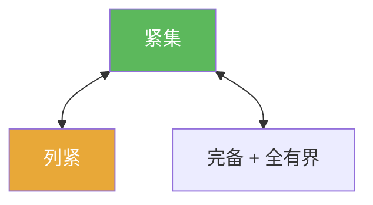

# 紧集

> [!abstract] 概述
> ==紧性==是分析里控制“无穷过程”的核心性质：它把“无限覆盖/无限序列”都压缩到“有限信息”。  
> 在度量空间中，紧性与列紧性等价，并可用“完备 + 全有界”判别，这是做题最常用的紧性工具链。

## 定义

> [!def] 定义（开覆盖）
> 在度量空间 $(X,d)$ 中，$K\subset X$ 称为紧集：若对任意开覆盖 $\{U_\alpha\}$，存在有限子覆盖。

## 核心性质（命题工具箱）

| 性质/命题 | 表述（可直接引用） | 用途（做题时怎么用） |
|------|------|------|
| 度量空间等价 | 在度量空间中：紧 $\Leftrightarrow$ 列紧 | 遇到序列问题直接用“列紧”处理（见 [[列紧]]) |
| 判别（工具链） | 在度量空间中：紧 $\Leftrightarrow$ 完备 + 全有界 | 把紧性拆成两个可验证条件（见 [[完备度量空间]] [[全有界]]) |
| 连续像保紧 | 若 $f$ 连续，$K$ 紧，则 $f(K)$ 紧 | 证明紧性最常用的“搬运”手段 |
| 极值存在 | 连续实函数在紧集上取到最大最小值 | 一类典型应用：存在性证明的“最后一步” |

## 典型例子与非例子

| 类型 | 例子 | 提醒 |
|---|---|---|
| 紧（$\mathbb{R}^n$） | $[0,1]$、闭球 $\overline{B(0,1)}$ | 有限维里可用 Heine–Borel（闭且有界） |
| 非紧（无界） | $\mathbb{R}$、开区间 $(0,1)$ | 无界或不闭都会失败 |
| 非紧（无限维提醒） | 无限维赋范空间的闭单位球一般不紧 | 这解释了很多“有限维直觉”失效的地方 |

## 关系网络

## 章节扩展

### 第01章：度量空间

- 1.3：列紧与紧性在度量空间的等价与判别：[[1.3 列紧集#二、核心思想]]

## 补充

> [!info] 常见误区与来源
>
> - 误区：把“紧”等同于“闭且有界”。这只在 $\mathbb{R}^n$ 等特殊场景成立；一般度量空间要用列紧/全有界等刻画。  
> - 误区：在无限维里沿用“闭单位球紧”的有限维直觉（通常是错的）。
>
> **参考（权威外链）**
> - MIT 18.S190 Metric Spaces（含紧性与全有界的关系）：https://ocw.mit.edu/courses/18-s190-introduction-to-metric-spaces-january-iap-2023/mit18_s190iap23_lec4.pdf
> - Wikipedia: Compact space (Metric spaces section): https://en.wikipedia.org/wiki/Compact_space#Metric_spaces

## 参见

- [[列紧]]
- [[全有界]]
