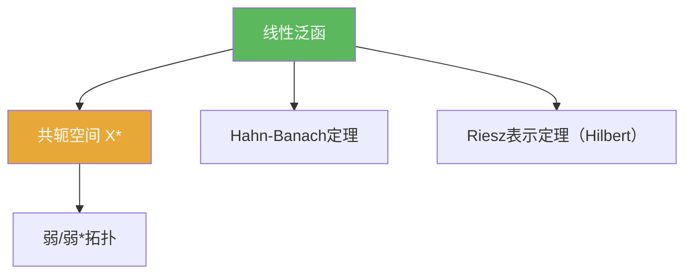

# 线性泛函

> [!abstract] 概述
> ==线性泛函==是取值于标量域 $\mathbb{F}$（$\mathbb{R}$ 或 $\mathbb{C}$）的线性算子。它们组成对偶空间 $X^\*$，并通过 Hahn–Banach 定理成为“分离/对偶化”的核心工具。

## 定义

> [!def] 定义
> 设 $X$ 为线性空间。若映射 $f:X\to\mathbb{F}$ 线性，则称 $f$ 为线性泛函。

## 核心性质（命题工具箱）

| 性质/命题 | 表述（可直接引用） | 用途（做题时怎么用） |
|------|------|------|
| 连续泛函构成对偶 | 在赋范空间上，连续线性泛函的全体记为 $X^*$ | 弱拓扑/弱收敛的“测试族”就是 $X^*$ |
| Hahn–Banach 延拓 | 子空间上的有界线性泛函可等范数延拓到全空间 | 分离定理、对偶化、存在性证明的核心工具 |
| Hilbert 特例（Riesz） | 若 $H$ Hilbert，则每个 $f\in H^*$ 唯一表示为 $f(x)=\langle x,y\rangle$ | 把“找泛函”转成“找向量”（计算更直接） |

## 典型例子与非例子

| 类型 | 例子 | 提醒 |
|---|---|---|
| 典型 | $\mathbb{R}^n$ 上 $f(x)=a\cdot x$ | 有限维中所有线性泛函自动连续 |
| 典型 | $C([0,1])$ 上的点值 $f(x)=x(t_0)$（上确界范数） | 典型连续线性泛函；有助理解“对偶” |
| 非例子 | 若赋范结构不合适，某些自然算子可能不连续 | “线性”不保证“连续”，对偶空间强调连续性 |

## 关系网络

## 章节扩展

### 第02章：线性算子与线性泛函

- 2.2：Hilbert 空间上连续线性泛函的表示：[[2.2 Riesz表示定理及其应用#二、核心思想]]
- 2.4：有界线性泛函的延拓：[[2.4 Hahn-Banach定理#二、核心思想]]
- 2.5：弱收敛/弱*收敛以 $X^\*$ 为测试集合：[[2.5 共轭空间 弱收敛 自反空间#二、核心思想]]

## 补充

> [!info] 常见误区与来源
>
> - 误区：把 $X^*$ 当作“所有线性泛函”。在泛函分析里 $X^*$ 默认是**连续**线性泛函，否则很多结构（如范数、弱拓扑）无法工作。  
> - 误区：以为“延拓”一定能保持很多额外性质。Hahn–Banach 主要保证线性与范数控制，其他性质需额外讨论。
>
> **参考（权威外链）**
> - 张恭庆《泛函分析讲义》第二章  
> - https://ocw.mit.edu/courses/18-102-introduction-to-functional-analysis-spring-2021/06f9cf855f9f5eaa1898f3e684e05cec_MIT18_102s21_lec5.pdf
> - MIT 18.102 讲义入口：https://ocw.mit.edu/courses/18-102-introduction-to-functional-analysis-spring-2021/pages/lecture-notes-and-readings/

## 参见

- [[共轭空间]]
- [[Hahn-Banach定理]]
- [[Riesz表示定理]]
