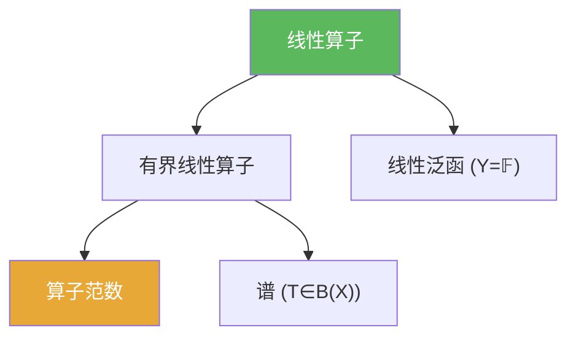

# 线性算子

> [!abstract] 概述
> ==线性算子==是从一个线性空间到另一个线性空间的线性映射。在泛函分析中，最重要的不是“线性”本身，而是它与范数/拓扑结合后形成的“连续（有界）线性算子”体系。

## 定义

> [!def] 定义
> 设 $X,Y$ 为线性空间。映射 $T:X\to Y$ 若满足对任意 $x_1,x_2\in X$ 与任意标量 $\alpha,\beta$，
> $$T(\alpha x_1+\beta x_2)=\alpha T(x_1)+\beta T(x_2),$$
> 则称 $T$ 为线性算子（线性映射）。

## 核心性质（命题工具箱）

| 性质/命题 | 表述（可直接引用） | 用途（做题时怎么用） |
|------|------|------|
| 连续性判别（赋范） | 线性算子：连续 $\Leftrightarrow$ 有界 $\Leftrightarrow$ 存在 $C$ 使 $\|Tx\|\le C\|x\|$ | 最常用证明套路：找“全局常数估计” |
| 范数化 | 有界线性算子空间 $B(X,Y)$ 上可定义算子范数 $\|T\|$ | 把“连续性”变成“范数有限”，便于做极限与级数 |
| 线性泛函是特例 | $Y=\mathbb{F}$ 时，线性算子就是线性泛函 | 对偶空间与 Hahn–Banach/Riesz 立刻进入视野 |

## 典型例子与非例子

| 类型 | 例子 | 提醒 |
|---|---|---|
| 典型 | 矩阵 $A:\mathbb{R}^n\to\mathbb{R}^m$ | 有限维上线性算子自动有界 |
| 典型 | 微分/积分算子（在合适空间与范数下） | “是否有界”高度依赖所选范数与函数空间 |
| 非例子 | 在不恰当范数下的导数算子可能不有界 | 不是所有“自然算子”都在任意范数下可控 |

## 关系网络

## 章节扩展

### 第02章：线性算子与线性泛函

- 2.1：线性算子在赋范空间上“有界/连续”等价，并引入算子范数：[[2.1 线性算子的概念#二、核心思想]]
- 2.6：当 $T\in B(X)$ 时可定义谱与预解集：[[2.6 线性算子的谱#二、核心思想]]

## 补充

> [!info] 来源
> - 张恭庆《泛函分析讲义》第二章（线性算子与线性泛函）  
> - https://uwaterloo.ca/scholar/sites/ca.scholar/files/g6tran/files/amath731_lecture10.pdf
> - MIT 18.102 讲义入口：https://ocw.mit.edu/courses/18-102-introduction-to-functional-analysis-spring-2021/pages/lecture-notes-and-readings/

## 参见

- [[有界线性算子]]
- [[算子范数]]
- [[线性泛函]]
