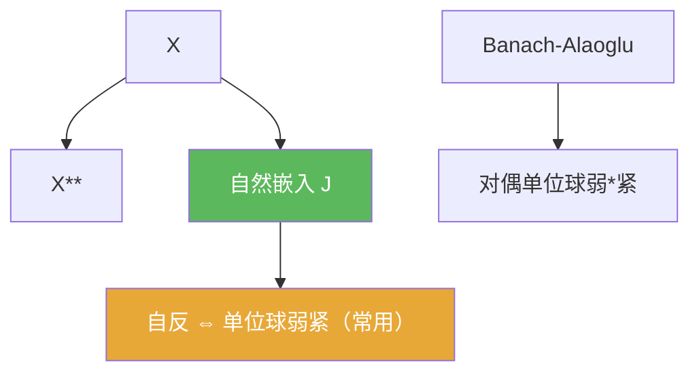

# 自反空间

> [!abstract] 概述
> ==自反空间==把“空间”与“双对偶空间”识别起来：$X$ 通过自然嵌入 $J:X\to X^{\*\*}$ 等距嵌入到双对偶中；若 $J$ 还是满射，则称 $X$ 自反。  
> 自反空间的一个重要后果是：闭单位球在弱拓扑下紧（或弱序列紧），因此有界序列更容易抽取弱收敛子列。

## 定义

> [!def] 自反
> 设 $X$ 为 Banach 空间。定义自然嵌入 $J:X\to X^{\*\*}$：
> $$J(x)(f)=f(x)\qquad (f\in X^\*).$$
> 若 $J$ 为满射，则称 $X$ 为自反空间。

## 核心性质（命题工具箱）

| 性质/命题 | 表述（可直接引用） | 用途（做题时怎么用） |
|------|------|------|
| 等距嵌入 | 自然嵌入 $J:X\to X^{**}$ 总是等距线性单射 | 把 $X$ 当作 $X^{**}$ 的子空间来做对偶化 |
| 弱紧性刻画（常用） | 自反空间常与“闭单位球弱紧/弱序列紧”联系 | 用来抽取弱收敛子列（配合相关紧性定理） |
| 有界序列抽取 | 在合适假设下，自反空间中有界序列更易抽取弱收敛子列 | 处理“存在弱极限点”的关键工具背景 |

## 典型例子与非例子

| 类型 | 例子 | 提醒 |
|---|---|---|
| 典型自反 | Hilbert 空间、$L^p(1<p<\infty)$、$\ell^p(1<p<\infty)$ | 自反性在经典空间中非常常见 |
| 非自反 | $L^1$、$L^\infty$、$\ell^1$、$\ell^\infty$ | 这类空间的弱紧性行为与直觉差异大 |

## 关系网络

## 章节扩展

### 第02章：线性算子与线性泛函

- 2.5：讨论弱收敛/弱*收敛与自反空间：[[2.5 共轭空间 弱收敛 自反空间#二、核心思想]]

## 补充

> [!info] 常见误区与来源
>
> - 误区：把“$X$ 可嵌入 $X^{**}$”当作“自反”。$J$ 总是等距嵌入；自反要求它还是满射。  
> - 误区：把“弱紧”理解成“范数紧”。弱紧是更弱拓扑下的紧性结论。
>
> **参考（权威外链）**
> - https://courses.maths.ox.ac.uk/pluginfile.php/83506/mod_resource/content/0/B4.2Lecture10P.pdf  
> - https://tymathdb.com/wp-content/uploads/2022/09/Reflexive-Spaces-Appendix-I.pdf

## 参见

- [[共轭空间]]
- [[弱收敛]]
- [[Banach-Alaoglu定理]]
