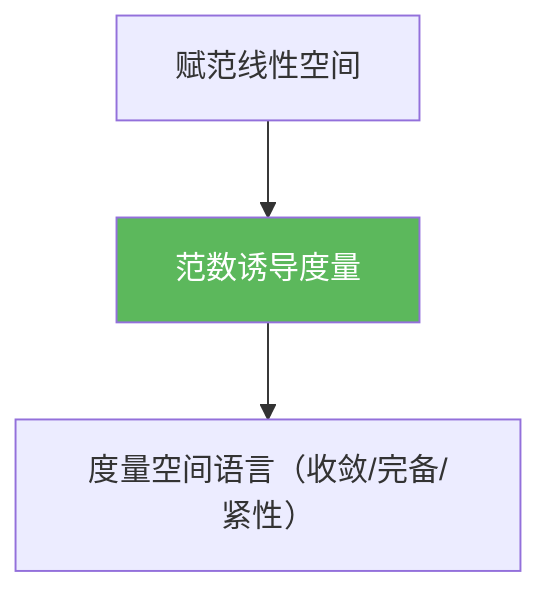

# 范数诱导度量

> [!abstract] 概述
> 在赋范线性空间中，范数天然给出距离：$d(x,y)=\|x-y\|$。  
> 这一步把“线性空间上的分析”彻底转化为“度量空间上的分析”：以后所有关于收敛、Cauchy、完备性的论证都可以直接写成距离估计。

## 定义

> [!def] 定义
> 给定赋范线性空间 $(X,\|\cdot\|)$，定义
> $$d(x,y):=\|x-y\|.$$
> 则 $(X,d)$ 为度量空间，称 $d$ 为范数诱导度量。

## 核心性质（命题工具箱）

| 性质/命题 | 表述（可直接引用） | 用途（做题时怎么用） |
|------|------|------|
| 平移不变 | $d(x+a,y+a)=d(x,y)$ | 很多估计只需控制 $d(x,0)=\|x\|$ |
| 收敛刻画 | $x_n\to x \iff \|x_n-x\|\to 0$ | 把“收敛”变成范数趋零的计算问题 |
| 完备性一致 | $(X,\|\cdot\|)$ 完备 $\iff (X,d)$ 完备 | Banach 空间就是“赋范 + 完备度量”的同一件事 |
| 线性算子范式 | 证明连续常用：$\|Tx\|\le C\|x\|$ | 把 $\varepsilon$–$\delta$ 简化成一个全局常数 |

## 典型例子与非例子

| 类型 | 例子 | 提醒 |
|---|---|---|
| 典型 | $X=\mathbb{R}^n$，$d(x,y)=\|x-y\|_2$ | 欧氏距离就是范数诱导度量 |
| 典型 | $X=C([0,1])$，$\|f\|_\infty$ 诱导 $d(f,g)=\|f-g\|_\infty$ | 这是函数空间最常用的度量之一 |
| 非例子 | 若 $\|\cdot\|$ 不是范数，则 $d(x,y)=\|x-y\|$ 不一定满足三角不等式 | 必须先确认范数公理成立 |

## 关系网络

## 章节扩展

### 第01章：度量空间

- 1.4：从度量空间过渡到赋范空间的关键桥梁：[[1.4 赋范线性空间#二、核心思想]]

## 补充

> [!info] 常见误区与来源
>
> - 误区：认为“赋范空间的收敛”与“逐点收敛/几乎处处收敛”是一回事。范数收敛是一种强结构，具体含义取决于所选范数。  
> - 误区：在不同范数下切换却不检查等价性（有限维可等价、无限维通常不可等价）。
>
> **参考（权威外链）**
> - MIT 18.102 Functional Analysis（范数/度量/完备的基本结构）：https://ocw.mit.edu/courses/18-102-introduction-to-functional-analysis-spring-2021/pages/lecture-notes-and-readings/

## 参见

- [[度量空间]]
- [[赋范线性空间]]
