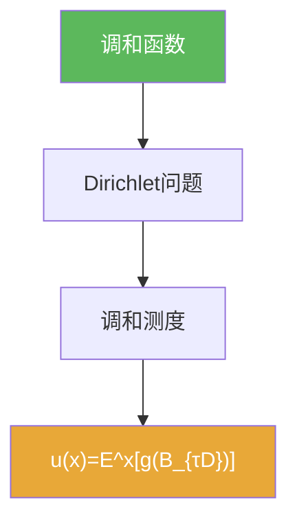

# 调和函数

> [!abstract] 概述
> ==调和函数==是满足 Laplace 方程 $\Delta u=0$ 的函数。  
> 在本章，它通过“均值性质/最大值原理”与 Brownian 的出口分布联系起来，是 Dirichlet 概率表示的分析端入口。

## 定义

> [!def] 调和函数
> 在区域 $D\subset\mathbb R^d$ 上，若 $u$ 足够光滑且满足 $\Delta u=0$，则称 $u$ 在 $D$ 内调和。

## 核心性质（命题工具箱）

| 性质/命题 | 表述 | 用途 |
|---|---|---|
| 均值性质 | $u(x)$ 等于某邻域球面/球体上的平均值（合适口径） | 与 Brownian 平均直觉对接 |
| 最大值原理 | 非常数调和函数在内部不取极大/极小 | Dirichlet 唯一性工具 |
| Dirichlet 关联 | 边界值问题 $\Delta u=0$ + $u|_{\partial D}=g$ | 6.6 的主线 |

## 关系网络

## 章节扩展

### 第06章：Brownian运动引论

- PDE 与 Brownian 的连接：[[6.6 Dirichlet问题的解#二、核心思想]]

## 补充

> [!info] 参考（权威外链）
> - https://en.wikipedia.org/wiki/Harmonic_function

## 参见

- [[Dirichlet问题]]
- [[调和测度]]

