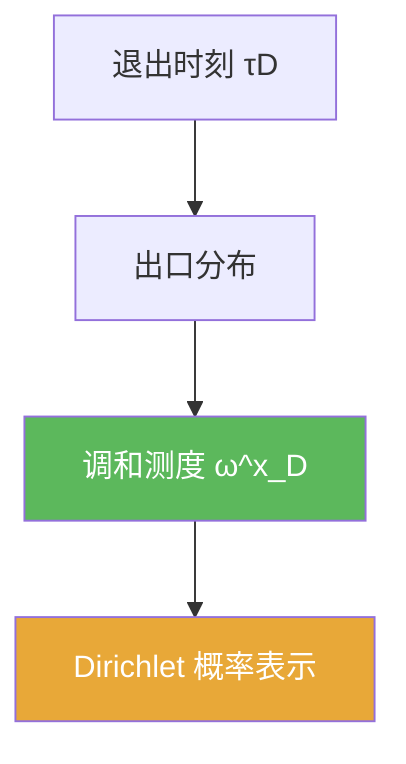

# 调和测度

> [!abstract] 概述
> ==调和测度==是边界上的概率测度：从点 $x$ 出发的 Brownian 运动在退出区域 $D$ 时落在边界的分布。  
> 它把“边界函数 $g$”变成“区域内调和函数 $u$”的加权平均：$u(x)=\int_{\partial D}g\,d\omega_D^x$。

## 定义

> [!def] 调和测度（直觉版）
> 设 $\tau_D=\inf\{t:B_t\notin D\}$。定义
> $$\omega_D^x(A)=\mathbb P^x(B_{\tau_D}\in A),\quad A\subset\partial D.$$

## 核心性质（命题工具箱）

| 性质/命题 | 表述 | 用途 |
|---|---|---|
| 概率测度 | 对每个 $x$，$\omega_D^x$ 是 $\partial D$ 上的概率测度 | 把边界值问题写成期望 |
| Dirichlet 表示 | $u(x)=\int_{\partial D} g(\xi)\,d\omega_D^x(\xi)$ | 6.6 的核心公式 |
| 停时驱动 | 依赖退出停时 $\tau_D$ | 强 Markov 的典型应用 |

## 关系网络

## 章节扩展

### 第06章：Brownian运动引论

- 出口分布与表示公式：[[6.6 Dirichlet问题的解#二、核心思想]]

## 补充

> [!info] 参考（权威外链）
> - https://en.wikipedia.org/wiki/Harmonic_measure

## 参见

- [[Dirichlet问题]]
- [[停时]]
- [[调和函数]]

