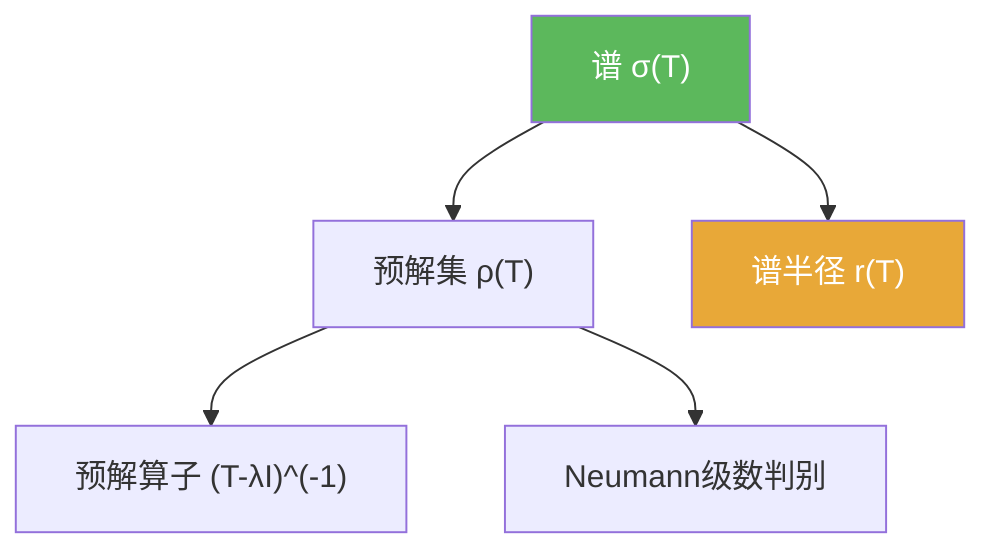

# 谱

> [!abstract] 概述
> 对有界线性算子 $T$，==谱== $\sigma(T)$ 是使 $T-\lambda I$ “不可逆”的复数集合。它以可逆性为核心定义，在无限维中比“特征值集合”更稳定、更基础。

## 定义

> [!def] 定义
> 设 $X$ 为 Banach 空间，$T\in B(X)$。定义
> $$\sigma(T)=\mathbb{C}\setminus\rho(T),$$
> 其中 $\rho(T)$ 为预解集（见 [[预解集]]）。

## 核心性质（命题工具箱）

| 性质/命题 | 表述（可直接引用） | 用途（做题时怎么用） |
|------|------|------|
| 定义核心 | $\sigma(T)=\mathbb{C}\setminus\rho(T)$ | 做题一律回到“可逆性”而非“特征向量” |
| 圆盘包含估计 | $\sigma(T)\subset\{\lambda:|\lambda|\le \|T\|\}$（由 Neumann 判别得） | 快速得到谱的粗略上界（见 [[Neumann级数]]） |
| 无限维提醒 | 谱可能包含非特征值点 | 避免误用“谱=特征值集合”的有限维直觉 |

## 典型例子与非例子

| 类型 | 例子 | 提醒 |
|---|---|---|
| 典型 | 有限维矩阵：谱=特征值集合 | 有限维里直觉最强 |
| 典型 | 无穷维移位算子：谱可为圆盘/圆周 | 说明“谱不等于特征值”可能非常明显 |
| 非例子提醒 | “找不到特征向量”并不推出 $\lambda\notin\sigma(T)$ | 必须用 $(T-\lambda I)$ 的可逆性判定 |

## 关系网络

## 章节扩展

### 第02章：线性算子与线性泛函

- 2.6：谱、预解集、Neumann 级数与基本估计：[[2.6 线性算子的谱#二、核心思想]]

### 第03章：紧算子与Fredholm算子

- 3.3：紧算子的谱结构（非零谱点为特征值、仅 0 为聚点）：[[3.3 紧算子的谱理论#二、核心思想]]

## 补充

> [!info] 常见误区与来源
>
> - 误区：“谱就是特征值”。无限维里谱以“不可逆性”为核心定义，可能出现连续谱等现象。  
> - 误区：只检查一对一/满射的其中之一。无限维里可逆性更微妙，常需用开映射/闭图像等工具。
>
> **参考（权威外链）**
> - https://www.math.univ-toulouse.fr/~jroyer/TD/2022-23-M2/M2-Ch1.pdf  
> - https://en.m.wikipedia.org/wiki/Spectrum_(functional_analysis)

## 参见

- [[预解集]]
- [[谱半径]]
- [[Neumann级数]]
