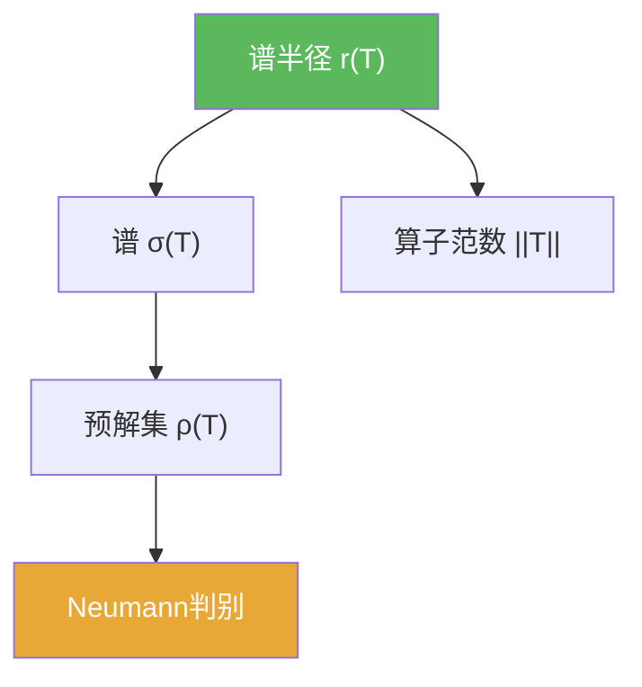

# 谱半径

> [!abstract] 概述
> ==谱半径== $r(T)$ 描述谱在复平面里的“外半径”，是衡量算子长期迭代行为的重要量。常见关系是 $r(T)\le \|T\|$；更精细的谱半径公式在 Banach 代数框架下给出。

## 定义

> [!def] 定义
> 对 $T\in B(X)$ 定义
> $$r(T):=\sup\{|\lambda|:\lambda\in\sigma(T)\}.$$

## 核心性质（命题工具箱）

| 性质/命题 | 表述（可直接引用） | 用途（做题时怎么用） |
|------|------|------|
| 范数上界 | $r(T)\le \|T\|$ | 得到谱的粗略半径控制，常用于稳定性估计 |
| Neumann 推导 | 若 $|\lambda|>\|T\|$，则 $\|T/\lambda\|<1$，从而 $\lambda\in\rho(T)$ | 最直接的“谱包含在闭球”证明套路 |
| 迭代意义 | $r(T)$ 控制 $\|T^n\|^{1/n}$ 的极限行为（在更一般理论下） | 用于长期迭代/幂次增长的直觉解释 |

## 典型例子与非例子

| 类型 | 例子 | 提醒 |
|---|---|---|
| 典型 | 有限维矩阵：$r(T)$ 是特征值模的最大值 | 最直观的理解来源 |
| 典型 | 幂次估计：若 $r(T)<1$，常预示 $T^n$ 衰减 | 需要结合具体范数/定理使用 |
| 非例子提醒 | $r(T)$ 小不等于 $\|T\|$ 小（可能严格小于） | $\|T\|$ 是粗上界，谱半径更精细 |

## 关系网络

## 章节扩展

### 第02章：线性算子与线性泛函

- 2.6：谱与谱半径的基本关系：[[2.6 线性算子的谱#二、核心思想]]

### 第03章：紧算子与Fredholm算子

- 3.3：紧算子谱结构与“谱只能向 0 聚集”的直觉：[[3.3 紧算子的谱理论#二、核心思想]]

## 补充

> [!info] 常见误区与来源
>
> - 误区：把 $r(T)$ 当作“算子大小”的唯一尺度。$\|T\|$ 与 $r(T)$ 解决的问题不同：前者控制一次作用，后者更偏长期/谱信息。  
> - 误区：忽略“谱半径公式”需要额外理论背景（Banach 代数等）；做题时先用 $r(T)\le\|T\|$ 与 Neumann 判别即可覆盖大量估计。
>
> **参考（权威外链）**
> - https://en.m.wikipedia.org/wiki/Spectrum_(functional_analysis)  
> - https://proofwiki.org/wiki/Gelfand%27s_Spectral_Radius_Formula/Bounded_Linear_Operator

## 参见

- [[谱]]
- [[预解集]]
- [[Neumann级数]]
- [[算子范数]]
