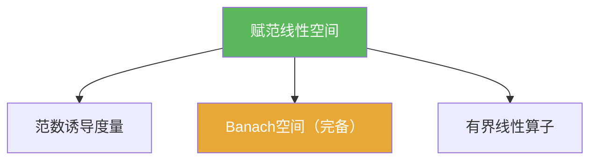

# 赋范线性空间

> [!abstract] 概述
> ==赋范线性空间==把“线性结构”与“距离结构”统一：范数既能度量长度，也能诱导度量，从而把度量空间中的收敛/Cauchy/完备/紧性语言无缝搬运到线性空间里。  
> 在后续第二章里，“连续线性算子”几乎总被替换成“有界线性算子”，而这种替换的基础正来自赋范结构。

## 定义

> [!def] 定义
> 在线性空间 $X$ 上，若函数 $\|\cdot\|:X\to\mathbb{R}$ 满足正定性、齐次性与三角不等式，则称为范数；$(X,\|\cdot\|)$ 为赋范线性空间。

## 核心性质（命题工具箱）

| 性质/命题 | 表述（可直接引用） | 用途（做题时怎么用） |
|------|------|------|
| 诱导度量 | $d(x,y)=\|x-y\|$ | 把度量空间的一切概念直接套用到 $X$（见 [[范数诱导度量]]) |
| Banach化 | 若 $(X,\|\cdot\|)$ 完备，则称为 Banach空间 | 证明极限存在/迭代收敛的常用“环境假设”（见 [[Banach空间]]) |
| 有界估计范式 | 若线性算子 $T$ 满足 $\|Tx\|\le C\|x\|$，则 $T$ 连续 | 大量题目都在找“全局常数 $C$”来证明连续性（见 [[有界线性算子]]) |

## 典型例子与非例子

| 类型 | 例子 | 提醒 |
|---|---|---|
| 典型 | $\mathbb{R}^n$ 上的 $\|\cdot\|_p$（任意 $1\le p\le\infty$） | 有限维中所有范数等价，且都完备 |
| 典型 | 连续函数空间 $C([0,1])$（上确界范数） | 是经典 Banach 空间例子 |
| 非例子 | “只满足 $\|x+y\|\le \|x\|+\|y\|$ 但齐次性失败”的函数 | 不满足范数公理就不能诱导度量 |

## 关系网络

## 章节扩展

### 第01章：度量空间

- 1.4：赋范空间与 Banach 空间基础：[[1.4 赋范线性空间#二、核心思想]]

## 补充

> [!info] 常见误区与来源
>
> - 误区：以为“有界/连续”必须用 $\varepsilon$–$\delta$ 来证。在线性算子上，最常用的是“找一个常数 $C$ 的全局估计”。  
> - 误区：把“有界（集合有界）”与“有界线性算子”混为一谈。
>
> **参考（权威外链）**
> - MIT 18.102 Functional Analysis 讲义入口（Chapter 1）：https://ocw.mit.edu/courses/18-102-introduction-to-functional-analysis-spring-2021/pages/lecture-notes-and-readings/
> - Wikipedia: Norm (mathematics): https://en.wikipedia.org/wiki/Norm_(mathematics)

## 参见

- [[Banach空间]]
- [[范数诱导度量]]
- [[有界线性算子]]
