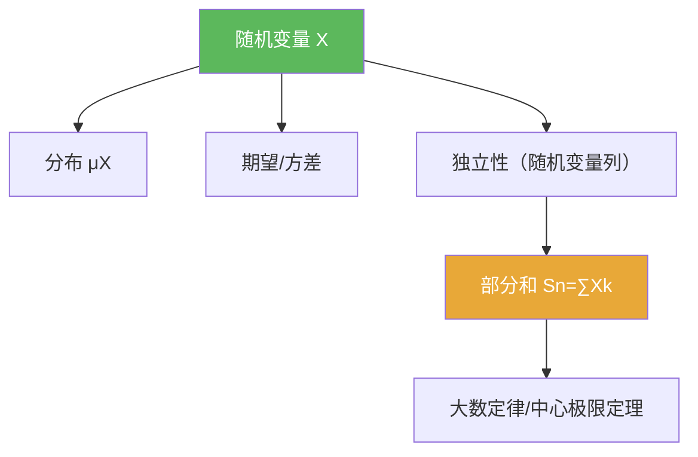

# 随机变量

> [!abstract] 概述
> ==随机变量==是把“随机结果”变成“可计算数值对象”的桥梁：它是从概率空间到数轴（或更一般空间）的可测映射。  
> 在本章，所有核心对象都可归结为“随机变量的函数”和“随机变量的和”（部分和）。

## 定义

> [!def] 随机变量
> 给定概率空间 $(\Omega,\mathcal F,\mathbb P)$。若映射 $X:\Omega\to\mathbb R$ 对 Borel $\sigma$-代数可测，则称 $X$ 为（实值）随机变量。

## 核心性质（命题工具箱）

| 性质/命题 | 表述（可直接引用） | 用途（做题时怎么用） |
|---|---|---|
| 分布（pushforward） | $\mu_X(B)=\mathbb P(X\in B)$ | 把概率问题转成分布测度问题 |
| 可测函数复合 | 若 $X$ 可测、$\varphi$ Borel 可测，则 $\varphi(X)$ 仍为随机变量 | 处理 $|X|,X^2,1_{\{X\in B\}}$ 等 |
| 期望/方差 | 见 [[期望]]、[[方差]] | 提供尺度与估计 |
| 部分和 | $S_n=\sum_{k=1}^n X_k$ | LLN/CLT 的统一入口 |

## 关系网络

## 章节扩展

### 第05章：概率论基础

- 5.1：以 0/1 随机变量为入口：[[5.1 Bernoulli试验#二、核心思想]]
- 5.2：以“独立随机变量的和”为主线：[[5.2 独立随机变量的和#二、核心思想]]

## 补充

> [!info] 常见误区
> “随机变量”不是“随机的数”，而是一个确定的可测函数；随机性来自于 $\omega$ 的分布。
>
> **参考（权威外链）**
> - https://en.wikipedia.org/wiki/Random_variable

## 参见

- [[期望]]
- [[方差]]
- [[独立性]]

