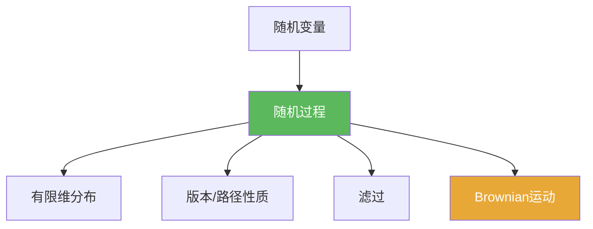

# 随机过程

> [!abstract] 概述
> ==随机过程==是“按时间索引的一族随机变量”。  
> 学习 Brownian 运动时，关键不是单点分布，而是：有限维分布（联合分布）+ 路径性质（连续/可测）+ 信息结构（滤过）。

## 定义

> [!def] 随机过程
> 在概率空间 $(\Omega,\mathcal F,\mathbb P)$ 上，族 $\{X_t\}_{t\in T}$ 若每个 $X_t$ 是随机变量，则称为随机过程。

## 核心性质（命题工具箱）

| 模块 | 表述（可直接引用） | 用途 |
|---|---|---|
| 有限维分布 | $(X_{t_1},\dots,X_{t_n})$ 的联合分布 | 通过一致性拼成路径测度 |
| 路径性质 | 讨论 $t\mapsto X_t(\omega)$ 的连续/可测 | 区分“版本”与“路径正则性” |
| 滤过 | $\mathcal F_t=\sigma(X_s:s\le t)$ | 描述“只用过去信息”的规则 |

## 关系网络

## 章节扩展

### 第06章：Brownian运动引论

- 框架入口：[[6.1 框架#二、核心思想]]
- 构造与版本：[[6.3 Brownian运动的构造#二、核心思想]]

## 补充

> [!info] 参考（权威外链）
> - https://en.wikipedia.org/wiki/Stochastic_process

## 参见

- [[滤过]]
- [[Brownian运动]]

