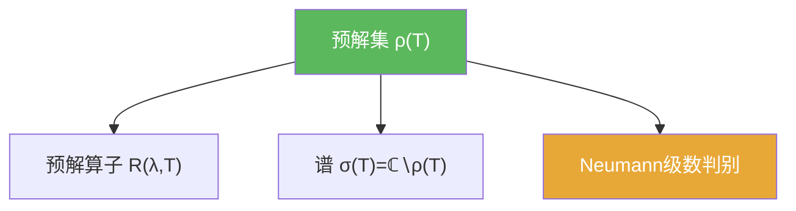

# 预解集

> [!abstract] 概述
> 对有界线性算子 $T$，==预解集== $\rho(T)$ 是使 $T-\lambda I$ 可逆（并且逆仍是有界算子）的复数集合。它是谱的补集，且通常是开集。

## 定义

> [!def] 定义
> 设 $X$ 为 Banach 空间，$T\in B(X)$。定义
> $$\rho(T):=\{\lambda\in\mathbb{C}:(T-\lambda I)\ \text{可逆且}\ (T-\lambda I)^{-1}\in B(X)\}.$$
> 对 $\lambda\in\rho(T)$，记预解算子 $R(\lambda,T)=(T-\lambda I)^{-1}$。

## 核心性质（命题工具箱）

| 性质/命题 | 表述（可直接引用） | 用途（做题时怎么用） |
|------|------|------|
| 开性与解析性 | $\rho(T)$ 是开集；$\lambda\mapsto R(\lambda,T)$ 在 $\rho(T)$ 上解析 | 预解算子可做复分析工具（后续更深入谱论） |
| Neumann 判别 | 若 $\|T/\lambda\|<1$，则 $\lambda\in\rho(T)$ | 常用来证明“大模长都在预解集里”，从而得到谱的圆盘包含 |
| 可逆性口径 | 需要 $(T-\lambda I)^{-1}\in B(X)$ | 强调“逆也要有界”，这是谱论的稳定性基础 |

## 典型例子与非例子

| 类型 | 例子 | 提醒 |
|---|---|---|
| 典型 | 有限维矩阵：$\rho(T)$ 是“非特征值集合” | 有限维里可逆=行列式非零 |
| 典型 | 若 $\|T\|<1$，则 $1\in\rho(I-T)$ | 用 Neumann 级数直接给出逆 |
| 非例子提醒 | “代数逆存在”不代表属于 $\rho(T)$ | 还要检查逆是否有界（无限维关键差异） |

## 关系网络

## 章节扩展

### 第02章：线性算子与线性泛函

- 2.6：预解集与谱的基本定义与估计：[[2.6 线性算子的谱#二、核心思想]]

### 第03章：紧算子与Fredholm算子

- 3.3：用 $I-\lambda^{-1}K$ 与 Fredholm 结构分析紧算子谱：[[3.3 紧算子的谱理论#二、核心思想]]

## 补充

> [!info] 常见误区与来源
>
> - 误区：把 $\rho(T)$ 当作“$(T-\lambda I)$ 可逆”就够了。谱论里要求逆仍是有界线性算子。  
> - 误区：把“$\rho(T)$ 开集”当作直观事实而不去用 Neumann 判别；做题时 Neumann 判别往往是最直接可操作的手段。
>
> **参考（权威外链）**
> - https://www.math.univ-toulouse.fr/~jroyer/TD/2022-23-M2/M2-Ch1.pdf  
> - http://v-v-kisil.scienceontheweb.net/courses/math3263m010.html

## 参见

- [[谱]]
- [[Neumann级数]]
