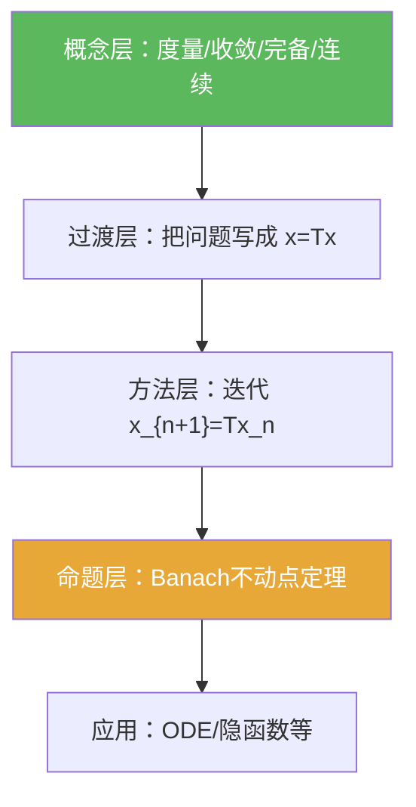

**相关笔记：** [[1.2 完备化]] | [[1.3 列紧集]] | [[1.5 凸集与不动点]] | [[第01章 度量空间 — 章节汇总]]

> [!abstract] 概览（本条目怎么读）
> 本节不是“压缩映射定理”单点，而是一条完整生产线：先搭建**度量语言**（度量、收敛、闭集、Cauchy、完备、连续），再把“求解问题”统一改写成 $x=Tx$ 的**不动点问题**，最后用 **[[Banach不动点定理]]**输出“存在唯一 + 迭代可算 + 误差可控”。  
> 阅读与复用时，抓三句：
> 1) 完备性保证：[[Cauchy列]]的极限仍在空间里；  
> 2) 压缩常数 $a<1$ 保证：几何级数收敛，从而迭代序列变 Cauchy；  
> 3) 迭代极限 + 连续性给出：极限满足 $Tx=x$。

^overview

---

# 1. 本节主题定位

- **本节的核心问题**
  - 如何用距离刻画“收敛/连续/完备”？
  - 如何把“方程/微分方程/隐函数”转成[[不动点]]问题？
  - 在什么条件下，不动点不仅存在，而且唯一、可迭代逼近，并可给误差界？

- **本节在本章知识链中的位置**
  - 第01章起点：建立度量空间语言；
  - 1.1 给出第一个“存在唯一性模板”（压缩映射原理）；
  - 1.2 专门解决“空间不完备”的问题；
  - 1.5 进一步扩展到 Brouwer/Schauder 等非压缩型不动点工具。

- **本节依赖哪些前置概念/定理**
  - 实分析中序列极限与 $\varepsilon$ 思维；
  - 三角不等式的估计能力（这是本节证明的发动机）。

- **本节为后续哪些内容铺路**
  - 完备化（为何完备不可省）：[[1.2 完备化]]
  - 不动点方法总览与非压缩工具：[[1.5 凸集与不动点]]
  - 将度量语言迁移到范数/算子范数：[[1.4 赋范线性空间]]

## 二、核心思想

- 把“求解”统一改写成**[[不动点]]**：把方程/ODE/积分方程/隐函数问题重排成 $x=Tx$，于是“找解”变成“找不动点”。  
- 压缩给出两类输出（并且都可复用到做题）：  
  1) **存在唯一**：压缩常数 $a<1$ 直接锁死唯一性（两个不动点会被压到同一点）；  
  2) **可计算**：Picard 迭代 $x_{n+1}=Tx_n$ 收敛到不动点，且几何级数给出误差界。  
- **完备性是落点许可**：先用压缩证明迭代列是 Cauchy，再用完备性保证极限仍落在空间里；否则极限可能“跑到空间外”（见 [[1.2 完备化]] 的动机）。

---

# 2. 内容分层图

> [!quote] 原文直接信息（分层）
> - **概念层**：度量空间、收敛、闭集、基本列（Cauchy）、完备、连续、压缩映射
> - **命题层**：连续的列定义与 $\varepsilon$–$\delta$ 等价（命题 1.1.9）；Banach 不动点定理（定理 1.1.12）
> - **方法层**：构造迭代列、几何级数估计、Cauchy 化、完备性取极限、压缩收口唯一性
> - **过渡层**：求根/积分方程/ODE/隐函数问题 → 不动点问题（“把解变成不动点”）

---

# 3. 定义系统

> [!warning] 学习提示（会不会用的分水岭）
> 你必须能对每个条件回答：“它在后面哪一步被用到了？”  
> 例如：三角不等式用来做夹逼；完备性用来保证极限点在空间里；$a<1$ 用来让几何级数收敛。

## 3.1 定义 1.1.1：度量空间（距离）

> [!quote] 原文直接信息（严格表述）
> 在非空集合 $X$ 上给定实值函数 $p(x,y)$，若对任意 $x,y,z\in X$：
> 1) $p(x,y)\ge 0$，且 $p(x,y)=0$ 当且仅当 $x=y$  
> 2) $p(x,y)=p(y,x)$  
> 3) $p(x,z)\le p(x,y)+p(y,z)$  
> 则称 $(X,p)$ 为度量空间，$p$ 为距离。

- **定义对象是什么**：集合 $X$ 与距离函数 $p$。
- **为什么要这样定义**：把“接近”变成可计算量，并保证极限/估计的稳定性。
- **关键条件的作用**
  - (1) 保证距离不退化；极限唯一性依赖“零距当且仅当相等”
  - (3) 是估计核心：把复杂距离拆成可控的两段
- **最小例子**：$X=\mathbb{R}$，$p(x,y)=|x-y|$。
- **非例/边界情况**：若允许 $p(x,y)=0$ 且 $x\ne y$，会出现“不同点不可区分”，后续唯一性崩坏。
- **初学者误区**：三角不等式不会用；只会背，不会把它用作“夹逼/拆分”。

## 3.2 注：欧氏距离是原型

> [!quote] 原文直接信息（抽取）
> 在 $\mathbb{R}^n$ 中常用
> $$p(x,y)=\sqrt{\sum_{i=1}^n (x_i-y_i)^2}.$$

> [!note] 辅助理解
> 这段的作用不是“复习线代”，而是告诉你：后面所有抽象条件都来自欧氏距离的可迁移性质。

## 3.3 例 1.1.2：$C[a,b]$ 的距离

> [!quote] 原文直接信息
> 对连续函数空间 $C[a,b]$，用
> $$p(x,y)=\max_{t\in[a,b]}|x(t)-y(t)|$$
> 规定距离。

- **它解决了什么问题**：让“函数序列收敛”具有明确意义（这里对应一致收敛）。
- **初学者误区**：把该收敛误读成逐点收敛。

## 3.4 定义 1.1.3：收敛

> [!quote] 原文直接信息
> $x_n\to x_0$ 指 $p(x_n,x_0)\to 0$（$n\to\infty$）。

- **最可能看懂但不会用**：不知道在证明中“把目标改写为距离趋零”。

## 3.5 定义 1.1.4：闭集

> [!quote] 原文直接信息
> $E$ 为闭集：若 $x_n\in E$ 且 $x_n\to x_0$，则 $x_0\in E$。

- **重要条件的作用**：在做迭代/极限时，保证极限仍留在允许集合内（和 1.2、1.1.14 的闭球构造直接相关）。

## 3.6 定义 1.1.5：基本列（Cauchy）与完备

> [!quote] 原文直接信息
> $\{x_n\}$ 为基本列：$p(x_n,x_m)\to 0$（$n,m\to\infty$）。  
> 若空间中所有基本列都是收敛列，则称空间完备。

- **关键条件的作用**
  - “Cauchy”只关心序列内部一致性；
  - “完备”把内部一致性提升为“存在极限点且落在空间里”。
- **最小例子**：$\mathbb{R}^n$ 完备；$C[a,b]$ 完备。
- **非例**：$\mathbb{Q}$ 不完备（典型 Cauchy 列极限不在 $\mathbb{Q}$）。

## 3.7 定义 1.1.8：连续（列定义）

> [!quote] 原文直接信息
> $T:(X,p)\to(Y,r)$ 连续：若 $p(x_n,x_0)\to 0$，则 $r(Tx_n,Tx_0)\to 0$。

- **最可能看懂但不会用**：不会把“$x_n\to x^\*$”转成“$Tx_n\to Tx^\*$”来验证不动点方程。

## 3.8 压缩映射（为 1.1.12 服务的定义）

> [!quote] 原文直接信息（抽取）
> $T:(X,p)\to(X,p)$ 为压缩映射：存在 $0<a<1$ 使
> $$p(Tx,Ty)\le a\,p(x,y).$$

- **条件 $a<1$ 的作用**：让“距离递推”形成可求和的几何级数，从而得到 Cauchy 与收敛速度。
- **若条件削弱**：若只要求 $p(Tx,Ty)\le p(x,y)$，不保证唯一性，也不保证迭代收敛。

---

# 4. 定理/命题系统

## 4.1 命题 1.1.9：连续的两种刻画等价

> [!quote] 原文直接信息（准确内容）
> $T$ 连续当且仅当：对任意 $x_0\in X$ 与任意 $\varepsilon>0$，存在 $\delta=\delta(x_0,\varepsilon)>0$，使
> $$p(x,x_0)<\delta\Rightarrow r(Tx,Tx_0)<\varepsilon.$$

- **条件逐条解释**
  - “任意 $x_0$”：连续是点态概念
  - “任意 $\varepsilon$”：输出精度
  - “存在 $\delta$”：允许依赖点与精度
- **证明骨架（只抽骨架）**
  - Step 1：必要性（反证构造序列）
  - Step 2：充分性（用收敛列最终落入 $\delta$-邻域）
- **证明中最关键的一跳**：把“否定 $\varepsilon$–$\delta$”转成“存在反例序列 $x_n\to x_0$”。

## 4.2 定理 1.1.12：Banach 不动点定理（压缩映射原理）

> [!quote] 原文直接信息（准确内容）
> 设 $(X,p)$ 完备，$T:X\to X$ 为压缩映射，则 $T$ 在 $X$ 上存在唯一不动点。

- **条件逐条解释**
  - 完备：让迭代产生的 Cauchy 列收敛且极限在 $X$
  - 压缩：提供几何级数估计与唯一性收口
- **结论到底在说什么（更可用的版本）**
  - 存在唯一 $x^\*$ 使 $Tx^\*=x^\*$
  - 任意初值迭代 $x_{n+1}=Tx_n$ 收敛到 $x^\*$
  - 可给出误差界（由几何级数得到）
- **证明骨架（Step 1/2/3）**
  - Step 1：定义迭代 $x_{n+1}=Tx_n$
  - Step 2：用压缩性证明 $p(x_{n+1},x_n)\le a^n p(x_1,x_0)$，从而 $(x_n)$ Cauchy
  - Step 3：用完备性得 $x_n\to x^\*$，再用连续性或压缩性得到 $Tx^\*=x^\*$，最后压缩收口唯一性
- **证明中最关键的一跳**
  - $a<1$ 把递推变成几何级数；
  - 完备性把“Cauchy”变成“存在极限点（且在空间内）”。

> [!note] 辅助：Banach 不动点定理的常用误差界（可作停止准则）
> 设压缩常数为 $a\in(0,1)$，迭代 $x_{n+1}=Tx_n$，不动点为 $x^\*$，则常用两条估计为：
> - **先验界**：$p(x_n,x^\*)\le \frac{a^n}{1-a}\,p(x_1,x_0)$
> - **后验界**：$p(x_n,x^\*)\le \frac{a}{1-a}\,p(x_n,x_{n-1})$
> 其来源都是同一件事：$a<1$ 使几何级数 $\sum_{k\ge n}a^k$ 可求和。

## 4.3 定理 1.1.14：ODE 初值问题的局部存在唯一（应用链条）

> [!quote] 原文直接信息（抽取）
> 将初值问题
> $$x'(t)=F(t,x),\quad x(0)=x_0$$
> 化为积分方程
> $$x(t)=x_0+\int_0^t F(\tau,x(\tau))\,d\tau,$$
> 在合适的函数空间闭子集上构造压缩映射并套用定理 1.1.12。

- **条件逐条解释（作者为什么加这些条件）**
  - $F$ 对 $x$ 局部 Lipschitz：保证压缩性（给出常数 $L$）
  - 取 $h$ 足够小：保证 $Lh<1$（压缩常数开关）
  - 在闭球上做：保证自映射 + 完备性（闭子集继承完备性是一个关键工具）
- **证明骨架**
  - Step 1：定义积分算子 $T$
  - Step 2：用 Lipschitz 条件估计得到 $p(Tx,Ty)\le Lh\,p(x,y)$
  - Step 3：选 $h$ 使 $Lh<1$ 并验证 $T$ 把闭球映到自身，然后套用 1.1.12

## 4.4 （本节后段）隐函数存在定理的“压缩映射证明套路”（例 1.1.15）

> [!quote] 原文直接信息（抽取）
> 在合适的向量值连续函数空间中，构造算子 $T$，并在小邻域内用导数控制使其成为压缩映射，从而得到隐函数的存在唯一性。

> [!note] 辅助理解（它在本节的角色）
> 这里的重点不是隐函数定理本身，而是展示“压缩映射原理可以复用到别的存在性定理”，即：**把解析条件转成压缩估计**。

---

# 5. 例子与反例系统

> [!quote] 原文直接信息（关键例子）
> - 欧氏空间度量：为抽象三公理提供原型
> - $C[a,b]$ 的上确界距离：为 ODE/积分方程做解空间
> - $C[a,b]$ 完备性证明：展示“Cauchy 列 → 极限函数 → 连续性”的典型结构
> - ODE 局部存在唯一：压缩原理的第一条生产线
> - 隐函数存在定理：压缩原理的第二条生产线

> [!quote] 原文直接信息（例 1.1.7：$(C[a,b],p)$ 完备——证明骨架）
> 设 $p(x,y)=\max_{t\in[a,b]}\lvert x(t)-y(t)\rvert$，给定 $\{x_n\}\subset C[a,b]$ 是 Cauchy：
> 1) **一致 Cauchy**：由定义，$\max_{t}\lvert x_m(t)-x_n(t)\rvert\to 0$（$m,n\to\infty$）。  
> 2) **点态极限存在**：固定 $t$，则 $\{x_n(t)\}$ 在 $\mathbb{R}$ 中是 Cauchy，故存在极限 $x_0(t)=\lim_n x_n(t)$。  
> 3) **一致收敛升级**：用“一致 Cauchy”把点态极限升级为一致收敛：$\max_t\lvert x_n(t)-x_0(t)\rvert\to 0$。  
> 4) **连续性保持**：一致极限保持连续性，故 $x_0\in C[a,b]$，并且 $x_n\to x_0$（在 $p$ 下）。

> [!note] 辅助理解（为什么这段是“模板”）
> - 你真正要复用的是“**先证明一致 Cauchy，再推出一致收敛**”这一步；它把“存在点态极限”变成“极限仍在原空间”。  
> - 第 4 步本质依赖：连续函数在一致收敛下封闭（否则极限可能不连续，从而跑出 $C[a,b]$）。

> [!note] 辅助理解（本节最值得补的反例）
> - **不完备空间**：Cauchy 列可能没有极限点落在空间里，压缩迭代的极限可能“跑到空间外”。  
> - **仅非扩张（$a=1$）**：可能有不动点但不唯一，也可能迭代不收敛；$a<1$ 是刚性与速度的来源。  
> - **连续但不压缩**：连续性本身不足以给“存在唯一 + 迭代收敛”；需要紧凸/压缩等额外结构。

---

# 6. 本节逻辑链复原

1) 用“距离三公理”定义度量空间：建立共同语言。  
2) 用距离定义收敛：把极限搬到一般空间。  
3) 引入闭集：保证极限点不跑出集合（尤其是后面把 $T$ 限制在闭球上）。  
4) 引入 Cauchy 与完备：先把“序列内部一致”定义出来，再问“是否一定有极限点”。  
5) 引入连续：为“取极限穿过 $T$”提供合法性。  
6) 把求根/ODE/积分方程改写为不动点：把解的存在性问题变成 $x=Tx$。  
7) 引入压缩映射原理：用压缩产生 Cauchy，用完备取极限，用压缩收口唯一性。  
8) 立刻给 ODE/隐函数应用：说明这是一条可复用的存在性生产线。

---

# 7. 本节高风险误区

1) **把 $C[a,b]$ 的收敛误读成逐点收敛**：本书在 1.1 用上确界距离定义 $C[a,b]$，因此收敛是一致收敛。  
2) **把“Cauchy”等同于“收敛”**：必须额外假设完备。  
3) **认为连续就足够保证不动点**：压缩/紧凸/有限维等结构才是存在性的来源。  
4) **把 $a<1$ 当作可有可无的技术条件**：它是几何级数与唯一性收口的开关。  
5) **不会构造 $T$**：真正的技能是把方程重排为 $x=Tx$ 且 $T$ 同时满足自映射与压缩估计。  
6) **做 ODE 时不知道为什么要选小区间与闭球**：小区间保证 $Lh<1$，闭球保证 $T$ 把解空间映回自身且仍完备。  
7) **证明时忽略“条件在哪一步被用到”**：导致看懂证明但不会迁移到新题。

---

# 8. 知识库拆分建议

- **A类：应独立成概念卡**
  - 度量空间、收敛、闭集、Cauchy 列、完备、连续、Lipschitz 条件、压缩映射、不动点、Picard 迭代

- **B类：应独立成定理卡**
  - 命题 1.1.9（连续的等价刻画）
  - 定理 1.1.12（Banach 不动点定理）
  - 定理 1.1.14（Picard–Lindelöf：ODE 局部存在唯一）
  - （例 1.1.15）隐函数存在定理的压缩映射证明路线（作为“方法型定理卡”）

- **C类：只保留在本节页中**
  - “求根/ODE/隐函数 → 不动点”的过渡叙事与套路总结

- **D类：专题综述页候选节点**
  - 不动点方法总览：压缩 vs 紧凸 vs 单调/变分
  - 完备化与“补完解空间”的工程化策略

---

# 9. 后续学习接口

- **适合下一轮展开证明的点**
  - 例 1.1.7：$C[a,b]$ 完备性证明（关键是“一致 Cauchy”与极限连续）
  - 定理 1.1.12：误差界的不同写法、收敛速度如何从几何级数推出
  - 定理 1.1.14：自映射与压缩的双重验证（闭球半径/区间长度如何选）

- **适合设计习题的点（对齐教材习题风格）**
  - 证明：闭子集继承完备性（用于 ODE 证明中“闭球完备”）
  - 证明：压缩映射必连续
  - 证明：$T^n$ 仍是压缩映射；并给反例说明逆命题不成立
  - 证明：若 $p(Tx,Ty)<p(x,y)$ 且有不动点，则不动点唯一（对比“压缩”的强度）

- **适合与下一节衔接的点**
  - 1.2 完备化：当迭代序列是 Cauchy 但空间不完备时如何补齐极限点

---

# 10. 自测问题

1) 度量空间三条公理是什么？三角不等式在证明里最常见的用法是什么？  
2) 在 $C[a,b]$ 的上确界距离下，$x_n\to x$ 的含义是什么？与逐点收敛有何不同？  
3) “Cauchy 列”与“收敛列”的区别是什么？完备性解决了哪一个缺口？  
4) 只写骨架：压缩映射迭代为何必为 Cauchy？几何级数在哪里出现？  
5) 在 ODE 应用中，为什么要选择小区间使 $Lh<1$，并把算子限制在闭球上？

---

> [!quote]- 参考（教材分片 + 权威外链）
> - ![[00-Raw素材/泛函分析讲义_张恭庆/章节内容/第一章_度量空间/1.1_压缩映射原理.pdf]]
> - <http://www.math.uconn.edu/~kconrad/blurbs/analysis/contraction.pdf>
> - <https://math.hws.edu/eck/metric-spaces/completeness.html>
> - <https://en.wikipedia.org/wiki/Contracting-mapping_principle>
