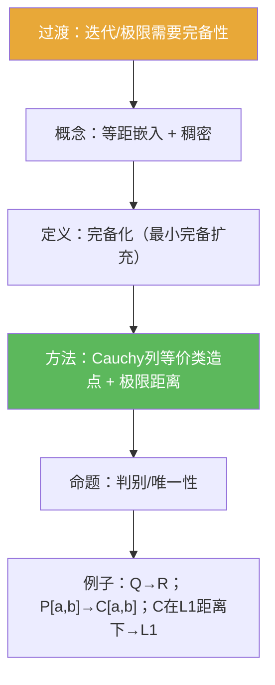

**相关笔记：** [[1.1 压缩映射原理]] | [[1.4 赋范线性空间]] | [[第01章 度量空间 — 章节汇总]]

## 概览

> [!abstract] 概览
> “完备化”回答一个非常具体的问题：给定任意度量空间 $(X,d)$，能否把它补齐成一个==完备度量空间==，并且让 $X$ 作为稠密子集嵌在里面？
>
> - 完备性缺失的本质：Cauchy 列“想收敛”，但极限点不在空间内
> - 完备化的目标：构造 $(\widehat X,\widehat d)$ 与等距嵌入 $\iota:X\to\widehat X$，使 $\iota(X)$ 在 $\widehat X$ 中稠密，且 $\widehat X$ 完备
> - 经典例子：$\mathbb{Q}$ 的完备化是 $\mathbb{R}$
> - 与本章联动：需要做迭代/极限过程（如 [[1.1 压缩映射原理]]）时，常先转到完备化；在范数情形得到 Banach（见 [[1.4 赋范线性空间]]）

^overview

---

# 1. 本节主题定位

- **本节的核心问题**
  - 给定任意度量空间 $(X,d)$，如何把它“补齐”成一个完备度量空间 $(\widehat X,\widehat d)$，并让 $X$ 以**等距嵌入**方式进入 $\widehat X$ 且在其中**稠密**？
- **本节在本章知识链中的位置**
  - 1.1 给出“完备 + 压缩 ⇒ 存在唯一 + 可迭代”的模板：[[1.1 压缩映射原理]]
  - 1.2 解决“空间不完备时极限落点缺失”的结构性问题：先补齐空间，再谈迭代/极限
  - 1.3 紧性与列紧将与“完备 + 全有界”形成新的判别链：[[1.3 列紧集]]
- **本节依赖哪些前置概念/定理**
  - [[度量空间]]、[[Cauchy列]]、[[完备度量空间]]（来自 1.1 的基本语言）
- **本节为后续哪些内容铺路**
  - Banach 化：赋范空间的完备化就是 Banach 空间（从“度量”迁移到“范数”）：[[1.4 赋范线性空间]]
  - “闭子集继承完备性/补齐解空间”的工程套路：在 1.1 的迭代/解方程中反复出现

## 二、核心思想

- 完备化的标准做法可以记成“三件套”：
  1) **造点**：用 $X$ 中 Cauchy 列的等价类代表“应当存在的极限点”；  
  2) **造距离**：用 $\lim d(x_n,y_n)$ 定义等价类间距离（先证极限存在与良定）；  
  3) **造嵌入**：把 $x\in X$ 映成常值列，得到等距嵌入；再用“代表列的第 $n$ 项”逼近，得到稠密性。
- 本节最容易“看懂但不会用”的地方：不是“构造长什么样”，而是**如何验证良定性与完备性**（三角不等式/夹逼/稠密选点这几步是可迁移模板）。

---

# 2. 内容分层图

> [!quote] 原文直接信息（分层）
> - **概念层**：等距同构/嵌入、稠密子集、完备化（最小完备扩充）、Cauchy 列等价类
> - **命题层**：完备化的判别（完备 + 等距包含 + 稠密）；完备化的唯一性（等距同构意义下）
> - **方法层**：Cauchy 列等价类构造；“极限距离”的良定性证明；稠密选点 + 对角线式构造证明完备
> - **过渡层**：从“迭代列是 Cauchy”到“极限点存在且落回空间”（连接 1.1 与后续 Banach 化）

---

# 3. 定义系统（按教材逻辑顺序）

## 3.1 等距同构 / 等距嵌入（“保距离搬运结构”）

> [!quote] 原文直接信息（严格表述：等距同构/嵌入的核心条件）
> 若映射 $\varphi:X\to Y$ 满足对任意 $x_1,x_2\in X$，
> $$\rho(\varphi(x_1),\varphi(x_2))=d(x_1,x_2),$$
> 则称 $\varphi$ 为等距映射（等距嵌入）。若进一步是满射，则两空间等距同构。

- **定义对象是什么**：两个度量空间之间的映射。
- **为什么要这样定义**：完备性、收敛、Cauchy 等概念都只用距离表述；“保距离”意味着这些性质可无损搬运。
- **重要条件的作用**
  - “保距离”：保证 Cauchy 性/收敛性在两空间间一致；
  - “满射”（等距同构额外要求）：保证空间大小也一致（不仅是“嵌进去一部分”）。
- **最小例子**：$\mathbb{Q}\hookrightarrow\mathbb{R}$（按通常距离）是等距嵌入但非满射。
- **初学者误区**：把“等距同构”和“等距嵌入”混为一谈，导致“唯一性/最小性”的叙述失真。

## 3.2 定义：稠密子集（“只补空洞，不乱加点”）

> [!quote] 原文直接信息（严格表述）
> $E\subset Y$ 在 $Y$ 中稠密：对任意 $y\in Y$ 与任意 $\varepsilon>0$，存在 $x\in E$ 使 $\rho(x,y)<\varepsilon$。

- **它解决了什么问题**：把“新增点”限制为“旧点可任意逼近的极限”，避免随意扩充。
- **与前面概念的关系**：稠密 + 等距嵌入一起刻画“$X$ 是 $\widehat X$ 的原始骨架”。
- **初学者误区**：把稠密误读成“每个点都在子集里”（正确是“任意精度逼近”）。

## 3.3 定义：完备化（completion）

> [!quote] 原文直接信息（严格表述）
> 若存在完备度量空间 $(\widehat X,\widehat d)$ 与等距嵌入 $\iota:(X,d)\to(\widehat X,\widehat d)$，且 $\iota(X)$ 在 $\widehat X$ 中稠密，则称 $(\widehat X,\widehat d)$ 为 $(X,d)$ 的完备化。

- **重要条件的作用**
  - “完备”：保证 Cauchy 列都能在空间内收敛（补齐缺失极限）；
  - “等距嵌入”：保留原空间的距离结构；
  - “稠密”：保证这是“最小补全”，没有加入与 $X$ 无关的额外部分。
- **最小例子**：$\mathbb{Q}$ 的完备化是 $\mathbb{R}$。
- **非例/边界情况**：把 $X$ 等距嵌入某个完备空间但像集不稠密，只能说“嵌入”，不能说“完备化”。

## 3.4 定义：Cauchy 列等价关系与“极限距离”（为存在性定理服务）

> [!quote] 原文直接信息（抽取：构造的两步核心定义）
> 令 $\mathcal{C}(X)$ 为 $X$ 中全体 Cauchy 列。定义
> $$(x_n)\sim(y_n)\iff d(x_n,y_n)\to 0.$$
> 并设
> $$\widehat d([(x_n)],[(y_n)]):=\lim_{n\to\infty} d(x_n,y_n).$$

- **最可能看懂但不会用**：只记住“定义长什么样”，但不会证明“极限存在/与代表元无关/满足度量三公理”。

---

# 4. 定理/命题系统（证明只提骨架）

## 4.1 命题：判别某个完备扩充就是完备化（“完备 + 稠密”判别法）

> [!quote] 原文直接信息（准确内容，语义抽取）
> 若 $(Y,\rho)$ 完备，且存在等距嵌入 $\iota:(X,d)\to(Y,\rho)$，并且 $\iota(X)$ 在 $Y$ 中稠密，则 $Y$（在等距同构意义下）可作为 $X$ 的完备化。

- **条件逐条解释**
  - 完备：用来取极限点并确保落在 $Y$
  - 等距：保证 $X$ 的 Cauchy 性/距离结构在 $Y$ 中保持
  - 稠密：保证“最小性”（新点都能被旧点列逼近）
- **证明骨架（Step 1/2/3）**
  - Step 1：取任意 $y\in Y$，用稠密性选 $\iota(x_n)\to y$
  - Step 2：比较 $Y$ 中的距离与 $X$ 中的距离（靠等距），把问题拉回到 $X$
  - Step 3：用完备性与“逼近列唯一决定极限点”的性质，得到“与任何其他完备扩充相比都具有最小性”
- **证明中最关键的一跳**：把“稠密逼近”与“等距搬运距离”结合起来，构造出从任意完备扩充到该 $Y$ 的一致比较。

## 4.2 定理：任意度量空间都存在完备化（Cauchy 等价类构造）

> [!quote] 原文直接信息（准确内容）
> 每一个度量空间都有一个完备化空间。

- **证明骨架（Step 1/2/3）**
  - Step 1（造点+造距离）：取 $\widehat X=\mathcal{C}(X)/\sim$，并定义 $\widehat d([(x_n)],[(y_n)])=\lim d(x_n,y_n)$；证明极限存在且良定，并验证度量三公理。
  - Step 2（嵌入+稠密）：定义 $\iota(x)=[(x,x,x,\dots)]$；证明等距；并用代表列的“第 $n$ 项”给出稠密逼近。
  - Step 3（完备）：对 $\widehat X$ 中 Cauchy 列，用稠密性在每一项附近选取 $X$ 中代表点，拼出 $X$ 中的 Cauchy 列，再用等价类定义出极限点并证明收敛。
- **证明中最关键的一跳**
  - 良定性：用三角不等式夹逼
    $$\bigl|d(x_n,y_n)-d(x_n',y_n')\bigr|\le d(x_n,x_n')+d(y_n,y_n'),$$
    令右侧 $\to 0$ 得到极限无关代表元；
  - 完备性：用“稠密选点 + $1/n$ 逼近”把 $\widehat X$ 的 Cauchy 列转回 $X$ 中 Cauchy 列。
- **若条件削弱哪里可能出问题**
  - 若只嵌入但不要求稠密，则不是“最小补全”；可能包含与 $X$ 无关的部分，导致“完备化不唯一”。

---

# 5. 例子与反例系统

- **本节最关键的例子**
  - $\mathbb{Q}$ 的完备化是 $\mathbb{R}$（经典“缺失极限点 $\sqrt2$”）。
  - 多项式空间 $P[a,b]$ 在上确界距离下的完备化是 $C[a,b]$（稠密 + 完备判别法）。
  - $C[a,b]$ 在 $L^1$ 型距离下的完备化是 $L^1[a,b]$（提示：完备性依赖距离/范数，而不只是集合）。

- **本节最值得补的反例（服务于“条件作用”）**
  - “同一集合换度量，完备性会变”：例如在 $C[a,b]$ 上取 $p_1(x,y)=\int_a^b \lvert x(t)-y(t)\rvert\,dt$，得到的不再是完备空间。
  - “嵌入到完备空间 ≠ 完备化”：若像集不稠密，则只是嵌入而不是补全。

- **每个例子/反例分别服务于什么理解点**
  - $\mathbb{Q}\to\mathbb{R}$：理解“缺失极限点”与“新增点由旧点列逼近”
  - $P[a,b]\to C[a,b]$：理解“命题判别法”（完备 + 稠密）
  - $C[a,b]$ 在 $L^1$ 距离下补全为 $L^1$：理解“完备性依赖度量/范数”

---

# 6. 本节逻辑链复原（作者为什么这样安排）

1) 先从 1.1 的应用动机出发：很多存在性/迭代法会先制造 Cauchy 列，但需要完备性把它变成空间内极限点。  
2) 因此先建立“怎么把 $X$ 放进更大空间而不损失距离”的语言（等距嵌入/同构）。  
3) 再加上“补全必须最小”的约束（稠密），避免“随便塞进一个完备空间”带来的非唯一性。  
4) 给出完备化的抽象定义（完备 + 等距嵌入 + 稠密）。  
5) 给出判别命题（以后遇到具体空间，如 $P[a,b]$，可以不用再重复构造）。  
6) 最后给出统一存在性构造（Cauchy 等价类），把“完备化总存在”变成可复用模板。

---

# 7. 本节高风险误区（至少 5 条）

1) **把“稠密”误读成“包含”**：稠密是“任意精度逼近”，不是“点本身属于子集”。  
2) **把“完备化”当成“闭包”**：闭包依赖预先给定的母空间；完备化是为 $X$ 构造一个完备母空间并要求最小性。  
3) **认为完备性只取决于集合**：完备性依赖度量/范数；同一 $C[a,b]$ 换距离可变为不完备。  
4) **把等距同构与等距嵌入混淆**：同构需要满射；嵌入一般不满射。  
5) **把 $(x_n)\sim(y_n)$ 写成“从某项起相等”**：正确是 $d(x_n,y_n)\to 0$（趋同而非最终一致）。  
6) **定义 $\widehat d$ 时漏证两件事**：极限存在、与代表元无关（良定性）。  
7) **误读“最小”=“元素最少”**：正确含义是“任何完备扩充都必须（等距地）包含它”，是结构性最小。

---

# 8. 知识库拆分建议

- **A类：应独立成概念卡**
  - [[完备化]]、[[完备度量空间]]、[[Cauchy列]]、[[等距映射]]、[[稠密子集]]
  - “等价关系与良定性证明套路”（可作为方法型概念节点）

- **B类：应独立成定理卡**
  - “度量空间完备化存在定理”（本节主定理）
  - “完备化判别命题：完备 + 等距嵌入 + 稠密”

- **C类：只保留在本节页中**
  - “为什么 1.1 的迭代法需要先补完解空间”的过渡叙事（与本节动机绑定）

- **D类：建议作为专题综述页候选节点**
  - “补完解空间的工程策略：完备化 / Banach 化 / Hilbert 化”
  - “完备性 vs 紧性：从 1.2 到 1.3 的判别链”

---

# 9. 后续学习接口

- **适合下一轮展开证明的点**
  - 定理存在性证明里“良定性（代表元无关）”与“完备性证明”的关键构造
  - 判别命题如何推导出“$P[a,b]$ 的完备化是 $C[a,b]$”
- **适合设计习题的点**
  - 证明 $\sim$ 是等价关系（核心工具：三角不等式）
  - 证明 $\widehat d$ 良定（核心工具：夹逼不等式）
  - 证明 $\iota$ 等距、且像集稠密（核心工具：Cauchy 列尾项趋近）
- **适合与前一节做比较的点**
  - 1.1：压缩 ⇒ 迭代列 Cauchy；1.2：Cauchy ⇒（在补全后）存在极限点落回空间
- **适合与下一节做衔接的点**
  - 1.3：紧性判别中“完备 + 全有界”的组合会频繁出现；完备性基础来自本节

### 练习样例（骨架级，供第二轮展开）

> [!problem] 题1：等价关系
> 在 $\mathcal{C}(X)$ 上定义 $(x_n)\sim(y_n)\iff d(x_n,y_n)\to 0$。证明 $\sim$ 是等价关系。
>
> [!solution]- 解答骨架
> - 自反：$d(x_n,x_n)=0\to 0$  
> - 对称：$d(x_n,y_n)=d(y_n,x_n)$  
> - 传递：三角不等式 $d(x_n,z_n)\le d(x_n,y_n)+d(y_n,z_n)$，两项都 $\to 0$ 推出左侧 $\to 0$

> [!problem] 题2：距离良定
> 设 $(x_n)\sim(x_n')$、$(y_n)\sim(y_n')$。证明
> $$\lim_{n\to\infty} d(x_n,y_n)=\lim_{n\to\infty} d(x_n',y_n').$$
>
> [!solution]- 解答骨架
> - 关键夹逼：
>   $$\bigl|d(x_n,y_n)-d(x_n',y_n')\bigr|\le d(x_n,x_n')+d(y_n,y_n').$$
> - 右侧两项 $\to 0$，故差值 $\to 0$，极限相同。

> [!problem] 题3：等距嵌入与稠密
> 令 $\iota(x)=[(x,x,x,\dots)]$。证明 $\iota$ 是等距嵌入；并说明为什么 $\iota(X)$ 在 $\widehat X$ 中稠密。
>
> [!solution]- 解答骨架
> - 等距：$\widehat d(\iota(x),\iota(y))=\lim d(x,y)=d(x,y)$  
> - 稠密：任取 $\widehat x=[(x_n)]$，考虑 $\iota(x_n)$，并证明 $\widehat d(\iota(x_n),\widehat x)\to 0$（用 Cauchy 尾项趋近）

---

# 10. 自测问题（5 个由浅到深）

1) 完备化的目标是什么？它与 1.1 的压缩迭代法在哪一步发生“接口对接”？  
2) 写出“稠密子集”的定义，并说明“稠密”为什么是完备化定义里的必要条件。  
3) 完备化构造中，为什么要用 $(x_n)\sim(y_n)\iff d(x_n,y_n)\to 0$ 这种等价关系？它解决了什么问题？  
4) 在定义 $\widehat d([(x_n)],[(y_n)])=\lim d(x_n,y_n)$ 时，最需要补齐的两步验证是什么？（提示：极限存在与良定性）  
5) 给出一个“同一集合换度量导致完备性改变”的例子，并解释它对后续 Banach 化有什么警示意义。  

---

> [!quote]- 参考（教材分片 + 本库链接）
> 1. 张恭庆《泛函分析讲义》1.2（分片）：![[00-Raw素材/泛函分析讲义_张恭庆/章节内容/第一章_度量空间/1.2_完备化.pdf]]
> 2. 参见概念页：[[完备度量空间]] / [[Cauchy列]] / [[完备化]] / [[度量空间]] / [[稠密子集]] / [[等距映射]]

#学习/泛函分析/度量空间
