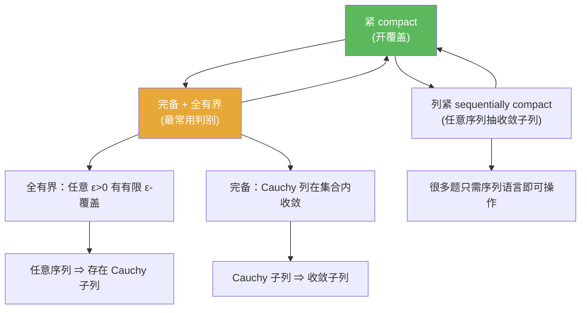

**相关笔记：** [[1.2 完备化]] | [[1.4 赋范线性空间]] | [[第01章 度量空间 — 章节汇总]]

## 概览

> [!abstract] 概览
> “列紧”把紧性改写成一个更可操作的序列命题：==任意序列都有收敛子列==。在度量空间中，列紧与紧等价，并进一步等价于“完备 + 全有界”。这三种口径构成后续泛函分析里判断紧性的基础工具箱。
>
> - 定义：列紧 $\Rightarrow$ 抽取收敛子列（极限仍在集合内）
> - 关键等价（度量空间）：紧 $\Leftrightarrow$ 列紧
> - 常用判别（度量空间）：紧 $\Leftrightarrow$ 完备 + 全有界
> - 思维纠偏：闭且有界 $\Rightarrow$ 紧只在 $\mathbb{R}^n$ 等特殊情形成立（无限维通常失败，见 [[1.4 赋范线性空间]]）

^overview

---

# 1. 本节主题定位

- **本节的核心问题**
  - 如何在度量空间里把“紧（开覆盖）”转换成“列紧（序列抽取）”？
  - 如何把“列紧/紧”进一步拆成两个更工程化的条件：**完备 + 全有界**？
  - 解题时到底该用哪种口径（开覆盖 / 序列 / $\varepsilon$-网）最省力？

- **本节在本章知识链中的位置**
  - 1.1/1.2 处理“极限是否落回空间”（完备性与补完空间）：[[1.1 压缩映射原理]]、[[1.2 完备化]]
  - 1.3 处理“无穷过程能否抽出收敛子列”（紧性/列紧/全有界）
  - 1.4 将用本节结论纠偏：无限维里“闭且有界”通常不紧：[[1.4 赋范线性空间]]

- **本节依赖哪些前置概念/定理**
  - [[度量空间]]、[[Cauchy列]]、[[完备度量空间]]
  - 开覆盖、闭集（至少能读懂“紧”的定义）

- **本节为后续哪些内容铺路**
  - 之后遇到“相对紧/紧算子/Arzelà–Ascoli 型工具”时，本节语言会反复出现：[[全有界]]、[[列紧]]、[[紧集]]

## 二、核心思想

> [!quote] 原文直接信息（主链条）
> 在度量空间中：
> - 紧（开覆盖）$\Leftrightarrow$ 列紧（任意序列抽收敛子列）
> - 紧 $\Leftrightarrow$ 完备 + 全有界

> [!tip] 辅助理解（把三种口径串成可复用流程）
> 判断紧性时，把“开覆盖”换成“序列抽取”，再把“序列抽取”换成“全有界 + 完备”：
> - **全有界**负责：从任意序列里“逼出”Cauchy 子列（靠有限覆盖递推/对角线抽取）
> - **完备**负责：把 Cauchy 子列“兑现”为收敛子列，且极限仍落在集合内

> [!warning] 本节最可能“看懂但不会用”的地方
> 你若只记住“紧⇔完备+全有界”这句话，但不会做两件事，就很难迁移到新题：
> 1) 用全有界构造 $\varepsilon$-网/有限覆盖，并递推抽取 Cauchy 子列；  
> 2) 用三角不等式证明：Cauchy 列若有收敛子列，则全列收敛到同一极限。

---

# 2. 内容分层图

> [!quote] 原文直接信息（分层）
> - **概念层**：紧、列紧、全有界、完备
> - **命题层**：紧 $\Leftrightarrow$ 列紧（度量空间）；紧 $\Leftrightarrow$ 完备 + 全有界
> - **方法层**：有限 $\varepsilon$-覆盖 / $\varepsilon$-网；对角线抽取；“Cauchy + 子列收敛 ⇒ 全列收敛”
> - **过渡层**：$\mathbb{R}^n$ 的 Heine–Borel（闭有界）只是特例；无限维要改用全有界语言

---

# 3. 定义系统

## 3.1 定义：列紧（sequentially compact）

> [!quote] 原文直接信息（严格表述）
> 子集 $K\subset X$ 称为列紧：对任意序列 $(x_n)\subset K$，存在子列 $(x_{n_k})$ 收敛到某个 $x\in K$。

- **定义对象是什么**：度量空间的子集 $K$。
- **为什么要这样定义**：把“紧性”从开覆盖语言变成序列抽取语言（更贴合分析做题）。
- **重要条件的作用**：极限点必须在 $K$ 内（这是很多存在性结论的落点许可）。
- **最小例子**：闭区间 $[0,1]\subset\mathbb{R}$（欧氏度量）列紧。
- **非例/边界情况**：$(0,1)$ 中序列 $x_n=1/n$ 收敛到 $0\notin(0,1)$，因此不列紧。
- **初学者误区**：只关注“有子列收敛”，忘记“极限仍在集合内”。

## 3.2 定义：紧（compact，开覆盖）

> [!quote] 原文直接信息（严格表述）
> 子集 $K\subset X$ 称为紧：对任意开覆盖 $\{U_\alpha\}$，存在有限子覆盖。

- **为什么要这样定义**：该定义在一般拓扑空间中也成立，是紧性的“源定义”。
- **最可能看懂但不会用**：面对开覆盖无法做构造；在度量空间里通常改用序列/全有界口径。

## 3.3 定义：全有界（totally bounded）

> [!quote] 原文直接信息（严格表述）
> 集合 $E\subset X$ 称全有界：对任意 $\varepsilon>0$，存在有限个点 $x_1,\dots,x_N$ 使
> $$E\subset \bigcup_{i=1}^N B(x_i,\varepsilon).$$

- **重要条件的作用**
  - “任意 $\varepsilon$”：任意精度都能被有限信息编码（紧性的有限可描述性来源）。
  - “有限覆盖”：为递推抽取/对角线法提供“无限子列仍落在同一球内”的启动条件。
- **与前面概念的关系**：全有界是“紧性”里负责“抽出 Cauchy 子列”的那一半。
- **最小例子**：$\mathbb{R}^n$ 中有界集都是全有界。
- **非例**：离散度量下的无限集合（任何半径 $<1$ 的球都是单点）不是全有界。
- **初学者误区**：把“有界”当作“全有界”（有界只是一颗大球装下，全有界是任意精度有限覆盖）。

---

# 4. 定理/命题系统（证明只提取骨架）

## 4.1 定理：度量空间中 紧 $\Leftrightarrow$ 列紧

> [!quote] 原文直接信息（准确内容）
> 在度量空间里，紧性（开覆盖定义）与列紧性等价。

- **条件逐条解释**
  - “度量空间”是关键假设：在一般拓扑空间中，“紧⇔列紧”可能失败。
- **结论到底在说什么**
  - 你可以把“紧”当作“任意序列可抽收敛子列”来用（但仅限度量空间语境）。
- **证明骨架（Step 1/2/3）**
  - Step 1：紧 $\Rightarrow$ 全有界（固定 $\varepsilon$，用 $\{B(x,\varepsilon)\}$ 作开覆盖取有限子覆盖）
  - Step 2：全有界 $\Rightarrow$ 任意序列有 Cauchy 子列（递推有限覆盖 + 对角线抽取）
  - Step 3：紧（或完备性）保证 Cauchy 子列收敛且极限在集合内，从而得到列紧
- **证明中最关键的一跳**
  - 从“有限 $\varepsilon$-覆盖”到“可抽 Cauchy 子列”的递推/对角线模板。
- **若条件削弱，哪里可能出问题**
  - 若空间不是度量空间：可能出现“紧但不列紧”或“列紧但不紧”的反例。

## 4.2 定理（判别链）：紧 $\Leftrightarrow$ 完备 + 全有界

> [!quote] 原文直接信息（准确内容）
> 在度量空间（或其子集的子空间度量）中，
> $$K \text{ 紧}\ \Leftrightarrow\ K \text{ 完备且全有界}.$$

- **条件逐条解释（每个条件的工作岗位）**
  - 全有界：把“任意序列”压缩出 Cauchy 子列（通过有限覆盖递推）
  - 完备：把 Cauchy 子列兑现为收敛子列，且极限仍在集合内
- **证明骨架（Step 1/2/3）**
  - Step 1：紧 $\Rightarrow$ 全有界（开覆盖取有限子覆盖）
  - Step 2：紧 $\Rightarrow$ 完备（Cauchy + 子列收敛 ⇒ 全列收敛）
  - Step 3：完备 + 全有界 $\Rightarrow$ 列紧 $\Rightarrow$ 紧（先抽 Cauchy 子列，再用完备性取极限点）
- **证明中最关键的一跳**
  - “Cauchy + 子列收敛 ⇒ 全列收敛”：一次三角不等式把“尾项互相近”与“子列靠近极限”拼起来。
- **若条件削弱，哪里可能出问题**
  - 全有界但不完备：如 $(0,1)$（不紧）
  - 完备但不全有界：如许多无限维空间的闭单位球（不紧）

## 4.3 命题：全有界 $\Rightarrow$ 任意序列存在 Cauchy 子列（抽取发动机）

> [!quote] 原文直接信息（语义抽取）
> 在度量空间中，全有界保证“任意序列可抽出 Cauchy 子列”。

- **证明骨架（递推 + 对角线）**
  - Step 1：用 $\varepsilon=1$ 的有限覆盖，从序列中取落在同一球内的无限子列
  - Step 2：对该子列用 $\varepsilon=1/2$ 覆盖，再取落在同一球内的无限子列
  - Step 3：递推得到嵌套子列，使第 $k$ 层子列直径 $\le 2^{-k}$
  - Step 4：取对角线子列，得到 Cauchy 子列
- **最关键的一跳**
  - 每一步都要保留“无限子列”，否则递推会断。

---

# 5. 例子与反例系统

- **本节最关键的例子**
  - $\mathbb{R}^n$（欧氏度量）中：紧 $\Leftrightarrow$ 闭且有界（Heine–Borel）
    - 服务理解点：有限维里“有界 ⇒ 全有界”，所以判别链会退化得更简单。

- **本节最值得补的反例**
  1) $(0,1)$：有界且全有界，但不完备，因此不紧/不列紧  
     - 服务理解点：说明“全有界还不够”，必须补上完备（或闭于某完备母空间）。
  2) 无限维赋范空间的闭单位球：通常完备但不全有界，因此不紧  
     - 服务理解点：无限维紧性失败常发生在“全有界”，而不是“完备”。

- **每个例子/反例分别服务于什么理解点**
  - Heine–Borel：有限维直觉何时可靠
  - $(0,1)$：缺完备时为何不紧（极限落点缺失）
  - 无限维闭单位球：缺全有界时为何不紧（无法任意精度有限编码）

---

# 6. 本节逻辑链复原（作者为什么这样安排）

1) 先用列紧把紧性从“开覆盖”转成“序列抽取”，贴合分析语言。  
2) 说明在度量空间里紧⇔列紧，让你可以安全用序列法做紧性题。  
3) 再把“序列抽取”进一步工程化：全有界负责抽 Cauchy 子列，完备负责把 Cauchy 兑现为收敛。  
4) 给出判别链“紧⇔完备+全有界”：把紧性拆成两个更可验证的模块化条件。  
5) 最后用有限维/无限维对比，提醒不要滥用“闭有界⇒紧”的直觉。

---

# 7. 本节高风险误区（至少 5 条）

1) **把“闭且有界 ⇒ 紧”当作一般事实**：只在 $\mathbb{R}^n$ 等有限维特例成立。  
2) **把“有界”当作“全有界”**：有界只是被一颗大球装下；全有界是任意精度有限覆盖。  
3) **忘记列紧定义里“极限必须在集合内”**：这是 $(0,1)$ 这类反例的关键。  
4) **以为“紧⇔列紧”在任意拓扑空间成立**：不成立；本节等价依赖度量/可数性。  
5) **对角线抽取时每步没保留“无限子列”**：递推中断是最常见技术错误。  
6) **误以为“完备 ⇒ 紧”**：完备只解决“极限落点”，不解决“能否任意精度有限编码”。  
7) **不会用“Cauchy + 子列收敛 ⇒ 全列收敛”**：其实只需一次三角不等式拼接两条趋近。

---

# 8. 知识库拆分建议

- **A类：应独立成概念卡**
  - [[紧集]]、[[列紧]]、[[全有界]]、[[完备度量空间]]、[[Cauchy列]]
  - 术语候选：$\varepsilon$-网（或“有限 $\varepsilon$-覆盖”）、分离序列（否定全有界的模板）

- **B类：应独立成定理卡**
  - 度量空间：紧 $\Leftrightarrow$ 列紧
  - 度量空间：紧 $\Leftrightarrow$ 完备 + 全有界
  - 全有界 $\Rightarrow$ 任意序列存在 Cauchy 子列（对角线抽取模板）

- **C类：只保留在本节页中**
  - 有限维/无限维直觉纠偏与叙事链条

- **D类：专题综述候选节点**
  - 紧性判别工具箱：开覆盖 / 序列 / $\varepsilon$-网 / 分离序列（以及无限维中的紧性稀缺）

---

# 9. 后续学习接口

- **适合下一轮展开证明的点**
  - “列紧⇒全有界”的反证构造（分离序列）
  - “全有界⇒抽 Cauchy 子列”的递推/对角线模板
  - “紧⇒完备”的标准证明（Cauchy + 子列收敛 ⇒ 全列收敛）

- **适合设计习题的点**
  - 证明：紧⇒全有界（固定 $\varepsilon$ 的开球覆盖）
  - 证明：列紧⇒完备（Cauchy 列抽收敛子列）
  - 构造：否定全有界（找分离序列）

- **适合与前一节做比较的点**
  - 1.2 完备化：解决“Cauchy 是否能取极限”；1.3 解决“是否能抽出 Cauchy/收敛子列”

- **适合与下一节做衔接的点**
  - 1.4 赋范空间：无限维里闭单位球通常不紧（通常因不全有界）

### 练习样例（骨架级，供第二轮展开）

> [!problem] 题1：紧 $\Rightarrow$ 全有界
> 设 $K$ 为紧度量空间。证明：$K$ 全有界。
>
> [!solution]- 解答骨架
> - 固定 $\varepsilon>0$，用 $\{B(x,\varepsilon)\}_{x\in K}$ 作开覆盖  
> - 紧 ⇒ 取有限子覆盖 $K\subset\bigcup_{i=1}^N B(x_i,\varepsilon)$，即全有界

> [!problem] 题2：紧 $\Rightarrow$ 完备
> 设 $K$ 为紧度量空间。证明：$K$ 完备。
>
> [!solution]- 解答骨架
> - 取 $K$ 中任意 Cauchy 列 $(x_n)$  
> - 紧/列紧 ⇒ 抽收敛子列 $x_{n_k}\to x\in K$  
> - 用 Cauchy 性 + 三角不等式推出全列 $x_n\to x$

> [!problem] 题3：闭有界但不紧的直觉（无限维）
> 解释为什么在无限维赋范空间中“闭单位球一般不紧”，并指出证明思路。
>
> [!solution]- 解答骨架
> - 紧 $\Leftrightarrow$ 完备 + 全有界；闭单位球通常是完备的  
> - 用 Riesz 引理构造分离序列：存在 $\delta>0$ 使 $\|x_n-x_m\|\ge\delta$  
> - 取 $\varepsilon<\delta/2$，否定有限 $\varepsilon$-覆盖，从而否定全有界 ⇒ 不紧

---

# 10. 自测问题（5 个由浅到深）

1) 列紧的定义中最容易漏掉的关键条件是什么？为什么它一漏，很多结论就失效？  
2) 用一句话区分“有界”与“全有界”。各自否定时最常用的构造是什么？  
3) 在证明“完备 + 全有界 ⇒ 紧”时，全有界与完备分别在证明里承担哪一步工作？  
4) 写出“全有界 ⇒ 任意序列有 Cauchy 子列”的递推抽取思路（不写细节，只写骨架）。  
5) 为什么无限维里“闭单位球不紧”通常是因为“非全有界”而不是“非完备”？（提示：闭子集继承完备性）  

---

> [!quote]- 参考（教材分片 + 本库链接）
> 1. 张恭庆，《泛函分析讲义》，第 1 章 1.3。  
> 2. 本节对应分片 PDF：![[00-Raw素材/泛函分析讲义_张恭庆/章节内容/第一章_度量空间/1.3_列紧集.pdf]]  
> 3. 概念页：[[紧集]] / [[列紧]] / [[全有界]] / [[完备度量空间]] / [[Cauchy列]] / [[度量空间]]

#学习/泛函分析/度量空间
