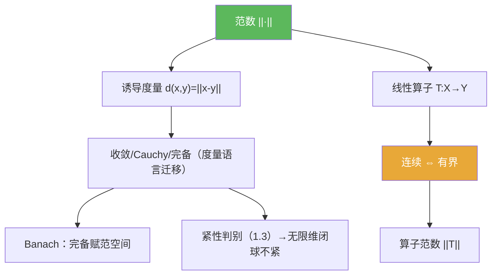

**相关笔记：** [[1.2 完备化]] | [[1.3 列紧集]] | [[1.5 凸集与不动点]] | [[1.6 内积空间]] | [[第01章 度量空间 — 章节汇总]]

> [!abstract] 概览
> 本节把“线性空间”升级为==赋范线性空间==：通过范数 $\|\cdot\|$ 得到度量 $d(x,y)=\|x-y\|$，从而把==收敛 / Cauchy / 完备==这套度量语言完整搬进线性空间，并进入泛函分析的主舞台。
>
> - 范数三公理 ⇒ 诱导度量 ⇒ 统一刻画开球、收敛、完备（回链 [[度量空间]]）
> - **Banach 空间** = 完备赋范空间：不丢极限点（与 [[1.2 完备化]] 闭环）
> - 线性算子最关键结论：==连续 ⇔ 有界==（只需控 0 点，再靠缩放推广）
> - 用==算子范数==把“有界性”数值化：$\|T\|=\sup_{\|x\|\le 1}\|Tx\|$
> - 无限维里“闭且有界”通常不紧（呼应 [[1.3 列紧集]] 的全有界/列紧判别）

^overview

---

# 1. 本节主题定位

- **本节的核心问题**
  - 如何把“距离语言”完整迁移到线性空间：用范数 $\|\cdot\|$ 诱导度量 $d(x,y)=\|x-y\|$？
  - 如何用“完备性”把赋范空间升级为 Banach 空间（避免极限点丢失）？
  - 为什么线性算子里“连续 ⇔ 有界”是第一重要判别器？它在后续算子论里怎么被复用？

- **本节在本章知识链中的位置**
  - 1.1–1.3：度量空间语言（收敛/Cauchy/完备/紧性判别）  
  - 1.4：把这套语言迁移到线性空间，并引入“线性算子 + 范数估计”的主工作方式  
  - 1.6：进一步在赋范空间上加入内积结构（Hilbert 作为更强舞台）

- **本节依赖哪些前置概念/定理**
  - [[度量空间]]、[[Cauchy列]]、[[完备度量空间]]、[[完备化]]
  - 1.3 的紧性判别（紧⇔完备+全有界）将用于理解“无限维闭单位球不紧”：[[1.3 列紧集]]

- **本节为后续哪些内容铺路**
  - Banach 空间上的算子与极限过程（不动点、级数、泛函极值等）
  - 算子范数将成为后续“有界线性算子空间”的范数与拓扑基础：[[算子范数]]
  - “闭且有界不紧”的无限维现象（为紧算子/弱拓扑等动机铺路）

## 二、核心思想

> [!quote] 原文直接信息（核心结论与工作流信号）
> - 范数三公理 ⇒ 诱导度量 ⇒ “收敛/Cauchy/完备”可复用到线性空间。  
> - Banach 空间 = 完备赋范空间。  
> - 线性算子最关键结论：连续 ⇔ 有界（等价于存在全局范数估计）。  
> - 算子范数把“有界性”数值化：$\|T\|=\sup_{\|x\|\le 1}\|Tx\|$。

> [!tip] 辅助理解（本节最值得记住的一句话）
> 在赋范空间里证明“连续/收敛/稳定性”，不要反复写 $\varepsilon$–$\delta$：把问题改写成**范数不等式**；在线性情形，“控住 0 点 + 缩放”即可推广到全局。

> [!warning] 本节最可能“看懂但不会用”的地方
> 你如果不能把“连续 ⇔ 有界”的证明压缩成一条固定套路（选 $\varepsilon=1$ 取 $\delta$，再缩放），后续遇到任何算子估计都会反复卡壳。

---

# 2. 内容分层图

> [!quote] 原文直接信息（分层）
> - **概念层**：范数、赋范线性空间、范数诱导度量、Banach 空间、线性算子、算子范数
> - **命题层**：连续线性算子 ⇔ 有界线性算子；$\|Tx\|\le \|T\|\|x\|$
> - **方法层**：用范数不等式替代 ε–δ；“控 0 点 + 缩放”；单位球上取上确界
> - **过渡层**：度量空间语言 → 线性空间语言（为后续算子论/谱理论铺路）

---

# 3. 定义系统

## 3.1 范数与赋范线性空间

> [!quote] 原文直接信息（严格表述）
> 在线性空间 $X$ 上，映射 $\|\cdot\|:X\to\mathbb{R}$ 若满足：
> 1) $\|x\|\ge 0$ 且 $\|x\|=0\Leftrightarrow x=0$  
> 2) $\|\alpha x\|=|\alpha|\,\|x\|$  
> 3) $\|x+y\|\le \|x\|+\|y\|$  
> 则称 $\|\cdot\|$ 为范数，$(X,\|\cdot\|)$ 为赋范线性空间。

- **定义对象是什么**：线性空间上的“大小”函数 $\|\cdot\|$。
- **重要条件的作用**
  - (2) 齐次性：支撑“缩放把 0 点连续推广成全局估计”
  - (3) 三角不等式：支撑“范数诱导度量”与几乎所有估计
- **最小例子**：$\mathbb{R}^n$ 的欧氏范数、$\ell^p$ 范数、$C[a,b]$ 的 $\|\cdot\|_\infty$。
- **非例/边界情况**：若只满足 (3) 与 (2) 但允许 $\|x\|=0$ 对非零 $x$，则会退化成半范数，导致“零距不辨点”。
- **初学者误区**：把“范数公理”当背诵点，不会在证明中明确指出：哪一步用到了(2)/(3)。

## 3.2 范数诱导度量

> [!quote] 原文直接信息（严格表述）
> 对赋范空间 $(X,\|\cdot\|)$，定义
> $$d(x,y):=\|x-y\|.$$
> 则 $d$ 是 $X$ 上的度量。

- **它解决了什么问题**：把 1.1–1.3 的“收敛/Cauchy/完备/紧性”整套语言搬进线性空间。
- **最小例子**：$d(x,y)=|x-y|$（$X=\mathbb{R}$）。
- **初学者误区**：忽略“平移不变/缩放相容”，导致不会用线性结构简化估计。

> [!note] 辅助理解（两条几何性质会反复用到）
> - 平移不变：$d(x+z,y+z)=d(x,y)$  
> - 缩放相容：$d(\alpha x,\alpha y)=|\alpha|\,d(x,y)$

## 3.3 Banach 空间（完备赋范空间）

> [!quote] 原文直接信息（严格表述）
> 若赋范空间 $(X,\|\cdot\|)$ 在度量 $d(x,y)=\|x-y\|$ 下完备，则称 $X$ 为 Banach 空间。

- **为什么要这样定义**：极限过程（级数、迭代、不动点、逼近）在空间内闭合，避免“极限点跑出空间外”。
- **与前面概念的关系**：这是 [[1.2 完备化]] 在“带线性结构”语境下的落地版本（Banach=已经补全好的赋范空间）。
- **初学者误区**：把“赋范”误当“完备”（很多常见子空间是赋范但不完备）。

## 3.4 有界线性算子与算子范数

> [!quote] 原文直接信息（语义抽取：定义层）
> 若线性算子 $T:X\to Y$ 满足存在 $C>0$ 使 $\|Tx\|\le C\|x\|$（$\forall x\in X$），则称 $T$ 有界；并定义算子范数
> $$\|T\|:=\sup_{\|x\|\le 1}\|Tx\|.$$

- **它解决了什么问题**：把“连续性”变成可计算的范数估计；把“最坏放大倍数”数值化为 $\|T\|$。
- **初学者误区**：把 $\|T\|$ 当成抽象符号，不会用“单位球上取上确界”来做估计与上界构造。

---

# 4. 定理/命题系统（证明只提取骨架）

## 4.1 定理：连续线性算子 ⇔ 有界线性算子

> [!quote] 原文直接信息（准确内容）
> 设 $X,Y$ 为赋范空间，$T:X\to Y$ 线性，则以下等价：  
> 1) $T$ 在 $0$ 点连续（等价于处处连续）  
> 2) $\exists C>0$ 使 $\|Tx\|\le C\|x\|$（$\forall x\in X$）  
> 3) $\sup_{\|x\|\le 1}\|Tx\|<\infty$

- **条件逐条解释**
  - “线性”是关键：它让“控 0 点”可以缩放推广到任意点/任意向量大小
  - “赋范”提供范数度量，允许把连续性写成范数不等式
- **结论到底在说什么**
  - 对线性算子而言，连续性不是局部 ε–δ 问题，而是一个全局 Lipschitz 型估计问题。
- **证明骨架（Step 1/2/3）**
  - Step 1：若 $\|Tx\|\le C\|x\|$，则 $\|Tx-Ty\|=\|T(x-y)\|\le C\|x-y\|$，所以连续（甚至 Lipschitz）。
  - Step 2：若 $T$ 连续，只需看 0 点：取 $\varepsilon=1$ 得 $\delta$ 使 $\|x\|<\delta\Rightarrow \|Tx\|<1$。
  - Step 3：对任意 $x\ne 0$，令 $u=\frac{\delta}{\|x\|}x$，用线性性与齐次性推出 $\|Tx\|\le \frac{1}{\delta}\|x\|$。
- **证明中最关键的一跳**
  - “缩放”：把任意 $x$ 归一化到 $\|u\|=\delta$，再把估计缩放回去。
- **后续用途**
  - 一切“算子连续性判别/稳定性/误差传播”都转化为找一个常数 $C$ 的范数估计。
- **若条件削弱，哪里可能出问题**
  - 若 $T$ 非线性：0 点连续无法推出全局 Lipschitz 型估计；结论整体失效。

## 4.2 命题：算子范数的基本控制式

> [!quote] 原文直接信息（语义抽取）
> 若 $T$ 有界且 $\|T\|=\sup_{\|x\|\le 1}\|Tx\|$，则对任意 $x\in X$，
> $$\|Tx\|\le \|T\|\,\|x\|.$$

- **证明骨架**：若 $x=0$ 显然；若 $x\ne 0$，令 $u=x/\|x\|$，则 $\|u\|=1$，所以 $\|Tx\|=\|x\|\|Tu\|\le \|x\|\|T\|$。

---

# 5. 例子与反例系统

- **本节最关键的例子**
  - 评价泛函 $\delta_{t_0}:C[a,b]\to\mathbb{R}$，$\delta_{t_0}(f)=f(t_0)$，其算子范数 $\|\delta_{t_0}\|=1$（展示“上界估计 + 取例达到”套路）。

- **本节最值得补的反例**
  - “赋范但不完备”的典型：$c_{00}$ 在 $\|\cdot\|_\infty$ 下不是 Banach（提示：Cauchy 列极限跑出空间）。
  - “闭且有界但不紧”的无限维闭单位球（提示：失败在全有界而非完备）。

- **每个例子/反例分别服务于什么理解点**
  - 评价泛函：算子范数的计算套路
  - $c_{00}$：为什么完备性必须单独验证
  - 闭单位球不紧：有限维直觉边界；为紧算子/弱拓扑埋伏笔

---

# 6. 本节逻辑链复原（作者为什么这样安排）

1) 先定义范数，把“大小/距离”引入线性空间。  
2) 立刻用范数诱导度量，把 1.1–1.3 的度量语言搬进来。  
3) 引入 Banach：说明“完备”是后续极限过程的默认环境（否则极限跑出空间）。  
4) 引入线性算子：泛函分析的主角。  
5) 给出核心桥梁“连续⇔有界”：把拓扑性质变成范数估计，从此证明体系进入“不等式驱动”。  
6) 最后给算子范数：把“有界性”数值化，为后续“算子空间本身也赋范/完备”的发展铺路。

---

# 7. 本节高风险误区（至少 5 条）

1) **把“赋范”误读成“完备”**：赋范只让你能谈 Cauchy；完备才保证 Cauchy 收敛且极限在空间内。  
2) **把连续线性算子当一般连续函数按 ε–δ 做**：会错过“缩放一次搞定”的线性优势。  
3) **把“有界”理解成“把有界集映成有界集”**：线性算子里真正的有界是 Lipschitz 型估计 $\|Tx\|\le C\|x\|$。  
4) **算子范数只会写定义，不会用**：不会通过单位向量归一化 $\|Tx\|\le \|T\|\|x\|$，也不会构造使上界达到的例子。  
5) **滥用“闭有界⇒紧”**：这只在有限维成立；无限维需要全有界/列紧语言（见 [[1.3 列紧集]]）。  
6) **证明时不标注条件岗位**：不知道齐次性/三角不等式分别在推导中承担哪一步，导致“看懂但不会迁移”。

---

# 8. 知识库拆分建议

- **A类：应独立成概念卡**
  - [[赋范线性空间]]、[[范数诱导度量]]、[[Banach空间]]、[[有界线性算子]]、[[算子范数]]
- **B类：应独立成定理卡**
  - “连续线性算子 ⇔ 有界线性算子”（本节核心桥梁）
- **C类：只保留在本节页中**
  - “线性缩放推广”作为证明套路的叙事（但可在多处引用）
- **D类：专题综述候选**
  - “无限维里紧性稀缺：闭单位球不紧 → 紧算子/弱拓扑动机”

---

# 9. 后续学习接口

- **适合下一轮展开证明的点**
  - 连续⇔有界证明中“缩放”这一步的形式化写法（如何选择 $\varepsilon$ 与归一化）
  - 算子范数的基本性质（次可乘性、等价定义等，若教材后续展开）
- **适合设计习题的点**
  - 用范数公理验证诱导度量
  - 给具体算子（矩阵/积分算子/评价泛函）计算或估计 $\|T\|$
  - 构造“赋范但不完备”的例子并指出其完备化
- **适合与前一节做比较的点**
  - 1.2 完备化：补齐极限点；1.4 Banach：在范数语境下的“已补齐状态”
  - 1.3 紧性判别：理解“无限维闭单位球不紧”的根因（缺全有界）
- **适合与下一节做衔接的点**
  - 1.6 内积诱导范数；Hilbert = 完备内积空间（Banach 的强化版）

---

# 10. 自测问题（5 个由浅到深）

1) 范数三公理分别在“诱导度量/估计/缩放”里承担什么作用？  
2) 为什么 $d(x,y)=\|x-y\|$ 一定是度量？其中哪一步用到了三角不等式？  
3) “赋范空间完备”与“度量空间完备”在这里是同一件事吗？为什么？  
4) 连续线性算子为何只需验证 0 点连续？“缩放”这一步具体怎么做？  
5) 算子范数为什么要在单位球上取上确界？你如何构造一个例子证明上界可达/逼近？

## 10.B 习题精选（保留完整解答）

> [!todo] 习题概览
> | 题号范围 | 核心考点 | 难度 |
> |---|---|---|
> | A | 范数三公理与例子库 | ⭐⭐ |
> | B | 证明 $d(x,y)=\|x-y\|$ 是度量；平移不变/缩放相容 | ⭐⭐ |
> | C | 证明“连续线性算子 ⇔ 有界”并写出证明套路 | ⭐⭐⭐ |
> | D | 计算算子范数（评价泛函/矩阵算子） | ⭐⭐⭐ |

### 题1：范数诱导度量

> [!problem] 题目
> 设 $(X,\|\cdot\|)$ 为赋范空间。证明 $d(x,y)=\|x-y\|$ 是度量；并证明 $d(x+z,y+z)=d(x,y)$。
>
> [!solution]- 完整过程解答
> 1) 非负性与零距：由范数定义 $\|x-y\|\ge 0$。且 $\|x-y\|=0\Leftrightarrow x-y=0\Leftrightarrow x=y$。  
> 2) 对称性：由齐次性，
>    $$d(x,y)=\|x-y\|=\|-(y-x)\|=|-1|\cdot\|y-x\|=\|y-x\|=d(y,x).$$
> 3) 三角不等式：对任意 $x,y,z$，
>    $$d(x,z)=\|x-z\|=\|(x-y)+(y-z)\|\le \|x-y\|+\|y-z\|=d(x,y)+d(y,z).$$
> 4) 平移不变性：对任意 $z$，
>    $$d(x+z,y+z)=\|(x+z)-(y+z)\|=\|x-y\|=d(x,y).$$
> 综上，$d$ 是度量，且满足平移不变性。

### 题2：连续线性算子 ⇔ 有界

> [!problem] 题目
> 设 $T:X\to Y$ 为线性算子（$X,Y$ 为赋范空间）。证明：$T$ 连续当且仅当存在 $C>0$ 使 $\|Tx\|\le C\|x\|$ 对一切 $x$ 成立。
>
> [!solution]- 完整过程解答
> **(有界 ⇒ 连续)**  
> 1) 假设存在 $C>0$ 使得对所有 $x\in X$ 有 $\|Tx\|\le C\|x\|$。  
> 2) 对任意 $x,y\in X$，
>    $$\|Tx-Ty\|=\|T(x-y)\|\le C\|x-y\|.$$
>    这说明 $T$ 是 Lipschitz，从而连续（处处连续）。
>
> **(连续 ⇒ 有界)**  
> 3) 假设 $T$ 连续。由线性性，只需证 $T$ 在 0 点连续即可推出全局估计。  
> 4) 取 $\varepsilon=1$，由 0 点连续性，存在 $\delta>0$ 使得当 $\|x\|<\delta$ 时 $\|Tx\|<1$。  
> 5) 对任意 $x\ne 0$，令 $u=\frac{\delta}{\|x\|}x$，则 $\|u\|=\delta$，所以 $\|Tu\|<1$。由线性性：
>    $$Tx=\frac{\|x\|}{\delta}\,Tu,$$
>    因而
>    $$\|Tx\|\le \frac{\|x\|}{\delta}\|Tu\|<\frac{1}{\delta}\|x\|.$$
> 6) 令 $C=1/\delta$，得到对所有 $x$ 都有 $\|Tx\|\le C\|x\|$（$x=0$ 情形显然）。因此 $T$ 有界。

### 题3：评价泛函的算子范数

> [!problem] 题目
> 在 $(C[a,b],\|\cdot\|_\infty)$ 上，令 $\delta_{t_0}(f)=f(t_0)$。求 $\|\delta_{t_0}\|$。
>
> [!solution]- 完整过程解答
> 1) 先给出上界：对任意 $f\in C[a,b]$，
>    $$|\delta_{t_0}(f)|=|f(t_0)|\le \sup_{t\in[a,b]}|f(t)|=\|f\|_\infty.$$
>    因此 $\|\delta_{t_0}\|\le 1$。  
> 2) 再证明上界可达：取 $f\equiv 1$，则 $\|f\|_\infty=1$ 且 $|\delta_{t_0}(f)|=|f(t_0)|=1$，说明 $\|\delta_{t_0}\|\ge 1$。  
> 3) 合并上下界，得 $\|\delta_{t_0}\|=1$。

---

> [!quote]- 参考（教材分片 + 本库链接）
> 1. 张恭庆，《泛函分析讲义》，第 1 章 1.4。  
> 2. 本节对应分片 PDF：![[00-Raw素材/泛函分析讲义_张恭庆/章节内容/第一章_度量空间/1.4_赋范线性空间.pdf]]  
> 3. 参见概念页：[[赋范线性空间]] / [[范数诱导度量]] / [[Banach空间]] / [[有界线性算子]] / [[算子范数]]  
> 4. 参见上节：[[1.2 完备化]] / [[1.3 列紧集]]

#学习/泛函分析/度量空间
