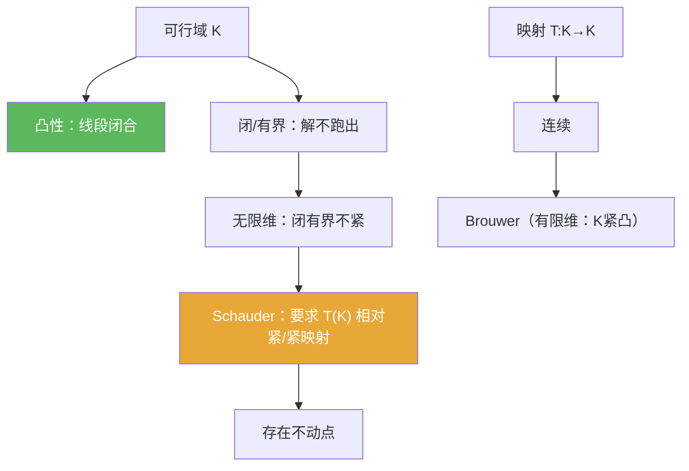

**相关笔记：** [[1.1 压缩映射原理]] | [[1.3 列紧集]] | [[1.4 赋范线性空间]] | [[1.6 内积空间]] | [[第01章 度量空间 — 章节汇总]]

## 概览

> [!abstract] 概览
> 本节把“不动点存在性”从 1.1 的“压缩（强条件）”推广到“凸性 + 紧性/紧映射（弱条件）”。核心差别是：压缩给 **唯一 + 可迭代**；Brouwer/Schauder 主要给 **存在性**（通常不唯一，也不保证简单迭代收敛）。
>
> - 凸集：线性空间里的“线段闭合”，是变分/优化/不动点的天然几何舞台
> - Brouwer：有限维紧凸集 $K\subset\mathbb{R}^n$ 上，连续映射 $T:K\to K$ 有不动点
> - Schauder：无限维 Banach 空间中，用“紧映射/相对紧像集”取代“有限维”
> - 选型意识：要算法与误差界→压缩（见 [[1.1 压缩映射原理]]）；只要存在性→紧/凸框架

^overview

---

# 1. 本节主题定位

- **本节的核心问题**
  - 当“压缩条件太强”时，如何用“凸性 + 紧性/紧映射”依然得到不动点的存在性？
  - Brouwer（有限维）与 Schauder（可无限维）各自需要哪些结构条件？每个条件在证明里承担什么岗位？
  - 如何把一个存在性问题工程化为 $x=Tx$，并验证 $T:K\to K$、连续性与相对紧像集？

- **本节在本章知识链中的位置**
  - 1.1：压缩映射给出“存在唯一 + 迭代收敛 + 误差界”：[[1.1 压缩映射原理]]
  - 1.3：紧性判别“紧⇔完备+全有界”，解释无限维里紧性稀缺：[[1.3 列紧集]]
  - 1.4：Banach 舞台与“闭且有界不紧”的警示：[[1.4 赋范线性空间]]
  - 1.5：在不保证唯一/算法的情况下，用凸性与紧性换取“至少存在一个解”

- **本节依赖哪些前置概念/定理**
  - [[凸集]]、[[紧集]]、[[列紧]]、[[全有界]]、[[Banach空间]]
  - “相对紧”（像集相对紧）与“紧映射”的直觉（由 1.3 的紧性口径支持）

- **本节为后续哪些内容铺路**
  - Schauder 不动点将成为后续积分方程/PDE 存在性证明的通用接口
  - “像集相对紧”将连接到紧算子、紧嵌入、紧性判别工具箱

## 二、核心思想

> [!quote] 原文直接信息（主链条）
> 当压缩条件太强时，用“凸性”提供可行域结构，用“紧性/紧映射”提供“抽取收敛子列”的紧致性，从而在不保证唯一与算法的情况下，仍能得到不动点的存在。

> [!tip] 辅助理解（选型意识：你到底想要什么输出）
> - 想要 **唯一 + 可迭代 + 误差界**：优先压缩框架（1.1）。  
> - 只需要 **存在性**：考虑 Brouwer/Schauder（但通常不唯一，也不保证简单迭代收敛）。

> [!warning] 本节最可能“看懂但不会用”的地方
> 你如果不会把条件拆成“岗位清单”（凸性/闭性/有界性/相对紧像集分别用于哪一步），就很难在实际应用里构造出合适的集合 $K$ 并验证 $T(K)$ 相对紧。

---

# 2. 内容分层图

> [!quote] 原文直接信息（分层）
> - **概念层**：凸集；不动点；相对紧（像集相对紧）；紧映射
> - **命题层**：Brouwer 不动点定理；Schauder 不动点定理
> - **方法层**：选闭凸有界 $K$；验证 $T(K)\subseteq K$；连续性；证明 $T(K)$ 相对紧（用列紧/全有界/紧性工具）
> - **过渡层**：有限维“闭有界⇒紧” vs 无限维“闭有界⇏紧”（因此 Schauder 必须加紧性/紧映射）

---

# 3. 定义系统

## 3.1 凸集

> [!quote] 原文直接信息（严格表述）
> 在线性空间 $X$ 中，集合 $K\subset X$ 称为凸的：对任意 $x,y\in K$ 与任意 $t\in[0,1]$，
> $$tx+(1-t)y\in K.$$

- **重要条件的作用**：凸性保证“取线段/取平均/迭代凸组合”仍留在可行域内，是许多不动点与变分论证的几何底座。
- **最小例子**：线性子空间、闭球、线段、凸多面体。
- **非例**：两个不相交球的并集（通常非凸）。
- **初学者误区**：只会用“图形直觉”，不会把“任意 $t\in[0,1]$ 的线性组合仍在集合内”写成证明句型。

## 3.2 相对紧（像集相对紧）/紧映射（使用口径）

> [!quote] 原文直接信息（语义抽取）
> 在度量空间中，称集合 $E$ 相对紧：其闭包 $\overline{E}$ 为紧集。  
> 在 Schauder 条件里，要求 $T(K)$ 相对紧（或 $T$ 为紧映射），以便从像集中抽取收敛子列。

- **它解决了什么问题**：在无限维里 $K$ 往往不紧，但若 $T(K)$ 相对紧，就能在像集中恢复“抽取收敛子列”的能力。
- **与前面概念的关系**：相对紧在度量空间中可用 1.3 的口径刻画（列紧/全有界）。
- **初学者误区**：把“有界”误当“相对紧”（相对紧比有界强得多）。

---

# 4. 定理/命题系统（证明只提取骨架）

## 4.1 Brouwer 不动点定理（有限维）

> [!quote] 原文直接信息（准确内容）
> 若 $K\subset\mathbb{R}^n$ 非空、紧、凸，且 $T:K\to K$ 连续，则存在 $x\in K$ 使 $Tx=x$。

- **条件逐条解释**
  - 紧：保证极限过程可抽收敛子列/达到极值（有限维里可由闭有界给出）
  - 凸：保证“逼近/构造”的过程不跑出 $K$
  - 连续：保证极限/固定点过程合法
- **证明骨架（只抽骨架）**
  - Step 1：构造某种逼近或反证结构（经典证明可借助单纯形逼近/度数理论/重心映射等）
  - Step 2：利用紧性取极限点
  - Step 3：用凸性与连续性推出极限满足 $Tx=x$
- **最关键的一跳**
  - “有限维 + 紧凸”使拓扑/几何工具可落地（无限维需 Schauder 替代）。
- **若条件削弱哪里可能出问题**
  - 无凸性：可能存在连续自映射但无不动点（可构造环形区域上的旋转等直觉例）
  - 无紧性：可能因极限点缺失而失败

## 4.2 Schauder 不动点定理（可无限维）

> [!quote] 原文直接信息（准确内容）
> 设 $X$ 为 Banach 空间，$K\subset X$ 非空、闭、凸、有界；若 $T:K\to K$ 连续且 $T(K)$ 相对紧（或 $T$ 为紧映射），则存在 $x\in K$ 使 $Tx=x$。

- **条件逐条解释（岗位清单）**
  - Banach：保证相关极限过程“落回空间”（完备性岗位）
  - $K$ 闭凸有界：保证可行域结构与“解不跑出”
  - $T(K)$ 相对紧：在无限维中人为补回“紧性”，以便抽取收敛子列
  - 连续：让极限穿过 $T$
- **证明骨架（只抽骨架）**
  - Step 1：构造逼近序列/有限维近似（或通过紧性条件抽子列）
  - Step 2：利用 $T(K)$ 相对紧抽取收敛子列，得到候选极限点
  - Step 3：用连续性与 $T(K)\subseteq K$ 得到不动点方程
- **最关键的一跳**
  - “像集相对紧”是无限维里替代有限维紧性的关键开关。
- **后续用途**
  - 作为积分方程/PDE 等存在性证明的通用接口：把问题写成 $x=Tx$ 并验证“像集相对紧”。
- **若条件削弱哪里可能出问题**
  - 若去掉相对紧像集：无限维中闭凸有界集上连续自映射可能无不动点（紧性缺失是主要原因）。

---

# 5. 例子与反例系统

- **本节最关键的例子**
  - “存在性证明模板”：选 $K$（闭凸有界）+ 验证 $T(K)\subseteq K$ + 连续 + 证明 $T(K)$ 相对紧 ⇒ 套 Schauder。

- **本节最值得补的反例**
  - 无限维里“闭有界⇏紧”：解释为什么 Schauder 必须额外要求 $T(K)$ 相对紧。

- **每个例子/反例服务的理解点**
  - 模板：把定理变成可执行的证明工艺
  - 反例动机：识别“紧性”在无限维是稀缺资源

---

# 6. 本节逻辑链复原（作者为什么这样安排）

1) 先给凸集：建立可行域的几何语言（线段闭合）。  
2) 回顾 1.1：压缩太强但给算法；提出“只要存在性”的需求。  
3) 引入 Brouwer：在有限维紧凸集上，连续自映射必有不动点。  
4) 指出无限维困难：闭有界不紧（1.3/1.4 的警示），不能直接照搬 Brouwer。  
5) 引入 Schauder：用“像集相对紧/紧映射”补回紧性，从而在无限维也得到存在性。

---

# 7. 本节高风险误区（至少 5 条）

1) **把 Schauder 当作“压缩的弱化版”**：它通常不给唯一与算法性输出。  
2) **以为连续就够了**：没有凸/紧/相对紧像集等结构，连续自映射可无不动点。  
3) **把“有界”当作“相对紧”**：相对紧意味着闭包紧（可抽收敛子列），比有界强得多。  
4) **在无限维里偷用 Heine–Borel（闭有界⇒紧）**：这是有限维特例。  
5) **不会选集合 $K$**：很多应用的真正难点是“先证明解不会跑出去”（构造闭凸有界不变集）。  
6) **不会证明像集相对紧**：需要调用列紧/全有界/紧性判别与具体函数空间工具（后续章节常用）。

---

# 8. 知识库拆分建议

- **A类：应独立成概念卡**
  - [[凸集]]、[[不动点]]、[[相对紧集]]（若库内已有对应命名）、[[紧集]]、[[列紧]]
- **B类：应独立成定理卡**
  - [[Brouwer不动点定理]]、[[Schauder不动点定理]]
- **C类：只保留在本节页中**
  - “不动点定理选型表”（压缩 vs 紧/凸）的叙事与策略
- **D类：专题综述候选**
  - “存在性方法总览：压缩/紧映射/变分/单调”等

---

# 9. 后续学习接口

- **适合下一轮展开证明的点**
  - Schauder 的证明思路：像集相对紧如何在推理中替代有限维紧性
- **适合设计习题的点**
  - 证明集合凸性（子空间/球/线段）
  - 对比 Brouwer vs Schauder 的条件岗位
  - 用 1.3 的口径解释“相对紧”的强度
- **适合与前一节做比较的点**
  - 1.1（压缩）输出“唯一+算法”；1.5（紧/凸）输出“存在性”
- **适合与下一节做衔接的点**
  - 1.6（Hilbert）与后续投影/最小化问题的几何结构（凸性常与最小化并行出现）

---

# 10. 自测问题（5 个由浅到深）

1) 凸集的定义是什么？线性子空间为什么必然凸？  
2) Brouwer 与 Schauder 的结论差别是什么（唯一性/算法性是否保证）？  
3) 为什么 Schauder 在无限维里必须引入“像集相对紧/紧映射”？  
4) 给出一个存在性证明的模板（如何选 $K$ 并验证 $T(K)\subseteq K$、连续、相对紧像集）？  
5) 若去掉凸性或紧性（/相对紧像集），你预期哪个环节会崩坏？为什么？

## 10.B 习题精选（保留完整解答）

> [!todo] 习题概览
> | 题号范围 | 核心考点 | 难度 |
> |---|---|---|
> | A | 证明集合凸性/闭性/有界性 | ⭐⭐ |
> | B | Brouwer/Schauder 的条件对比 | ⭐⭐⭐ |
> | C | 证明 $T(K)\subseteq K$ 与“像集相对紧” | ⭐⭐⭐⭐ |

### 题1：凸性的快速判断

> [!problem] 题目
> 设 $X$ 为线性空间。证明：任意线性子空间 $M\subset X$ 是凸集。
>
> [!solution]- 完整过程解答
> 任取 $x,y\in M$，任取 $t\in[0,1]$。由于 $M$ 是线性子空间，意味着对任意标量 $\alpha,\beta$，都有 $\alpha x+\beta y\in M$。  
> 取 $\alpha=t$、$\beta=1-t$，则
> $$tx+(1-t)y\in M.$$
> 这正是凸集的定义，因此 $M$ 是凸集。

### 题2：Brouwer vs Schauder

> [!problem] 题目
> 用一句话分别概括 Brouwer 与 Schauder 的“空间条件 + 映射条件”，并说明它们为何不矛盾。
>
> [!solution]- 完整过程解答
> 1) **Brouwer（有限维）**：$K\subset \mathbb{R}^n$ 非空、紧、凸，且 $T:K\to K$ 连续，则存在 $x\in K$ 使 $Tx=x$。  
> 2) **Schauder（可无穷维）**：$X$ 为 Banach 空间，$K\subset X$ 非空、闭、凸、有界；若 $T:K\to K$ 连续且 $T(K)$ 相对紧（等价于 $\overline{T(K)}$ 紧），则存在 $x\in K$ 使 $Tx=x$。  
> 3) **为何不矛盾/如何衔接**：有限维里“闭且有界 ⇒ 紧”（Heine–Borel），而无限维里闭有界一般不紧，所以 Schauder 通过加入“相对紧像集/紧映射”把缺失的紧性补回来。

### 题3：相对紧像集

> [!problem] 题目
> 设 $X$ 为 Banach 空间，$K\subset X$ 闭凸有界。说明为什么“$T(K)$ 相对紧”比“$K$ 有界”强得多，并指出它与列紧/全有界的关系。
>
> [!solution]- 完整过程解答
> 1) “$K$ 有界”只说明：存在 $R>0$ 使得 $K\subset B(0,R)$，也就是能被一个大球装下；这并不能保证你能从任意序列中抽取收敛子列。  
> 2) “$T(K)$ 相对紧”意味着：$\overline{T(K)}$ 是紧集。紧集在度量空间里等价于列紧，因此任取序列 $(y_n)\subset T(K)$ 都能抽取收敛子列。  
> 3) 在度量空间中：紧 $\Leftrightarrow$ 列紧 $\Leftrightarrow$ 完备 + 全有界，因此相对紧在定量上等价于（在闭包里）能被任意精度的有限 $\varepsilon$-网覆盖（全有界），这比“有界”强得多。  
> 4) Schauder 的证明中正是利用“像集相对紧”获得“抽取收敛子列”的能力，从而在没有压缩条件时依然推进存在性证明。

---

> [!quote]- 参考（教材分片 + 本库链接）
> 1. 张恭庆，《泛函分析讲义》，第 1 章 1.5。  
> 2. 本节对应分片 PDF：![[00-Raw素材/泛函分析讲义_张恭庆/章节内容/第一章_度量空间/1.5_凸集与不动点.pdf]]  
> 3. 参见：[[Brouwer不动点定理]] / [[Schauder不动点定理]] / [[凸集]] / [[不动点]] / [[紧集]] / [[列紧]]

#学习/泛函分析/度量空间
