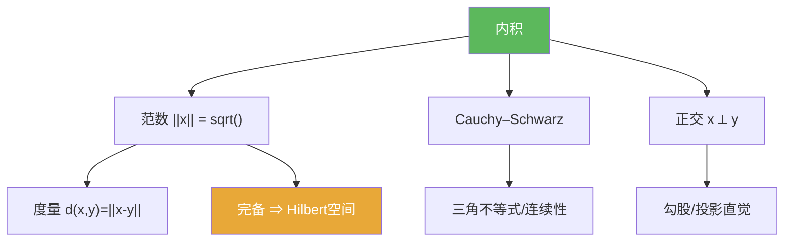

**相关笔记：** [[1.4 赋范线性空间]] | [[1.5 凸集与不动点]] | [[第01章 度量空间 — 章节汇总]]

## 概览

> [!abstract] 概览
> 内积空间在“赋范空间”之上加入角度与正交结构，使很多问题能几何化：  
> 内积 $\langle x,y\rangle$ 诱导范数 $\|x\|=\sqrt{\langle x,x\rangle}$，再诱导度量 $d(x,y)=\|x-y\|$。当这个范数完备时得到 Hilbert 空间，它是后续算子论与谱理论的核心舞台。
>
> - 关键不等式：Cauchy–Schwarz，推出三角不等式与连续性
> - 正交：让“投影/分解/最小化”可控（为后续投影定理铺垫）
> - 结构强度：内积空间 ⊂ 赋范空间；Hilbert = 完备内积空间

^overview

---

# 1. 本节主题定位

- **本节的核心问题**
  - 内积如何诱导范数与度量，并把“几何直觉（角度/正交）”带入无穷维？
  - Cauchy–Schwarz 为什么是内积空间的“发动机”，它如何推出三角不等式与连续性？
  - Hilbert 空间（完备内积空间）为何是后续投影/最小化/谱理论的核心舞台？

- **本节在本章知识链中的位置**
  - 1.4：赋范空间与 Banach（完备）提供极限过程的默认舞台
  - 1.6：在赋范之上加入内积，使很多问题可“正交化/几何化”

- **本节依赖哪些前置概念/定理**
  - [[1.4 赋范线性空间]]（范数/完备/ Banach）
  - 度量语言：收敛与 Cauchy（来自 1.1–1.3）

- **本节为后续哪些内容铺路**
  - 正交投影、最小距离、Fourier 展开、谱理论等（后续章节）
  - “范数是否来自内积”的判别（平行四边形恒等式/极化恒等式）

## 二、核心思想

> [!quote] 原文直接信息（主链条）
> - 内积 $\langle x,y\rangle$ 诱导范数 $\|x\|=\sqrt{\langle x,x\rangle}$，再诱导度量 $d(x,y)=\|x-y\|$。  
> - Cauchy–Schwarz 不等式是关键工具：推出三角不等式与内积连续性。  
> - 完备内积空间称为 Hilbert 空间。

> [!tip] 辅助理解（本节最值得记住的一句话）
> 在内积空间里，很多“范数不等式”都来自同一个源头：Cauchy–Schwarz；一旦有了正交结构，最优化/最小距离问题常能转化为“正交投影”。

> [!warning] 本节最可能“看懂但不会用”的地方
> 你若不熟练“从 C–S 推三角、从正交推勾股、从展开相消推平行四边形”，后续 Hilbert 空间的投影类结论会反复卡在计算上。

---

# 2. 内容分层图

> [!quote] 原文直接信息（分层）
> - **概念层**：内积、诱导范数/度量、正交、Hilbert 空间
> - **命题层**：Cauchy–Schwarz；三角不等式；勾股；平行四边形恒等式
> - **方法层**：展开 $\langle x\pm y,x\pm y\rangle$；用 $0\le \langle x-ty,x-ty\rangle$ 选参；交叉项相消
> - **过渡层**：从一般 Banach 到 Hilbert：结构更强 ⇒ 结果更几何化

---

# 3. 定义系统

## 3.1 内积空间

> [!quote] 原文直接信息（严格表述）
> 在线性空间 $H$ 上，映射 $\langle\cdot,\cdot\rangle:H\times H\to\mathbb{F}$（$\mathbb{F}=\mathbb{R}$ 或 $\mathbb{C}$）若满足共轭对称、（共轭）线性与正定性，则称 $H$ 为内积空间。

- **重要条件的作用**
  - 正定性：保证 $\|x\|=\sqrt{\langle x,x\rangle}$ 真的是“大小”（零当且仅当 $x=0$）
  - 共轭对称：保证 $\langle x,x\rangle$ 为实且非负
- **最小例子**：$\mathbb{R}^n$ 的标准内积 $\langle x,y\rangle=\sum x_i y_i$。
- **初学者误区**：复空间里忘记“共轭线性/共轭对称”，导致推导出错。

## 3.2 内积诱导范数与度量

> [!quote] 原文直接信息（严格表述）
> 定义
> $$\|x\|:=\sqrt{\langle x,x\rangle},\qquad d(x,y):=\|x-y\|.$$
> 由 Cauchy–Schwarz 可推出 $\|\cdot\|$ 满足三角不等式，从而确为范数。

- **它解决了什么问题**：把内积空间纳入 1.4 的赋范框架，并引入“角度/正交”结构。
- **初学者误区**：以为“定义了 $\|x\|$ 就自动是范数”，忽略三角不等式需要 C–S 支撑。

## 3.3 正交与 Hilbert 空间

> [!quote] 原文直接信息（严格表述）
> $x\perp y \iff \langle x,y\rangle=0$。  
> 若 $H$ 在 $\|\cdot\|$ 下完备，则称 $H$ 为 Hilbert 空间。

- **重要条件的作用**
  - 正交：让分解/投影/最小化可几何化（后续章节）
  - 完备：保证极限过程落回空间（投影/最小距离类结论常依赖）
- **初学者误区**：把“内积”误当“自动完备”（只有完备的内积空间才叫 Hilbert）。

---

# 4. 定理/命题系统（证明只提取骨架）

## 4.1 Cauchy–Schwarz 不等式

> [!quote] 原文直接信息（准确内容）
> 对任意 $x,y\in H$，
> $$|\langle x,y\rangle|\le \|x\|\,\|y\|.$$

- **证明骨架（Step 1/2/3）**
  - Step 1：对任意实参数 $t$（或复参数）考虑 $0\le \langle x-ty,x-ty\rangle$。
  - Step 2：展开得到关于 $t$ 的二次式（或用极小化选取最优 $t$）。
  - Step 3：判别式 $\le 0$（或最小值 $\ge 0$）推出 $|\langle x,y\rangle|^2\le \langle x,x\rangle\langle y,y\rangle$。
- **最关键的一跳**：把“不等式”转成“非负二次型”并选参。
- **后续用途**：三角不等式、内积连续性、投影/最小化的估计基础。

## 4.2 推论：三角不等式与内积连续性

> [!quote] 原文直接信息（语义抽取）
> 由 C–S 可推出 $\|x+y\|\le \|x\|+\|y\|$；并推出内积对范数拓扑连续。

- **证明骨架**：展开 $\|x+y\|^2$，用 $\operatorname{Re}\langle x,y\rangle\le |\langle x,y\rangle|$ 与 C–S 夹逼。

## 4.3 命题：正交与勾股/平行四边形恒等式

> [!quote] 原文直接信息（语义抽取）
> 若 $x\perp y$，则 $\|x+y\|^2=\|x\|^2+\|y\|^2$；并且内积诱导范数满足平行四边形恒等式。

- **证明骨架**：分别展开 $\langle x\pm y,x\pm y\rangle$，交叉项相消。
- **若条件削弱哪里可能出问题**：一般范数未必满足平行四边形恒等式，因此未必来自内积。

---

# 5. 例子与反例系统

- **本节最关键的例子**
  - $\mathbb{R}^n$ 标准内积与欧氏范数（所有结论的原型）
- **本节最值得补的反例**
  - 并非所有范数来自内积：判别工具是“平行四边形恒等式”
- **每个例子/反例服务于什么理解点**
  - 例子：把抽象恒等式对齐到熟悉几何
  - 反例：提醒“Hilbert 结构比 Banach 强”，不能把正交/角度直觉随便搬到一般 Banach

---

# 6. 本节逻辑链复原（作者为什么这样安排）

1) 先给内积定义：引入“角度/正交”的来源。  
2) 由内积诱导范数与度量：把内积空间放进赋范/度量的统一语言里。  
3) 给出 C–S：这是保证范数性质与后续几乎所有估计的发动机。  
4) 推出三角不等式与连续性：说明“内积结构 ⇒ 强可控性”。  
5) 引入 Hilbert 与正交：为后续投影/分解/最小化做舞台准备。  
6) 讨论平行四边形/极化恒等式：说明“哪些范数来自内积”。

---

# 7. 本节高风险误区（至少 5 条）

1) **忽略复内积的共轭结构**：导致 $\langle y,x\rangle=\overline{\langle x,y\rangle}$ 等基本等式用错。  
2) **以为内积空间自动完备**：不对；完备内积空间才是 Hilbert。  
3) **以为所有范数都来自内积**：不对；平行四边形恒等式是关键判别信号。  
4) **不会用 C–S 推三角**：应熟练“展开平方 + C–S 夹逼”的套路。  
5) **把“正交”当作形式符号**：正交真正的用处在于分解/投影/最小化（后续章节）。  
6) **证明中不标注关键一跳**：C–S 的关键在“构造非负二次型并选参”，不是死记结论。

---

# 8. 知识库拆分建议

- **A类：应独立成概念卡**
  - [[内积空间]]、[[正交]]、[[Hilbert空间]]
  - “平行四边形恒等式/极化恒等式”（作为“范数来自内积”的判别节点）
- **B类：应独立成定理卡**
  - [[Cauchy-Schwarz不等式]]
- **C类：只保留在本节页中**
  - “从 C–S 推出三角/连续性”的推导链条（但可在第二轮拆成方法卡）
- **D类：专题综述候选**
  - “Hilbert 空间几何：正交投影/最小化/谱理论入口”

---

# 9. 后续学习接口

- **适合下一轮展开证明的点**
  - C–S 的选参证明（实/复两种口径的差异）
  - 平行四边形恒等式 ⇒ 极化恒等式（如何从范数恢复内积）
- **适合设计习题的点**
  - 用 C–S 推三角/内积连续
  - 正交条件下的勾股与最小化直觉
  - 判别一个范数是否来自内积（平行四边形恒等式）
- **适合与前一节做比较的点**
  - 1.4：一般 Banach 只有范数；1.6：内积带来正交几何（更强结构）
- **适合与下一节做衔接的点**
  - 1.5：凸集常与最小化/投影并行出现；Hilbert 中“闭凸集最近点”是经典主题（后续章节）

---

# 10. 自测问题（5 个由浅到深）

1) 复内积与实内积的定义差别是什么？为什么要共轭？  
2) 为什么 $\|x\|=\sqrt{\langle x,x\rangle}$ 的三角不等式需要 C–S 支撑？  
3) 写出 C–S 的证明骨架：你如何构造非负量并选参？  
4) 为什么“平行四边形恒等式”可以用来判别范数是否来自内积？  
5) Hilbert 的“完备性”在后续投影/最小化问题中会扮演什么角色？

## 10.B 习题精选（保留完整解答）

> [!todo] 习题概览
> | 题号范围 | 核心考点 | 难度 |
> |---|---|---|
> | A | 证明 Cauchy–Schwarz，并推三角不等式 | ⭐⭐⭐ |
> | B | 验证内积诱导范数/度量性质 | ⭐⭐ |
> | C | 平行四边形恒等式与“范数是否来自内积” | ⭐⭐⭐ |

### 题1：由 C–S 推出三角不等式

> [!problem] 题目
> 在内积空间中，证明 $\|x+y\|\le \|x\|+\|y\|$。
>
> [!solution]- 完整过程解答
> 1) 从内积展开：
>    $$\|x+y\|^2=\langle x+y,x+y\rangle=\langle x,x\rangle+\langle x,y\rangle+\langle y,x\rangle+\langle y,y\rangle.$$
> 2) 注意到 $\langle y,x\rangle=\overline{\langle x,y\rangle}$，因此
>    $$\|x+y\|^2=\|x\|^2+2\operatorname{Re}\langle x,y\rangle+\|y\|^2.$$
> 3) 用基本不等式 $\operatorname{Re} z\le |z|$ 与 Cauchy–Schwarz：
>    $$2\operatorname{Re}\langle x,y\rangle\le 2|\langle x,y\rangle|\le 2\|x\|\,\|y\|.$$
> 4) 代回得到
>    $$\|x+y\|^2\le \|x\|^2+2\|x\|\,\|y\|+\|y\|^2=(\|x\|+\|y\|)^2.$$
> 5) 两边都非负，开平方得
>    $$\|x+y\|\le \|x\|+\|y\|.$$

### 题2：正交与勾股

> [!problem] 题目
> 若 $x\perp y$，证明 $\|x+y\|^2=\|x\|^2+\|y\|^2$。
>
> [!solution]- 完整过程解答
> 1) 展开：
>    $$\|x+y\|^2=\langle x+y,x+y\rangle=\|x\|^2+2\operatorname{Re}\langle x,y\rangle+\|y\|^2.$$
> 2) 若 $x\perp y$，则 $\langle x,y\rangle=0$，从而 $\operatorname{Re}\langle x,y\rangle=0$。
> 3) 代入即可得到
>    $$\|x+y\|^2=\|x\|^2+\|y\|^2.$$

### 题3：平行四边形恒等式

> [!problem] 题目
> 在内积空间中证明平行四边形恒等式：$\|x+y\|^2+\|x-y\|^2=2\|x\|^2+2\|y\|^2$。
>
> [!solution]- 完整过程解答
> 分别展开两项并相加。
> 1) 展开第一项：
>    $$\|x+y\|^2=\langle x+y,x+y\rangle=\|x\|^2+2\operatorname{Re}\langle x,y\rangle+\|y\|^2.$$
> 2) 展开第二项：
>    $$\|x-y\|^2=\langle x-y,x-y\rangle=\|x\|^2-2\operatorname{Re}\langle x,y\rangle+\|y\|^2.$$
> 3) 相加后交叉项相消：
>    $$\|x+y\|^2+\|x-y\|^2=2\|x\|^2+2\|y\|^2.$$

---

> [!quote]- 参考（教材分片 + 本库链接）
> 1. 张恭庆，《泛函分析讲义》，第 1 章 1.6。  
> 2. 本节对应分片 PDF：![[00-Raw素材/泛函分析讲义_张恭庆/章节内容/第一章_度量空间/1.6_内积空间.pdf]]  
> 3. 参见：[[Cauchy-Schwarz不等式]] / [[内积空间]] / [[正交]] / [[Hilbert空间]] / [[1.4 赋范线性空间]]

#学习/泛函分析/度量空间
