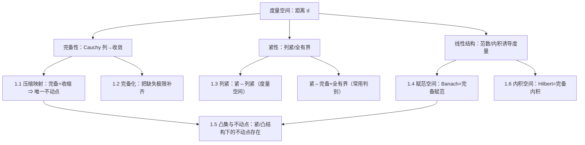

**相关笔记：** [[1.1 压缩映射原理]] | [[1.2 完备化]] | [[1.3 列紧集]] | [[1.4 赋范线性空间]] | [[1.5 凸集与不动点]] | [[1.6 内积空间]]

## 概览

> [!abstract] 本章一句话
> 用==度量==统一“收敛/完备/紧性”，并以==不动点==与==线性结构（范数/内积）==两条主线，建立后续泛函分析的基本舞台。
>
> - “极限过程能否落回空间”→完备（1.1/1.2/1.4/1.6）
> - “无穷过程能否抽出收敛子列”→紧性（1.3，并贯穿 1.5/1.4）
> - “求解=不动点”→压缩（唯一+算法）与紧/凸（存在性）两种框架（1.1/1.5）

^overview

---

## 一、知识结构总览

---

## 二、核心思想

> [!tip] 复习最短路径（按“题型→工具”选路）
> - 看到 **迭代/收缩/误差界**：先想 [[1.1 压缩映射原理]]（需要完备）  
> - 看到 **极限落点/补全空间**：先想 [[1.2 完备化]]（把 Cauchy 的“缺失极限”补齐）  
> - 看到 **紧性/抽子列/存在极值**：先想 [[1.3 列紧集]]（紧⇔列紧⇔完备+全有界）  
> - 看到 **线性算子估计/连续性判别**：用范数不等式与“控 0 点”套路（[[1.4 赋范线性空间]]）  
> - 看到 **正交/最小化/投影直觉**：转到内积与 Hilbert（[[1.6 内积空间]]）

---

## 三、补充理解与易混淆点

### 补充理解

> [!info] 补充1：本章三件核心事其实是一条链
> - 紧性常用判别：紧 $\Leftrightarrow$ 完备 + 全有界（1.3）  
> - 压缩映射的收敛性证明：先证迭代列是 Cauchy，再用完备性落回空间（1.1）  
> - 范数/内积的“可操作性”：把连续/收敛问题改写成范数不等式（1.4/1.6）  
> 这三条链把“存在/收敛/结构”连在一起：只要你知道当前题目卡在链条的哪一环，就知道该去哪一节找工具。
>
> > [!quote]- 参考（联网权威来源）
> > - [A metric space is compact iff complete and totally bounded (HWS)](https://math.hws.edu/eck/metric-spaces/completeness.html)
> > - [Chapter 3 The Contraction Mapping Principle (CUHK PDF)](https://www.math.cuhk.edu.hk/course_builder/2425/math3060/Chapter%203%20Contraction%20Mapping%20Prinicple%202024.pdf)

> [!info] 补充2：两类不动点定理是“算法性”与“适用面”的取舍
> - 压缩（1.1）：条件强，但给唯一与算法（迭代收敛 + 误差界）  
> - Schauder/Brouwer（1.5）：条件弱（凸/紧或紧映射），但多只给存在性  
> 这不是谁更强，而是解题时你想要的“输出”不同。
>
> > [!quote]- 参考（联网权威来源）
> > - [Lecture 09: Schauder Fixed-Point Theorem and Applications (Waterloo PDF)](https://uwaterloo.ca/scholar/sites/ca.scholar/files/g6tran/files/amath731_lecture09.pdf)
> > - [Banach fixed-point theorem (Wikipedia)](https://en.wikipedia.org/wiki/Contracting-mapping_principle)

### 易混淆点

> [!warning] ❌把 $\mathbb{R}^n$ 直觉直接搬到无限维 → ✅先问“是否还有紧性/全有界”
> 在 $\mathbb{R}^n$ 中“闭且有界⇒紧”非常好用，但在无限维赋范空间中常常失效（闭单位球不紧）。一旦出现“无穷维/函数空间”，紧性判断要转向“全有界/列紧/紧算子”等工具。
>
> > [!quote]- 参考（联网权威来源）
> > - [Normed vector space — unit ball compact iff finite-dimensional (Wikipedia)](https://en.wikipedia.org/wiki/Normed_vector_space)
> > - [Riesz's lemma (Wikipedia)](https://en.wikipedia.org/wiki/Riesz%27s_lemma)

> [!warning] ❌把“存在性定理”当成“迭代法一定收敛” → ✅存在与算法是两回事
> Brouwer/Schauder 的不动点结论通常只保证“至少有一个解”，不保证你用简单迭代就能找到它；若题目需要收敛速度/误差界，应优先尝试压缩框架或更强的稳定性条件。
>
> > [!quote]- 参考（联网权威来源）
> > - [Schauder fixed-point theorem notes (UIC PDF)](https://tteoli2.people.uic.edu/notes_schauder.pdf)
> > - [Banach fixed-point theorem (Wikipedia)](https://en.wikipedia.org/wiki/Contracting-mapping_principle)

---

## 四、习题精选

> [!todo] 复习题单（按主题）
> | 主题 | 关联小节 | 核心抓手 | 难度 |
> |---|---|---|---|
> | 迭代与误差界 | 1.1 | “压缩 + 完备”→Cauchy→极限 | ⭐⭐⭐ |
> | 紧性判别 | 1.3 | 紧⇔列紧⇔完备+全有界 | ⭐⭐⭐ |
> | 不动点定理选型 | 1.1 vs 1.5 | 算法性 vs 适用面 | ⭐⭐ |

### 题1：你应该用哪条不动点定理？

> [!problem] 题目
> 给定一个方程（或积分方程）被改写成 $x=Tx$。你如何快速判断更可能用“压缩映射原理”还是 “Schauder/Brouwer”？

> [!faq]- 解答（要点）
> - 若你能得到 $\|Tx-Ty\|\le a\|x-y\|$ 且 $a<1$：优先压缩（唯一+迭代+误差界）。  
> - 若只能证明 $T$ 连续、且 $T(K)\subset K$，并且能拿到紧性（$K$ 紧或 $T$ 紧/像集相对紧）：倾向 Schauder/Brouwer（存在性）。

### 题2：紧性的一句话判别

> [!problem] 题目
> 在度量空间里，要证明集合 $K$ 紧，给出你最常用的一条“可操作口径”，并说明证明思路。

> [!faq]- 解答（要点）
> - 最常用：证明 $K$ 完备且全有界。  
> - 思路：全有界给“任意精度有限覆盖”，完备保证 Cauchy 列极限落回；两者合起来等价紧。

### 题3：内积为何能做“几何化”

> [!problem] 题目
> 简述：为什么在 Hilbert 空间里“最小化/最近点”常能转化为“正交条件”？

> [!faq]- 解答（要点）
> - 内积给出正交与勾股结构；最小化常等价于“误差向量与可行方向正交”。  
> - 这在投影定理与 Riesz 表示中会系统化出现（本章先建立工具）。

---

## 各节概览（嵌入聚合）

- ![[1.1 压缩映射原理#^overview]]
- ![[1.2 完备化#^overview]]
- ![[1.3 列紧集#^overview]]
- ![[1.4 赋范线性空间#^overview]]
- ![[1.5 凸集与不动点#^overview]]
- ![[1.6 内积空间#^overview]]

---

## 本章索引

### 节笔记

- [[1.1 压缩映射原理]]
- [[1.2 完备化]]
- [[1.3 列紧集]]
- [[1.4 赋范线性空间]]
- [[1.5 凸集与不动点]]
- [[1.6 内积空间]]

### 参见 Wiki（本章核心概念）

- [[度量空间]]、[[Cauchy列]]、[[完备度量空间]]、[[完备化]]
- [[紧集]]、[[列紧]]、[[全有界]]
- [[赋范线性空间]]、[[Banach空间]]
- [[内积空间]]、[[Hilbert空间]]、[[正交]]
- [[压缩映射]]、[[Banach不动点定理]]、[[不动点]]、[[凸集]]

#学习/泛函分析/第01章
