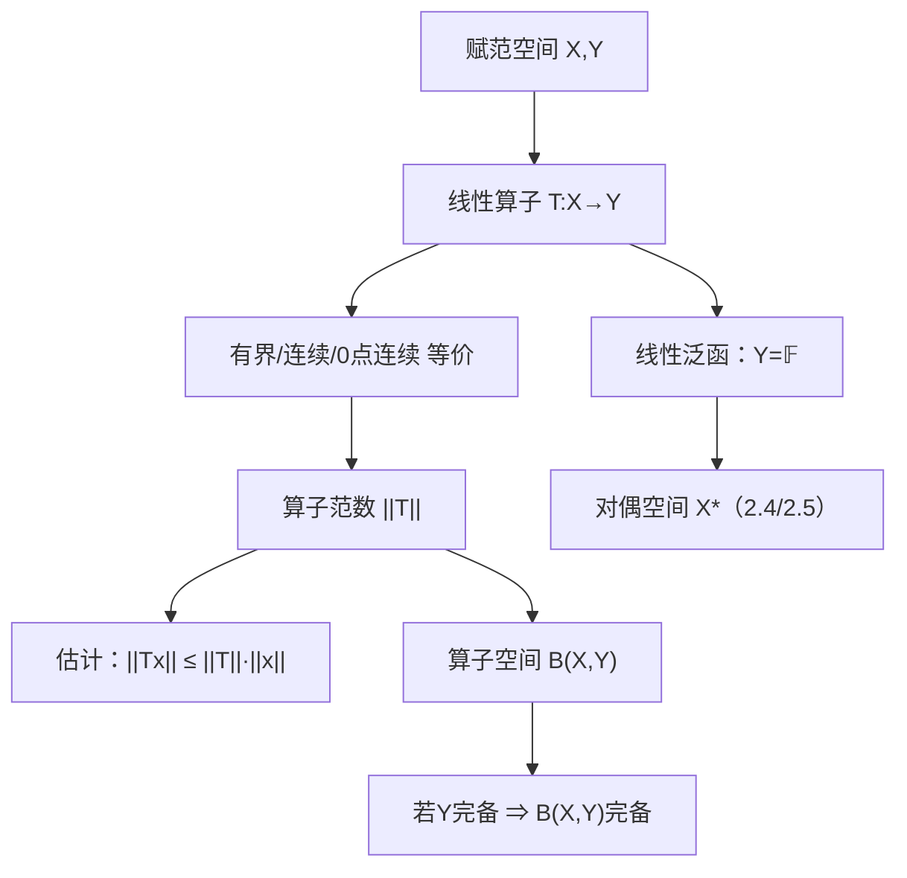

**相关笔记：** [[1.6 内积空间]] | [[2.2 Riesz表示定理及其应用]] | [[第02章 线性算子与线性泛函 — 章节汇总]]

> [!abstract] 概览
> 本节把“线性映射”升级为泛函分析的核心对象：==有界线性算子==。在赋范空间/ Banach 空间上，有界性与连续性等价，从而可以用==算子范数==把连续性“数值化”，并把算子组织成新的赋范空间（算子空间）。
>
> - 核心等价：线性算子 $T:X\to Y$ **有界 $\Leftrightarrow$ 连续 $\Leftrightarrow$ 在 $0$ 点连续**
> - 算子范数：$\|T\|=\sup_{\|x\|\le 1}\|Tx\|$，并且 $\|Tx\|\le \|T\|\|x\|$
> - 算子空间：$B(X,Y)$ 在算子范数下是赋范空间；若 $Y$ 完备，则 $B(X,Y)$ 也完备（常用）
> - 与后续：2.2–2.6 的大定理（Riesz / Hahn–Banach / 开映射 / 弱拓扑 / 谱）都在“有界算子/连续泛函”框架里展开

^overview

---

# 1. 本节主题定位

- **本节的核心问题**
  - 何谓“有界线性算子”？为什么它就是“连续线性算子”？
  - 如何用算子范数把连续性转化为可计算的数值估计？
  - 为什么可以把全体有界线性算子组成一个新的赋范空间 $B(X,Y)$？

- **本节在本章知识链中的位置**
  - 2.1：建立“有界算子/算子范数/算子空间”语言，是全章的地基  
  - 2.2/2.4：把“连续线性泛函”具体化（Riesz/Hahn–Banach）  
  - 2.3：用 Baire 三件套保证稳定估计（开映射/闭图像/有界逆）  
  - 2.5：弱/弱* 拓扑提供紧性与极限工具  
  - 2.6：谱把“可逆性/稳定性”统一描述

- **本节依赖哪些前置概念/定理**
  - [[1.4 赋范线性空间]]（范数诱导度量、连续⇔有界的基础套路）

- **本节为后续哪些内容铺路**
  - 对偶空间 $X^\*$：线性泛函就是 $B(X,\mathbb{F})$（2.4/2.5 的入口）
  - 进一步的稳定性定理（2.3）与谱论（2.6）都依赖“算子范数控制”

## 二、核心思想

> [!tip] 核心方法论（本节最值得记住的一句话）
> 在赋范空间上讨论线性映射时，最有力的语言不是反复写 $\varepsilon$-$\delta$，而是找一个常数 $C$ 使 $\|Tx\|\le C\|x\|$：这既是连续性的判别式，也是后续所有估计的起点。

---

# 2. 内容分层图

> [!quote] 原文直接信息（分层）
> - **概念层**：有界线性算子、算子范数、算子空间 $B(X,Y)$  
> - **命题层**：有界 $\Leftrightarrow$ 连续 $\Leftrightarrow$ 0 点连续；$\|Tx\|\le \|T\|\|x\|$；$Y$ 完备 $\Rightarrow B(X,Y)$ 完备  
> - **方法层**：单位球取上确界；“控 0 点 + 缩放”把局部连续变成全局估计  
> - **过渡层**：把“映射”变成“可估计的对象”，为 2.2–2.6 的对偶/弱拓扑/谱工具做语言准备

---

# 3. 定义系统

## 3.1 有界线性算子

> [!quote] 原文直接信息（定义）
> 设 $X,Y$ 为赋范空间，线性算子 $T:X\to Y$ 若存在 $C>0$ 使对任意 $x\in X$，
> $$\|Tx\|\le C\|x\|,$$
> 则称 $T$ 有界。

## 3.2 算子范数

> [!quote] 原文直接信息（定义）
> 对有界线性算子 $T$ 定义
> $$\|T\|:=\sup_{\|x\|\le 1}\|Tx\|.$$
> 则对任意 $x\in X$，都有 $\|Tx\|\le \|T\|\|x\|$。

## 3.3 算子空间 $B(X,Y)$

> [!quote] 原文直接信息（定义）
> 记 $B(X,Y)$ 为从 $X$ 到 $Y$ 的全体有界线性算子集合，赋予算子范数 $\|\cdot\|$ 后它成为赋范空间。

---

# 4. 定理/命题系统

## 4.1 线性算子：有界 $\Leftrightarrow$ 连续

> [!quote] 原文直接信息（定理）
> 设 $T:X\to Y$ 线性，则以下等价：  
> 1) $T$ 连续；2) $T$ 在 $0$ 点连续；3) 存在 $C>0$ 使 $\|Tx\|\le C\|x\|$。

- **条件逐条解释**
  - 线性：让“只看 0 点”成立，并允许通过缩放把局部估计推广为全局估计
  - 赋范结构：把连续性写成范数不等式
- **结论到底在说什么**
  - 线性算子连续性 = 一个全局 Lipschitz 型估计；后续所有稳定性估计都从这里出发
- **证明骨架（Step 1/2/3）**
  1)（有界 $\Rightarrow$ 连续）由 $\|Tx-Ty\|=\|T(x-y)\|\le C\|x-y\|$ 得 Lipschitz，从而连续  
  2)（连续 $\Rightarrow$ 0 点连续）显然  
  3)（0 点连续 $\Rightarrow$ 有界）取 $\varepsilon=1$ 得 $\delta$，对 $x\ne 0$ 用 $u=\frac{\delta}{\|x\|}x$ 缩放，推出 $\|Tx\|\le \frac{1}{\delta}\|x\|$
- **证明中最关键的一跳**
  - “缩放”：把任意向量归一化到控制半径内，再缩放回去
- **后续用途**
  - 2.3 的开映射/闭图像/有界逆，全部默认算子是有界（即连续）  
  - 2.5 的弱收敛定义与对偶 $X^\*$，也以连续泛函为测试集
- **若条件削弱，哪里可能出问题**
  - 若非线性：0 点连续不再能推出全局范数估计

## 4.2 命题：算子范数给出最小控制常数

> [!quote] 原文直接信息（命题/性质）
> 若 $\|T\|=\sup_{\|x\|\le 1}\|Tx\|$，则对任意 $x\in X$，
> $$\|Tx\|\le \|T\|\,\|x\|.$$

- **证明骨架**：$x\ne 0$ 时取 $u=x/\|x\|$，则 $\|u\|=1$，故 $\|Tx\|=\|x\|\|Tu\|\le \|x\|\|T\|$。

---

# 5. 例子与反例系统

## 5.1 典型例子：评价泛函

> [!quote] 原文直接信息（例）
> 在 $C[a,b]$ 上定义 $\delta_{t_0}(f)=f(t_0)$，则
> $$|\delta_{t_0}(f)|\le \|f\|_\infty,$$
> 因而 $\|\delta_{t_0}\|=1$。  
> 这类“从估计得到连续性”的思路会在 2.2、2.4、2.5 反复出现。

## 5.2 最值得补的反例（服务于理解点）
- **非线性情形**：连续性不再等价于全局范数估计（提醒“线性”条件的岗位）。  
- **$B(X,Y)$ 何时是 Banach**：若 $Y$ 不完备，算子空间在算子范数下可能不完备（提醒“完备性”条件的岗位）。

---

# 6. 本节逻辑链复原

1) 先把“线性映射”升级为对象：引入有界线性算子，确保极限过程稳定。  
2) 用“有界⇔连续⇔0 点连续”把拓扑语言压缩为范数估计语言。  
3) 定义算子范数，把连续性数值化为“最坏放大倍数”。  
4) 把算子组成算子空间 $B(X,Y)$，为后续“算子空间本身也可分析”铺路。  
5) 为 2.4/2.5 的对偶空间与弱拓扑准备：线性泛函就是 $B(X,\mathbb{F})$。  

---

# 7. 本节高风险误区（至少 5 条）

1) **只背“有界⇔连续”，但不会证明**：关键在“控 0 点 + 缩放”这一跳。  
2) **把“线性算子处处有定义”当成连续**：连续性需要范数估计控制。  
3) **把“有界集映成有界集”当成有界算子定义**：对线性算子，等价但最可用口径是 $\|Tx\|\le C\|x\|$。  
4) **把算子范数当符号，不会用单位向量归一化**：$\|Tx\|\le \|T\|\|x\|$ 是后续一切估计的按钮。  
5) **忘记 $B(X,Y)$ 完备性需要 $Y$ 完备**：否则 Cauchy 列可能“逐点收敛”但极限不落在 $Y$。  

---

# 8. 知识库拆分建议

- **A类：概念卡**
  - [[线性算子]]、[[有界线性算子]]、[[算子范数]]、[[线性泛函]]、[[共轭空间]]
- **B类：定理卡**
  - “线性算子：有界 $\Leftrightarrow$ 连续 $\Leftrightarrow$ 0 点连续”
- **C类：只保留在本节页**
  - “缩放证明套路”的叙事版说明（但可被后续反复链接）
- **D类：专题综述候选**
  - “稳定性三件套（Baire）与算子范数估计的关系”（对接 2.3）

---

# 9. 后续学习接口

- **适合下一轮展开证明的点**
  - $Y$ 完备 $\Rightarrow B(X,Y)$ 完备 的证明细节（逐点极限 + 一致估计）
- **适合设计习题的点**
  - 单位球上有界 ⇔ 有界算子  
  - 对偶泛函范数的“几乎取到”  
  - 超平面距离公式与几何解释（对接 2.4/2.5 的分离与弱拓扑）
- **与下一节衔接**
  - 2.2（Riesz）会把“线性泛函”具体化为内积；但 2.1 的语言是前提。

---

# 10. 自测问题

1) 写出有界线性算子的三种等价判别，并指出“线性”在其中的作用。  
2) 证明：线性算子在 0 点连续 $\Rightarrow$ 处处连续（关键一跳：缩放）。  
3) 解释 $\|T\|=\sup_{\|x\|\le 1}\|Tx\|$ 的“单位球归一化”意义。  
4) $B(X,Y)$ 何时是 Banach？为什么需要 $Y$ 完备？  
5) 解释为什么对线性泛函 $f$，“$N(f)$ 闭”与“$f$ 连续”等价。

## 10.B 习题（完整解答，按教材编号）

### 习题 2.1.1（有界集像有界 ⇔ 有界线性算子）
> [!problem] 题目
> （本节各题中，$X,Y$ 均指 Banach 空间。）求证：$T\in B(X,Y)$ 的充要条件是：$T$ 为线性算子，并将 $X$ 中的有界集映为 $Y$ 中的有界集。

> [!solution]- 完整过程解答
> **(⇒)** 若 $T\in B(X,Y)$，则存在 $C>0$ 使 $\|Tx\|\le C\|x\|$。对任意有界集 $B\subset X$，设 $\sup_{x\in B}\|x\|\le M$，则 $\sup_{x\in B}\|Tx\|\le CM$，故 $T(B)$ 有界。  
> **(⇐)** 反之，设 $T$ 线性且把有界集映为有界集。取单位球 $B_X(0,1)$，其像有界，令 $M=\sup_{\|x\|\le 1}\|Tx\|<\infty$。对 $x\ne 0$ 取 $u=x/\|x\|$，则 $\|Tx\|=\|x\|\|Tu\|\le M\|x\|$，故 $T$ 有界。

### 习题 2.1.2（算子范数的等价写法）
> [!problem] 题目
> 设 $A\in B(X,Y)$。求证：
> $$\|A\|=\sup_{\|x\|<1}\|Ax\|=\sup_{\|x\|\le 1}\|Ax\|.$$

> [!solution]- 完整过程解答
> 显然 $\sup_{\|x\|<1}\|Ax\|\le \sup_{\|x\|\le 1}\|Ax\|$。  
> 反向：对任意 $\|x\|\le 1$，取 $r_n\uparrow 1$，则 $\|r_nx\|<1$ 且 $\|A(r_nx)\|=r_n\|Ax\|\uparrow \|Ax\|$，故 $\|Ax\|\le \sup_{\|u\|<1}\|Au\|$。对 $\|x\|\le 1$ 取上确界即得等号。

### 习题 2.1.3（线性泛函范数与“几乎取到上确界”）
> [!problem] 题目
> 设 $f\in X^*$。求证：  
> (1) $\|f\|=\sup_{\|x\|<1}|f(x)|$；  
> (2) 对任意 $\delta>0$，存在 $x$ 使 $\|x\|=1$ 且 $|f(x)|>(1-\delta)\|f\|$。

> [!solution]- 完整过程解答
> (1) 同 2.1.2 的缩放逼近法。  
> (2) 由上确界定义取 $u$ 使 $\|u\|\le 1$ 且 $|f(u)|>(1-\delta)\|f\|$；若 $\|u\|<1$ 则归一化 $x=u/\|u\|$ 即得 $\|x\|=1$ 且 $|f(x)|\ge |f(u)|>(1-\delta)\|f\|$。

### 习题 2.1.4（积分型泛函的范数）
> [!problem] 题目
> 设 $y(t)\in C[0,1]$，在 $C[0,1]$（$\|\cdot\|_\infty$）上定义线性泛函
> $$f(x)=\int_0^1 x(t)y(t)\,dt.$$
> 求 $\|f\|$。

> [!solution]- 完整过程解答
> 对任意 $x$，
> $$|f(x)|\le \int_0^1 |x(t)|\,|y(t)|dt\le \|x\|_\infty\int_0^1|y(t)|dt,$$
> 故 $\|f\|\le \int_0^1|y(t)|dt$。  
> 反向：用连续函数逼近符号函数 $\operatorname{sgn}(y)$，构造 $\|x_n\|_\infty\le 1$ 且 $\int x_n y\to \int |y|$，从而 $\|f\|\ge \int|y|$。故
> $$\|f\|=\int_0^1|y(t)|dt.$$

### 习题 2.1.5（范数的倒数极值公式）
> [!problem] 题目
> 设 $f$ 是 $X$ 上的非零有界线性泛函，令
> $$d=\inf\{\|x\|:\ f(x)=1\}.$$
> 求证：$\|f\|=1/d$。

> [!solution]- 完整过程解答
> 若 $f(x)=1$，则 $1\le \|f\|\|x\|$，故 $\|x\|\ge 1/\|f\|$，取下确界得 $d\ge 1/\|f\|$，即 $\|f\|\ge 1/d$。  
> 取极小化序列 $x_n$ 使 $f(x_n)=1$ 且 $\|x_n\|\downarrow d$，则 $1\le \|f\|\|x_n\|$，令 $n\to\infty$ 得 $\|f\|\le 1/d$。合并即得等号。

### 习题 2.1.6（几乎取到范数：选择近最优向量）
> [!problem] 题目
> 设 $f\in X^*$。求证：对任意 $\varepsilon>0$，存在 $x_0\in X$ 使 $f(x_0)=\|f\|$ 且 $\|x_0\|<1+\varepsilon$。

> [!solution]- 完整过程解答
> 取 $u$ 满足 $\|u\|\le 1$ 且 $|f(u)|>\|f\|/(1+\varepsilon)$。令 $x_0=\frac{\|f\|}{f(u)}u$（复情形吸收相位），则 $f(x_0)=\|f\|$ 且 $\|x_0\|=\frac{\|f\|}{|f(u)|}\|u\|<1+\varepsilon$。

### 习题 2.1.7（核空间闭性与连续性）
> [!problem] 题目
> 设 $T:X\to Y$ 线性，令 $N(T)=\{x\in X:\ Tx=0\}$。  
> (1) 若 $T\in B(X,Y)$，求证 $N(T)$ 是 $X$ 的闭线性子空间。  
> (2) 问：$N(T)$ 闭能否推出 $T\in B(X,Y)$？  
> (3) 若 $f$ 是线性泛函，求证：$f\in X^*\Longleftrightarrow N(f)$ 是闭线性子空间。

> [!solution]- 完整过程解答
> (1) $N(T)=T^{-1}(\{0\})$，$\{0\}$ 闭且 $T$ 连续，故 $N(T)$ 闭。  
> (2) 一般不能：例如 $T:D\subset\ell^2\to\ell^2$，$Tx=(nx_n)$（$D=\{x:(nx_n)\in\ell^2\}$），则 $N(T)=\{0\}$ 闭，但 $T$ 不属于 $B(\ell^2,\ell^2)$（它甚至不在全空间处处定义）。  
> (3) “⇒”同(1)。反向：若 $N(f)$ 闭且 $f\ne 0$，则 $X/N(f)$ 为一维赋范空间，商映射开（见 2.3.1），而 $f$ 通过商空间诱导出的线性泛函在一维上必连续，故 $f$ 连续，即 $f\in X^*$。

### 习题 2.1.8（到超平面的距离公式）
> [!problem] 题目
> 设 $f$ 是 $X$ 上的线性泛函，记 $H_\lambda=\{x\in X:\ f(x)=\lambda\}$。若 $f\in X^*$ 且 $\|f\|=1$，求证：  
> (1) $|f(x)|=\inf\{\|x-z\|:\ z\in H_0\}$（$\forall x\in X$）；  
> (2) 对任意 $\lambda$，$H_\lambda$ 上任一点到 $H_0$ 的距离都等于 $|\lambda|$。

> [!solution]- 完整过程解答
> (1) 任取 $z\in H_0$，$|f(x)|=|f(x-z)|\le \|f\|\|x-z\|=\|x-z\|$，故 $|f(x)|\le \inf_{z\in H_0}\|x-z\|$。  
> 反向：由 2.1.6 取 $x_0$ 使 $f(x_0)=1$ 且 $\|x_0\|<1+\varepsilon$。令 $z=x-f(x)x_0$，则 $z\in H_0$，且 $\|x-z\|\le |f(x)|(1+\varepsilon)$。令 $\varepsilon\downarrow 0$ 得 $\inf_{z\in H_0}\|x-z\|\le |f(x)|$。  
> (2) 若 $x\in H_\lambda$，则 $d(x,H_0)=|f(x)|=|\lambda|$。

### 习题 2.1.9（线性泛函在开球内无局部极值）
> [!problem] 题目
> 设 $X$ 是实 Banach 空间，$f$ 为 $X$ 上非零实值线性泛函。求证：不存在开球 $B(x_0,\delta)$ 使得 $f(x_0)$ 是 $f$ 在该球内的极大值或极小值。

> [!solution]- 完整过程解答
> 取 $h$ 使 $f(h)>0$。任意开球 $B(x_0,\delta)$ 内可取 $t>0$ 使 $\|th\|<\delta$。则 $x_0\pm th\in B(x_0,\delta)$ 且
> $$f(x_0+th)=f(x_0)+t f(h)>f(x_0),\quad f(x_0-th)=f(x_0)-t f(h)<f(x_0).$$
> 因此 $f(x_0)$ 不可能是局部极大或极小。

## 10.C 引用与原文 PDF（末尾嵌入）

> [!quote]- 参考（教材分片）
> 1. 张恭庆，《泛函分析讲义》，第 2 章 2.1。
> 2. 本节对应分片 PDF：![[00-Raw素材/泛函分析讲义_张恭庆/章节内容/第二章_线性算子与线性泛函/2.1_线性算子的概念.pdf]]

#学习/泛函分析/第02章

