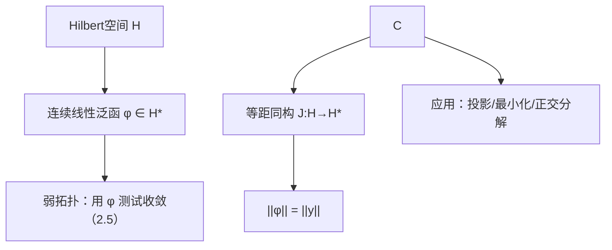

**相关笔记：** [[2.1 线性算子的概念]] | [[2.3 纲与开映射定理]] | [[第02章 线性算子与线性泛函 — 章节汇总]]

> [!abstract] 概览
> Riesz 表示定理给出 Hilbert 空间里“连续线性泛函”的完全刻画：每个 $\varphi\in H^\*$ 都可以唯一写成内积形式 $\varphi(x)=\langle x,y\rangle$。  
> 它把“抽象对偶”变成“空间内部的一个向量”，从而让很多问题（最小化、投影、弱收敛判别）变得可计算。
>
> - 结论：存在唯一 $y\in H$ 使 $\varphi(x)=\langle x,y\rangle$（实/复情形注意共轭线性约定）
> - 等距同构：$H^\*\cong H$，并且 $\|\varphi\|=\|y\|$
> - 应用入口：投影定理、正交分解、最小二乘/最小范数解、对偶识别
> - 与后续：2.5 的弱/弱*拓扑中，“对偶”是测试函数集合；Riesz 把 Hilbert 情形的对偶测试变得直观

^overview

---

# 1. 本节主题定位

- **本节的核心问题**
  - 为什么在 Hilbert 空间里，连续线性泛函可以“完全具体化”为一个向量？
  - 这个向量代表 $y$ 的唯一性与范数等距 $\|\varphi\|=\|y\|$ 各依赖什么关键条件？
  - Riesz 表示如何把“最小化/投影/正交分解”问题转化为可操作的几何条件？

- **本节在本章知识链中的位置**
  - 2.1：先把连续性变成范数估计（有界算子/算子范数）  
  - 2.2：在 Hilbert 舞台上把对偶 $H^\*$ 识别为 $H$ 本身（最强可计算性）  
  - 2.4/2.5：一般 Banach 的对偶更抽象，需要 Hahn–Banach 与弱拓扑语言  

- **本节依赖哪些前置概念/定理**
  - [[1.6 内积空间]]（内积、正交、Hilbert 完备性）
  - [[2.1 线性算子的概念]]（连续线性泛函 = 有界线性算子到 $\mathbb{F}$）

- **本节为后续哪些内容铺路**
  - 2.5 弱收敛：在 Hilbert 情形，弱收敛可用内积测试直观理解  
  - 投影定理/最小二乘：后续很多“存在唯一最优解”都靠 Hilbert 的几何结构

## 二、核心思想

> [!tip] 核心方法论（本节最值得记住的一句话）
> 在 Hilbert 空间里，“泛函 = 内积”使抽象线性泛函可以被一个向量代表；因此很多对偶问题都能回到“正交几何”来处理。

---

# 2. 内容分层图

> [!quote] 原文直接信息（分层）
> - **概念层**：对偶 $H^\*$、核空间 $\ker\varphi$、正交补 $(\ker\varphi)^\perp$、等距同构  
> - **命题层**：Riesz 表示（存在唯一）；范数等距 $\|\varphi\|=\|y\|$  
> - **方法层**：闭子空间 + 正交补分解；把线性泛函“降到一维”处理；用 C–S 得上界再取等号  
> - **过渡层**：Hilbert（内积+完备）比一般 Banach 强：对偶不再抽象

---

# 3. 定义系统

## 3.1 连续线性泛函与对偶

> [!quote] 原文直接信息（定义）
> 设 $X$ 为赋范空间，所有连续线性泛函的集合记为 $X^\*$，称为 $X$ 的对偶（或共轭）空间。

> [!note] 辅助理解（本节的特殊性）
> 一般 Banach 空间的 $X^\*$ 往往比 $X$ “大很多”；本节研究的是 Hilbert 情形的特权：$H^\*\cong H$。

---

# 4. 定理/命题系统

## 4.1 Riesz 表示定理（Hilbert 空间）

> [!quote] 原文直接信息（定理）
> 设 $H$ 为 Hilbert 空间，$\varphi\in H^\*$。则存在唯一 $y\in H$ 使对任意 $x\in H$，
> $$\varphi(x)=\langle x,y\rangle.$$
> 且 $\|\varphi\|=\|y\|$（因此 $H^\*$ 与 $H$ 等距同构）。

- **条件逐条解释**
  - Hilbert（完备内积）用于：核空间是闭子空间并能做正交补分解；极小化/投影论证可落地
  - 连续性用于：$\ker\varphi$ 为闭集（进而可用正交补）
- **证明骨架（Step 1/2/3）**
  1) 若 $\varphi=0$ 取 $y=0$；否则取闭子空间 $M=\ker\varphi$  
  2) 取 $e\in M^\perp$ 的单位向量（$M^\perp$ 一维），把任意 $x$ 分解为 $x=z+\alpha e$（$z\in M$）  
  3) 由 $\varphi(z)=0$ 得 $\varphi(x)=\alpha\varphi(e)$，再把 $\alpha$ 表成 $\langle x,e\rangle$ 的倍数，从而构造 $y$
- **证明中最关键的一跳**
  - 用“核空间的正交补是一维”把泛函问题降到一维处理
- **若条件削弱，哪里可能出问题**
  - 在一般 Banach 空间没有内积与正交补，结论通常不成立

---

# 5. 例子与反例系统

## 5.1 例：最小化 = 正交条件（应用接口）

> [!quote] 原文直接信息（应用信号）
> 对闭子空间 $M\subset H$，最小化 $\|x-m\|$ 的解 $m^\*$ 满足 $x-m^\*\perp M$。

> [!note] 辅助理解
> 这是“投影定理”的核心句型：最优解满足正交性；其证明常用平行四边形恒等式与完备性。

## 5.2 反例提示（边界）
- **误用警示**：一般 Banach 空间没有正交结构，“最小化 = 正交”不再是默认结论；Riesz 表示也失效（见本节误区）。

---

# 6. 本节逻辑链复原

1) 先提出对偶问题：连续线性泛函的集合 $H^\*$ 如何被描述？  
2) 利用 Hilbert 的正交结构：用 $\ker\varphi$ 与其正交补把问题降维。  
3) 构造代表向量 $y$，并用内积表达式得到 $\varphi(x)=\langle x,y\rangle$。  
4) 通过 C–S 与取等号构造，得到范数等距 $\|\varphi\|=\|y\|$。  
5) 将“泛函/最小化/投影”统一为 Hilbert 空间的几何语言。

---

# 7. 本节高风险误区（至少 5 条）

1) **把 Riesz 表示误认为“一般 Banach 都成立”**：它依赖内积与正交分解，是 Hilbert 结构特权。  
2) **复 Hilbert 情形忽略共轭线性约定**：不同教材对“哪一边线性”约定不同，写错会差一个共轭。  
3) **只记住结论，不会构造 $y$**：关键是先看 $\ker\varphi$，再用一维正交补降维。  
4) **唯一性不会证明**：要会用“取 $x=y_1-y_2$”把等式变成范数为 0。  
5) **不会证明范数等距 $\|\varphi\|=\|y\|$**：上界靠 C–S；取等号要选 $x=y/\|y\|$。  

---

# 8. 知识库拆分建议

- **A类：概念卡**
  - [[共轭空间]]、[[线性泛函]]、[[正交]]、[[Hilbert空间]]
- **B类：定理卡**
  - [[Riesz表示定理]]
- **C类：只保留在本节页**
  - “核空间 + 正交补降维”的证明叙事链条
- **D类：专题综述候选**
  - “Hilbert 对偶可计算性：Riesz 表示 → 投影/最小化/弱收敛直觉”

---

# 9. 后续学习接口

- **适合下一轮展开证明的点**
  - 复 Hilbert 情形：共轭线性约定如何影响 $y$ 的表达（哪里需要共轭）
  - 投影定理的完整证明（使用平行四边形恒等式与完备性）
- **适合设计习题的点**
  - 唯一性与范数等距（C–S + 取等号）
  - 用正交分解解决最小化（把最小化序列与正交条件连接）
- **与后续衔接**
  - 2.5 弱收敛：用对偶测试收敛；Hilbert 情形可用内积测试更直观

---

# 10. 自测问题

1) Riesz 表示定理的结论是什么？它为什么是 Hilbert 结构的特权？  
2) 构造 $y$ 的核心步骤是什么？为什么要考虑 $\ker\varphi$ 的正交补？  
3) 如何证明 $y$ 唯一？你会用哪一个 $x$ 代入？  
4) 如何证明 $\|\varphi\|=\|y\|$？哪一步用 C–S，哪一步取等号？  
5) 为什么“最小化 = 正交”与 Riesz 表示天然同框？  

## 10.B 习题（完整解答）

> [!todo] 习题编号（按教材）
> 2.2.1–2.2.5

### 习题 2.2.1（交核的投影：用 Riesz 把泛函变成向量）
> [!problem] 题目
> （本节各题中的 $H$ 均指 Hilbert 空间。）设 $f_1,\dots,f_n$ 是 $H$ 上的一组有界线性泛函，记
> $$M:=\bigcap_{k=1}^n N(f_k),\qquad N(f_k)=\{x\in H:\ f_k(x)=0\}.$$
> 给定 $x_0\in H$，记 $y_0$ 为 $x_0$ 在 $M$ 上的正交投影。求证：存在 $y_1,\dots,y_n\in H$ 与标量 $a_1,\dots,a_n$ 使
> $$y_0=x_0-\sum_{k=1}^n a_k y_k.$$

> [!solution]- 完整过程解答
> 由 Riesz 表示定理，对每个 $k$ 存在唯一 $u_k\in H$ 使
> $$f_k(x)=\langle x,u_k\rangle\quad(\forall x\in H).$$
> 于是 $N(f_k)=u_k^\perp$，从而
> $$M=\bigcap_{k=1}^n u_k^\perp=\left(\operatorname{span}\{u_1,\dots,u_n\}\right)^\perp.$$
> 记 $U:=\operatorname{span}\{u_1,\dots,u_n\}$，则 $H=U\oplus U^\perp$，且 $M=U^\perp$。  
> 因此 $y_0=P_M x_0=x_0-P_Ux_0$。令 $y_k:=u_k$，并把 $P_Ux_0$ 在有限维空间 $U$ 中表示为
> $$P_Ux_0=\sum_{k=1}^n a_k u_k.$$
> 于是
> $$y_0=x_0-\sum_{k=1}^n a_k y_k,$$
> 结论成立。（若需显式 $a_k$，可用 Gram 矩阵 $G_{ij}=\langle u_j,u_i\rangle$ 解线性方程 $G a = (\langle x_0,u_i\rangle)_i$。）

### 习题 2.2.2（“完成平方”+ 闭凸集上取极小）
> [!problem] 题目
> 设 $l$ 是 $H$ 上的实值有界线性泛函，$C$ 是 $H$ 中闭凸子集，定义
> $$\phi(v)=\frac12\|v\|^2-l(v)\qquad (v\in C).$$
> (1) 求证：存在 $u^*\in H$ 使得
> $$\phi(v)=\frac12\|u^*-v\|^2-\frac12\|u^*\|^2\qquad(\forall v\in C).$$
> (2) 求证：存在 $u_0\in C$ 使 $\phi(u_0)=\inf_{v\in C}\phi(v)$。

> [!solution]- 完整过程解答
> (1) 由 Riesz 表示，存在唯一 $u^*\in H$ 使 $l(v)=\langle v,u^*\rangle$（实情形内积为双线性）。于是
> $$\phi(v)=\frac12\|v\|^2-\langle v,u^*\rangle=\frac12\big(\|v\|^2-2\langle v,u^*\rangle+\|u^*\|^2\big)-\frac12\|u^*\|^2
> =\frac12\|v-u^*\|^2-\frac12\|u^*\|^2.$$
> (2) 由(1)，在 $C$ 上极小化 $\phi$ 等价于极小化距离函数 $v\mapsto \|v-u^*\|$。  
> 而 Hilbert 空间中“闭凸集到点的距离”一定能取到（投影定理：存在唯一投影点），故存在 $u_0\in C$ 达到极小值，从而 $\phi(u_0)=\inf_C\phi$。

### 习题 2.2.3（再生核：评价泛函的 Riesz 表示）
> [!problem] 题目
> 设 $H$ 的元素是定义在集合 $S$ 上的复值函数，并且对每个 $y\in S$，评价泛函
> $$J_y:H\to\mathbb{C},\qquad J_y(f)=f(y)$$
> 都是 $H$ 上的连续线性泛函。求证：存在函数 $K:S\times S\to\mathbb{C}$ 满足  
> (1) 对任意固定 $y$，$K(\cdot,y)\in H$；  
> (2) $f(y)=\langle f, K(\cdot,y)\rangle$（$\forall f\in H,\ \forall y\in S$）。  
> 并说明满足 (1)(2) 的 $K$ 称为 $H$ 的再生核。

> [!solution]- 完整过程解答
> 对固定 $y$，$J_y\in H^*$。由 Riesz 表示定理，存在唯一元素 $K(\cdot,y)\in H$ 使
> $$J_y(f)=f(y)=\langle f,K(\cdot,y)\rangle\qquad(\forall f\in H).$$
> 令 $K(x,y):=K(\cdot,y)(x)$，则得到 $K:S\times S\to\mathbb{C}$，且 (1)(2) 成立。唯一性来自 Riesz 表示的唯一性。

### 习题 2.2.4（$H^2(D)$ 的再生核：级数求和）
> [!problem] 题目
> 求证：$H^2(D)$（定义见教材例 1.6.28）的再生核为
> $$K(z,w)=\frac{1}{\pi(1-z\overline w)^2}\qquad (z,w\in D).$$

> [!solution]- 完整过程解答
> 用正交基展开是标准做法：在 $H^2(D)$（此处为 Bergman 型空间）中，单项式构成正交基，且可取归一化基
> $$e_n(z)=\sqrt{\frac{n+1}{\pi}}\,z^n\quad(n\ge 0).$$
> 再生核的级数表示为
> $$K(z,w)=\sum_{n=0}^\infty e_n(z)\overline{e_n(w)}=\sum_{n=0}^\infty \frac{n+1}{\pi} z^n\overline{w}^n
> =\frac{1}{\pi}\sum_{n=0}^\infty (n+1)(z\overline w)^n.$$
> 而对 $|t|<1$ 有 $\sum_{n\ge 0}(n+1)t^n=\frac{1}{(1-t)^2}$，取 $t=z\overline w$ 即得
> $$K(z,w)=\frac{1}{\pi(1-z\overline w)^2}.$$

### 习题 2.2.5（投影算子与子空间关系）
> [!problem] 题目
> 设 $L,M$ 是 $H$ 上的闭线性子空间，$P_L,P_M$ 为对应正交投影。求证：  
> (1) $L\perp M \Longleftrightarrow P_LP_M=0$；  
> (2) $L=M^\perp \Longleftrightarrow P_L+P_M=I$；  
> (3) $P_LP_M=P_{L\cap M}\Longleftrightarrow P_LP_M=P_MP_L$。

> [!solution]- 完整过程解答
> (1) “⇒”：若 $L\perp M$，则对任意 $x$，$P_Mx\in M$，再投影到 $L$ 得 $P_L(P_Mx)=0$，故 $P_LP_M=0$。  
> “⇐”：若 $P_LP_M=0$，取 $u\in L,v\in M$，令 $x=v$，则 $P_Lv=P_LP_Mv=0$。但 $P_Lv$ 是 $v$ 在 $L$ 上的投影，等价于 $v\perp L$，故 $L\perp M$。  
> (2) 若 $L=M^\perp$，则 $H=L\oplus M$，任意 $x=x_L+x_M$，有 $P_Lx=x_L$，$P_Mx=x_M$，故 $P_L+P_M=I$。反向：若 $P_L+P_M=I$，则 $H=R(P_L)\oplus R(P_M)=L\oplus M$ 且两投影互补，推出 $L=M^\perp$。  
> (3) “⇒”显然两边都等于 $P_{L\cap M}$ 因而可交换。  
> “⇐”：若 $P_LP_M=P_MP_L$，则 $P_LP_M$ 是自伴投影（可验证 $(P_LP_M)^*=P_MP_L=P_LP_M$ 且幂等），其值域为 $L\cap M$，从而 $P_LP_M=P_{L\cap M}$。

---

> [!quote]- 参考（教材分片 + 本库链接）
> 1. 张恭庆，《泛函分析讲义》，第 2 章 2.2。  
> 2. 本节对应分片 PDF：![[00-Raw素材/泛函分析讲义_张恭庆/章节内容/第二章_线性算子与线性泛函/2.2_Riesz表示定理及其应用.pdf]]  
> 3. 参见：[[Riesz表示定理]] / [[Hilbert空间]] / [[共轭空间]] / [[线性泛函]] / [[正交]] / [[2.5 共轭空间 弱收敛 自反空间]]  

#学习/泛函分析/线性算子与线性泛函
