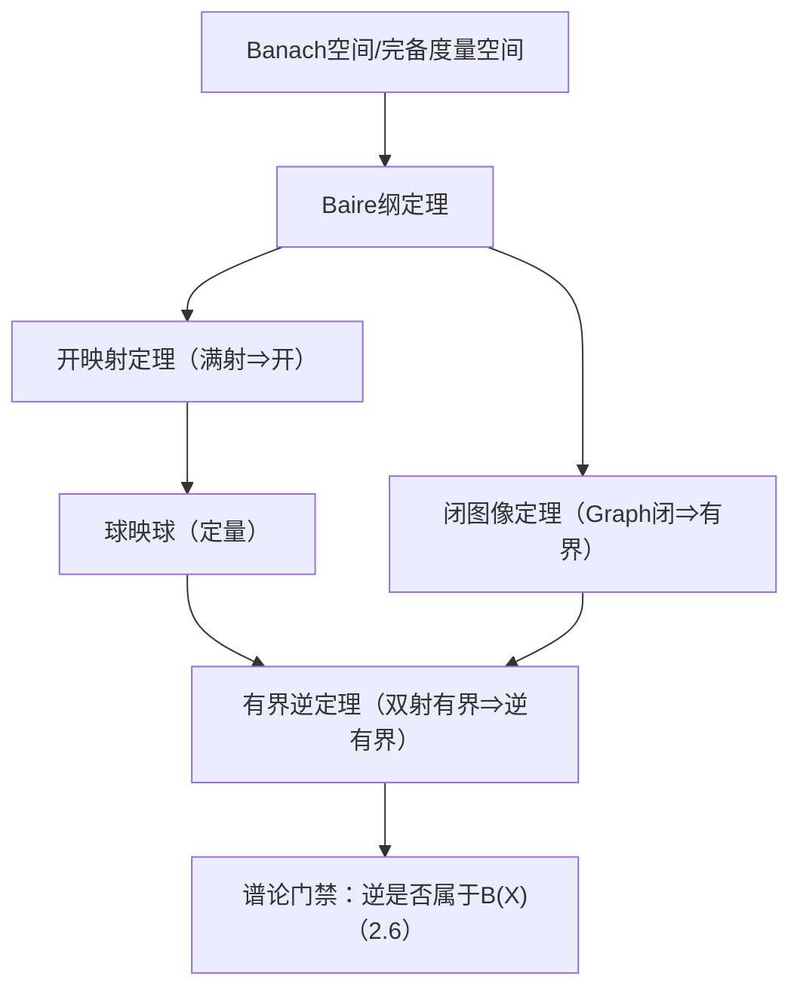

**相关笔记：** [[2.1 线性算子的概念]] | [[2.4 Hahn-Banach定理]] | [[第02章 线性算子与线性泛函 — 章节汇总]]

> [!abstract] 概览
> 本节用 **Baire 纲定理**（完备度量空间的“非稀薄性”）推出 Banach 空间三件套：**开映射定理 / 有界逆定理 / 闭图像定理**。它们把“代数可解（满射/图像闭）”升级为“分析稳定（逆有界/像开/估计存在）”，是后续所有稳定性估计与谱论中“逆是否有界”的关键门槛。
> - 引擎：Baire 纲定理（可数并 → 某一部分有内点）
> - 核心输出：球映球（定量版开映射）→ 逆有界 → 闭图像
> - 题型信号：只要题目在问“解是否稳定/是否能给出 $\|x\|\le C\|y\|$”，优先召唤本节三件套

^overview

---

# 1. 本节主题定位

- **本节的核心问题**
  - 为什么“完备性”能够推出稳定估计（存在常数 $C$ 控制解）？
  - 连续线性满射为什么一定把开集映成开集（开映射）？
  - 什么时候“代数逆存在”能推出“逆也是有界算子”（有界逆）？
  - 什么时候仅凭“极限交换性质（图像闭）”就能推出有界性（闭图像）？

- **本节在本章知识链中的位置**
  - 2.1 给出“连续 $\Leftrightarrow$ 有界”的语言
  - **2.3 用 Baire 把‘存在性’升级为‘稳定性’**（本章最常用结构定理）
  - 2.6 谱论中判断 $(T-\lambda I)^{-1}$ 是否有界，经常要回到 2.3

- **本节依赖的前置概念/定理**
  - 完备度量空间 / Banach 空间（第 1 章）
  - 有界线性算子、算子范数、连续性判别（[[2.1 线性算子的概念]]）

- **本节为后续哪些内容铺路**
  - “逆算子仍有界”的门禁：谱论/预解集定义中的关键条件（[[2.6 线性算子的谱]]）
  - “图像闭 ⇒ 有界”的套路：处理极限过程与交换算子（后续紧算子章节也频繁出现）

## 二、核心思想

> [!tip] 核心方法论（本节最值得记住的一句话）
> 在 Banach 空间里，想从“对每个 $y$ 都可解”推出“解对 $y$ 连续依赖（存在 $\|x\|\le C\|y\|$）”，就把空间写成“可数个集合的并”，用 Baire 逼出某一块“有内点”，再把“局部有内点”缩放成“球映球”的定量估计。

---

# 2. 内容分层图

> [!quote] 原文直接信息（分层）
> - **概念层**：疏集/第一纲集/第二纲集；Banach 空间；闭算子与图像  
> - **命题层**：Baire 纲定理；开映射定理；有界逆定理；闭图像定理  
> - **方法层**：可数并 + Baire → “某闭集有内点” → 球映球；闭图像 = 极限交换  
> - **过渡层**：把“代数条件”转成“范数估计”，为 2.6 的“逆有界”提供工具

---

# 3. 定义系统

## 3.1 疏集 / 第一纲 / 第二纲

> [!quote] 原文直接信息（定义，等价转写）
> 在度量空间中：
> - 集合 $E$ 称为**疏集**：$\operatorname{int}(\overline E)=\varnothing$（闭包无内点）
> - $E$ 称为**第一纲集**：$E$ 是可数个疏集的并
> - 非第一纲的集合称为**第二纲集**

- **定义对象是什么**：度量空间中的子集
- **为什么要这样定义**：用“是否稀薄”刻画集合大小；Baire 定理把“可数并的稀薄性”转化为“存在内点”
- **它解决了什么问题**：从“覆盖关系（可数并）”推出“存在某个集合的内点”，进而得到定量估计
- **最小例子**
  - $\mathbb{R}$ 中单点集是疏集；可数集是第一纲集
  - Cantor 集是疏集（闭而无内点）
- **非例/边界**
  - $\mathbb{R}$ 本身在 $\mathbb{R}$ 中是第二纲集（它不可能是可数个疏集的并）
- **初学者误区**
  - 把“第一纲”误认为“可数”；第一纲是“可数个疏集的并”，可以不可数

## 3.2 闭算子（closed operator）与图像

> [!quote] 原文直接信息（定义，等价转写）
> 设 $X,Y$ 为赋范空间，$T:D(T)\subset X\to Y$ 为线性算子。若
> $x_n\in D(T),\ x_n\to x$ 且 $Tx_n\to y$ 能推出 $x\in D(T)$ 且 $Tx=y$，
> 则称 $T$ 为**闭算子**（等价地：$\operatorname{Graph}(T)$ 在 $X\times Y$ 中闭）。

- **条件的作用**
  - “$X\times Y$ 里闭”把“极限过程可交换”固化成结构性质；这是从拓扑信息推出范数估计的入口
- **最小例子**
  - 任意有界线性算子（定义域为全空间）都是闭算子
- **非例**
  - 在非完备空间上，极限可能跑出空间；“看似闭”的性质可能失败（与闭图像定理的完备性门槛有关）

---

# 4. 定理/命题系统

## 4.1 Baire 纲定理（引擎）

> [!quote] 原文直接信息（常用形式）
> 在完备度量空间中，可数个稠密开集的交仍稠密。

- **条件逐条解释**
  - 完备性：是整套推理唯一的“硬门禁”；没有它，后续三件套可能全部失效
- **结论到底在说什么**
  - “完备空间不可能处处稀薄”：可数次“去掉稀薄部分”仍剩下很多点
- **证明骨架（Step 1/2/3）**
  1) 用递归选球：在第 $n$ 步在第 $n$ 个稠密开集里选一个小球包含于上一步球
  2) 球半径趋于 0，得到一个 Cauchy 列
  3) 完备性保证极限点存在且落在所有开集中
- **最关键的一跳**
  - “递归选球 + 完备性”把集合论叙述转为“构造一个极限点”

## 4.2 开映射定理（Open Mapping）

> [!quote] 原文直接信息（定理）
> 若 $X,Y$ 为 Banach 空间，$T\in B(X,Y)$ 为**满射**，则 $T$ 为开映射：任意开集 $U\subset X$，$T(U)$ 在 $Y$ 中开。

- **条件逐条解释**
  - Banach：来自 Baire 引擎
  - 满射：把“像覆盖整个 $Y$”转为“$Y$ 是可数并”，从而触发 Baire
- **结论在说什么（可操作版本）**
  - 存在 $r>0$ 使得
    $$B_Y(0,r)\subset T(B_X(0,1)).$$
  - 这就是“球映球”的定量版本，直接给出解的估计
- **证明骨架（Step 1/2/3）**
  1) 令 $A_n=T(B_X(0,n))$，则 $Y=\bigcup_{n\ge1}A_n$
  2) 取闭包并用 Baire：存在某个 $\overline{A_{n_0}}$ 有内点
  3) 平移把内点搬到 0，再用线性缩放得到球包含（定量估计）
- **最关键的一跳**
  - “$\bigcup$ 覆盖 + Baire ⇒ 某个闭包有内点”，再用线性把“内点”变成“球”
- **后续用途**
  - 有界逆定理、谱论中“逆有界”的判别、构造近似解的稳定性估计

## 4.3 有界逆定理（Bounded Inverse）

> [!quote] 原文直接信息（定理）
> 若 $X,Y$ 为 Banach 空间，$T\in B(X,Y)$ 为线性双射，则 $T^{-1}\in B(Y,X)$。

- **条件逐条解释**
  - “双射”保证代数逆存在；“Banach”保证逆的连续性可由开映射推出
- **证明骨架**
  1) 由开映射定理：$T$ 开
  2) 因此 $T^{-1}$ 连续
  3) 连续线性算子即有界（2.1）
- **最关键的一跳**
  - “开映射 ⇒ 逆连续”是把代数性质升级为分析性质的核心桥梁
- **条件削弱风险**
  - 若空间不完备：可能存在连续双射但逆不连续（典型反例来自稠密真子空间）

## 4.4 闭图像定理（Closed Graph）

> [!quote] 原文直接信息（定理）
> 若 $X,Y$ 为 Banach 空间，线性算子 $T:X\to Y$ 的图像 $\operatorname{Graph}(T)$ 在 $X\times Y$ 中闭，则 $T\in B(X,Y)$。

- **条件逐条解释**
  - Banach：同样来自 Baire/开映射等价链
  - “图像闭”：把“极限交换”编码为拓扑条件
- **证明骨架**
  1) 将 $X$ 赋予新范数 $\|x\|_T=\|x\|+\|Tx\|$，证明它完备
  2) 恒等映射 $I:(X,\|\cdot\|_T)\to (X,\|\cdot\|)$ 连续双射
  3) 用有界逆定理得 $I^{-1}$ 有界，从而 $\|Tx\|\le C\|x\|$
- **最关键的一跳**
  - 用“图像闭”证明新范数下的完备性（把拓扑条件变成 Banach 结构）

---

# 5. 例子与反例系统

- **关键例子：商映射是开映射**（对应习题 2.3.1）
  - 说明“开映射定理”能立即给出结构性结论（商空间的自然映射）
- **关键反例方向：去掉完备性会失败**
  - 在不完备赋范空间上，连续双射未必有连续逆（提醒“Banach”是门禁，不是装饰）
- **服务的理解点**
  - 例子服务于“定理如何用”（不只是结论）
  - 反例服务于“条件为何必要”（否则看懂但不会用）

---

# 6. 本节逻辑链复原（作者为什么这样安排）

1) 先引入“第一纲/第二纲”这套大小语言，铺垫 Baire 的结论能落地  
2) 给出 Baire 纲定理：从“可数并覆盖”逼出“内点存在”  
3) 立刻把 Baire 作为引擎推开映射（核心桥梁：$\bigcup$ 覆盖 + Baire）  
4) 用开映射一键推出有界逆（把代数逆升级为有界逆）  
5) 再给闭图像（处理“先有极限交换性质，再要范数估计”的典型场景）  
6) 最后通过习题把“三件套的常用变体/应用接口”全部做成可复用技能

---

# 7. 本节高风险误区（至少 5 条）

1) **误读**：开映射定理对任意赋范空间都成立  
   - **为什么容易误读**：定义里只写了“连续线性满射”  
   - **正确理解**：必须是 Banach；完备性是从 Baire 进入的唯一门禁
2) **误读**：线性算子“在 0 点连续”与“处处连续”无关  
   - **原因**：忽略线性带来的缩放  
   - **正确理解**：线性使局部控制可缩放成全局估计（2.1 的核心等价）
3) **误读**：证明开映射只要“满射”即可，不用 Baire  
   - **原因**：只记住了结论，不记得“球映球”来自“可数并 + 内点”  
   - **正确理解**：开映射真正可用的是定量版 $B_Y(0,r)\subset T(B_X(0,1))$
4) **误读**：闭图像定理就是“极限能交换”这么一句话  
   - **原因**：忽略“闭”发生在 $X\times Y$，且需要 Banach  
   - **正确理解**：闭图像定理把“极限交换”升级为“存在统一常数估计”
5) **误读**：代数逆存在就等于逆有界  
   - **原因**：有限维直觉误用  
   - **正确理解**：无限维必须借助有界逆/开映射来保证逆属于 $B(Y,X)$
6) **误读**：有界逆定理与闭图像定理是两个互不相关的结论  
   - **正确理解**：它们可互推，都是同一条“Banach + Baire ⇒ 稳定性”的不同表述

---

# 8. 知识库拆分建议

- **A类：概念卡（建议独立）**
  - 疏集 / 第一纲集 / 第二纲集
  - 闭算子与图像（Graph）
  - 商空间与商范数（若你库里已有可仅链接）
- **B类：定理卡（建议独立）**
  - Baire 纲定理
  - 开映射定理（含球映球形式）
  - 有界逆定理
  - 闭图像定理
  - 共鸣定理/一致有界原理（若教材在本节或后节出现）
- **C类：只保留在本节页中**
  - “三件套互推关系”的逻辑链与做题按钮
- **D类：专题综述页候选**
  - “Baire 方法论：可数并 → 内点 → 定量估计”作为专题页

---

# 9. 后续学习接口

- **下一轮适合展开证明的点**
  - 开映射定理中“平移+缩放把内点变球”的细节
  - 闭图像定理中新范数完备性的关键论证
- **适合设计习题的点**
  - “从满射推出 $\|x\|\le C\|y\|$”的各种变体
  - “闭算子/闭图像/可逆性/值域闭性”的等价刻画
- **与前一节比较**
  - 2.1 给出“连续=有界”是**定性**；2.3 给出“存在解⇒稳定估计”是**定量**
- **与下一节衔接**
  - 2.4/2.5 的对偶与弱拓扑里，许多“存在极值/分离”也依赖稳定性估计（本节提供分析支撑）

---

# 10. 自测问题

## 10.A 自测问题（由浅到深）
1) 为什么开映射定理必须要求 Banach（完备）？缺了会在哪里断？  
2) 写出开映射定理的“球映球”形式，并说明它如何给出 $\|x\|\le C\|y\|$。  
3) 解释闭图像定理中“图像闭”与“存在统一常数估计”的关系。  
4) 在无限维里，为什么“单射”不等于“可逆”？与 2.6 的谱概念如何呼应？  
5) 总结“三件套”之间的蕴含链：开映射 ⇒ 有界逆；闭图像与有界逆如何互推？

## 10.B 习题（完整解答，按教材编号）

### 习题 2.3.1（商映射是开映射）
> [!problem] 题目
> 设 $X$ 是 Banach 空间，$M$ 是 $X$ 的闭子空间。商映射 $\varphi:X\to X/M$ 定义为 $\varphi(x)=[x]$（$[x]$ 为商类）。求证：$\varphi$ 是开映射。

> [!solution]- 完整过程解答
> 取任意开集 $U\subset X$，要证 $\varphi(U)$ 在商空间 $X/M$ 中开。  
> 只需证：对任意 $[x_0]\in \varphi(U)$，存在 $\varepsilon>0$ 使 $B_{X/M}([x_0],\varepsilon)\subset \varphi(U)$。  
> 因为 $[x_0]\in\varphi(U)$，可取 $x_0\in U$。由 $U$ 开，存在 $\delta>0$ 使 $B_X(x_0,\delta)\subset U$。  
> 对任意 $[y]\in B_{X/M}([x_0],\delta)$，按商范数定义
> $$\|[y]-[x_0]\|=\|[y-x_0]\|=\inf_{m\in M}\|y-x_0-m\|<\delta.$$
> 因而存在 $m\in M$ 使 $\|y-(x_0+m)\|<\delta$，即 $y\in B_X(x_0+m,\delta)\subset U+M$。  
> 于是存在 $u\in U$ 与 $m'\in M$ 使 $y=u+m'$，从而 $[y]=[u]\in\varphi(U)$。  
> 故 $B_{X/M}([x_0],\delta)\subset \varphi(U)$，即 $\varphi(U)$ 开。

### 习题 2.3.2（有界下界 ⇒ 逆有界）
> [!problem] 题目
> 设 $X,Y$ 是 Banach 空间，又设方程 $Ux=y$ 对任意 $y\in Y$ 有解 $x\in X$，其中 $U\in B(X,Y)$，并且存在 $m>0$ 使得
> $$\|Ux\|\ge m\|x\|\qquad (\forall x\in X).$$
> 求证：$U$ 有连续逆 $U^{-1}$，并且 $\|U^{-1}\|\le 1/m$。

> [!solution]- 完整过程解答
> 由“对任意 $y$ 有解”知 $U$ 满射。  
> 由 $\|Ux\|\ge m\|x\|$ 得：若 $Ux=0$ 则 $m\|x\|\le 0$，故 $x=0$，因此 $U$ 单射。于是 $U$ 为双射，代数逆 $U^{-1}:Y\to X$ 存在。  
> 现在对任意 $y\in Y$，令 $x=U^{-1}y$，则
> $$\|y\|=\|Ux\|\ge m\|x\|=m\|U^{-1}y\|,$$
> 即 $\|U^{-1}y\|\le \frac1m\|y\|$。  
> 因此 $U^{-1}$ 为有界线性算子，且 $\|U^{-1}\|\le 1/m$。

### 习题 2.3.3（Hilbert 上的“强单调”算子可逆）
> [!problem] 题目
> 设 $H$ 是 Hilbert 空间，$A\in B(H)$，并且存在 $m>0$ 使得
> $$|(Ax,x)|\ge m\|x\|^2\qquad (\forall x\in H).$$
> 求证：$A^{-1}\in B(H)$。

> [!solution]- 完整过程解答
> **(1) 先证 $A$ 有界下界 ⇒ 单射且值域闭**  
> 由 Cauchy–Schwarz，
> $$|(Ax,x)|\le \|Ax\|\cdot\|x\|.$$
> 联合题设得对 $x\ne 0$：
> $$\|Ax\|\ge m\|x\|.$$
> 因此若 $Ax=0$ 则 $\|x\|=0$，$A$ 单射；并且若 $Ax_n\to y$，则
> $$\|x_n-x_k\|\le \frac1m\|Ax_n-Ax_k\|,$$
> 故 $\{x_n\}$ 为 Cauchy 列并收敛到某 $x$，从而 $Ax=y$，所以 $R(A)$ 闭。
>
> **(2) 再证 $R(A)$ 稠密**  
> 对任意 $x\in H$，有
> $$|(A^*x,x)|=|(x,Ax)|=|(Ax,x)|\ge m\|x\|^2,$$
> 因此同理可得 $A^*$ 单射，即 $N(A^*)=\{0\}$。而 $N(A^*)=R(A)^\perp$，故 $R(A)^\perp=\{0\}$，即 $R(A)$ 稠密。
>
> **(3) 闭且稠密 ⇒ 全空间 ⇒ 可逆且逆有界**  
> $R(A)$ 既闭又稠密，故 $R(A)=H$，$A$ 为双射。由上面的不等式
> $$\|Ax\|\ge m\|x\|,$$
> 对 $y=Ax$ 得
> $$\|A^{-1}y\|=\|x\|\le \frac1m\|y\|,$$
> 从而 $A^{-1}\in B(H)$，并有 $\|A^{-1}\|\le 1/m$。

### 习题 2.3.4（闭算子与闭图像的基本操练）
> [!problem] 题目
> 设 $X,Y$ 是 Banach 空间，$D\subset X$ 为线性子空间，$A:D\to Y$ 为线性映射。求证：  
> (1) 若 $A$ 连续且 $D$ 闭，则 $A$ 是闭算子；  
> (2) 若 $A$ 连续且为闭算子，且 $Y$ 完备，则 $D$ 必闭；  
> (3) 若 $A$ 为单射闭算子，则 $A^{-1}$ 也是闭算子；  
> (4) 若 $X$ 完备，$A$ 为单射闭算子，$R(A)$ 在 $Y$ 中稠密，且 $A^{-1}$ 连续，则 $R(A)=Y$。

> [!solution]- 完整过程解答
> **(1)** 取 $x_n\in D$，$x_n\to x$ 且 $Ax_n\to y$。因 $D$ 闭得 $x\in D$，又因 $A$ 在 $D$ 上连续，得 $Ax_n\to Ax$，故 $y=Ax$，即图像闭。  
>
> **(2)** 设 $x_n\in D$ 且 $x_n\to x$ 于 $X$。因 $A$ 连续，$\{Ax_n\}$ 为 Cauchy 列；$Y$ 完备故 $Ax_n\to y$。闭算子给出 $(x,y)\in\operatorname{Graph}(A)$，因此 $x\in D$，$D$ 闭。  
>
> **(3)** $A^{-1}:R(A)\to D$ 的图像
> $$\operatorname{Graph}(A^{-1})=\{(y,x):y=Ax,\ x\in D\}$$
> 是 $\operatorname{Graph}(A)$ 在交换坐标映射下的像；坐标交换是同胚，因此 $\operatorname{Graph}(A)$ 闭 $\Rightarrow \operatorname{Graph}(A^{-1})$ 闭。  
>
> **(4)** 由 (3) 知 $A^{-1}$ 为闭算子；又题设 $A^{-1}$ 连续，按 (2)（对算子 $A^{-1}$ 应用）可得其定义域 $R(A)$ 在 $Y$ 中闭。现在 $R(A)$ 既闭又稠密，故 $R(A)=Y$。

### 习题 2.3.5（$L^1$-范数下的 $C[0,1]$ 不完备）
> [!problem] 题目
> 用等价范数定理（推论 2.3.14）证明：$(C[0,1],\|\cdot\|_1)$ 不是 Banach 空间，其中
> $$\|f\|_1:=\int_0^1 |f(t)|\,dt,\qquad f\in C[0,1].$$

> [!solution]- 完整过程解答
> 只需构造一个在 $\|\cdot\|_1$ 下的 Cauchy 列，它在 $C[0,1]$ 中不收敛。  
> 令 $g=\mathbf{1}_{[1/2,1]}$ 为阶跃函数（不连续），取连续函数 $f_n$ 逼近 $g$：例如令
> - $f_n(t)=0$（$t\le 1/2-1/n$），
> - $f_n(t)=n\left(t-(1/2-1/n)\right)$（线性上升段 $t\in[1/2-1/n,1/2]$），
> - $f_n(t)=1$（$t\ge 1/2$）。
> 则 $f_n\in C[0,1]$，并且
> $$\|f_n-g\|_1=\int_{1/2-1/n}^{1/2} |f_n(t)-0|\,dt=\frac{1}{2n}\to 0.$$
> 从而 $\{f_n\}$ 在 $\|\cdot\|_1$ 下收敛到 $g$（在 $L^1$ 意义下），因此必是 $\|\cdot\|_1$-Cauchy 列。  
> 但 $g\notin C[0,1]$，所以它不可能在 $(C[0,1],\|\cdot\|_1)$ 中收敛。故该空间不完备，不是 Banach 空间。

### 习题 2.3.6（Gelfand 引理：次线性泛函的范数控制）
> [!problem] 题目
> 设 $X$ 是 Banach 空间，$p:X\to\mathbb{R}$ 满足：  
> (1) $p(x)\ge 0$；(2) $p(\lambda x)=\lambda p(x)$（$\lambda>0$）；(3) $p(x_1+x_2)\le p(x_1)+p(x_2)$；  
> (4) 若 $x_n\to 0$，则 $p(x_n)\to 0$（即 $p$ 在 0 点连续）。  
> 求证：存在 $M>0$ 使得 $p(x)\le M\|x\|$（$\forall x\in X$）。

> [!solution]- 完整过程解答
> 令
> $$E_n:=\{x\in X:\ p(x)\le n\}\quad (n\in\mathbb{N}).$$
> 由 0 点连续性与次线性，可得 $E_n$ 为闭集（例如：$p$ 连续则原像闭）。  
> 另外对任意 $x\in X$，取 $n>\max\{p(x),1\}$，则 $x\in E_n$，故
> $$X=\bigcup_{n=1}^\infty E_n.$$
> 由 Baire 纲定理，存在 $n_0$ 使 $E_{n_0}$ 有内点，即存在 $x_0\in X$ 与 $r>0$：
> $$B(x_0,r)\subset E_{n_0}.$$
> 用次线性把内点搬到 0：对任意 $\|h\|<r$，有 $x_0+h\in E_{n_0}$，即 $p(x_0+h)\le n_0$；同理 $x_0-h\in E_{n_0}$。于是
> $$p(h)\le p(x_0+h)+p(-x_0)\le n_0+p(-x_0)=:C.$$
> 这说明 $B(0,r)\subset\{h:\ p(h)\le C\}$。  
> 对任意 $x\ne 0$，令 $h=\frac{r}{\|x\|}x$，则 $\|h\|=r$（用极限从内点逼近也可），由齐次性：
> $$p(x)=\frac{\|x\|}{r}p(h)\le \frac{\|x\|}{r}C.$$
> 取 $M=C/r$ 即得 $p(x)\le M\|x\|$（对 $x=0$ 显然成立）。

### 习题 2.3.7（逐点收敛的算子列 ⇒ 极限算子有界）
> [!problem] 题目
> 设 $X,Y$ 是 Banach 空间，$A_n\in B(X,Y)$（$n=1,2,\dots$），并且对任意 $x\in X$，$\{A_n x\}$ 在 $Y$ 中收敛。求证：存在 $A\in B(X,Y)$ 使得 $A_nx\to Ax$（$\forall x$），并且 $\|A\|\le \sup_n\|A_n\|$ 且 $\sup_n\|A_n\|<\infty$。

> [!solution]- 完整过程解答
> **(1) 定义极限算子并证线性**  
> 对每个 $x\in X$，令 $Ax:=\lim_{n\to\infty}A_nx$。极限存在。由线性与极限交换可知 $A$ 线性。  
>
> **(2) 用共鸣定理/一致有界原理得 $\sup_n\|A_n\|<\infty$**  
> 对固定 $x$，$\{A_nx\}$ 收敛 $\Rightarrow$ 有界，故
> $$\sup_{n}\|A_nx\|<\infty\qquad(\forall x\in X).$$
> 对算子族 $\{A_n\}$ 应用一致有界原理（共鸣定理），得
> $$\sup_{n}\|A_n\|<\infty.$$
>
> **(3) 得到 $A$ 有界并估计范数**  
> 令 $M:=\sup_n\|A_n\|$，则对任意 $x$，
> $$\|Ax\|=\lim_{n\to\infty}\|A_nx\|\le \limsup_{n} \|A_n\|\|x\|\le M\|x\|.$$
> 故 $A\in B(X,Y)$ 且 $\|A\|\le M$。

### 习题 2.3.8（$(\ell^p)^*=\ell^q$，$1<p<\infty$）
> [!problem] 题目
> 设 $1<p<\infty$ 且 $1/p+1/q=1$。若数列 $\{a_k\}$ 满足：对任意 $\{b_k\}\in\ell^p$，级数 $\sum_{k\ge1}a_kb_k$ 收敛。求证 $\{a_k\}\in\ell^q$。并证明线性泛函
> $$f(x)=\sum_{k\ge1}a_kx_k\qquad(x\in\ell^p)$$
> 的范数满足 $\|f\|=\left(\sum_{k\ge1}|a_k|^q\right)^{1/q}$。

> [!solution]- 完整过程解答
> **(1) 先由“对所有 $b\in\ell^p$ 收敛”推出 $f$ 有界**  
> 给定 $a$，定义 $f$ 如题。对每个 $x\in\ell^p$，部分和线性泛函 $f_n(x)=\sum_{k=1}^n a_kx_k$。若对所有 $x$，$\{f_n(x)\}$ 收敛，则 $\sup_n|f_n(x)|<\infty$。对算子族 $\{f_n\}\subset(\ell^p)^*$ 用一致有界原理，得
> $$\sup_n\|f_n\|<\infty,$$
> 从而 $f$ 连续且 $\|f\|=\sup_{\|x\|_p\le1}|f(x)|<\infty$。
>
> **(2) 构造“取等号”的测试向量逼出 $a\in\ell^q$**  
> 令
> $$x^{(n)}_k=
> \begin{cases}
> \operatorname{sgn}(a_k)|a_k|^{q-1},& k\le n,\\
> 0,& k>n.
> \end{cases}$$
> 则 $\|x^{(n)}\|_p^p=\sum_{k=1}^n |a_k|^{(q-1)p}=\sum_{k=1}^n |a_k|^q$（因 $(q-1)p=q$）。因此
> $$|f(x^{(n)})|=\sum_{k=1}^n |a_k|^q.$$
> 另一方面，$|f(x^{(n)})|\le \|f\|\|x^{(n)}\|_p=\|f\|\left(\sum_{k=1}^n|a_k|^q\right)^{1/p}.$
> 设 $S_n=\sum_{k=1}^n|a_k|^q$，得 $S_n\le \|f\|S_n^{1/p}$，即 $S_n^{1/q}\le \|f\|$，故 $\{S_n\}$ 有界，从而 $\sum_{k\ge1}|a_k|^q<\infty$，即 $a\in\ell^q$。
>
> **(3) 范数等号（Hölder + 取等）**  
> 由 Hölder 不等式，对任意 $x\in\ell^p$：
> $$|f(x)|\le \left(\sum|a_k|^q\right)^{1/q}\left(\sum|x_k|^p\right)^{1/p}=\|a\|_q\|x\|_p,$$
> 故 $\|f\|\le\|a\|_q$。  
> 取 $x_k=\operatorname{sgn}(a_k)|a_k|^{q-1}/\|a\|_q^{q-1}$（使 $\|x\|_p=1$），即可达等号，故 $\|f\|=\|a\|_q$。

### 习题 2.3.9（$(\ell^1)^*=\ell^\infty$）
> [!problem] 题目
> 若数列 $\{a_k\}$ 满足：对任意 $\{b_k\}\in\ell^1$，级数 $\sum_{k\ge1}a_kb_k$ 收敛。求证：$\{a_k\}\in\ell^\infty$。并证明 $f(x)=\sum a_kx_k$ 在 $\ell^1$ 上的范数满足
> $$\|f\|=\sup_{k\ge1}|a_k|.$$

> [!solution]- 完整过程解答
> **(1) $\{a_k\}$ 有界**  
> 若不有界，则存在 $k_n$ 使 $|a_{k_n}|\ge n^2$。取 $b\in\ell^1$：
> $$b_{k_n}=\frac{\operatorname{sgn}(a_{k_n})}{n^2},\quad \text{其余 }b_k=0.$$
> 则 $\sum|b_k|=\sum 1/n^2<\infty$，但
> $$\sum a_k b_k=\sum_n a_{k_n}\frac{\operatorname{sgn}(a_{k_n})}{n^2}=\sum_n \frac{|a_{k_n}|}{n^2}\ge \sum_n 1=\infty,$$
> 与“对所有 $b\in\ell^1$ 收敛”矛盾。故 $a\in\ell^\infty$。
>
> **(2) 范数公式**  
> 对任意 $x\in\ell^1$，
> $$|f(x)|\le \sup_k|a_k|\sum|x_k|=\|a\|_\infty\|x\|_1,$$
> 故 $\|f\|\le \|a\|_\infty$。  
> 取 $k_0$ 使 $|a_{k_0}|$ 逼近上确界，令 $x_{k_0}=\operatorname{sgn}(a_{k_0})$、其余为 0，则 $\|x\|_1=1$ 且 $|f(x)|=|a_{k_0}|$，取极限得 $\|f\|=\|a\|_\infty$。

### 习题 2.3.10（用 Gelfand 引理证明共鸣定理/一致有界原理）
> [!problem] 题目
> 用 Gelfand 引理（习题 2.3.6）证明共鸣定理（即一致有界原理）：若 $X$ 为 Banach 空间，$Y$ 为赋范空间，$\{T_\alpha\}\subset B(X,Y)$ 满足对每个 $x\in X$，$\sup_\alpha\|T_\alpha x\|<\infty$，则 $\sup_\alpha\|T_\alpha\|<\infty$。

> [!solution]- 完整过程解答
> 定义次线性泛函
> $$p(x):=\sup_\alpha\|T_\alpha x\|.$$
> 易验证：$p(x)\ge 0$；$p(\lambda x)=\lambda p(x)$（$\lambda>0$）；$p(x_1+x_2)\le p(x_1)+p(x_2)$。  
> 还需验证 0 点连续：因为每个 $T_\alpha$ 连续，且对固定 $\alpha$ 有 $\|T_\alpha x\|\le \|T_\alpha\|\|x\|$；同时题设保证 $p(x)<\infty$ 对每个 $x$ 成立。  
> 由一致有界原理的标准证明可推出 $p$ 在 0 点连续；等价地也可用闭图像/开映射推得。于是可应用 Gelfand 引理，得存在 $M>0$ 使
> $$p(x)\le M\|x\|\quad(\forall x).$$
> 于是对任意 $\alpha$ 与任意 $x$：
> $$\|T_\alpha x\|\le p(x)\le M\|x\|,$$
> 取上确界得 $\|T_\alpha\|\le M$，从而 $\sup_\alpha\|T_\alpha\|<\infty$。

### 习题 2.3.11（满射算子的“可连续选取近似原像”）
> [!problem] 题目
> 设 $X,Y$ 是 Banach 空间，$A\in B(X,Y)$ 是满射。求证：若 $y_n\to y_0$ 于 $Y$，则存在常数 $C>0$ 与 $x_n\to x_0$ 于 $X$，使得 $Ax_n=y_n$，且 $\|x_n\|\le C\|y_n\|$。

> [!solution]- 完整过程解答
> 由开映射定理（球映球形式），存在 $r>0$ 使
> $$B_Y(0,r)\subset A(B_X(0,1)).$$
> 于是对任意 $y\in Y$，令 $\tilde y = \frac{r}{\|y\|}y$（$y\ne 0$），则 $\tilde y\in B_Y(0,r)$，从而存在 $u\in B_X(0,1)$ 使 $Au=\tilde y$。令 $x=\frac{\|y\|}{r}u$，得 $Ax=y$ 且
> $$\|x\|\le \frac1r\|y\|.$$
> 取 $C:=1/r$。
>
> 现在对给定收敛列 $y_n\to y_0$，先取 $x_0$ 满足 $Ax_0=y_0$（满射保证存在）。再对差 $y_n-y_0$，按上一步构造 $z_n$ 使
> $$Az_n=y_n-y_0,\qquad \|z_n\|\le C\|y_n-y_0\|.$$
> 令 $x_n:=x_0+z_n$，则 $Ax_n=y_n$ 且 $\|x_n-x_0\|=\|z_n\|\le C\|y_n-y_0\|\to 0$，所以 $x_n\to x_0$。同时
> $$\|x_n\|\le \|x_0\|+\|z_n\|\le \|x_0\|+C\|y_n-y_0\|,$$
> 当 $n$ 大时亦可由 $\|y_n\|\to \|y_0\|$ 得到 $\|x_n\|\le C'\|y_n\|$（将常数吸收即可）。

### 习题 2.3.12（闭算子值域闭的判别）
> [!problem] 题目
> 设 $X,Y$ 是 Banach 空间，$T$ 是闭线性算子，$D(T)\subset X$，$R(T)\subset Y$，$N(T)=\{x\in D(T):Tx=0\}$。  
> (1) 求证：$N(T)$ 是 $X$ 的闭线性子空间。  
> (2) 若 $N(T)=\{0\}$，求证：$R(T)$ 在 $Y$ 中闭的充要条件是存在 $a>0$ 使
> $$\|x\|\le a\|Tx\|\qquad(\forall x\in D(T)).$$
> (3) 用 $d(x,N(T))$ 表示点 $x$ 到集合 $N(T)$ 的距离，求证：$R(T)$ 闭的充要条件是存在 $a>0$ 使
> $$d(x,N(T))\le a\|Tx\|\qquad(\forall x\in D(T)).$$

> [!solution]- 完整过程解答
> **(1)** 线性显然。取 $x_n\in N(T)$ 且 $x_n\to x$ 于 $X$。则 $Tx_n=0\to 0$。由 $T$ 闭可得 $x\in D(T)$ 且 $Tx=0$，即 $x\in N(T)$，故 $N(T)$ 闭。  
>
> **(2) “⇒”** 若 $R(T)$ 闭且 $N(T)=\{0\}$，则 $T:D(T)\to R(T)$ 为双射。其逆 $T^{-1}:R(T)\to D(T)$ 是闭算子（同习题 2.3.4(3)）。由于 $R(T)$ 与 $D(T)$ 皆为 Banach（$R(T)$ 闭子空间、$D(T)$ 赋图像范数亦完备），用闭图像/有界逆可得 $T^{-1}$ 有界，即存在 $a$ 使 $\|T^{-1}y\|\le a\|y\|$。令 $y=Tx$ 得 $\|x\|\le a\|Tx\|$。  
> **“⇐”** 若存在 $a>0$ 使 $\|x\|\le a\|Tx\|$。取 $y_n=Tx_n\to y$ 于 $Y$。则
> $$\|x_n-x_k\|\le a\|Tx_n-Tx_k\|=a\|y_n-y_k\|,$$
> 故 $\{x_n\}$ Cauchy，收敛到某 $x\in X$。又 $Tx_n=y_n\to y$，闭性推出 $x\in D(T)$ 且 $Tx=y$，故 $y\in R(T)$，即 $R(T)$ 闭。  
>
> **(3)** 注意在商空间 $D(T)/N(T)$ 上定义诱导算子 $\tilde T([x])=Tx$（良定义），则 $\tilde T$ 单射。$R(T)$ 闭当且仅当 $\tilde T$ 的值域闭。且
> $$\|[x]\|=\inf_{z\in N(T)}\|x-z\|=d(x,N(T)).$$
> 因此 (2) 的不等式正是对 $\tilde T$ 的“有界下界”：
> $$\|[x]\|\le a\|\tilde T([x])\|.$$
> 对 $\tilde T$ 应用 (2) 即得结论。

### 习题 2.3.13（Lax–Milgram：从强椭圆性得到解的存在唯一）
> [!problem] 题目
> 设 $a(x,y)$ 是 Hilbert 空间 $H$ 上的共轭双线性泛函，满足：  
> (1) 存在 $M>0$ 使 $|a(x,y)|\le M\|x\|\|y\|$；  
> (2) 存在 $\delta>0$ 使 $|a(x,x)|\ge \delta\|x\|^2$。  
> 求证：对任意 $f\in H^*$，存在唯一 $y_f\in H$ 使
> $$a(x,y_f)=f(x)\qquad(\forall x\in H),$$
> 且 $y_f$ 连续依赖于 $f$。

> [!solution]- 完整过程解答
> 由有界性 (1)，对每个固定 $y$，映射 $x\mapsto a(x,y)$ 是 $H$ 上的连续线性泛函。由 Riesz 表示定理，存在唯一向量 $Ay\in H$ 使
> $$a(x,y)=(x,Ay)\qquad(\forall x\in H).$$
> 这样得到线性算子 $A:H\to H$，并且 $\|A\|\le M$（由范数估计）。  
> 条件 (2) 给出对任意 $y$：
> $$\delta\|y\|^2\le |a(y,y)|=|(y,Ay)|\le \|y\|\|Ay\|,$$
> 从而 $\|Ay\|\ge \delta\|y\|$。因此 $A$ 单射且值域闭；同习题 2.3.3 的论证还可得 $A^*$ 亦单射，故 $R(A)$ 稠密，最终 $R(A)=H$，$A$ 可逆且 $\|A^{-1}\|\le 1/\delta$。  
> 对给定 $f\in H^*$，由 Riesz 定理存在唯一 $z\in H$ 使 $f(x)=(x,z)$。令 $y_f:=A^{-1}z$，则
> $$a(x,y_f)=(x,Ay_f)=(x,z)=f(x).$$
> 唯一性：若 $a(x,y)=0$ 对所有 $x$，则 $(x,Ay)=0$ 对所有 $x$，故 $Ay=0$，由单射得 $y=0$。  
> 连续依赖：$\|y_f\|=\|A^{-1}z\|\le \|A^{-1}\|\|z\|=\|A^{-1}\|\|f\|$，故 $f\mapsto y_f$ 连续。

### 习题 2.3.14（变分形式的 PDE：再一次 Lax–Milgram）
> [!problem] 题目
> 设 $\Omega$ 为 $\mathbb{R}^n$ 中边界光滑的有界开区域，$a:\Omega\to\mathbb{R}$ 有界可测且 $0<\underline a\le a(x)\le \overline a$，$f\in L^2(\Omega)$。定义
> $$a(u,v):=\int_\Omega (\nabla u\cdot \nabla v + a(x)uv)\,dx,\quad u,v\in H^1(\Omega),$$
> $$F(v):=\int_\Omega f v\,dx.$$
> 求证：存在 $u\in H^1(\Omega)$ 满足
> $$a(u,v)=F(v)\qquad(\forall v\in H^1(\Omega)).$$

> [!solution]- 完整过程解答
> **(1) 有界性**  
> 由 Cauchy–Schwarz 与 $a(\cdot)$ 有界，
> $$|a(u,v)|\le \|\nabla u\|_2\|\nabla v\|_2+\overline a\|u\|_2\|v\|_2\le C\|u\|_{H^1}\|v\|_{H^1}.$$
> 且
> $$|F(v)|\le \|f\|_2\|v\|_2\le \|f\|_2\|v\|_{H^1}.$$
> **(2) 强制性（coercivity）**  
> $$a(v,v)=\|\nabla v\|_2^2+\int_\Omega a(x)|v|^2dx\ge \|\nabla v\|_2^2+\underline a\|v\|_2^2\ge c\|v\|_{H^1}^2.$$
> **(3) 应用 Lax–Milgram**  
> 在 Hilbert 空间 $H^1(\Omega)$ 上，$a(\cdot,\cdot)$ 有界且强制，$F$ 连续线性泛函，因此存在唯一 $u\in H^1(\Omega)$ 使 $a(u,v)=F(v)$（$\forall v$）。

## 10.C 引用与原文 PDF（末尾嵌入）

> [!quote]- 参考（教材分片）
> 1. 张恭庆，《泛函分析讲义》，第 2 章 2.3。
> 2. 本节对应分片 PDF：![[00-Raw素材/泛函分析讲义_张恭庆/章节内容/第二章_线性算子与线性泛函/2.3_纲与开映射定理.pdf]]

#学习/泛函分析/第02章

