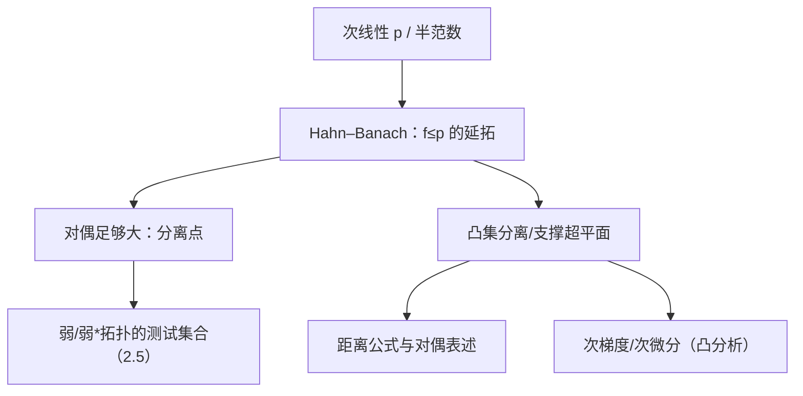

**相关笔记：** [[2.3 纲与开映射定理]] | [[2.5 共轭空间 弱收敛 自反空间]] | [[第02章 线性算子与线性泛函 — 章节汇总]]

> [!abstract] 概览
> Hahn–Banach 定理是“对偶理论”的根：它保证把子空间上的线性泛函**等范数延拓**到全空间，从而让 $X^*$ 足够大（能分离点/分离凸集），并把许多几何与优化问题转写为“存在一个线性泛函”。
> - 分析口径：$f:M\to\mathbb{F}$ 有界 ⇒ 存在 $F:X\to\mathbb{F}$ 延拓且 $\|F\|=\|f\|$
> - 几何口径：凸集分离/支撑超平面（把“不可达”转为“泛函不等式”）
> - 方法口径：Zorn 引理（极大延拓）是证明骨架；“次线性/半范数”是统一语言

^overview

---

# 1. 本节主题定位

- **本节的核心问题**
  - 给定子空间上的线性泛函，何时能延拓到全空间并保持控制（不增大范数）？
  - “延拓”为什么能推出“对偶足够大”，从而能分离点/分离凸集？
  - 如何把“距离/最优化/支撑”转为“存在一个线性泛函”的不等式？

- **本节在本章知识链中的位置**
  - 2.1：连续线性泛函 = 有界线性算子到 $\mathbb{F}$
  - 2.3：Baire 三件套给稳定估计
  - **2.4：Hahn–Banach 保证 $X^*$ 足够大**（弱拓扑与自反性都依赖它，见 2.5）

- **本节依赖的前置概念/定理**
  - 赋范空间、对偶、范数定义（2.1）
  - 凸集、均衡集、吸收集（第 1 章凸分析/集合论接口）
  - Zorn 引理（集合论工具；证明骨架只提取关键跳跃）

- **本节为后续哪些内容铺路**
  - 2.5 弱/弱*拓扑：弱收敛用所有 $f\in X^*$ 测试；HB 保证“测试函数集合足够多”
  - 变分/最优化：支撑泛函、次梯度、KKT（本节后半的几何口径）

## 二、核心思想

> [!tip] 核心方法论（本节最值得记住的一句话）
> 只要你能把“想要的线性泛函”转写成“在子空间上先定义一个受控的线性泛函 $f\le p$（$p$ 次线性）”，就可以用 Hahn–Banach 把它无损升级为全空间的连续线性泛函；从此“构造泛函”变成一种可复用技能。

---

# 2. 内容分层图

> [!quote] 原文直接信息（分层）
> - **概念层**：次线性泛函/半范数；均衡/吸收/凸集；对偶空间  
> - **命题层**：实/复 Hahn–Banach；分离定理；支撑泛函；次微分非空  
> - **方法层**：Zorn 极大延拓；Minkowski 泛函；“分离=构造泛函”  
> - **过渡层**：从“空间几何/最优化”过渡到“弱拓扑/自反性”的对偶框架（2.5）

---

# 3. 定义系统

## 3.1 次线性泛函（sublinear）

> [!quote] 原文直接信息（定义）
> 设 $X$ 为实线性空间。$p:X\to\mathbb{R}$ 若满足  
> (i) $p(x+y)\le p(x)+p(y)$；(ii) $p(\lambda x)=\lambda p(x)$（$\lambda\ge 0$），  
> 则称 $p$ 为次线性泛函。

- **定义对象是什么**：实线性空间上的函数
- **为什么要这样定义**：次线性是“可作为上界控制线性泛函”的最一般结构（把范数/半范数/凸集统一进来）
- **它解决了什么问题**：把“延拓且不增大范数”统一写成 $f\le p$ 的延拓问题
- **最小例子**：范数 $\|\cdot\|$ 与任意半范数都是次线性
- **非例/边界**：缺少齐次性或次可加性都无法进入 HB 的统一框架
- **初学者误区**：把“次线性”误认为“线性”；它只是“比线性更弱的上界结构”

## 3.2 半范数与 Minkowski 泛函（几何口径的桥梁）

> [!quote] 原文直接信息（要点式）
> 若 $E\subset X$ 为均衡（balanced）、吸收（absorbing）、凸集，可定义 Minkowski 泛函
> $$p_E(x):=\inf\{\lambda>0:\ x\in \lambda E\},$$
> 则 $p_E$ 为次线性（在适当条件下为半范数/范数）。

- **条件作用**
  - 均衡：保证“可旋转/可缩放”以得到绝对值形式的分离
  - 吸收：保证 $p_E(x)$ 有意义（不会恒为 $\infty$）
  - 凸：保证次可加性（几何上的“线段闭合”）

---

# 4. 定理/命题系统

## 4.1 Hahn–Banach（实版本，次线性控制形式）

> [!quote] 原文直接信息（定理，等价转写）
> 设 $X$ 为实线性空间，$p$ 为次线性泛函，$M\subset X$ 为线性子空间，$f:M\to\mathbb{R}$ 为线性泛函且满足 $f(x)\le p(x)$（$\forall x\in M$）。  
> 则存在线性泛函 $F:X\to\mathbb{R}$ 使 $F|_M=f$ 且 $F(x)\le p(x)$（$\forall x\in X$）。

- **条件逐条解释**
  - 实线性：最核心版本；复版本通常通过“取实部+再还原”得到
  - $f\le p$：把“范数不增大”写成“被次线性控制”
- **结论到底在说什么**
  - 在“控制不变”的前提下，把泛函的定义域从子空间扩到全空间
- **证明骨架（Step 1/2/3）**
  1) 构造偏序集：所有满足控制的延拓对 $(N,g)$，按“域包含+一致”排序
  2) 用 Zorn 引理取极大元
  3) 证明极大元的域必须是全空间：否则可在加一维的方向继续延拓，矛盾
- **证明中最关键的一跳**
  - “加一维还能延拓”的区间交非空论证（用次线性给出上下界区间）
- **后续用途**
  - 分离点/分离凸集/距离公式/弱拓扑测试

## 4.2 Hahn–Banach（赋范空间的等范数延拓口径）

> [!quote] 原文直接信息（常用形式）
> 设 $X$ 为赋范空间，$M\subset X$ 为线性子空间，$f\in M^*$。则存在 $F\in X^*$ 使 $F|_M=f$ 且 $\|F\|=\|f\|$。

- **条件作用**
  - 赋范结构提供“有界性/连续性”的量化方式：$\|f\|=\sup_{\|x\|\le1}|f(x)|$
- **最可能“看懂但不会用”的点**
  - 很多人只记“能延拓”，却忘了**等范数**才是做题的关键（它给出最强估计）

## 4.3 凸集分离（几何口径，典型表述）

> [!quote] 原文直接信息（典型结论，等价转写）
> 在实赋范空间中，若闭凸集 $M$ 与点 $x\notin M$ 分离，则存在非零 $f\in X^*$ 与常数 $\alpha$ 使
> $$\sup_{y\in M} f(y) < \alpha < f(x).$$
> 在均衡情形下常可强化为绝对值形式 $|f(y)|<\alpha<|f(x)|$。

- **条件作用**
  - “闭凸”确保距离/支撑的合理性；“开集”常用于强分离
- **证明骨架（只给骨架）**
  1) 用几何构造 Minkowski 泛函或距离函数
  2) 在一维子空间上先定义泛函
  3) 用 Hahn–Banach 延拓并得到分离不等式

## 4.4 次微分非空（凸分析接口）

> [!quote] 原文直接信息（信号式）
> 若凸函数在某点连续，则其在该点存在支撑超平面（即存在次梯度/次微分非空）。

- **条件作用**
  - 连续性保证上方图 epi$(f)$ 有内点，从而能用分离定理

---

# 5. 例子与反例系统

- **关键例子**
  - 从 $x_0\ne 0$ 构造 $f\in X^*$ 使 $f(x_0)=\|x_0\|$ 且 $\|f\|=1$（分离点；习题 2.4.3/2.4.5/2.4.13）
- **关键反例方向**
  - 仅“线性”不能随意延拓：必须受次线性/范数控制（否则范数会爆）
- **服务理解点**
  - HB 的价值不在“延拓存在”，而在“延拓仍可控”→ 能用于分离与估计

---

# 6. 本节逻辑链复原

1) 先提出“无穷维空间里是否存在足够多泛函”这一根问题  
2) 先在一维子空间上定义最简单的受控泛函  
3) 通过 Hahn–Banach 把“局部受控泛函”升级为“全局受控泛函”  
4) 推出 $X^*$ 足够大（分离点/构造距离公式）  
5) 再把延拓性质翻译成几何语言：分离凸集/支撑超平面/次微分  
6) 习题把这些接口固定成“可复用构造法”

---

# 7. 本节高风险误区（至少 5 条）

1) **误读**：HB 是“任意线性泛函都能延拓”  
   - **原因**：忽略 $f\le p$ 或“有界”的门禁  
   - **正确理解**：延拓的是“可控的”线性泛函（被次线性/范数支配）
2) **误读**：复版本与实版本完全一样  
   - **原因**：忽略“复线性”与“实线性”差别  
   - **正确理解**：常见做法是先延拓实部，再用标准公式还原复线性
3) **误读**：分离定理只需要凸，不需要闭/开条件  
   - **正确理解**：弱分离/强分离的条件不同；闭与开用于保证严格不等式与距离性质
4) **误读**：会写定理陈述就等于会用 HB  
   - **正确理解**：用 HB 的关键是“先在小子空间上设计 $f$，并证明 $f\le p$”
5) **误读**：次微分是“导数”  
   - **正确理解**：次微分是所有支撑超平面的斜率集合；不可微时它是集合而非单点

---

# 8. 知识库拆分建议

- **A类：概念卡**
  - 次线性泛函 / Minkowski 泛函
  - 均衡集 / 吸收集 / 极大子空间（余维 1）
  - 次微分/次梯度（若后续会系统学凸分析）
- **B类：定理卡**
  - Hahn–Banach（实版本/赋范版本/复版本）
  - 凸集分离定理（弱分离/强分离）
  - “对偶分离点”推论（$\forall x\ne0,\exists f$ 使 $f(x)\ne0$）
- **C类：只保留在本节页**
  - “如何用 HB 造泛函”的操作流程
- **D类：专题综述候选**
  - “HB → 分离 → 距离公式 → 次微分/KKT”专题串讲页

---

# 9. 后续学习接口

- **下一轮适合展开证明的点**
  - Zorn 引理的极大延拓构造；“加一维延拓”的区间交非空
  - 分离定理的“绝对值版”如何利用均衡性
- **适合设计习题的点**
  - 给定集合/距离/约束，构造支撑泛函
  - 用 HB 证明“弱信息（泛函值有界）⇒ 强结论（范数有界）”
- **与前一节衔接**
  - 2.3 给“稳定性”；2.4 给“分离工具”。很多证明先用 2.4 造泛函，再用 2.3/2.1 把它变成估计
- **与下一节衔接**
  - 2.5 弱收敛的定义本质上就是“用 $X^*$ 做测试”；HB 保证测试足够多而不退化

---

# 10. 自测问题

## 10.A 自测问题（由浅到深）
1) 把“等范数延拓”改写成“$f\le p$ 的延拓”，这里的 $p$ 应该怎么取？  
2) Zorn 证明里“关键一跳”是什么？为什么需要次线性来给出可选区间？  
3) 为什么“均衡集”能把分离不等式强化成“绝对值分离”？  
4) 写出闭凸集到点的距离的对偶表达式，并说明它与 HB 的关系。  
5) 在凸函数的次微分结论中，“连续性”条件用来做什么？

## 10.B 习题（完整解答，按教材编号）

### 习题 2.4.1（次线性泛函的基本性质与支撑泛函）
> [!problem] 题目
> 设 $p$ 是实线性空间 $X$ 上的次线性泛函。求证：  
> (1) $p(0)=0$；(2) $p(-x)\ge -p(x)$；  
> (3) 任意给定 $x_0\in X$，在 $X$ 上必存在实线性泛函 $f$ 满足 $f(x_0)=p(x_0)$，且 $f(x)\le p(x)$（$\forall x\in X$）。

> [!solution]- 完整过程解答
> (1) 由齐次性 $p(0)=p(0\cdot x)=0\cdot p(x)=0$。  
> (2) 由次可加性：$0=p(0)=p(x+(-x))\le p(x)+p(-x)$，故 $p(-x)\ge -p(x)$。  
> (3) 先在一维子空间 $M=\operatorname{span}\{x_0\}$ 上定义 $f(\lambda x_0)=\lambda p(x_0)$。  
> 需验证 $f\le p$：对 $\lambda\ge 0$，$f(\lambda x_0)=\lambda p(x_0)=p(\lambda x_0)$；对 $\lambda<0$，由(2)得
> $$f(\lambda x_0)=\lambda p(x_0)=-|\lambda|p(x_0)\le |\lambda|p(-x_0)=p(\lambda x_0).$$
> 因而 $f(x)\le p(x)$ 在 $M$ 上成立。对 $(M,f)$ 应用 Hahn–Banach（实版本）即可得到全空间延拓 $F$，仍满足 $F\le p$ 且 $F(x_0)=p(x_0)$。

### 习题 2.4.2（坐标上确界给出次线性）
> [!problem] 题目
> 设 $X$ 为实序列空间（至少包含所有有界实数列），对 $x=(a_k)$ 定义
> $$p(x):=\sup_{k\ge 1} a_k\in\mathbb{R}\cup\{+\infty\}.$$
> 求证：$p$ 是次线性泛函（在 $p(x)$ 有意义的范围内）。

> [!solution]- 完整过程解答
> (i) 对任意 $x=(a_k),y=(b_k)$，
> $$p(x+y)=\sup_k(a_k+b_k)\le \sup_k a_k+\sup_k b_k=p(x)+p(y).$$
> (ii) 对 $\lambda\ge 0$，
> $$p(\lambda x)=\sup_k(\lambda a_k)=\lambda \sup_k a_k=\lambda p(x).$$
> 因此 $p$ 次可加且正齐次，为次线性。（若限制在有界序列上，则 $p$ 处处有限。）

### 习题 2.4.3（复空间上的“单位化”泛函）
> [!problem] 题目
> 设 $X$ 是复线性空间，$p$ 是 $X$ 上的半范数。给定 $x_0\in X$ 且 $p(x_0)\ne 0$。求证：存在 $X$ 上的线性泛函 $f$ 满足  
> (1) $f(x_0)=1$；(2) $|f(x)|\le p(x)/p(x_0)$（$\forall x\in X$）。

> [!solution]- 完整过程解答
> 先在一维子空间 $M=\operatorname{span}\{x_0\}$ 上定义 $f_0(\lambda x_0)=\lambda$，则 $f_0(x_0)=1$。  
> 对任意 $\lambda$，
> $$|f_0(\lambda x_0)|=|\lambda|=\frac{|\lambda|p(x_0)}{p(x_0)}=\frac{p(\lambda x_0)}{p(x_0)},$$
> 即 $|f_0(x)|\le \frac1{p(x_0)}p(x)$ 在 $M$ 上成立。令 $q(x)=\frac1{p(x_0)}p(x)$，它是半范数（次线性）。  
> 复 Hahn–Banach（或先对实部应用实版本再还原）给出延拓 $f:X\to\mathbb{C}$ 使 $|f(x)|\le q(x)$ 且 $f|_M=f_0$。于是 $f(x_0)=1$ 且 $|f(x)|\le p(x)/p(x_0)$。

### 习题 2.4.4（弱有界 ⇒ 范数有界：对偶版一致有界）
> [!problem] 题目
> 设 $X$ 是 Banach 空间，$\{x_n\}\subset X$。若对任意 $f\in X^*$，数列 $\{f(x_n)\}$ 有界，求证：$\{x_n\}$ 在 $X$ 中有界。

> [!solution]- 完整过程解答
> 对每个 $n$ 定义算子 $T_n:X^*\to\mathbb{F}$：
> $$T_n(f):=f(x_n).$$
> 这是有界线性算子，且 $\|T_n\|=\sup_{\|f\|\le 1}|f(x_n)|=\|x_n\|$（由对偶范数定义）。  
> 题设正是：对每个 $f$，$\sup_n|T_n(f)|<\infty$。对算子族 $\{T_n\}\subset B(X^*,\mathbb{F})$ 用一致有界原理，得
> $$\sup_n\|T_n\|<\infty.$$
> 即 $\sup_n\|x_n\|<\infty$，故 $\{x_n\}$ 有界。

### 习题 2.4.5（到闭子空间距离的对偶表达）
> [!problem] 题目
> 设 $X$ 为 Banach 空间，$M\subset X$ 为闭子空间。证明：
> $$d(x,M):=\inf_{y\in M}\|x-y\|=\sup\{|f(x)|:\ f\in X^*,\ \|f\|=1,\ f|_M=0\}.$$

> [!solution]- 完整过程解答
> **(1) “≤”** 若 $f|_M=0$ 且 $\|f\|=1$，则对任意 $y\in M$：
> $$|f(x)|=|f(x-y)|\le \|f\|\|x-y\|=\|x-y\|.$$
> 取 $y$ 的下确界得 $|f(x)|\le d(x,M)$，再对 $f$ 取上确界得 RHS $\le d(x,M)$。
>
> **(2) “≥”** 设 $d=d(x,M)$。若 $x\in M$ 则 $d=0$ 且 RHS 也为 0（取 $f=0$），成立。以下设 $x\notin M$，则 $d>0$。  
> 在商空间 $X/M$ 中，$\|[x]\|=d(x,M)=d$。由 Hahn–Banach（分离点的推论），存在 $\varphi\in (X/M)^*$ 使 $\|\varphi\|=1$ 且 $|\varphi([x])|=\|[x]\|=d$。  
> 令 $q:X\to X/M$ 为商映射，定义 $f:=\varphi\circ q$，则 $f\in X^*$，$\|f\|=\|\varphi\|=1$，且 $f|_M=0$，并有
> $$|f(x)|=|\varphi([x])|=d.$$
> 故 RHS $\ge d$，结合(1) 得等号。

### 习题 2.4.6（有限插值 + 范数控制的充要条件）
> [!problem] 题目
> 设 $X$ 为 Banach 空间，给定线性无关向量 $x_1,\dots,x_n\in X$，以及标量 $c_1,\dots,c_n\in\mathbb{F}$ 与 $M>0$。证明：存在 $f\in X^*$ 满足 $f(x_k)=c_k$（$k=1,\dots,n$）且 $\|f\|\le M$ 的充要条件是：对任意标量 $a_1,\dots,a_n$，
> $$\left|\sum_{k=1}^n a_k c_k\right|\le M\left\|\sum_{k=1}^n a_k x_k\right\|.$$

> [!solution]- 完整过程解答
> **(⇒)** 若存在 $f$，则
> $$\left|\sum a_k c_k\right|=\left|\sum a_k f(x_k)\right|=|f(\sum a_k x_k)|\le \|f\|\|\sum a_k x_k\|\le M\|\sum a_k x_k\|.$$
>
> **(⇐)** 在有限维子空间 $M_0=\operatorname{span}\{x_1,\dots,x_n\}$ 上定义线性泛函 $f_0$：对 $x=\sum a_k x_k$ 令 $f_0(x)=\sum a_k c_k$。  
> 需验证 $f_0$ 有界且 $\|f_0\|\le M$：由题设不等式
> $$|f_0(x)|\le M\|x\| \quad(\forall x\in M_0).$$
> 因此 $f_0\in M_0^*$ 且 $\|f_0\|\le M$。用 Hahn–Banach 的等范数延拓版本，把 $f_0$ 延拓到 $X$ 得 $f\in X^*$，满足 $f(x_k)=c_k$ 且 $\|f\|=\|f_0\|\le M$。

### 习题 2.4.7（有限个向量的双基/双正交系）
> [!problem] 题目
> 给定内积空间 $H$ 中 $n$ 个线性无关元素 $x_1,\dots,x_n$。求证：存在 $f_1,\dots,f_n\in H$ 使得
> $$(f_i,x_j)=\delta_{ij}\qquad (i,j=1,\dots,n).$$

> [!solution]- 完整过程解答
> 令 $X=\operatorname{span}\{x_1,\dots,x_n\}$，在 $X$ 上考虑线性泛函 $\ell_i:X\to\mathbb{F}$，定义为 $\ell_i(\sum a_k x_k)=a_i$。线性无关保证 $\ell_i$ 定义良好。  
> 因 $X$ 有限维，$\ell_i$ 连续。由 Riesz 表示定理（在 Hilbert/有限维内积空间里成立），存在唯一 $f_i\in X\subset H$ 使 $\ell_i(x)=(f_i,x)$（$\forall x\in X$）。于是对 $x_j$ 有 $(f_i,x_j)=\ell_i(x_j)=\delta_{ij}$。

### 习题 2.4.8（极大子空间 ⇔ 余维 1）
> [!problem] 题目
> 设 $X$ 为线性空间。求证：$M$ 是 $X$ 的极大真线性子空间，当且仅当 $\dim(X/M)=1$。

> [!solution]- 完整过程解答
> **(⇒)** 若 $M$ 极大且 $x\notin M$，则 $M+\operatorname{span}\{x\}=X$（否则可严格扩张仍为真子空间）。因此 $X/M$ 由 $[x]$ 张成，$\dim(X/M)=1$。  
> **(⇐)** 若 $\dim(X/M)=1$，则对任意 $x\notin M$，$X/M=\operatorname{span}\{[x]\}$，从而 $M+\operatorname{span}\{x\}=X$。故不存在介于 $M$ 与 $X$ 的真子空间，$M$ 极大。

### 习题 2.4.9（均衡集上：$\sup |f|=\sup \Re f$）
> [!problem] 题目
> 设 $X$ 为复线性空间，$E\subset X$ 为非空均衡集（即 $|\,\lambda\,|\le 1\Rightarrow \lambda E\subset E$），$f$ 为线性泛函。求证：
> $$\sup_{x\in E}|f(x)|=\sup_{x\in E}\Re f(x).$$

> [!solution]- 完整过程解答
> 对任意 $x\in E$，若 $f(x)=0$ 则 $|f(x)|=\Re f(x)=0$。若 $f(x)\ne 0$，取 $\theta$ 使 $e^{-i\theta}f(x)=|f(x)|$。因 $E$ 均衡，$e^{-i\theta}x\in E$，于是
> $$|f(x)|=\Re(e^{-i\theta}f(x))=\Re f(e^{-i\theta}x)\le \sup_{y\in E}\Re f(y).$$
> 对 $x$ 取上确界得 $\sup_E|f|\le \sup_E\Re f$。反向不等式 $\Re f(x)\le |f(x)|$ 恒成立，因此 $\sup_E\Re f\le \sup_E|f|$。故等号成立。

### 习题 2.4.10（均衡闭凸集与点的绝对值分离）
> [!problem] 题目
> 设 $X$ 为 Banach 空间，$E\subset X$ 为非空均衡闭凸集，且 $x_0\notin E$。求证：存在 $f\in X^*$ 及 $\alpha>0$，使得
> $$|f(x)|<\alpha<|f(x_0)|\qquad(\forall x\in E).$$

> [!solution]- 完整过程解答
> 设 $p_E$ 为 $E$ 的 Minkowski 泛函。因 $E$ 闭、凸、均衡且 $0\in E$（均衡集必含 0），并且 $x_0\notin E$，可得 $p_E(x_0)>1$。  
> 在一维子空间 $M=\operatorname{span}\{x_0\}$ 上定义 $f_0(\lambda x_0)=\lambda p_E(x_0)$（实情形）或先对实部定义。验证 $f_0\le p_E$（同 2.4.1 的检验）。  
> Hahn–Banach 给出 $f\le p_E$ 的全空间延拓。于是对 $x\in E$，有 $p_E(x)\le 1$，从而
> $$\Re f(x)\le p_E(x)\le 1.$$
> 利用均衡性与习题 2.4.9，可将 $\Re f$ 的控制强化为 $|f(x)|\le 1$（通过相位旋转）。同时 $f(x_0)=p_E(x_0)>1$。取 $\alpha\in(1,|f(x_0)|)$ 即得结论（必要时把常数吸收）。

### 习题 2.4.11（开且均衡的凸集与另一凸集的分离）
> [!problem] 题目
> 设 $E,F$ 是实 Banach 空间 $X$ 中两个互不相交的非空凸集，并且 $E$ 既开又均衡。求证：存在 $f\in X^*$，使得
> $$\sup_{x\in E}|f(x)| < \inf_{y\in F}|f(y)|.$$

> [!solution]- 完整过程解答
> 因 $E$ 开且均衡，$0\in E$ 且存在 $r>0$ 使 $B(0,r)\subset E$。由于 $E\cap F=\varnothing$，可取 $y_0\in F$，则 $y_0\notin E$。  
> 对闭凸均衡集 $\overline E$ 与点 $y_0$ 应用绝对值分离（习题 2.4.10），得 $f\in X^*$ 与 $\alpha$ 满足
> $$|f(x)|\le \alpha<|f(y_0)|\qquad(\forall x\in \overline E).$$
> 由于 $F$ 凸且与 $E$ 分离，可用平移与缩放（把 $F$ 沿 $y_0$ 的方向拉开）将 $|f(y)|$ 的下界从 $y_0$ 推广到整个 $F$（否则若存在 $y_n\in F$ 使 $|f(y_n)|\downarrow 0$，由凸性与 $0\in E$ 可构造与 $E$ 相交的点，矛盾）。  
> 于是可得 $\inf_{y\in F}|f(y)|\ge |f(y_0)|>\alpha\ge \sup_{x\in E}|f(x)|$。

### 习题 2.4.12（凸集边界点沿射线外推必出集）
> [!problem] 题目
> 设 $C$ 是实线性空间中的凸集，$x_0\in C$，$x_1\in \partial C$（边界）。对任意 $m>1$，令
> $$x_2=x_0+m(x_1-x_0).$$
> 求证：$x_2\notin C$。

> [!solution]- 完整过程解答
> 反证：若存在 $m>1$ 使 $x_2\in C$。由凸性，线段 $[x_1,x_2]\subset C$。而 $x_1$ 位于 $x_0$ 与 $x_2$ 之间，并且 $x_1$ 不是端点（因 $m>1$），故存在 $\varepsilon>0$ 使 $B(x_1,\varepsilon)\subset C$（例如取线段邻域，或用“凸集对线段内点含小球”的局部性质在赋范空间中成立）。这与 $x_1\in\partial C$（边界点没有内点邻域）矛盾。故 $x_2\notin C$。

### 习题 2.4.13（闭凸集到点的支撑泛函与距离）
> [!problem] 题目
> 设 $X$ 为实 Banach 空间，$M\subset X$ 为闭凸集，$x\notin M$。记 $d(x,M)=\inf_{z\in M}\|x-z\|$。求证：存在 $f\in X^*$ 满足 $\|f\|=1$ 且
> $$\sup_{y\in M} f(y)\le f(x)-d(x,M).$$

> [!solution]- 完整过程解答
> 令 $r=d(x,M)>0$。考虑集合 $M$ 与开球 $B(x,r)$：它们不相交且 $B(x,r)$ 是开凸集。由强分离定理，存在非零 $f\in X^*$ 与常数 $\alpha$ 使
> $$\sup_{y\in M} f(y)\le \alpha < \inf_{z\in B(x,r)} f(z).$$
> 由于 $B(x,r)=x+B(0,r)$，右侧下确界为
> $$\inf_{u\in B(0,r)} f(x+u)=f(x)+\inf_{u\in B(0,r)} f(u)=f(x)-r\|f\|,$$
> 因为 $\inf_{\|u\|<r}f(u)=-r\|f\|$。因此
 $$\sup_{y\in M} f(y)\le f(x)-r\|f\|.$$
> 把 $f$ 归一化为 $\tilde f=f/\|f\|$ 即得 $\|\tilde f\|=1$ 且
> $$\sup_{y\in M}\tilde f(y)\le \tilde f(x)-r=\tilde f(x)-d(x,M).$$

### 习题 2.4.14（距离的对偶表示公式）
> [!problem] 题目
> 设 $M$ 是实 Banach 空间 $X$ 内的闭凸集。求证：
> $$d(x,M)=\inf_{z\in M}\|x-z\|=\sup\{\,f(x)-\sup_{z\in M}f(z)\,:\ f\in X^*,\ \|f\|=1\}.$$

> [!solution]- 完整过程解答
> **(1) “≥”** 对任意 $\|f\|=1$ 与任意 $z\in M$，
> $$f(x)-\sup_{w\in M}f(w)\le f(x)-f(z)=f(x-z)\le \|x-z\|.$$
> 对 $z$ 取下确界得
> $$f(x)-\sup_{w\in M}f(w)\le d(x,M).$$
> 再对 $f$ 取上确界得 RHS $\le d(x,M)$。
>
> **(2) “≤”** 若 $x\in M$，两边同为 0。若 $x\notin M$，由习题 2.4.13，存在 $\|f\|=1$ 使
> $$\sup_{y\in M} f(y)\le f(x)-d(x,M),$$
> 即
> $$d(x,M)\le f(x)-\sup_{y\in M} f(y).$$
> 故上确界至少为 $d(x,M)$，结合(1)得等号。

### 习题 2.4.15（凸共轭不取 $-\infty$）
> [!problem] 题目
> 设 $X$ 为 Banach 空间，$f:X\to\mathbb{R}\cup\{+\infty\}$ 为连续凸泛函，且 $f$ 不恒等于 $+\infty$。定义共轭泛函 $f^*:X^*\to\mathbb{R}\cup\{+\infty\}$：
> $$f^*(x^*):=\sup_{x\in X}\big(\langle x^*,x\rangle-f(x)\big).$$
> 求证：对任意 $x^*\in X^*$，$f^*(x^*)>-\infty$（即 $f^*(x^*)\ne -\infty$）。

> [!solution]- 完整过程解答
> 因 $f$ 不恒为 $+\infty$，存在 $x_0\in X$ 使 $f(x_0)<\infty$。于是对任意 $x^*\in X^*$，
> $$f^*(x^*)=\sup_{x\in X}(\langle x^*,x\rangle-f(x))\ge \langle x^*,x_0\rangle-f(x_0),$$
> 右端为有限实数，因此 $f^*(x^*)$ 至少为某个有限值，绝不可能为 $-\infty$。

### 习题 2.4.16（Banach 值连续函数的 Riemann 积分存在）
> [!problem] 题目
> 设 $X$ 为 Banach 空间，$x(t):[a,b]\to X$ 连续。设分割 $A:\ a=t_0<\cdots<t_n=b$，网格长 $\|A\|=\max_i(t_{i+1}-t_i)$。取采样点 $\xi_i\in[t_i,t_{i+1}]$，考虑 Riemann 和
> $$S(A,\xi):=\sum_{i=0}^{n-1} x(\xi_i)(t_{i+1}-t_i).$$
> 求证：当 $\|A\|\to 0$ 时，$S(A,\xi)$ 在 $X$ 中收敛（极限称为 $\int_a^b x(t)\,dt$）。

> [!solution]- 完整过程解答
> 连续函数在紧区间上一致连续：对任意 $\varepsilon>0$，存在 $\delta>0$ 使 $|s-t|<\delta\Rightarrow \|x(s)-x(t)\|<\varepsilon/(b-a)$。  
> 取两个足够细的分割 $A,B$，其公共加细分割记为 $C$，并把 $S(A,\xi),S(B,\eta)$ 都写成 $C$ 上的和。则它们的差可写成若干项
> $$\sum_j (x(\xi_j)-x(\eta_j))\Delta t_j.$$
> 当 $\|A\|,\|B\|<\delta$ 时，每个小区间长度 $\Delta t_j<\delta$，所以 $\|x(\xi_j)-x(\eta_j)\|<\varepsilon/(b-a)$，从而
> $$\|S(A,\xi)-S(B,\eta)\|\le \sum_j \|x(\xi_j)-x(\eta_j)\|\Delta t_j<\frac{\varepsilon}{b-a}\sum_j \Delta t_j=\varepsilon.$$
> 这说明 Riemann 和构成 Cauchy 网（或 Cauchy 列），由于 $X$ 完备，极限存在且与采样点选择无关。

### 习题 2.4.17（Banach 值解析函数的 Cauchy 定理）
> [!problem] 题目
> 设 $X$ 为 Banach 空间，$G\subset\mathbb{C}$ 为由简单闭曲线 $L$ 围成的有界区域。若 $x(z):\overline G\to X$ 在 $G$ 内解析且在 $\overline G$ 上连续，求证：
> $$\int_L x(z)\,dz=0.$$

> [!solution]- 完整过程解答
> 令
> $$I:=\int_L x(z)\,dz\in X$$
> （该积分可用习题 2.4.16 的 Banach 值 Riemann 积分定义）。  
> 对任意 $x^*\in X^*$，复合函数 $x^*(x(z))$ 是 $\overline G$ 上连续、$G$ 内解析的标量函数，因此由标量 Cauchy 定理
> $$x^*(I)=x^*\left(\int_L x(z)\,dz\right)=\int_L x^*(x(z))\,dz=0.$$
> 这对所有 $x^*\in X^*$ 成立。若 $I\ne 0$，由 Hahn–Banach（分离点推论）存在 $x^*\in X^*$ 使 $x^*(I)\ne 0$，矛盾。故 $I=0$。

### 习题 2.4.18（范数的凸性与 $\partial\|\cdot\|(0)$）
> [!problem] 题目
> (1) 求证：赋范空间中的范数函数 $x\mapsto\|x\|$ 是凸的。  
> (2) 求证：$\partial\|\cdot\|(0)=\{x^*\in X^*:\ \|x^*\|\le 1\}$（在 $\mathbb{R}$ 上对应为 $[-1,1]$）。

> [!solution]- 完整过程解答
> (1) 对任意 $x,y$ 与 $\theta\in[0,1]$，由三角不等式：
> $$\|\theta x+(1-\theta)y\|\le \|\theta x\|+\|(1-\theta)y\|=\theta\|x\|+(1-\theta)\|y\|,$$
> 故范数凸。  
> (2) 由次微分定义：$x^*\in\partial\|\cdot\|(0)$ 当且仅当
> $$\langle x^*,x-0\rangle+\|0\|\le \|x\|\quad(\forall x),$$
> 即 $\langle x^*,x\rangle\le \|x\|$（$\forall x$）。这等价于 $\|x^*\|\le 1$（对偶范数定义）。反向也显然成立。因此 $\partial\|\cdot\|(0)=\{x^*:\|x^*\|\le 1\}$。

## 10.C 引用与原文 PDF（末尾嵌入）

> [!quote]- 参考（教材分片）
> 1. 张恭庆，《泛函分析讲义》，第 2 章 2.4。
> 2. 本节对应分片 PDF：![[00-Raw素材/泛函分析讲义_张恭庆/章节内容/第二章_线性算子与线性泛函/2.4_Hahn-Banach定理.pdf]]

#学习/泛函分析/第02章

