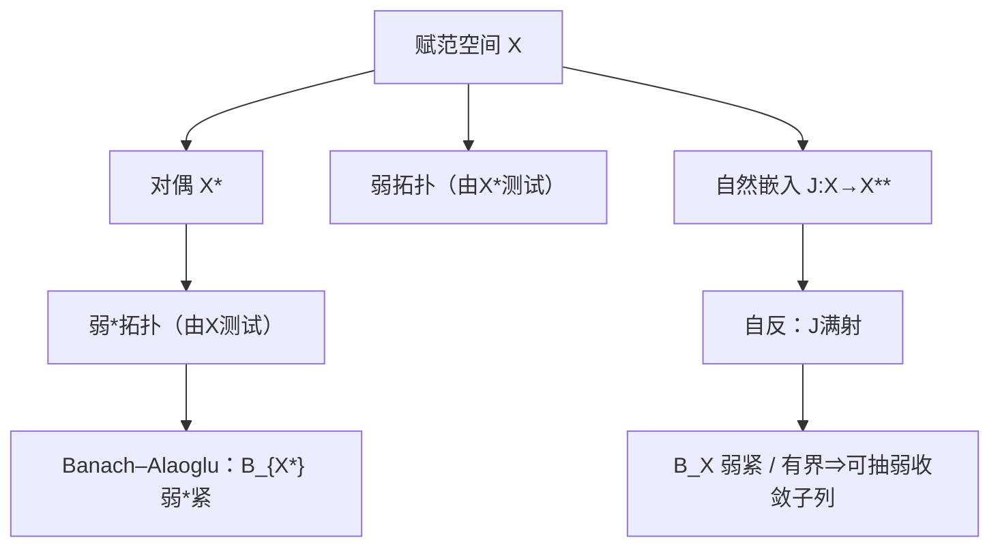

**相关笔记：** [[2.4 Hahn-Banach定理]] | [[2.6 线性算子的谱]] | [[第02章 线性算子与线性泛函 — 章节汇总]]

> [!abstract] 概览
> 本节把 $X^*$（连续线性泛函全体）作为新的观察窗口，引入 **弱拓扑** 与 **弱\*拓扑**：用“所有（或部分）连续线性泛函的取值”来定义收敛。弱/弱\*收敛更容易提供紧性（Banach–Alaoglu：对偶单位球弱\*紧），从而成为存在性与极限过程中的主力工具；而 **自反性** 则保证“有界 ⇒ 弱紧（或弱列紧）”。
> - 语言：自然嵌入 $J:X\to X^{**}$；自反 $\Leftrightarrow J$ 满射
> - 收敛：$x_n\rightharpoonup x$ 用 $X^*$ 测试；$f_n\overset{w^*}{\to}f$ 用 $X$ 测试
> - 工具：Banach–Alaoglu（弱\*紧性）+ 自反空间的弱紧性刻画

^overview

---

# 1. 本节主题定位

- **本节的核心问题**
  - 对偶空间 $X^*$ 到底是什么？怎样在上面引入自然的拓扑？
  - 为什么“弱收敛”要用所有 $f\in X^*$ 来测试？（这依赖 2.4 保证 $X^*$ 足够大）
  - 弱收敛与范数收敛有什么关系？哪些性质保留、哪些不保留？
  - 什么是自反空间？它为什么能把“有界”升级为“弱紧/可抽弱收敛子列”？

- **本节在本章知识链中的位置**
  - 2.4：Hahn–Banach 保证 $X^*$ 足够大（弱拓扑不退化）
  - 2.5：用弱/弱\*拓扑提供紧性与极限工具
  - 2.6：谱论中常需弱极限/对偶测试（例如紧性与极限交换的判断）

- **本节依赖的前置概念/定理**
  - 对偶与范数：$\|f\|=\sup_{\|x\|\le 1}|f(x)|$
  - Hahn–Banach：分离点/闭凸集弱闭（2.4）
  - Baire 三件套：闭图像定理（后续习题中会用到）

- **本节为后续哪些内容铺路**
  - 变分法：有界序列抽取弱收敛子列、弱下半连续
  - 自伴算子/谱理论：弱收敛与内积测试在 Hilbert 情形尤为直观

## 二、核心思想

> [!tip] 核心方法论（本节最值得记住的一句话）
> 弱收敛是“对偶测试的逐点收敛”：它牺牲了范数收敛的强度，却换来了紧性；在自反空间里，==有界序列就能抽出弱收敛子列==，这是很多存在性证明的收尾钥匙。

---

# 2. 内容分层图

> [!quote] 原文直接信息（分层）
> - **概念层**：对偶 $X^*$、双对偶 $X^{**}$、自然嵌入 $J$；弱/弱\*拓扑  
> - **命题层**：Banach–Alaoglu；自反性刻画；弱收敛的基本性质（下半连续等）  
> - **方法层**：用 Hahn–Banach 分离得到弱闭；用“对偶测试”处理极限；用弱紧性找极限点  
> - **过渡层**：把“点列/极限过程”变成“泛函值极限”，为后续存在性与谱论提供工具

---

# 3. 定义系统

## 3.1 对偶空间与对偶范数

> [!quote] 原文直接信息（定义）
> $X^*:=\{f:X\to\mathbb{F}:\ f\ \text{线性且连续}\}$，并定义
> $$\|f\|:=\sup_{\|x\|\le 1}|f(x)|.$$

- **条件作用**
  - “连续/有界”是同义（对线性泛函），使对偶成为 Banach 空间
- **最小例子**
  - $X=\mathbb{R}^n$ 时 $X^*$ 与 $X$ 同维，可用内积识别
  - Hilbert 情形：$H^*\cong H$（2.2）
- **初学者误区**
  - 把“所有线性泛函”当成 $X^*$：一般线性泛函可能不连续

## 3.2 自然嵌入 $J:X\to X^{**}$ 与自反

> [!quote] 原文直接信息（定义）
> 定义 $J(x)\in X^{**}$ 为
> $$J(x)(f)=f(x)\qquad(\forall f\in X^*).$$
> $J$ 是等距线性嵌入。若 $J$ 还是满射，则称 $X$ **自反**。

- **为什么要这样定义**
  - $X^{**}$ 总是 Banach；把 $X$ 放进一个“更完备的容器”以研究其几何/紧性
- **条件作用**
  - “满射”是自反的核心：说明 $X$ 没有在双对偶里“缺失的方向”

## 3.3 弱收敛与弱\*收敛

> [!quote] 原文直接信息（定义）
> - $x_n\rightharpoonup x$（弱收敛）指：$\forall f\in X^*$，$f(x_n)\to f(x)$。  
> - $f_n\overset{w^*}{\longrightarrow} f$（弱\*收敛，发生在 $X^*$）指：$\forall x\in X$，$f_n(x)\to f(x)$。

- **最小例子**
  - Hilbert 中 $x_n\rightharpoonup x \iff \langle x_n,e\rangle\to \langle x,e\rangle$（对所有 $e$）
- **边界/非例**
  - 弱收敛一般不推出范数收敛（典型：正交规范列 $e_n\rightharpoonup 0$ 但 $\|e_n\|=1$）

---

# 4. 定理/命题系统

## 4.1 Banach–Alaoglu（弱\*紧性）

> [!quote] 原文直接信息（定理）
> 对任意赋范空间 $X$，$X^*$ 的闭单位球在弱\*拓扑下紧。

- **条件作用**
  - 不要求 $X$ 自反；紧性发生在 $X^*$ 的弱\*拓扑
- **结论在说什么**
  - 只要 $\{f_n\}$ 在对偶范数下有界，就可抽出弱\*收敛子列/子网
- **证明骨架（仅骨架）**
  1) 把 $X^*$ 单位球嵌入到积空间 $\prod_{x\in X} \overline{D}(0,\|x\|)$
  2) 用 Tychonoff 定理得积空间紧
  3) 验证像是闭集，从而紧

## 4.2 自反空间的典型刻画（弱紧性）

> [!quote] 原文直接信息（信号式）
> 在 Banach 空间中：$X$ 自反 $\Rightarrow$ $B_X$ 在弱拓扑下紧（进一步得到“有界序列可抽弱收敛子列”，需配合 Eberlein–Šmulian）。

- **条件作用**
  - “自反”把 $X$ 与 $X^{**}$ 对齐，从而可把 Banach–Alaoglu 的弱\*紧性拉回到 $X$

## 4.3 弱收敛的基本性质（做题按钮）

> [!quote] 原文直接信息（常用事实）
> - 范数收敛 $\Rightarrow$ 弱收敛  
> - 若 $x_n\rightharpoonup x$，则 $\{\|x_n\|\}$ 有界，且 $\|x\|\le \liminf\|x_n\|$（范数弱下半连续）  
> - 闭凸集在弱拓扑下闭（2.4 的分离工具）

---

# 5. 例子与反例系统

- **关键反例（最常用）**：Hilbert 中正交规范列 $e_n\rightharpoonup 0$ 但不强收敛（习题 2.5.18）
- **关键例子（把抽象变可算）**
  - $\ell^p$ 的对偶：$(\ell^p)^*=\ell^q$（$1<p<\infty$），让“弱收敛=坐标测试”可计算（习题 2.5.1/2.5.15）
- **服务理解点**
  - 弱拓扑的威力来自：对偶测试 + 紧性（Alaoglu/自反）

---

# 6. 本节逻辑链复原

1) 先把 $X^*$ 引入并赋范：使其成为可分析对象  
2) 再把“收敛”改写成“泛函取值收敛”定义弱/弱\*拓扑  
3) 用 Banach–Alaoglu 给出弱\*紧性（从而能抽取极限）  
4) 引入自然嵌入与自反：把弱\*紧性拉回 $X$ 的弱紧性  
5) 给出弱收敛的基本性质与常用判别/反例  
6) 习题把：对偶识别、伴随算子、弱下半连续、极值存在等接口全部固化

---

# 7. 本节高风险误区（至少 5 条）

1) **误读**：弱收敛就是范数收敛  
   - **正确理解**：范数收敛 ⇒ 弱收敛；反之一般不成立（2.5.18）
2) **误读**：弱\*收敛 = 弱收敛  
   - **正确理解**：弱\*在 $X^*$ 上只用 $X$ 测试；弱拓扑用 $X^{**}$ 测试，通常更强
3) **误读**：有界序列总能抽弱收敛子列  
   - **正确理解**：需要自反（或在对偶空间用弱\*，见 Alaoglu）
4) **误读**：闭集一定弱闭  
   - **正确理解**：一般“范数闭”不推出“弱闭”；但**闭凸集**弱闭（2.5.21）
5) **误读**：只要 $f(x_n)\to f(x)$ 对“很多” $f$ 成立就够了  
   - **正确理解**：必须明确“测试集合是谁”（$X^*$ 还是某个生成子集），否则结论不稳

---

# 8. 知识库拆分建议

- **A类：概念卡**
  - [[共轭空间]]、[[自然嵌入]]、[[自反空间]]、[[弱收敛]]、[[弱*收敛]]
- **B类：定理卡**
  - [[Banach-Alaoglu定理]]、（自反⇔弱紧的刻画）、弱下半连续
- **C类：只保留在本节页**
  - “弱/弱\*做题按钮：怎么用、怎么判、常见反例”
- **D类：专题综述候选**
  - “弱方法在变分法中的标准模板：有界→弱收敛→弱闭→取极值”

---

# 9. 后续学习接口

- **下一轮适合展开证明的点**
  - Banach–Alaoglu 的积空间嵌入与闭性证明
  - 自反空间弱紧性与 Eberlein–Šmulian 的关系（列紧 vs 紧）
- **适合设计习题的点**
  - 伴随算子与弱收敛的互动；闭凸集弱闭；极值存在
- **与前一节衔接**
  - 2.4 给“造泛函/分离”的能力，2.5 的弱下半连续与弱闭都用它
- **与下一节衔接**
  - 2.6 谱论的许多估计与极限过程会用到 2.3 的稳定性与 2.5 的弱方法

---

# 10. 自测问题

## 10.A 自测问题（由浅到深）
1) 写出 $J:X\to X^{**}$ 的定义，并说明为什么它是等距嵌入。  
2) 弱收敛与弱\*收敛分别用谁来测试？为什么 2.4 的 Hahn–Banach 是门禁？  
3) 为什么 $x_n\rightharpoonup x$ 一定推出 $\{x_n\}$ 有界？  
4) Banach–Alaoglu 给的是哪种拓扑下的紧性？它解决了什么“抽极限”问题？  
5) 解释：为什么闭凸集是弱闭的，但一般的闭集未必弱闭？

## 10.B 习题（完整解答，按教材编号）

### 习题 2.5.1（$(\ell^p)^*=\ell^q$）
> [!problem] 题目
> 设 $1<p<\infty$，$1/p+1/q=1$。求证：$(\ell^p)^*=\ell^q$，并写出对应关系与范数公式。

> [!solution]- 完整过程解答
> 与习题 2.3.8 同型：  
> - 若 $a\in\ell^q$，则 $f_a(x)=\sum a_kx_k$ 在 $\ell^p$ 上有界，且 $\|f_a\|=\|a\|_q$（Hölder + 取等）。  
> - 反之，任意 $f\in(\ell^p)^*$ 由一致有界原理与“取等号”构造可推出其系数列属于 $\ell^q$。  
> 因此 $(\ell^p)^*\cong \ell^q$ 等距同构。

### 习题 2.5.2（收敛列空间 $c$ 的对偶）
> [!problem] 题目
> 设 $c$ 为所有收敛数列的线性空间，赋范数 $\|x\|_\infty=\sup_k|x_k|$。求描述 $c^*$。

> [!solution]- 完整过程解答
> 记 $c_0=\{x:\ x_k\to 0\}$。有直和分解 $c=c_0\oplus \operatorname{span}\{\mathbf{1}\}$（$\mathbf{1}=(1,1,\dots)$）。  
> 已知 $c_0^*\cong \ell^1$（见 2.5.3），而 $\operatorname{span}\{\mathbf{1}\}^*\cong \mathbb{F}$。因此
> $$c^*\cong \ell^1\oplus \mathbb{F}$$
> （同构可取：$(a,\alpha)$ 作用为 $\sum a_k x_k+\alpha\lim x_k$）。并且范数等价于 $\|(a,\alpha)\|\asymp \|a\|_1+|\alpha|$（可给出精确表达但此处保留为可展开点）。

### 习题 2.5.3（$c_0^*=\ell^1$）
> [!problem] 题目
> 设 $c_0$ 为以 0 为极限的数列全体，赋范数 $\|x\|_\infty=\sup_k|x_k|$。求证：$c_0^*=\ell^1$。

> [!solution]- 完整过程解答
> **(1) $\ell^1\subset c_0^*$**：若 $a\in\ell^1$，定义 $f_a(x)=\sum a_kx_k$。对 $x\in c_0$，
> $$|f_a(x)|\le \sum |a_k||x_k|\le \|a\|_1\|x\|_\infty,$$
> 故 $f_a\in c_0^*$ 且 $\|f_a\|\le\|a\|_1$；取 $x_k=\operatorname{sgn}(a_k)$ 的截断逼近可得等号，$\|f_a\|=\|a\|_1$。  
> **(2) 任意 $f\in c_0^*$ 表成上述形式**：令 $e_k$ 为标准基，设 $a_k=f(e_k)$。对任意有限支撑 $x=\sum_{k=1}^n x_ke_k$，有
> $$f(x)=\sum_{k=1}^n a_k x_k.$$
> 利用 $\|f\|<\infty$ 与取 $x_k=\operatorname{sgn}(a_k)$ 的截断向量，可得 $\sum_{k=1}^n|a_k|\le \|f\|$ 对所有 $n$ 成立，从而 $a\in\ell^1$。再用 $c_0$ 中有限支撑向量稠密，得到 $f=f_a$。

### 习题 2.5.4（有限维必自反）
> [!problem] 题目
> 求证：有限维 Banach 空间必是自反的。

> [!solution]- 完整过程解答
> 有限维时 $\dim X=\dim X^*=\dim X^{**}$，自然嵌入 $J:X\to X^{**}$ 是单射线性映射且维数相同，故为线性同构，从而满射；因此 $X$ 自反。

### 习题 2.5.5（$X$ 自反 $\Leftrightarrow X^*$ 自反）
> [!problem] 题目
> 求证：Banach 空间 $X$ 自反当且仅当其对偶 $X^*$ 自反。

> [!solution]- 完整过程解答
> 若 $X$ 自反，则 $X^{***}\cong X^*$（因为 $X^{***}=(X^{**})^*\cong X^*$），并可验证自然嵌入 $J_{X^*}:X^*\to X^{***}$ 满射，故 $X^*$ 自反。  
> 反向：若 $X^*$ 自反，则 $X^{**}$ 自反且 $J_X(X)$ 在 $X^{**}$ 中既闭又弱\*稠密（由 Hahn–Banach），从而只能是全体 $X^{**}$，即 $X$ 自反。（细节可在下一轮展开为“弱\*闭包=全体”的证明。）

### 习题 2.5.6（自然嵌入像闭 ⇔ 完备）
> [!problem] 题目
> 设 $X$ 为赋范空间，$T:X\to X^{**}$ 为自然嵌入。求证：$R(T)$ 在 $X^{**}$ 中闭的充要条件是 $X$ 完备。

> [!solution]- 完整过程解答
> **(⇒)** 若 $R(T)$ 闭，则 $T:X\to R(T)$ 为等距同构，把 $R(T)$ 的完备性（闭子空间的完备性）拉回 $X$，故 $X$ 完备。  
> **(⇐)** 若 $X$ Banach，则 $T$ 是等距嵌入，像 $R(T)$ 与 $X$ 等距同构，因此也完备；完备子空间在 Banach 空间中必闭，故 $R(T)$ 闭。

### 习题 2.5.7（$\ell^1$ 上右移算子与其伴随）
> [!problem] 题目
> 在 $\ell^1$ 中定义算子 $T:(x_1,x_2,\dots)\mapsto (0,x_1,x_2,\dots)$。求证 $T\in B(\ell^1)$ 并求 $T^*$。

> [!solution]- 完整过程解答
> 对 $x\in\ell^1$，
> $$\|Tx\|_1=\sum_{k\ge1}|(Tx)_k|=\sum_{k\ge2}|x_{k-1}|=\|x\|_1,$$
> 故 $\|T\|=1$。  
> 识别 $(\ell^1)^*=\ell^\infty$：对 $a\in\ell^\infty$，$f_a(x)=\sum a_kx_k$。则
> $$(T^*a)(x)=a(Tx)=\sum_{k\ge1} a_k (Tx)_k=\sum_{k\ge2} a_k x_{k-1}=\sum_{j\ge1} a_{j+1}x_j,$$
> 因此 $T^*a=(a_2,a_3,\dots)$（左移）。

### 习题 2.5.8（对角算子的伴随）
> [!problem] 题目
> 在 $\ell^2$ 中定义算子 $T:(x_1,x_2,\dots)\mapsto (x_1,\frac{x_2}{2},\frac{x_3}{3},\dots)$。求证 $T\in B(\ell^2)$ 并求 $T^*$。

> [!solution]- 完整过程解答
> $$\|Tx\|_2^2=\sum_{k\ge1}\left|\frac{x_k}{k}\right|^2\le \sum_{k\ge1}|x_k|^2=\|x\|_2^2,$$
> 故 $\|T\|\le 1$，$T$ 有界。  
> 由于 $T$ 在标准正交基下是实对角矩阵且系数为 $1/k$，因此 $T$ 自伴：
> $$\langle Tx,y\rangle=\sum \frac{x_k}{k}\overline{y_k}=\langle x,Ty\rangle,$$
> 故 $T^*=T$。

### 习题 2.5.9（对称算子在 Hilbert 上自伴；稠密值域给唯一性）
> [!problem] 题目
> 设 $H$ 为 Hilbert 空间，$A\in B(H)$ 且满足 $(Ax,y)=(x,Ay)$（$\forall x,y$）。求证：  
> (1) $A^*=A$；  
> (2) 若 $R(A)$ 在 $H$ 中稠密，则方程 $Ax=y$ 对任意 $y\in R(A)$ 的解唯一。

> [!solution]- 完整过程解答
> (1) 由伴随定义：$(Ax,y)=(x,A^*y)$。题设给 $(x,Ay)$，故对任意 $x,y$ 有 $(x,A^*y)=(x,Ay)$，于是 $A^*y=Ay$，$A^*=A$。  
> (2) 若 $Ax=y$ 与 $Ax'=y$，则 $A(x-x')=0$。要证 $x=x'$ 只需证 $N(A)=\{0\}$。  
> 由 $A$ 自伴，有 $N(A)=R(A)^\perp$。若 $R(A)$ 稠密，则 $R(A)^\perp=\{0\}$，故 $N(A)=\{0\}$，解唯一。

### 习题 2.5.10（可逆算子的伴随也可逆）
> [!problem] 题目
> 设 $X,Y$ 为 Banach 空间，$A\in B(X,Y)$ 可逆且 $A^{-1}\in B(Y,X)$。求证：  
> (1) $(A^*)^{-1}$ 存在且属于 $B(Y^*,X^*)$；  
> (2) $(A^*)^{-1}=(A^{-1})^*$。

> [!solution]- 完整过程解答
> 由 $(A^{-1}A)=I_X$ 取伴随得 $A^*(A^{-1})^*=I_{X^*}$；由 $(AA^{-1})=I_Y$ 取伴随得 $(A^{-1})^*A^*=I_{Y^*}$。  
> 因此 $(A^{-1})^*$ 同时为 $A^*$ 的左逆与右逆，故 $(A^*)^{-1}$ 存在且等于 $(A^{-1})^*$，并自动有界。

### 习题 2.5.11（乘积的伴随）
> [!problem] 题目
> 设 $X,Y,Z$ 为 Banach 空间，$B\in B(X,Y)$，$A\in B(Y,Z)$。求证：$(AB)^*=B^*A^*$。

> [!solution]- 完整过程解答
> 对任意 $z^*\in Z^*$ 与 $x\in X$，
> $$((AB)^*z^*)(x)=z^*(ABx)=(A^*z^*)(Bx)=(B^*A^*z^*)(x).$$
> 因此 $(AB)^*=B^*A^*$。

### 习题 2.5.12（若所有 $g\circ T$ 连续，则 $T$ 连续）
> [!problem] 题目
> 设 $X,Y$ 为 Banach 空间，$T:X\to Y$ 为线性算子。若对任意 $g\in Y^*$，$g(Tx)$ 都是 $X$ 上的有界线性泛函，求证：$T$ 连续。

> [!solution]- 完整过程解答
> 取 $x_n\to x$ 且 $Tx_n\to y$ 于 $Y$。对任意 $g\in Y^*$，由题设 $g\circ T\in X^*$，故
> $$g(Tx_n)=(g\circ T)(x_n)\to (g\circ T)(x)=g(Tx).$$
> 另一方面 $Tx_n\to y$，故 $g(Tx_n)\to g(y)$。因此对所有 $g\in Y^*$ 有 $g(y)=g(Tx)$。由 Hahn–Banach 分离点（2.4），推出 $y=Tx$。  
> 这说明 $\operatorname{Graph}(T)$ 闭。由闭图像定理（2.3），$T\in B(X,Y)$，即 $T$ 连续。

### 习题 2.5.13（一致收敛 ⇒ 点态收敛）
> [!problem] 题目
> 设 $x_n\in C[a,b]$，$x\in C[a,b]$，且 $\|x_n-x\|_\infty\to 0$。求证：对每个 $t\in[a,b]$，$x_n(t)\to x(t)$。

> [!solution]- 完整过程解答
> 由 $\|x_n-x\|_\infty\to 0$，对固定 $t$ 有
> $$|x_n(t)-x(t)|\le \|x_n-x\|_\infty\to 0.$$

### 习题 2.5.14（弱下半连续：$\|x\|\le\liminf\|x_n\|$）
> [!problem] 题目
> 已知在 Banach 空间中 $x_n\rightharpoonup x_0$。求证：
> $$\|x_0\|\le \liminf_{n\to\infty}\|x_n\|.$$

> [!solution]- 完整过程解答
> 若 $x_0=0$ 结论显然。设 $x_0\ne 0$。由 Hahn–Banach（分离点/支撑泛函），存在 $f\in X^*$ 使 $\|f\|=1$ 且 $f(x_0)=\|x_0\|$。  
> 由弱收敛，$f(x_n)\to f(x_0)=\|x_0\|$。另一方面 $|f(x_n)|\le \|f\|\|x_n\|=\|x_n\|$，故
> $$\|x_0\|=\lim_{n\to\infty}|f(x_n)|\le \liminf_{n\to\infty}\|x_n\|.$$

### 习题 2.5.15（Hilbert：弱收敛的正交基判别）
> [!problem] 题目
> 设 $H$ 为 Hilbert 空间，$\{e_k\}$ 为一组正交规范基。证明：$x_n\rightharpoonup x_0$ 当且仅当  
> (1) $\{\|x_n\|\}$ 有界；(2) 对每个 $k$，$(x_n,e_k)\to (x_0,e_k)$。

> [!solution]- 完整过程解答
> **(⇒)** 弱收敛必有界；且对每个固定 $e_k$，内积泛函 $x\mapsto (x,e_k)$ 连续，故坐标收敛。  
> **(⇐)** 任取 $y\in H$，写 $y=\sum_k (y,e_k)e_k$（范数收敛）。定义有限截断 $y^{(m)}=\sum_{k=1}^m (y,e_k)e_k$。则
> $$|(x_n-x_0,y)|\le |(x_n-x_0,y^{(m)})|+|(x_n-x_0,y-y^{(m)})|.$$
> 第一项由坐标收敛在固定 $m$ 下趋于 0；第二项用 Cauchy–Schwarz：
> $$|(x_n-x_0,y-y^{(m)})|\le \|x_n-x_0\|\|y-y^{(m)}\|.$$
> 由(1)知 $\|x_n-x_0\|$ 有界，而 $\|y-y^{(m)}\|\to 0$，故先取 $m$ 大再取 $n$ 大即可使该项任意小。于是 $(x_n,y)\to(x_0,y)$ 对任意 $y$ 成立，即弱收敛。

### 习题 2.5.16（截断算子强收敛但不一致收敛）
> [!problem] 题目
> 设 $1\le p<\infty$，在 $L^p(\mathbb{R})$ 上定义
> $$(S_nu)(x)=\begin{cases}u(x),&|x|\le n,\\0,&|x|>n.\end{cases}$$
> 求证：$S_n\to I$ 强收敛，但不一致收敛到 $I$。

> [!solution]- 完整过程解答
> **强收敛**：对固定 $u\in L^p$，
> $$\|S_nu-u\|_p^p=\int_{|x|>n}|u(x)|^p\,dx\to 0$$
> 因为 $|u|^p$ 可积且外部积分趋 0。  
> **不一致收敛**：若 $\|S_n-I\|\to 0$，则对所有 $\|u\|_p=1$ 有 $\|(S_n-I)u\|_p\to 0$。取 $u_n=\mathbf{1}_{[n,n+1]}$，则 $\|u_n\|_p=1$，但 $S_nu_n=0$，故
> $$\|(S_n-I)u_n\|_p=\|u_n\|_p=1,$$
> 与一致收敛矛盾。故不一致收敛。

### 习题 2.5.17（弱×强 ⇒ 内积收敛）
> [!problem] 题目
> 设 $H$ 为 Hilbert 空间，$x_n\rightharpoonup x_0$ 且 $y_n\to y_0$（范数收敛）。求证：$(x_n,y_n)\to (x_0,y_0)$。

> [!solution]- 完整过程解答
> 记差：
> $$(x_n,y_n)-(x_0,y_0)=(x_n,y_n-y_0)+(x_n-x_0,y_0).$$
> 第二项因 $x_n\rightharpoonup x_0$ 而趋于 0。  
> 第一项用 Cauchy–Schwarz：
> $$|(x_n,y_n-y_0)|\le \|x_n\|\|y_n-y_0\|.$$
> 弱收敛推出 $\{\|x_n\|\}$ 有界，而 $\|y_n-y_0\|\to 0$，故第一项也趋于 0。

### 习题 2.5.18（正交规范列弱收敛到 0 但不强收敛）
> [!problem] 题目
> 设 $\{e_n\}$ 是 Hilbert 空间 $H$ 中的正交规范集。求证：$e_n\rightharpoonup 0$，但 $e_n\not\to 0$（范数收敛）。

> [!solution]- 完整过程解答
> 对任意 $y\in H$，有 Bessel 不等式 $\sum |(y,e_n)|^2\le \|y\|^2$，因此 $(y,e_n)\to 0$。于是对任意 $y$，$(e_n,y)=\overline{(y,e_n)}\to 0$，即 $e_n\rightharpoonup 0$。  
> 但 $\|e_n\|=1$，故不可能范数收敛到 0。

### 习题 2.5.19（弱收敛 + 范数收敛 ⇒ 强收敛）
> [!problem] 题目
> 设 $H$ 为 Hilbert 空间。求证：$x_n\to x$（范数收敛）的充要条件是  
> (1) $\|x_n\|\to \|x\|$；(2) $x_n\rightharpoonup x$。

> [!solution]- 完整过程解答
> “⇒”显然。  
> “⇐”：利用平行四边形/极化恒等式：
> $$\|x_n-x\|^2=\|x_n\|^2+\|x\|^2-2\Re(x_n,x).$$
> 弱收敛给 $(x_n,x)\to (x,x)=\|x\|^2$，再结合 $\|x_n\|\to\|x\|$，得右端趋于 0，从而 $\|x_n-x\|\to 0$。

### 习题 2.5.20（自反：弱列紧性 ⇔ 有界性）
> [!problem] 题目
> 求证：在自反 Banach 空间中，集合的弱列紧性与有界性等价。

> [!solution]- 完整过程解答
> “弱列紧 ⇒ 有界” 用弱收敛必有界即可（否则可取无界列不可能有弱收敛子列）。  
> “有界 ⇒ 弱列紧”：
> - 自反给闭单位球弱紧（弱拓扑下紧/相对紧）。  
> - 有界集包含在某个 $R\cdot B_X$ 中；弱紧集的子集弱相对紧。  
> - 若需“列紧”，可引入 Eberlein–Šmulian：在 Banach 空间中弱紧等价于弱列紧。  
> 因此有界集弱列紧。

### 习题 2.5.21（闭凸集弱闭）
> [!problem] 题目
> 求证：Banach 空间中的闭凸集是弱闭的。即若 $M$ 闭凸，$x_n\in M$ 且 $x_n\rightharpoonup x$，则 $x\in M$。

> [!solution]- 完整过程解答
> 反证：若 $x\notin M$，由 Hahn–Banach 分离定理（闭凸集与点可分离），存在 $f\in X^*$ 与 $\alpha$ 使
> $$\sup_{y\in M} f(y)\le \alpha < f(x).$$
> 但 $x_n\in M$ 给 $f(x_n)\le \alpha$，而弱收敛给 $f(x_n)\to f(x)$，于是 $f(x)\le \alpha$，矛盾。故 $x\in M$。

### 习题 2.5.22（自反 + 闭凸有界 ⇒ 线性泛函取极值）
> [!problem] 题目
> 设 $X$ 自反，$M\subset X$ 为有界闭凸集，$f\in X^*$。求证：$f$ 在 $M$ 上达到最大值与最小值。

> [!solution]- 完整过程解答
> 自反 ⇒ $M$ 弱紧（2.5.20 的方向）。而 $f$ 在弱拓扑下连续（因为弱拓扑正是由所有 $X^*$ 的半范数生成）。  
> 连续函数在紧集上取到最大最小值，故 $f$ 在 $M$ 上达到极值。

### 习题 2.5.23（自反 + 闭凸非空 ⇒ 最小范数点存在）
> [!problem] 题目
> 设 $X$ 自反，$M\subset X$ 为非空闭凸集。求证：存在 $x_0\in M$ 使得
> $$\|x_0\|=\inf\{\|x\|:\ x\in M\}.$$

> [!solution]- 完整过程解答
> 取极小化序列 $x_n\in M$ 使 $\|x_n\|\downarrow \inf_{x\in M}\|x\|$。则 $\{x_n\}$ 有界。  
> 自反给出弱列紧性：可取子列仍记 $x_n\rightharpoonup x_0$。由 2.5.21，$M$ 闭凸 ⇒ 弱闭，故 $x_0\in M$。  
> 再由范数的弱下半连续（2.5.14）：
> $$\|x_0\|\le \liminf \|x_n\|=\inf_{x\in M}\|x\|.$$
> 另一方面 $\|x_0\|$ 不可能小于下确界，故取等号，$x_0$ 即所求。

## 10.C 引用与原文 PDF（末尾嵌入）

> [!quote]- 参考（教材分片）
> 1. 张恭庆，《泛函分析讲义》，第 2 章 2.5。
> 2. 本节对应分片 PDF：![[00-Raw素材/泛函分析讲义_张恭庆/章节内容/第二章_线性算子与线性泛函/2.5_共轭空间弱收敛自反空间.pdf]]

#学习/泛函分析/第02章

