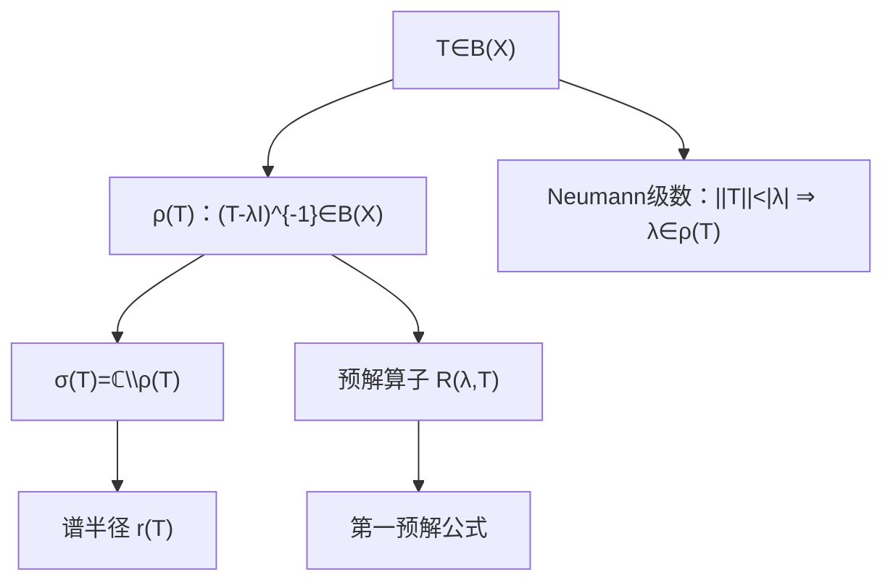

**相关笔记：** [[2.1 线性算子的概念]] | [[2.3 纲与开映射定理]] | [[第02章 线性算子与线性泛函 — 章节汇总]]

> [!abstract] 概览
> “谱”把算子当成“广义的数”来研究：对 $T\in B(X)$，预解集 $\rho(T)$ 是使 $(T-\lambda I)$ 可逆且逆仍在 $B(X)$ 的复数集合；谱 $\sigma(T)$ 是其补集。谱论把“可逆性/稳定性/迭代级数（Neumann）”统一到同一框架，并给出谱半径与解析性等结构性质。
> - 定义：$\rho(T)=\{\lambda:(T-\lambda I)^{-1}\in B(X)\}$，$\sigma(T)=\mathbb{C}\setminus\rho(T)$
> - 门禁：逆必须有界（这就是 2.3 三件套在谱论中的落点）
> - 工具：Neumann 级数、预解公式、谱半径估计

^overview

---

# 1. 本节主题定位

- **本节的核心问题**
  - 为什么谱要用“不可逆”定义，而不是“特征值”？
  - 预解集为什么是开集？预解算子为什么解析？
  - 怎样用 Neumann 级数快速判断可逆性与估计逆的范数？
  - 谱半径如何控制算子迭代的增长？

- **本节在本章知识链中的位置**
  - 2.1：算子范数与 $B(X)$ 的语言
  - 2.3：保证“代数可逆 ⇒ 逆有界”的门禁（谱定义里直接用到）
  - **2.6：把可逆性作为主对象**，为后续紧算子与 Fredholm 理论铺路

- **本节依赖的前置概念/定理**
  - 有界线性算子与算子范数（2.1）
  - 有界逆定理/开映射（2.3）
  - 复分析基础（“解析”的概念，用于预解算子）

- **本节为后续哪些内容铺路**
  - 第 3 章紧算子谱性质（紧算子谱离散性等）
  - 无穷维线性方程的可解性与稳定性

## 二、核心思想

> [!tip] 核心方法论（本节最值得记住的一句话）
> 在无穷维里，“找特征向量”不够用：真正稳定可用的是围绕 $(T-\lambda I)$ 的可逆性做判断；Neumann 级数提供最直接的可逆判据与估计，而 2.3 三件套保证“逆仍有界”。

---

# 2. 内容分层图

> [!quote] 原文直接信息（分层）
> - **概念层**：预解集/谱；预解算子；点谱/连续谱/剩余谱（若教材涉及）  
> - **命题层**：可逆集开；Neumann 级数；第一预解公式；谱半径估计/公式  
> - **方法层**：把 $T-\lambda I$ 写成 $-\lambda(I-\frac1\lambda T)$；用几何级数控制逆  
> - **过渡层**：为后续紧算子谱提供基本框架

---

# 3. 定义系统

## 3.1 预解集与谱

> [!quote] 原文直接信息（定义）
> 设 $X$ 为复 Banach 空间，$T\in B(X)$。定义
> $$\rho(T):=\{\lambda\in\mathbb{C}:\ (T-\lambda I)\ \text{可逆且}\ (T-\lambda I)^{-1}\in B(X)\},$$
> $$\sigma(T):=\mathbb{C}\setminus\rho(T).$$

- **条件作用**
  - “逆在 $B(X)$”是谱论门禁；在无穷维里代数逆存在不等于逆有界（2.3）
- **初学者误区**
  - 把 $\sigma(T)$ 当成“特征值集合”：无限维时谱可能包含无特征向量的点

## 3.2 点谱/连续谱/剩余谱（使用时再展开）

> [!note] 辅助理解（不抢细节）
> 常见分解：点谱 $\sigma_p$（存在特征向量）、连续谱/剩余谱描述“不可逆但无特征向量”的情形。做题时优先回到“$(T-\lambda I)$ 是否双射、逆是否有界”。

---

# 4. 定理/命题系统

## 4.1 可逆算子集是开集（Banach 代数基本事实）

> [!quote] 原文直接信息（结论口径）
> $B(X)$ 中可逆算子组成的集合是开集；且逆映射在该集合上连续。

- **条件作用**
  - 需要 Banach 结构来保证 Neumann 级数在范数下收敛
- **证明骨架**
  1) 设 $A$ 可逆，考虑 $A+E=A(I+A^{-1}E)$
  2) 若 $\|A^{-1}E\|<1$，则 $I+A^{-1}E$ 可逆且逆由 Neumann 级数给出
  3) 得 $A+E$ 可逆，且逆连续依赖于 $E$

## 4.2 Neumann 级数（最常用可逆判据）

> [!quote] 原文直接信息（定理）
> 若 $\|S\|<1$，则 $I-S$ 可逆且
> $$(I-S)^{-1}=\sum_{n=0}^\infty S^n.$$

- **关键一跳**
  - 把“求逆”变成“几何级数”，并用算子范数判收敛

## 4.3 第一预解公式（resolvent identity）

> [!quote] 原文直接信息（公式）
> 若 $\lambda,\mu\in\rho(T)$，则
> $$R(\lambda,T)-R(\mu,T)=(\mu-\lambda)R(\lambda,T)R(\mu,T),$$
> 其中 $R(\lambda,T)=(T-\lambda I)^{-1}$。

- **用途**
  - 推出 $R(\lambda,T)$ 关于 $\lambda$ 的解析性与 $\rho(T)$ 的开性（下一轮可展开）

---

# 5. 例子与反例系统

- **例子：移位算子**
  - 双边右移（习题 2.6.3）：谱是单位圆周
  - 单边左移（习题 2.6.4）：点谱为单位圆盘、连续谱为单位圆周
- **反例提醒**
  - “单射 ≠ 可逆”：无限维里还需满射与逆有界（见 2.3 与本节误区）

---

# 6. 本节逻辑链复原

1) 先用“不可逆集合”定义谱：避免无限维里“特征值不够用”的问题  
2) 用 Neumann 级数给出可逆判据与粗估计（$\sigma(T)\subset\{|\lambda|\le\|T\|\}$）  
3) 用预解公式组织 $R(\lambda,T)$ 的结构（开性/解析性）  
4) 用具体算子例子（移位算子）展示：谱真的比特征值复杂  
5) 习题把“可逆集开”“特征向量线性无关”“移位算子谱”固定为可复用技能

---

# 7. 本节高风险误区（至少 5 条）

1) **误读**：谱就是特征值  
   - **正确理解**：谱围绕“可逆性”定义；无限维可出现无特征向量的谱点  
2) **误读**：只要 $T-\lambda I$ 单射就算可逆  
   - **正确理解**：还要满射；并且代数逆存在还要保证逆有界（2.3）  
3) **误读**：$\rho(T)$ 的定义不需要“逆有界”  
   - **正确理解**：需要；否则失去 Banach 代数框架，许多结论（开性/解析性）会崩  
4) **误读**：Neumann 级数只是形式技巧  
   - **正确理解**：它是可逆判据+估计工具（控制 $\|(T-\lambda I)^{-1}\|$）  
5) **误读**：移位算子“显然没有谱”或“谱很小”  
   - **正确理解**：移位算子的谱恰恰是典型的“大谱”例子（单位圆/圆盘）

---

# 8. 知识库拆分建议

- **A类：概念卡**
  - [[预解集]]、[[谱]]、[[预解算子]]、[[点谱]]（可选）
- **B类：定理卡**
  - Neumann 级数
  - 可逆算子集开
  - 第一预解公式
- **C类：只保留在本节页**
  - “把 $T-\lambda I$ 化成 $I-S$”的做题按钮
- **D类：专题综述候选**
  - “移位算子谱”专题（作为后续紧算子谱的对照）

---

# 9. 后续学习接口

- **下一轮适合展开证明的点**
  - $\rho(T)$ 开性与 $R(\lambda,T)$ 解析性的严格证明（由预解公式推出）
  - 谱半径公式与 Gelfand 定理（若教材继续）
- **适合设计习题的点**
  - 通过 Neumann 级数估计谱包含关系
  - 通过构造近似逆/近似特征向量定位连续谱
- **与前一节衔接**
  - 2.3 有界逆定理解释“为什么要要求逆有界”

---

# 10. 自测问题

## 10.A 自测问题（由浅到深）
1) 写出 $\rho(T)$ 与 $\sigma(T)$ 的定义，并解释“逆有界”为什么必须写进去。  
2) 用 Neumann 级数证明：若 $|\lambda|>\|T\|$ 则 $\lambda\in\rho(T)$。  
3) 解释第一预解公式的含义：它在逻辑上推动了哪些结构结论？  
4) 给出一个“谱包含非特征值点”的例子（提示：移位算子）。  
5) 在无穷维中，“单射但不满射”的典型线性算子是什么？它的谱在哪里体现？

## 10.B 习题（完整解答，按教材编号）

### 习题 2.6.1（可逆算子集开）
> [!problem] 题目
> 设 $X$ 是 Banach 空间。求证：$B(X)$ 中可逆（存在有界逆）的算子集是开的。

> [!solution]- 完整过程解答
> 取可逆算子 $A\in B(X)$，考虑扰动 $A+E$。有
> $$A+E=A(I+A^{-1}E).$$
> 若 $\|A^{-1}E\|<1$，则由 Neumann 级数
> $$(I+A^{-1}E)^{-1}=\sum_{n=0}^\infty (-A^{-1}E)^n$$
> 收敛且给出有界逆。于是
> $$(A+E)^{-1}=(I+A^{-1}E)^{-1}A^{-1}\in B(X).$$
> 因此当 $\|E\|<1/\|A^{-1}\|$ 时，$A+E$ 仍可逆，说明可逆集包含一个邻域，故为开集。

### 习题 2.6.2（不同特征值的特征向量线性无关）
> [!problem] 题目
> 设 $A$ 是闭线性算子，$\lambda_1,\dots,\lambda_n\in\sigma_p(A)$ 两两互异，$x_i$ 为对应于 $\lambda_i$ 的特征向量（$Ax_i=\lambda_i x_i$）。求证：$\{x_1,\dots,x_n\}$ 线性无关。

> [!solution]- 完整过程解答
> 反证：若线性相关，取最小 $m$ 使 $\{x_1,\dots,x_m\}$ 相关，则存在不全为 0 的系数 $c_i$ 使
> $$\sum_{i=1}^m c_i x_i=0,$$
> 且可设 $c_m\ne 0$，从而 $x_m=-\sum_{i=1}^{m-1}(c_i/c_m)x_i$。对等式施加 $A$：
> $$\lambda_m x_m=Ax_m=-\sum_{i=1}^{m-1}(c_i/c_m)Ax_i=-\sum_{i=1}^{m-1}(c_i/c_m)\lambda_i x_i.$$
> 将 $x_m$ 的表达代回得
> $$-\lambda_m\sum_{i=1}^{m-1}(c_i/c_m)x_i=-\sum_{i=1}^{m-1}(c_i/c_m)\lambda_i x_i,$$
> 即
> $$\sum_{i=1}^{m-1}(c_i/c_m)(\lambda_i-\lambda_m)x_i=0.$$
> 由于 $\lambda_i-\lambda_m\ne 0$，这给出 $\{x_1,\dots,x_{m-1}\}$ 的非平凡线性关系，矛盾于 $m$ 的最小性。故线性无关。

### 习题 2.6.3（双边 $\ell^2$ 右移：谱为单位圆）
> [!problem] 题目
> 在双边 $\ell^2(\mathbb{Z})$ 上定义右移算子
> $$(Ax)_m=x_{m-1}.$$
> 求证：$\sigma(A)=\{\lambda\in\mathbb{C}:\ |\lambda|=1\}$（并且点谱为空，连续谱为单位圆）。

> [!solution]- 完整过程解答
> 记 $U=A$。首先 $U$ 为酉算子：$\|Ux\|_2=\|x\|_2$ 且 $U^{-1}$ 为左移。因而 $\|U\|=1$。  
> **(1) 先证 $\sigma(U)\subset\{|\lambda|=1\}$**  
> 若 $|\lambda|>1$，则
> $$U-\lambda I=-\lambda\left(I-\frac1\lambda U\right),\qquad \left\|\frac1\lambda U\right\|=\frac1{|\lambda|}<1,$$
> 由 Neumann 级数 $(I-\frac1\lambda U)^{-1}$ 存在且有界，故 $\lambda\in\rho(U)$。同理若 $|\lambda|<1$，则
> $$U-\lambda I=U\left(I-\lambda U^{-1}\right),\qquad \|\lambda U^{-1}\|=|\lambda|<1,$$
> 故亦可逆，$\lambda\in\rho(U)$。因此 $\sigma(U)\subset\{|\lambda|=1\}$。  
> **(2) 再证 $\{|\lambda|=1\}\subset\sigma(U)$**  
> 取 $|\lambda|=1$。证明 $U-\lambda I$ 不可逆。注意 $U$ 为双边移位，其傅里叶变换对应于 $L^2(\mathbb{T})$ 上的乘子算子 $M_{e^{it}}$；则 $U-\lambda I$ 对应于乘以 $e^{it}-\lambda$。当 $|\lambda|=1$ 时，$e^{it}-\lambda$ 在某点为 0，因此乘子算子不具备有界逆（逆会在零点附近发散）。故 $0\in\sigma(M_{e^{it}}-\lambda I)$，从而 $\lambda\in\sigma(U)$。  
> 于是 $\sigma(U)=\{|\lambda|=1\}$。  
> （补充：点谱为空可由“若 $Ux=\lambda x$ 则 $|x_m|$ 常数导致不可平方可和”推出。）

### 习题 2.6.4（单边 $\ell^2$ 左移：点谱为圆盘，连续谱为圆周）
> [!problem] 题目
> 在 $\ell^2(\mathbb{N})$ 上定义左移算子
> $$A(x_1,x_2,\dots)=(x_2,x_3,\dots).$$
> 求证：$\sigma_p(A)=\{\lambda:\ |\lambda|<1\}$，$\sigma_c(A)=\{\lambda:\ |\lambda|=1\}$，并且 $\sigma(A)=\sigma_p(A)\cup\sigma_c(A)$。

> [!solution]- 完整过程解答
> **(1) 计算点谱**：求 $Ax=\lambda x$。则
> $$x_{n+1}=\lambda x_n\Rightarrow x_n=\lambda^{n-1}x_1.$$
> 该 $x\in\ell^2$ 当且仅当 $\sum_{n\ge1}|\lambda|^{2(n-1)}|x_1|^2<\infty$，即 $|\lambda|<1$（取 $x_1\ne0$）。  
> 因此 $\sigma_p(A)=\{|\lambda|<1\}$。
>
> **(2) $|\lambda|>1$ 属于预解集**  
> 写成 $A-\lambda I=-\lambda(I-\frac1\lambda A)$，且 $\|\frac1\lambda A\|\le 1/|\lambda|<1$，由 Neumann 级数可逆，故 $|\lambda|>1$ 时 $\lambda\in\rho(A)$。
>
> **(3) $|\lambda|=1$ 属于连续谱**  
> 先证单射：若 $(A-\lambda I)x=0$ 则 $Ax=\lambda x$，但 $|\lambda|=1$ 时上一步算得不存在非零 $\ell^2$ 特征向量，故核为 0。  
> 再证不满射且值域稠密：可构造近似特征向量（Weyl 序列）$x^{(N)}=(1,\lambda,\dots,\lambda^{N-1},0,0,\dots)$ 归一化后满足 $\|(A-\lambda I)x^{(N)}\|\to 0$，说明 $(A-\lambda I)$ 的逆（若存在）不可能有界；另一方面可验证 $R(A-\lambda I)$ 稠密。  
> 因而 $|\lambda|=1$ 属于连续谱 $\sigma_c(A)$。
>
> **(4) 总谱**  
> 已得 $|\lambda|>1$ 在预解集，$|\lambda|<1$ 在点谱，$|\lambda|=1$ 在连续谱，故
> $$\sigma(A)=\{|\lambda|\le 1\}=\sigma_p(A)\cup\sigma_c(A).$$

## 10.C 引用与原文 PDF（末尾嵌入）

> [!quote]- 参考（教材分片）
> 1. 张恭庆，《泛函分析讲义》，第 2 章 2.6。
> 2. 本节对应分片 PDF：![[00-Raw素材/泛函分析讲义_张恭庆/章节内容/第二章_线性算子与线性泛函/2.6_线性算子的谱.pdf]]

#学习/泛函分析/第02章

