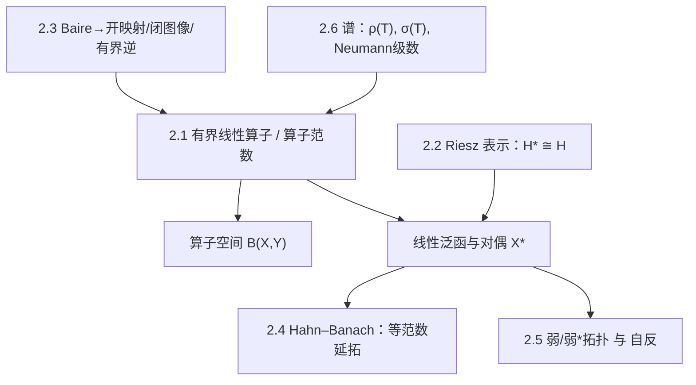

**相关笔记：** [[2.1 线性算子的概念]] | [[2.2 Riesz表示定理及其应用]] | [[2.3 纲与开映射定理]] | [[2.4 Hahn-Banach定理]] | [[2.5 共轭空间 弱收敛 自反空间]] | [[2.6 线性算子的谱]]

## 概览

> [!abstract] 本章一句话
> 把“线性映射”变成可分析的对象：用==算子范数==刻画连续性（2.1），用==对偶与表示==把泛函具体化（2.2/2.4），用==Baire→三件套==保证稳定估计（2.3），用==弱/弱*拓扑==获得紧性与极限（2.5），并用==谱==统一可逆性与稳定性（2.6）。

^overview

---

## 一、知识结构总览

---

## 二、核心思想

> [!tip] 复习最短路径（题型 → 工具）
> - 题目在问“连续/有界/算子大小”：先想 2.1（$\|Tx\|\le C\|x\|$ 与 $\|T\|$）  
> - 题目需要“把泛函具体化/做最小化”：先想 2.2（Riesz 表示 + 正交几何）  
> - 题目需要“满射/逆/稳定估计”：先想 2.3（开映射/闭图像/有界逆）  
> - 题目需要“从有界抽极限/弱收敛”：先想 2.5（Banach–Alaoglu、自反）  
> - 题目在问“可逆性随参数变化/谱”：先想 2.6（预解集、Neumann 级数、谱半径）

---

## 三、补充理解与易混淆点

### 补充理解

> [!info] 补充1：本章的“对偶视角”贯穿 2.2–2.6
> - 2.2：Hilbert 情形 $H^\*\cong H$（对偶不再抽象）  
> - 2.4：Hahn–Banach 保证对偶足够大（能分离点）  
> - 2.5：弱/弱*拓扑把“收敛”定义成“对偶测试的逐点收敛”  
> 这条主线解释了：为什么学习线性算子最终会走向“对偶与拓扑”。
>
> > [!quote]- 参考（联网权威来源）
> > - [MIT 18.102 Lecture 5: Hahn–Banach (PDF)](https://ocw.mit.edu/courses/18-102-introduction-to-functional-analysis-spring-2021/06f9cf855f9f5eaa1898f3e684e05cec_MIT18_102s21_lec5.pdf)
> > - [Elements of Functional Analysis (J. Feneuil, 2024 PDF)](https://www.imo.universite-paris-saclay.fr/~joseph.feneuil/Cours/Functional_Analysis.pdf)

> [!info] 补充2：Baire 三件套=“稳定性保证书”
> 开映射/有界逆/闭图像把“代数可解”升级为“解随扰动稳定”。  
> 在很多分析问题里，最后真正要的不是“存在解”，而是“解对数据连续依赖”（否则解没有可用意义）。
>
> > [!quote]- 参考（联网权威来源）
> > - [MIT 18.102 Lecture 4: Open Mapping & Closed Graph (PDF)](https://ocw.mit.edu/courses/18-102-introduction-to-functional-analysis-spring-2021/038fc32ab9c1bb63a4f29bd9d7c97961_MIT18_102s21_lec4.pdf)
> > - [Open mapping theorem (Wikipedia)](https://en.wikipedia.org/wiki/Open_mapping_theorem_(functional_analysis))

### 易混淆点

> [!warning] ❌把“弱收敛/弱*收敛”当成“范数收敛” → ✅它们更弱，但换来紧性
> 弱收敛只保证对偶测试的收敛，不保证范数收敛；但它能在合适条件下提供抽取子列的紧性（例如自反空间或对偶单位球的弱*紧性）。
>
> > [!quote]- 参考（联网权威来源）
> > - [Oxford Functional Analysis II Lecture 10 (PDF)](https://courses.maths.ox.ac.uk/pluginfile.php/83506/mod_resource/content/0/B4.2Lecture10P.pdf)
> > - [Banach–Alaoglu theorem (Wikipedia)](https://en.wikipedia.org/wiki/Banach%E2%80%93Alaoglu_theorem)

> [!warning] ❌把“谱”当成“特征值集合” → ✅谱是“不可逆集合”，无限维会更复杂
> 在无限维里，$\sigma(T)$ 可能包含没有特征向量的点；做题时应围绕 $(T-\lambda I)$ 是否可逆来判断，而不是只找特征向量。
>
> > [!quote]- 参考（联网权威来源）
> > - [Chapter 1 Spectrum of bounded operators (Univ. Toulouse PDF)](https://www.math.univ-toulouse.fr/~jroyer/TD/2022-23-M2/M2-Ch1.pdf)
> > - [Spectrum (functional analysis) (Wikipedia)](https://en.m.wikipedia.org/wiki/Spectrum_(functional_analysis))

---

## 四、习题精选

> [!todo] 复习题单（按主题）
> | 主题 | 关联小节 | 核心抓手 | 难度 |
> |---|---|---|---|
> | 连续性与范数估计 | 2.1 | $\|Tx\|\le C\|x\|$ 与 $\|T\|$ | ⭐⭐⭐ |
> | 表示与最小化 | 2.2 | Riesz 表示 + 正交分解 | ⭐⭐⭐⭐ |
> | 稳定性三件套 | 2.3 | Baire → 开映射/闭图像/有界逆 | ⭐⭐⭐⭐ |
> | 弱拓扑与紧性 | 2.5 | Banach–Alaoglu、自反性 | ⭐⭐⭐⭐ |
> | 谱与可逆性 | 2.6 | 预解集/Neumann 级数 | ⭐⭐⭐⭐ |

---

## 各节概览（嵌入聚合）

- ![[2.1 线性算子的概念#^overview]]
- ![[2.2 Riesz表示定理及其应用#^overview]]
- ![[2.3 纲与开映射定理#^overview]]
- ![[2.4 Hahn-Banach定理#^overview]]
- ![[2.5 共轭空间 弱收敛 自反空间#^overview]]
- ![[2.6 线性算子的谱#^overview]]

---

## 本章索引

### 节笔记

- [[2.1 线性算子的概念]]
- [[2.2 Riesz表示定理及其应用]]
- [[2.3 纲与开映射定理]]
- [[2.4 Hahn-Banach定理]]
- [[2.5 共轭空间 弱收敛 自反空间]]
- [[2.6 线性算子的谱]]

### 参见 Wiki（本章核心概念/定理）

- 概念：[[线性算子]]、[[线性泛函]]、[[算子范数]]、[[共轭空间]]、[[弱收敛]]、[[弱*收敛]]、[[自反空间]]、[[谱]]、[[预解集]]、[[谱半径]]、[[Neumann级数]]
- 定理：[[Riesz表示定理]]、[[Baire纲定理]]、[[开映射定理]]、[[有界逆定理]]、[[闭图像定理]]、[[Hahn-Banach定理]]、[[Banach-Alaoglu定理]]

#学习/泛函分析/第02章
