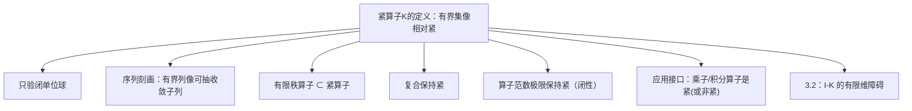

**相关笔记：** [[1.3 列紧集]]｜[[2.6 线性算子的谱]]｜[[3.2 Riesz-Fredholm理论]]｜[[第03章 紧算子与Fredholm算子 — 章节汇总]]

> [!abstract] 概览
> 本节引入第03章的主角：==紧算子==。它把“无限维里紧集稀缺”的事实，转化为“算子把有界集压缩成相对紧集（可抽收敛子列）”。这使得后续 $I-K$ 的不可逆性只能以“有限维方式”发生（3.2），并进一步导致紧算子谱结构接近线性代数（3.3）。
> - 核心等价：紧算子 $\Leftrightarrow$ “任意有界列的像可抽收敛子列”
> - 基础性质：有限秩算子必紧；紧算子对左右复合封闭；紧算子在算子范数极限下封闭
> - 高风险点：**紧 $\neq$ 有界**；“像有界”远弱于“像相对紧”；证明非紧要构造“分离序列（无收敛子列）”
> ^overview

---

# 1. 本节主题定位

- **本节的核心问题**
  1) 什么是紧算子？它与“紧集/列紧/相对紧”之间如何对接？  
  2) 为什么“序列刻画”是紧算子最可用的判别口径？  
  3) 紧算子有哪些“稳定性性质”（复合/范数极限/商空间诱导）？  
  4) 哪些算子典型非紧（尤其恒等算子）？如何构造反例序列？

- **本节在本章知识链中的位置**
  - 3.1：给出“紧”的定义与工具箱（后续所有证明反复调用）  
  - 3.2：把 $I-K$ 的失败模式压缩到有限维（Fredholm alternative）  
  - 3.3：用 3.2 推出紧算子非零谱点是特征值、有限重数等  
  - 3.4：Hilbert 情形下更强（紧自伴可正交“对角化”）

- **本节依赖哪些前置概念/定理**
  - 相对紧/列紧/全有界（[[1.3 列紧集]]）  
  - 有界线性算子与算子范数（第2章，尤其 2.1/2.6）  

- **本节为后续哪些内容铺路**
  - 3.2：证明核有限维/值域闭的关键矛盾结构来自“分离序列 vs 紧性抽子列”  
  - 3.3：把 $K-\lambda I$ 化成 $I-\lambda^{-1}K$（$\lambda\ne 0$）后直接套 3.2  

## 二、核心思想

> [!tip] 核心方法论（怎么“把紧性用成招式”）
> - **证紧**：拿任意有界序列 $(x_n)$，证明 $(Kx_n)$ 一定能抽出收敛子列（序列刻画）。  
> - **证非紧**：构造有界序列 $(x_n)$，使得 $(Kx_n)$ 的任意两项距离都有统一下界（分离序列），从而不可能有收敛子列。  
> - **把紧转成有限维**：紧性最常在“反证：若无限维则可用 Riesz 引理造分离序列”里作为矛盾端。

---

# 2. 内容分层图

> [!quote] 原文直接信息（分层）
> - **概念层**：紧算子、相对紧/列紧、有限秩算子、乘子算子/积分算子  
> - **命题层**：只验单位球；序列刻画；复合保持紧；范数极限保持紧  
> - **方法层**：缩放（单位球）+ 序列语言；有限秩逼近；“分离序列”反证  
> - **过渡层**：为 3.2 的 $I-K$ 理论准备：紧性→“无限维结构会被抽子列破坏”

---

# 3. 定义系统

## 3.1 紧算子（compact operator）

> [!quote] 原文直接信息（定义）
> 设 $X,Y$ 为赋范空间，$K\in B(X,Y)$。若对任意有界集 $E\subset X$，$K(E)$ 在 $Y$ 中相对紧（即 $\overline{K(E)}$ 紧），则称 $K$ 为紧算子。

- **定义对象是什么**：有界线性算子 $K:X\to Y$ 的一种“压缩性”性质
- **为什么要这样定义**：无限维里“闭有界不紧”，但紧性恰恰是“可抽收敛子列”的结构；把它放到算子上，就能让线性方程的不可逆性呈现有限维形态（3.2）
- **它解决了什么问题**
  - 给出一种可迁移的“紧性来源”：一旦 $K$ 紧，很多极限/谱结构会变得像有限维
- **与前面概念的关系**
  - 相对紧/列紧/全有界（1.3）；紧算子是“把有界集送进相对紧集”的算子版本
- **最小例子**
  - 有限秩算子（像落在有限维子空间 → 单位球紧）
- **非例/边界情况**
  - 无穷维 Banach 空间上的恒等算子一般不紧（习题 3.1.1 的直接推论）
- **初学者误区**
  - 把“像集有界”当“像集相对紧”；这是无限维里最常见的错觉来源

## 3.2 有限秩算子（finite rank）

> [!quote] 原文直接信息（定义）
> 若 $K(X)$ 落在 $Y$ 的某个有限维子空间中（即 $\dim K(X)<\infty$），则称 $K$ 为有限秩算子。

- **为什么要这样定义**：有限维里闭有界必紧，有限秩算子是“可控的紧性源头”，也是构造紧算子的主要逼近工具

---

# 4. 定理/命题系统

## 4.1 只需验闭单位球

> [!quote] 原文直接信息（命题）
> $K$ 紧当且仅当 $K(B_X)$ 相对紧，其中 $B_X=\{x\in X:\|x\|\le 1\}$。

- **条件逐条解释**
  - 线性与缩放：任意有界集 $E$ 都包含于某个 $R B_X$，而 $K(RB_X)=R K(B_X)$
- **结论到底在说什么**
  - 检验紧性只需看一个集合（闭单位球）的像是否相对紧
- **证明骨架**
  1) 若对所有有界集成立，则对 $B_X$ 成立  
  2) 若 $K(B_X)$ 相对紧，则对任意有界 $E\subset RB_X$ 有 $K(E)\subset R K(B_X)$ 相对紧
- **最关键的一跳**
  - “有界集 $\subset RB_X$”+“线性缩放”

## 4.2 序列刻画（最可用的判别式）

> [!quote] 原文直接信息（定理）
> 设 $K\in B(X,Y)$。则 $K$ 紧当且仅当：对任意有界序列 $(x_n)\subset X$，序列 $(Kx_n)\subset Y$ 有收敛子列。

- **为什么重要**
  - 无限维紧性最可靠的语言是“序列语言”；做题与后续 3.2/3.3 的证明几乎都以此为入口
- **证明骨架**
  1) 紧 $\Rightarrow$ 序列刻画：$(x_n)$ 有界 $\Rightarrow$ 落入某个 $RB_X$，像落入相对紧集 → 可抽收敛子列  
  2) 序列刻画 $\Rightarrow$ 紧：对任意有界集 $E$，从 $K(E)$ 任取序列写成 $Kx_n$，抽收敛子列 → $K(E)$ 列紧 → 相对紧
- **最关键的一跳**
  - “从像集取序列”反推“像集列紧”

## 4.3 有限秩算子必紧

> [!quote] 原文直接信息（命题）
> 若 $\operatorname{rank}K<\infty$，则 $K$ 为紧算子。

- **条件作用**
  - 有限维子空间上闭有界集紧（Heine–Borel 在有限维赋范空间成立）
- **证明骨架**
  - $K(B_X)$ 有界且落在有限维子空间中 → 相对紧

## 4.4 复合保持紧

> [!quote] 原文直接信息（命题）
> 若 $K:X\to Y$ 紧，$S:W\to X$、$T:Y\to Z$ 有界，则 $K\circ S$ 与 $T\circ K$ 都紧。

- **证明骨架**
  - 有界序列经有界算子仍有界；紧算子抽子列；有界算子保持收敛

## 4.5 紧算子在算子范数下封闭

> [!quote] 原文直接信息（命题）
> 若 $K_n$ 都紧且 $\|K_n-K\|\to 0$，则 $K$ 紧。

- **证明骨架**
  1) 取任意有界序列 $(x_m)$  
  2) 先用某个 $K_N$ 的紧性在 $(K_Nx_m)$ 中抽收敛子列  
  3) 用 $\|(K-K_N)x_m\|\le \|K-K_N\|\|x_m\|$ 把误差压小，推出 $(Kx_m)$ 同子列收敛
- **最关键的一跳**
  - “先抽子列，再用范数误差把极限从 $K_N$ 转移到 $K$”

---

# 5. 例子与反例系统

- **关键例子 1（有限秩算子）**
  - $Kx=\sum_{j=1}^m f_j(x)y_j$（$f_j\in X^*,\,y_j\in Y$）→ 像在有限维张成里 → 紧  
  - 服务理解点：把“紧性来源”具体化为“有限维压缩”

- **关键例子 2（$\ell^p$ 上对角乘子）**
  - $(Tx)_n=w_n x_n$ 且 $w_n\to 0$ ⇒ $T$ 紧（用有限秩截断逼近）  
  - 服务理解点：展示“范数极限=紧”这一套路（习题 3.1.6）

- **关键例子 3（Hilbert-Schmidt 积分算子）**
  - $K\in L^2(D\times D)$ 定义的积分算子在 $L^2(D)$ 上紧  
  - 服务理解点：给 3.4 的 Hilbert-Schmidt 理论做接口（习题 3.1.8）

- **最值得补的反例：恒等算子非紧**
  - 无限维中闭单位球不紧 → 恒等算子把闭单位球送回自己，不可能相对紧  
  - 服务理解点：紧性是“额外结构”，不是有界性的同义词（习题 3.1.1）

---

# 6. 本节逻辑链复原（作者为什么这样安排）

1) 先定义紧算子：把“紧性”从集合迁移到算子  
2) 立刻给两个等价刻画（单位球/序列）：把定义变成可用判别式  
3) 给出三类稳定性结论（有限秩/复合/范数闭）：形成可复用工具箱  
4) 用一组典型习题训练“证紧/证非紧/构造反例/在不同空间上的紧性判别”  
5) 为下一节 3.2 铺路：紧性 + 分离序列将推出 $I-K$ 的有限维障碍

---

# 7. 本节高风险误区（≥5）

1) **误读**：紧算子 = 有界算子  
   - **为什么容易误读**：两者都属于 $B(X,Y)$  
   - **正确理解**：紧性是更强的“像相对紧”，用于抽子列；有界只给 Lipschitz 控制
2) **误读**：只要 $K(B_X)$ 有界就算紧  
   - **正确理解**：要“相对紧/可抽收敛子列”；无限维里“有界≠相对紧”
3) **误读**：证明非紧只要找一个不收敛序列  
   - **正确理解**：要构造“无收敛子列”的序列；最稳是“分离序列”$\|x_n-x_m\|\ge c$
4) **误读**：$K_nx\to Kx$（逐点收敛）且 $K_n$ 紧 ⇒ $K$ 紧  
   - **正确理解**：需要算子范数收敛（或至少一致控制 + 适当紧性条件）；逐点收敛不够
5) **误读**：紧算子一定有界逆 / 一定可逆  
   - **正确理解**：紧算子在无限维里甚至不可能有有界逆（若它可逆，则恒等算子紧，矛盾）
6) **误读**：紧算子把弱收敛变强收敛对所有空间都成立  
   - **正确理解**：这是 Hilbert 或反身 Banach 情形常用性质（完全连续性），使用时要点名条件

---

# 8. 知识库拆分建议

- **A类：应独立成概念卡**
  - [[紧算子]]、[[有限秩算子]]、[[相对紧集]]、[[分离序列]]（做题反证接口）
  - [[Hilbert-Schmidt算子]]（为 3.4 铺路）
- **B类：应独立成定理卡**
  - 紧算子的序列刻画
  - 复合保持紧 / 范数极限保持紧
- **C类：只保留在本节页中**
  - “证紧/证非紧”的操作流程与例题地图
- **D类：专题综述候选**
  - “紧性方法论：分离序列 vs 抽子列（Riesz 引理风格）”专题页

---

# 9. 后续学习接口

- **下一轮适合展开证明的点**
  - 4.5（范数闭性）中“先抽子列再转移极限”的严谨写法
  - Hilbert 上“紧 ⇒ 弱收敛映到强收敛”的证明细节（为 3.4/3.5 常用）
- **适合设计习题的点**
  - 乘子算子何时紧（$w_n\to 0$）/在 $L^2$ 上乘子算子何时紧（只能是 0）
  - 积分算子何时紧（核函数属于 $L^2$ 或连续核）
- **适合与前一节比较的点**
  - 与 2.6 谱论比较：一般算子谱很复杂；紧算子谱在 3.3 变得“线代化”
- **适合与下一节衔接的点**
  - 3.2 的核心矛盾结构：若核无限维 ⇒ Riesz 引理造分离序列，与紧性抽子列矛盾

---

# 10. 自测问题

## 10.A 自测问题（由浅到深）
1) 写出紧算子的定义，并解释“相对紧”与“有界”差别在哪里。  
2) 为什么紧性只需要验闭单位球？“缩放”在证明中承担什么岗位？  
3) 写出紧算子的序列刻画，并说明它为什么是做题最常用的口径。  
4) 给出一个证明算子非紧的通用策略（分离序列），并举一个最典型例子。  
5) 解释：为什么无限维里紧算子不可能有有界逆？这句话在 3.2/3.3 里会怎样出现？

## 10.B 习题（完整解答，按教材编号）

### 习题 3.1.1（无穷维上紧算子不可有界可逆）
> [!problem] 题目
> 设 $X$ 是无穷维 Banach 空间。求证：若 $A\in B(X)$ 为紧算子，则 $A$ 没有有界逆（即不存在 $A^{-1}\in B(X)$）。

> [!solution]- 完整过程解答
> 若反设 $A^{-1}\in B(X)$ 存在，则恒等算子
> $$I=A^{-1}A.$$
> 由“有界算子与紧算子复合仍紧”（4.4），得 $I$ 也是紧算子。  
> 但若 $I$ 紧，则 $I(B_X)=B_X$ 相对紧，闭单位球在 $X$ 中紧，从而 $X$ 必为有限维（与 1.3 的结论等价）。与“无穷维”矛盾。故 $A$ 不可有界可逆。

### 习题 3.1.2（有下界算子紧 ⇔ 空间有限维）
> [!problem] 题目
> 设 $X$ 为 Banach 空间，$A\in B(X)$ 满足存在 $a>0$ 使
> $$\|Ax\|\ge a\|x\|\qquad(\forall x\in X).$$
> 求证：$A$ 为紧算子的充要条件是 $X$ 有限维。

> [!solution]- 完整过程解答
> **(⇒)** 由不等式知 $A$ 单射，且在其值域 $R(A)$ 上有
> $$\|A^{-1}y\|\le \frac1a\|y\|\qquad(\forall y\in R(A)),$$
> 因此 $A^{-1}:R(A)\to X$ 有界。若 $A$ 紧，则 $A(B_X)$ 相对紧，于是其闭包 $K:=\overline{A(B_X)}$ 为紧集。  
> 又由 $B_X\subset A^{-1}(A(B_X))\subset A^{-1}(K)$，且 $A^{-1}$ 连续，所以 $A^{-1}(K)$ 紧。故 $B_X$ 相对紧，从而 $X$ 有限维。  
> **(⇐)** 若 $X$ 有限维，则任意有界集闭包紧，故任意 $A\in B(X)$ 都紧。

### 习题 3.1.3（值域包含于紧算子值域 ⇒ 仍紧）
> [!problem] 题目
> 设 $X,Y$ 为 Banach 空间，$A\in B(X,Y)$，$K\in B(X,Y)$ 为紧算子，且满足 $R(A)\subset R(K)$。求证：$A$ 也是紧算子。

> [!solution]- 完整过程解答
> 令 $N(K)=\{x:\ Kx=0\}$，这是闭子空间。考虑商空间 $\tilde X:=X/N(K)$（Banach）。定义诱导算子
> $$\tilde K:\tilde X\to Y,\qquad \tilde K([x])=Kx.$$
> 这是良定义且有界，并且 $\tilde K(\,q(B_X)\,)=K(B_X)$ 相对紧，因此 $\tilde K$ 也是紧算子（紧性对商映射保留）。  
> 由于 $R(A)\subset R(K)$，对每个 $x\in X$，存在 $y\in X$ 使 $Ky=Ax$。定义
> $$S:X\to \tilde X,\qquad Sx=[y]\ \text{其中 }Ky=Ax.$$
> **良定义**：若 $Ky=Ky'$，则 $K(y-y')=0$，故 $[y]=[y']$。  
> **线性**：由 $K(y_1+y_2)=Ax_1+Ax_2=A(x_1+x_2)$，以及商类加法，得 $S$ 线性。  
> **有界性**：取 $x_n\to x$ 且 $Sx_n\to [y]$ 于 $\tilde X$。则
> $$\tilde K(Sx_n)=\tilde K([y_n])=Ky_n=Ax_n\to Ax.$$
> 另一方面 $\tilde K(Sx_n)\to \tilde K([y])$（因 $\tilde K$ 连续），故 $\tilde K([y])=Ax$，即 $Sx=[y]$，图像闭。由闭图像定理（2.3），$S$ 有界。  
> 最后
> $$A=\tilde K\circ S,$$
> 为“紧算子 ∘ 有界算子”的复合，因此 $A$ 紧。

### 习题 3.1.4（Hilbert：弱收敛 + 紧算子 ⇒ 双变量极限）
> [!problem] 题目
> 设 $H$ 为 Hilbert 空间，$A\in B(H)$ 为紧算子。若 $x_n\rightharpoonup x_0$、$y_n\rightharpoonup y_0$（弱收敛），求证：
> $$\langle x_n,Ay_n\rangle\to \langle x_0,Ay_0\rangle.$$

> [!solution]- 完整过程解答
> 由弱收敛可知 $\{x_n\}$ 有界。又因 $A$ 紧，$y_n\rightharpoonup y_0$ 推出 $Ay_n\to Ay_0$（范数收敛）（紧算子把弱收敛序列送到强收敛序列，这是 Hilbert/反身情形的常用性质）。  
> 于是
> $$\langle x_n,Ay_n\rangle-\langle x_0,Ay_0\rangle
> =\langle x_n-x_0,Ay_0\rangle+\langle x_n,Ay_n-Ay_0\rangle.$$
> 第一项：因 $x_n\rightharpoonup x_0$，对固定向量 $Ay_0$ 有 $\langle x_n-x_0,Ay_0\rangle\to 0$。  
> 第二项：由 Cauchy–Schwarz，
> $$|\langle x_n,Ay_n-Ay_0\rangle|\le \|x_n\|\,\|Ay_n-Ay_0\|\to 0.$$
> 故结论成立。

### 习题 3.1.5（值域闭且无限维 ⇒ 非紧）
> [!problem] 题目
> 设 $X,Y$ 为 Banach 空间，$A\in B(X,Y)$，且 $R(A)$ 闭并满足 $\dim R(A)=\infty$。求证：$A$ 不是紧算子。

> [!solution]- 完整过程解答
> 因 $R(A)$ 闭，商空间 $X/N(A)$ 与 $R(A)$ 之间的诱导算子
> $$\tilde A:X/N(A)\to R(A),\qquad \tilde A([x])=Ax$$
> 是有界线性双射。由于 $X/N(A)$ 与 $R(A)$ 都是 Banach（$R(A)$ 闭子空间），由有界逆定理（2.3），$\tilde A^{-1}$ 有界。  
> 若 $A$ 紧，则 $\tilde A$ 也紧（因为它与 $A$ 仅差商映射/值域限制的等价重表述），于是恒等算子
> $$I_{R(A)}=\tilde A\circ \tilde A^{-1}$$
> 为紧算子（紧算子与有界算子复合仍紧）。因此 $R(A)$ 的闭单位球紧，从而 $R(A)$ 有限维，与 $\dim R(A)=\infty$ 矛盾。故 $A$ 非紧。

### 习题 3.1.6（$\ell^p$ 上对角算子：$w_n\to 0$ ⇒ 紧）
> [!problem] 题目
> 设 $1\le p<\infty$，且数列 $w_n\to 0$。定义算子 $T:\ell^p\to\ell^p$：
> $$T((z_n))=(w_n z_n).$$
> 求证：$T$ 是紧算子。

> [!solution]- 完整过程解答
> 定义截断算子 $T_N$：
> $$T_N((z_n))=(w_1z_1,\dots,w_Nz_N,0,0,\dots).$$
> 则 $T_N$ 的值域包含于 $\mathbb{F}^N$（有限维），故 $T_N$ 有限秩，从而紧。  
> 估计算子范数差：对任意 $z\in\ell^p$，
> $$\|(T-T_N)z\|_p^p=\sum_{n>N}|w_n z_n|^p\le \left(\sup_{n>N}|w_n|\right)^p\sum_{n>N}|z_n|^p\le \left(\sup_{n>N}|w_n|\right)^p\|z\|_p^p.$$
> 因而 $\|T-T_N\|\le \sup_{n>N}|w_n|\to 0$。  
> 由“紧算子在算子范数下封闭”（4.5），$T$ 是紧算子。

### 习题 3.1.7（$L^2$ 上乘子算子紧当且仅当为零）
> [!problem] 题目
> 设 $\Omega$ 为可测集，$f$ 为 $\Omega$ 上有界可测函数。定义乘子算子 $F:L^2(\Omega)\to L^2(\Omega)$：
> $$(Fx)(t)=f(t)x(t).$$
> 求证：$F$ 是紧算子当且仅当 $f=0$（a.e. 于 $\Omega$）。

> [!solution]- 完整过程解答
> **(⇐)** 若 $f=0$ a.e.，则 $F=0$，显然紧。  
> **(⇒)** 反设 $f\ne 0$ a.e.，则存在 $\varepsilon>0$ 使集合
> $$E=\{t:\ |f(t)|\ge \varepsilon\}$$
> 具有正测度。可取一列两两不交的可测子集 $E_n\subset E$，且 $0<\mu(E_n)<\infty$。令
> $$x_n=\frac{\mathbf{1}_{E_n}}{\sqrt{\mu(E_n)}},$$
> 则 $\{x_n\}$ 是 $L^2$ 中的正交规范列，特别地有界。并且
> $$\|Fx_n\|_2^2=\int |f|^2|x_n|^2\ge \varepsilon^2\int_{E_n}|x_n|^2=\varepsilon^2.$$
> 同时 $Fx_n$ 两两正交（支撑不交），因此 $\|Fx_n-Fx_m\|_2^2=\|Fx_n\|_2^2+\|Fx_m\|_2^2\ge 2\varepsilon^2$，是分离序列，不可能有收敛子列。  
> 与 $F$ 紧（应把有界列像抽收敛子列）矛盾。故必须 $f=0$ a.e.

### 习题 3.1.8（$L^2$ 核积分算子是紧算子）
> [!problem] 题目
> 设 $\Omega$ 为可测集，$K\in L^2(\Omega\times\Omega)$。定义算子 $A:L^2(\Omega)\to L^2(\Omega)$：
> $$(Au)(x)=\int_\Omega K(x,y)u(y)\,dy.$$
> 求证：$A$ 是紧算子。

> [!solution]- 完整过程解答
> 这是 Hilbert-Schmidt 型算子。先给出有界性：由 Cauchy–Schwarz，
> $$|(Au)(x)|\le \left(\int_\Omega |K(x,y)|^2dy\right)^{1/2}\|u\|_2,$$
> 再对 $x$ 积分可得 $\|Au\|_2\le \|K\|_{L^2(\Omega\times\Omega)}\|u\|_2$。  
> 紧性：取简单函数（有限和）$K_n(x,y)=\sum_{j=1}^{m_n}\phi_{j}(x)\psi_{j}(y)$ 逼近 $K$ 于 $L^2(\Omega\times\Omega)$。对应算子
> $$(A_nu)(x)=\int K_n(x,y)u(y)dy=\sum_{j=1}^{m_n}\phi_j(x)\int \psi_j(y)u(y)dy,$$
> 其值域包含于 $\operatorname{span}\{\phi_1,\dots,\phi_{m_n}\}$，故 $A_n$ 有限秩，从而紧。  
> 且由上面的有界性估计同样得到
> $$\|A-A_n\|\le \|K-K_n\|_{L^2(\Omega\times\Omega)}\to 0.$$
> 由紧算子范数闭性（4.5），$A$ 紧。

### 习题 3.1.9（正交规范列与紧算子：对角元趋零）
> [!problem] 题目
> 设 $H$ 为 Hilbert 空间，$A\in B(H)$ 为紧算子，$\{e_n\}$ 为 $H$ 的正交规范集。求证：
> $$\langle Ae_n,e_n\rangle\to 0.$$

> [!solution]- 完整过程解答
> 因 $e_n\rightharpoonup 0$（正交规范列弱收敛到 0），而 $A$ 紧，故 $Ae_n\to 0$（范数收敛）。于是
> $$|\langle Ae_n,e_n\rangle|\le \|Ae_n\|\|e_n\|=\|Ae_n\|\to 0.$$

### 习题 3.1.10（商空间上的诱导算子保持紧）
> [!problem] 题目
> 设 $X$ 为 Banach 空间，$A\in B(X)$ 为紧算子，$X_0$ 为 $X$ 的闭子空间且 $A(X_0)\subset X_0$。定义诱导算子
> $$T:X/X_0\to X/X_0,\qquad T([x])=[Ax].$$
> 求证：$T$ 是紧算子。

> [!solution]- 完整过程解答
> 记商映射 $q:X\to X/X_0$，则 $q$ 连续且把有界集映为有界集。由 $A(X_0)\subset X_0$，有
> $$T\circ q=q\circ A.$$
> 取任意有界序列 $[x_n]\in X/X_0$。可取代表元使 $\|x_n\|\le C$（因为商范数 $\|[x]\|=\inf_{z\in X_0}\|x-z\|$，可选近最优代表元）。  
> 由 $A$ 紧，$\{Ax_n\}$ 有收敛子列 $Ax_{n_k}\to y$ 于 $X$。再用 $q$ 连续得
> $$T([x_{n_k}])=[Ax_{n_k}]=q(Ax_{n_k})\to q(y)$$
> 于商空间。故 $T$ 满足序列刻画，为紧算子。

### 习题 3.1.11（紧嵌入给出“ε-不等式”）
> [!problem] 题目
> 设 $X,Y,Z$ 为 Banach 空间，且有连续嵌入 $X\hookrightarrow Y\hookrightarrow Z$。若嵌入 $X\hookrightarrow Y$ 是紧的，而嵌入 $Y\hookrightarrow Z$ 连续。求证：对任意 $\varepsilon>0$，存在常数 $C(\varepsilon)>0$ 使
> $$\|x\|_Y\le \varepsilon\|x\|_X+C(\varepsilon)\|x\|_Z\qquad(\forall x\in X).$$

> [!solution]- 完整过程解答
> 反证。若存在 $\varepsilon_0>0$ 使对任意 $n$ 都存在 $x_n\in X$ 满足
> $$\|x_n\|_Y> \varepsilon_0\|x_n\|_X+n\|x_n\|_Z.$$
> 令 $u_n=x_n/\|x_n\|_Y$，则 $\|u_n\|_Y=1$ 且
> $$1>\varepsilon_0\|u_n\|_X+n\|u_n\|_Z.$$
> 因而 $\|u_n\|_X\le 1/\varepsilon_0$ 有界，且 $\|u_n\|_Z\le 1/n\to 0$。  
> 由紧嵌入 $X\hookrightarrow Y$，从 $\{u_n\}$ 可抽出子列（仍记 $u_n$）使 $u_n\to u$ 于 $Y$。于是 $\|u\|_Y=\lim\|u_n\|_Y=1$。  
> 另一方面，$Y\hookrightarrow Z$ 连续，故 $u_n\to u$ 于 $Z$，但又有 $\|u_n\|_Z\to 0$，因此 $u=0$ 于 $Z$，从而 $u=0$ 于 $Y$（嵌入为同一元素的不同范数，$Z$ 范数为 0 则元素为 0）。矛盾。  
> 故反设不成立，所求不等式成立。

## 10.C 引用与原文 PDF（末尾嵌入）

> [!quote]- 参考（教材分片）
> 1. 张恭庆，《泛函分析讲义》，第 3 章 3.1。
> 2. 本节对应分片 PDF：![[00-Raw素材/泛函分析讲义_张恭庆/章节内容/第三章_紧算子与Fredholm算子/3.1_紧算子的定义和基本性质.pdf]]

#学习/泛函分析/第03章

