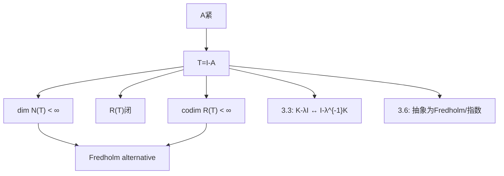

**相关笔记：** [[3.1 紧算子的定义和基本性质]]｜[[3.3 紧算子的谱理论]]｜[[3.6 Fredholm算子]]｜[[第03章 紧算子与Fredholm算子 — 章节汇总]]

> [!abstract] 概览
> 本节研究紧算子诱导的线性方程
> $$(I-A)x=y\qquad(A\ \text{紧})$$
> 的可解性结构。结论的核心是：==紧性把不可逆性压缩成有限维障碍==，从而出现 Fredholm alternative（“要么对所有 $y$ 唯一可解，要么齐次方程有非零解且非齐次可解性由有限个相容条件决定”）。
> - 结构三件套：$\dim N(I-A)<\infty$；$R(I-A)$ 闭；$\operatorname{codim}R(I-A)<\infty$
> - 方法引擎：Riesz 引理构造分离序列 + 紧性抽子列 → 矛盾
> - 后续用途：3.3 把 $K-\lambda I$ 化成 $I-\lambda^{-1}K$（$\lambda\ne 0$）后直接调用本节
> ^overview

---

# 1. 本节主题定位

- **本节的核心问题**
  1) 在 Banach 空间中，紧扰动 $I-A$ 的“不可逆性”会以什么方式出现？  
  2) 如何用“有限维障碍”描述非齐次方程的相容条件？  
  3) 为什么闭值域、余维有限这些性质不是一般算子默认拥有，但在 $I-A$（$A$ 紧）情形成立？

- **本节在本章知识链中的位置**
  - 3.1：紧性与分离序列工具  
  - **3.2：从紧性推出 $I-A$ 的 Fredholm 结构（本章发动机）**  
  - 3.3：紧算子谱结构由 3.2 直接推出  
  - 3.6：把 3.2 的结构抽象成 Fredholm 与指数

- **本节依赖哪些前置概念/定理**
  - 紧算子序列刻画（3.1）  
  - Riesz 引理（用于在无限维闭子空间中构造分离序列）  
  - 开映射/闭图像/有界逆（2.3）：用于“闭值域⇔逆有界”等等

- **本节为后续哪些内容铺路**
  - 3.3：证明“非零谱点必为特征值、有限重数”  
  - 3.5：应用题常被写成 $(I-K)u=f$，相容条件即来自本节

## 二、核心思想

> [!tip] 核心方法论（本节最值得记住的一句话）
> 紧性最常用的矛盾结构是：  
> **若某个空间/核是无限维，则可用 Riesz 引理在单位球中造出分离序列；而分离序列不可能有收敛子列；但紧性强迫像序列可抽收敛子列**。  
> 本节把这个矛盾结构“嵌入到 $I-A$ 的解结构里”，于是得到有限维障碍。

---

# 2. 内容分层图

> [!quote] 原文直接信息（分层）
> - **概念层**：核 $N(T)$、值域 $R(T)$、余维 $\operatorname{codim}R(T)$、闭值域算子  
> - **命题层**：Riesz–Fredholm 定理；$\dim N(T)=\operatorname{codim}R(T)$（对 $T=I-A$）；Fredholm alternative  
> - **方法层**：Riesz 引理 + 紧性抽子列；将“可解性”转为“相容条件”（来自余核/对偶核）  
> - **过渡层**：3.3 把谱问题转为 $I-$紧扰动问题

---

# 3. 定义系统

## 3.1 余维（codimension）

> [!quote] 原文直接信息（定义）
> 若 $M\subset Y$ 为线性子空间，定义
> $$\operatorname{codim}M:=\dim(Y/M).$$

- **为什么要这样定义**
  - “差多少维才能补成全空间”的定量描述；在 Fredholm 理论里相容条件的个数正是余维
- **初学者误区**
  - 把“余维有限”误认成“补空间唯一”；补空间一般不唯一，但“余维数”是确定的

## 3.2 闭值域算子（closed range operator）

> [!quote] 原文直接信息（定义）
> $T\in B(X,Y)$ 称为闭值域算子，若 $R(T)$ 在 $Y$ 中是闭集。

- **条件作用**
  - 值域闭才能把 $Y/R(T)$ 当成 Banach（否则商空间结构很差），从而“余维”与“相容条件”才可操作

---

# 4. 定理/命题系统

## 4.1 Riesz–Fredholm 定理（紧扰动的结构三件套）

> [!quote] 原文直接信息（定理，规范转写）
> 设 $X$ 为 Banach 空间，$A\in B(X)$ 为紧算子，令 $T=I-A$。则：
> 1) $\dim N(T)<\infty$；
> 2) $R(T)$ 闭；
> 3) $\operatorname{codim}R(T)<\infty$。

- **条件逐条解释**
  - “$A$ 紧”：唯一核心条件；它提供“像序列可抽收敛子列”的矛盾端
  - “$I-A$”：把“紧性”放到“扰动单位算子”上，使得结论变成“可解性结构”
- **结论到底在说什么**
  - $I-A$ 的失败模式只能是有限维地失败：核与余核都有限维，且值域闭
- **证明骨架（Step 1/2/3）**
  1) 证明 $\dim N(I-A)<\infty$：若无限维，用 Riesz 引理在核的单位球中造分离序列；但核上 $x=Ax$，像序列必须有收敛子列，矛盾  
  2) 证明 $R(I-A)$ 闭：设 $y_n=(I-A)x_n\to y$，先证明 $(x_n)$ 有界；再由紧性从 $(Ax_n)$ 抽收敛子列，得到 $(x_n)$ 收敛，从而 $y\in R(I-A)$  
  3) 证明余维有限：把问题转到对偶空间（或构造有限多个线性泛函刻画 $R(I-A)$ 的补）
- **证明中最关键的一跳**
  - “分离序列 vs 抽子列”的矛盾结构（3.1 的核心用法）
- **后续用途**
  - 3.3：紧算子谱结构（非零谱点为特征值、有限重数）
  - 3.5：应用题相容条件 = “落在值域中” = 满足有限个条件
- **条件削弱会怎样**
  - 若 $A$ 仅有界而不紧，则 $I-A$ 可能出现无限维核/余核，值域也可能不闭（结构完全崩）

## 4.2 Fredholm alternative（可解性二选一）

> [!quote] 原文直接信息（结论口径）
> 对 $T=I-A$（$A$ 紧），方程 $Tx=y$ 的情形只有两种：  
> (i) 对一切 $y$ 都存在唯一解；  
> (ii) 齐次方程 $Tx=0$ 有非零解，并且非齐次方程可解性由有限个相容条件决定。

- **“相容条件”到底是什么**
  - Banach 口径：$y$ 必须湮灭某个有限维子空间 $N(T^*)$（即 $f(y)=0$ 对所有 $f\in N(T^*)$）
  - Hilbert 口径：$y\perp N(T^*)$（可写成有限个正交条件）

---

# 5. 例子与反例系统

- **关键例子：把积分方程写成 $x-Ax=y$**
  - 若 $A$ 为紧积分算子（3.1.8 类型），则可解性结构由 Fredholm alternative 给出
- **关键反例方向：一般有界算子值域不闭**
  - 说明“闭值域”不是自动的，因此 3.2 的“值域闭”是强结论

---

# 6. 本节逻辑链复原

1) 先把问题放在 $T=I-A$：这是最常出现的“单位算子 + 紧扰动”结构  
2) 用 Riesz 引理 + 紧性证明核不可能无限维  
3) 再处理值域闭：把“极限在值域里”转为“预像有界 + 紧性抽子列”  
4) 最后得到余维有限：相容条件数量有限  
5) 把以上结构用 “Fredholm alternative” 一句话打包，作为后续谱论/应用的操作系统

---

# 7. 本节高风险误区（≥5）

1) **误读**：Riesz–Fredholm 结论适用于所有 $T$  
   - **正确理解**：它专门针对 $T=I-A$ 且 $A$ 紧  
2) **误读**：核有限维意味着“核为 0”  
   - **正确理解**：核可以非零，只是维数有限；这正对应“有限维障碍”  
3) **误读**：值域闭是“有界算子默认性质”  
   - **正确理解**：一般不闭；本节是紧性强迫得到闭值域  
4) **误读**：相容条件来自 $N(T)$  
   - **正确理解**：相容条件来自余核/对偶核 $N(T^*)$，而不是 $N(T)$  
5) **误读**：只要 $N(T)=\{0\}$ 就自动“对所有 $y$ 可解”  
   - **正确理解**：还需要 $R(T)=X$（满射）；本节在紧情形下能推出“单射⇒满射”（需结合结构定理）

---

# 8. 知识库拆分建议

- **A类：概念卡**
  - [[余维]]、[[闭值域算子]]、[[余核]]、[[Fredholm替代]]
- **B类：定理卡**
  - [[Riesz-Fredholm定理]]（结构三件套）
  - Fredholm alternative（可解性二选一）
- **C类：只保留在本节页**
  - “分离序列 vs 抽子列”的证明模板（但可链接到专题）
- **D类：专题综述候选**
  - “$I-$紧扰动：可解性结构的统一模板（含伴随与相容条件）”

---

# 9. 后续学习接口

- **适合下一轮展开证明的点**
  - “$R(T)$ 闭”的关键：为何先要证明 $(x_n)$ 有界  
  - 余维有限与 $N(T^*)$ 的等维关系（Banach 口径 vs Hilbert 正交口径）
- **适合设计习题的点**
  - 余维为 $n$ 的子空间如何写成 $n$ 个线性泛函核的交（3.2.1）
  - $T$ 满射时 $X/N(T)\cong Y$（3.2.2）
- **与上一节比较**
  - 3.1 给“紧性工具”；3.2 把工具用于“解结构”
- **与下一节衔接**
  - 3.3 的核心变形：$K-\lambda I$（$\lambda\ne 0$）等价于 $I-\lambda^{-1}K$

---

# 10. 自测问题

## 10.A 自测问题（由浅到深）
1) 解释“余维有限”意味着什么？它在可解性问题里对应什么含义？  
2) 写出 Riesz–Fredholm 定理的三件套结论，并指出唯一的核心条件是什么。  
3) 说明为什么“紧性 + Riesz 引理”能逼出“核有限维”。  
4) Fredholm alternative 的相容条件来自哪里？为什么不是来自 $N(T)$？  
5) 把谱论中的 “$K-\lambda I$ 不可逆” 转写成 “$I-\lambda^{-1}K$ 不可逆”，并说明这一步的作用。

## 10.B 习题（完整解答，按教材编号）

### 习题 3.2.1（余维有限子空间 = 有限个泛函核的交）
> [!problem] 题目
> 设 $X$ 为 Banach 空间，$M\subset X$ 为闭线性子空间且 $\operatorname{codim}M=n$。求证：存在 $n$ 个线性无关的连续线性泛函 $f_1,\dots,f_n\in X^*$ 使
> $$M=\bigcap_{k=1}^n N(f_k).$$

> [!solution]- 完整过程解答
> 因 $\operatorname{codim}M=n$，商空间 $X/M$ 为 $n$ 维。令 $q:X\to X/M$ 为商映射。取 $X/M$ 的一组基 $\{e_k\}_{k=1}^n$，并取其对偶基 $\{\varphi_k\}_{k=1}^n\subset (X/M)^*$，使 $\varphi_k(e_j)=\delta_{kj}$。  
> 定义 $f_k:=\varphi_k\circ q$，则 $f_k$ 为连续线性泛函，且 $x\in N(f_k)$ 当且仅当 $\varphi_k(q(x))=0$。  
> 于是
> $$\bigcap_{k=1}^n N(f_k)=\{x:\ \varphi_k(q(x))=0,\ \forall k\}=\{x:\ q(x)=0\}=M.$$
> 线性无关：若 $\sum c_k f_k=0$，则 $\sum c_k\varphi_k=0$ 于 $X/M$，由对偶基性质得 $c_k=0$。

### 习题 3.2.2（满射算子诱导同胚：$X/N(T)\cong Y$）
> [!problem] 题目
> 设 $X,Y$ 为 Banach 空间，$T\in B(X,Y)$ 为满射。定义
> $$f:X/N(T)\to Y,\qquad f([x])=Tx.$$
> 求证：$f$ 是线性同胚（线性双射且连续，逆连续）。

> [!solution]- 完整过程解答
> **良定义**：若 $[x]=[x']$，则 $x-x'\in N(T)$，故 $Tx=Tx'$。  
> **线性**：由 $T$ 线性立即得出。  
> **双射**：满射性给出对任意 $y\in Y$ 存在 $x$ 使 $Tx=y$；单射性：若 $f([x])=0$，则 $Tx=0$，故 $x\in N(T)$，即 $[x]=0$。  
> **连续性**：商范数定义为 $\|[x]\|=\inf_{z\in N(T)}\|x-z\|$，因此
> $$\|f([x])\|=\|Tx\|\le \|T\|\|x\|\quad\Rightarrow\quad \|f([x])\|\le \|T\|\|[x]\|.$$
> **逆连续**：$f$ 是 Banach 空间间的有界线性双射，故由有界逆定理 $f^{-1}$ 有界，从而同胚。

### 习题 3.2.3（补空间同胚）
> [!problem] 题目
> 设 $X$ 为 Banach 空间，$M,N_1,N_2$ 为闭线性子空间。若
> $$X=M\oplus N_1=X=M\oplus N_2,$$
> 求证：$N_1$ 与 $N_2$ 线性同胚。

> [!solution]- 完整过程解答
> 由直和分解，存在有界投影 $P_i:X\to M$（沿 $N_i$ 投影）。则 $I-P_i$ 是到 $N_i$ 的投影且有界。  
> 定义映射
> $$S:N_1\to N_2,\qquad Sx=(I-P_2)x.$$
> 若 $x\in N_1$，则 $x=m+n_2$（按 $M\oplus N_2$ 分解），且 $(I-P_2)x=n_2\in N_2$，故 $S$ 良定义且线性有界。  
> 同理定义 $T:N_2\to N_1$，$Ty=(I-P_1)y$。易验证 $TS=I_{N_1}$、$ST=I_{N_2}$（因为分解唯一），因此 $S$ 为线性同构且逆有界，即同胚。

### 习题 3.2.4（商空间中的最小范数代表元；最小范数解）
> [!problem] 题目
> 设 $A$ 为紧算子，$T=I-A$。求证：  
> (1) 对任意 $[x]\in X/N(T)$，存在 $x_0\in[x]$ 使 $\|x_0\|=\|[x]\|$；  
> (2) 若 $y\in R(T)$，则方程 $Tx=y$ 的解中存在一个范数最小解。

> [!solution]- 完整过程解答
> (1) 由 Riesz–Fredholm 定理知 $M=N(T)$ 为**有限维**闭子空间。对任意 $[x]\in X/M$，
> $$\|[x]\|=\inf_{z\in M}\|x-z\|=d(x,M).$$
> 取极小化序列 $z_n\in M$ 使 $\|x-z_n\|\downarrow d(x,M)$。令
> $$u_n:=x-z_n.$$
> 则 $\|u_n\|\downarrow d(x,M)$，而 $z_n=x-u_n$ 落在有限维空间 $M$ 中。由于
> $$\|z_n\|\le \|x\|+\|u_n\|\le \|x\|+\|u_1\|,$$
> 序列 $\{z_n\}$ 在有限维空间中有收敛子列（紧性）。取子列 $z_{n_k}\to z_0\in M$，则 $u_{n_k}=x-z_{n_k}\to x-z_0=:x_0$。由范数连续性
> $$\|x_0\|=\lim_{k\to\infty}\|u_{n_k}\|=d(x,M)=\|[x]\|.$$
> 又 $x_0=x-z_0\in[x]$，故得到了达到商范数的代表元。
>
> (2) 若 $y\in R(T)$，取一个特解 $x_p$ 使 $Tx_p=y$。则全体解为 $x_p+M$。把“在解集中最小化范数”改写为
> $$\min_{z\in M}\|x_p+z\|=\min_{z\in M}\|(-x_p)-z\|=d(-x_p,M),$$
> 右端正是(1)中的“到有限维子空间的距离”，因此存在 $z_0\in M$ 使该距离取到。令 $x_{\min}=x_p+z_0$，则 $Tx_{\min}=y$ 且 $\|x_{\min}\|$ 在解集中最小。

### 习题 3.2.5（$N(T^k)$ 有限维、$R(T^k)$ 闭）
> [!problem] 题目
> 设 $A$ 为紧算子，$T=I-A$。对任意 $k\in\mathbb{N}$，求证：  
> (1) $N(T^k)$ 有限维；  
> (2) $R(T^k)$ 闭。

> [!solution]- 完整过程解答
> 关键观察：因为 $T=I-A$ 且 $A$ 紧，
> $$T^k=(I-A)^k=I-\Big(I-(I-A)^k\Big)=I-A_k,$$
> 其中
> $$A_k:=I-(I-A)^k=\sum_{j=1}^k {k\choose j}(-1)^{j+1}A^j.$$
> 由于紧算子在复合下保持紧（3.1 的“复合保持紧”），$A^j$ 仍紧；有限线性组合仍紧，因此 $A_k$ 紧。  
> 于是 $T^k=I-A_k$ 仍是“单位算子减紧算子”的形式。对 $T^k$ 直接应用 Riesz–Fredholm 定理（4.1）即可得到：
> - $N(T^k)$ 有限维；
> - $R(T^k)$ 闭。

### 习题 3.2.6（投影算子与直和分解；核/值域/商空间同构）
> [!problem] 题目
> 设 $M$ 为 Banach 空间 $X$ 的闭线性子空间。称满足 $P^2=P$ 的有界线性算子 $P:X\to M$ 为到 $M$ 的投影算子。求证：  
> (1) 若 $M$ 有限维，则存在到 $M$ 的投影算子；  
> (2) 若 $P$ 是到 $M$ 的投影，则 $I-P$ 是到 $R(I-P)$ 的投影；  
> (3) 若 $P$ 是到 $M$ 的投影，则 $X=M\oplus N$，其中 $N=R(I-P)$；  
> (4) 若 $A$ 紧、$T=I-A$，则在代数与拓扑同构意义下，
> $$N(T)\oplus X/N(T)\cong X\cong R(T)\oplus X/R(T).$$

> [!solution]- 完整过程解答
> (1) 取 $M$ 的一组基 $\{e_1,\dots,e_n\}$。在 $M$ 上定义坐标泛函 $\ell_i(\sum a_je_j)=a_i$，它们在有限维上连续。用 Hahn–Banach 将 $\ell_i$ 延拓到 $X$ 得 $f_i\in X^*$。令
> $$P(x)=\sum_{i=1}^n f_i(x)e_i,$$
> 则 $P$ 有界、$P(X)\subset M$ 且对 $x\in M$ 有 $P(x)=x$，从而 $P^2=P$。  
> (2) $(I-P)^2=I-2P+P^2=I-P$，且 $R(I-P)$ 显然为其值域，故为到 $R(I-P)$ 的投影。  
> (3) 对任意 $x$，有分解 $x=Px+(I-P)x$，其中 $Px\in M$，$(I-P)x\in R(I-P)=:N$，故 $X=M+N$。若 $x\in M\cap N$，则 $x=Px$ 且 $x=(I-P)y$，从而
> $$x=Px=P(I-P)y=Py-P^2y=Py-Py=0,$$
> 故直和。  
> (4) 由 Riesz–Fredholm 定理，$M:=N(T)$ 为有限维闭子空间，且 $R(T)$ 闭且余维有限。  
> **第一部分：$X\cong M\oplus X/M$**。取 $M$ 的一组基 $e_1,\dots,e_n$，用(1)构造到 $M$ 的投影 $P:X\to M$。令 $N:=R(I-P)$，则由(3)有 $X=M\oplus N$。而商空间 $X/M$ 与补空间 $N$ 线性同胚：定义
> $$\Phi:X/M\to N,\qquad \Phi([x])=(I-P)x.$$
> 良定义（若 $x-x'\in M$ 则 $(I-P)(x-x')=0$），线性且双射，且由有界性与开映射定理得同胚。于是
> $$X\cong M\oplus N\cong M\oplus X/M.$$
>
> **第二部分：$X\cong R(T)\oplus X/R(T)$**。因 $\operatorname{codim}R(T)<\infty$，商空间 $X/R(T)$ 有限维。取 $X/R(T)$ 的一组基，并选取代表元 $v_1,\dots,v_m\in X$ 使
> $$X=R(T)+\operatorname{span}\{v_1,\dots,v_m\}.$$
> 由有限维性可构造到 $\operatorname{span}\{v_i\}$ 的投影，从而得到直和分解
> $$X=R(T)\oplus F,\qquad F:=\operatorname{span}\{v_1,\dots,v_m\}.$$
> 再注意到商映射 $q:X\to X/R(T)$ 在 $F$ 上是线性同构（核为 $F\cap R(T)=\{0\}$，像为全体），且有限维空间上线性同构自动同胚，因此 $F\cong X/R(T)$。从而
> $$X\cong R(T)\oplus F\cong R(T)\oplus X/R(T).$$

## 10.C 引用与原文 PDF（末尾嵌入）

> [!quote]- 参考（教材分片）
> 1. 张恭庆，《泛函分析讲义》，第 3 章 3.2。
> 2. 本节对应分片 PDF：![[00-Raw素材/泛函分析讲义_张恭庆/章节内容/第三章_紧算子与Fredholm算子/3.2_Riesz-Fredholm理论.pdf]]

#学习/泛函分析/第03章
