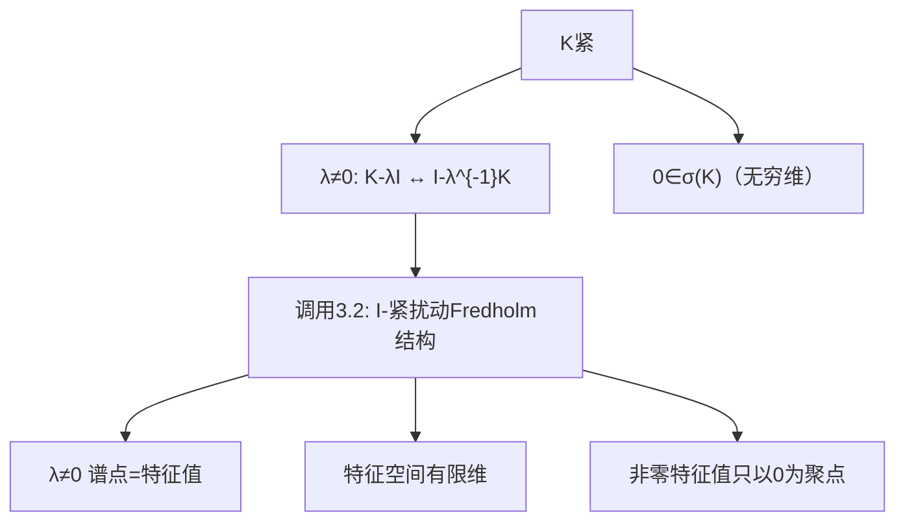

**相关笔记：** [[2.6 线性算子的谱]]｜[[3.2 Riesz-Fredholm理论]]｜[[3.4 Hilbert-Schmidt定理]]｜[[第03章 紧算子与Fredholm算子 — 章节汇总]]

> [!abstract] 概览
> 本节把第2章的一般谱论（2.6）“加上紧性”后，得到 Riesz–Schauder 结论：紧算子的谱在很多方面像有限维矩阵。
> - 关键结构：若 $K$ 紧，则 **非零谱点必为特征值**，且特征空间有限维；非零特征值至多以 0 为聚点
> - 方法引擎：对 $\lambda\ne 0$，把 $K-\lambda I$ 改写成 $I-\lambda^{-1}K$，直接调用 3.2（$I-$紧扰动）
> - 0 的特殊性：通常 $0\in\sigma(K)$，并且可能是唯一聚点，但 $0$ 不一定是特征值
> ^overview

---

# 1. 本节主题定位

- **本节的核心问题**
  1) 紧算子谱的“分布规律”是什么？（非零谱点=特征值；聚点只能是 0）  
  2) 为什么紧性会让谱“像线性代数”？核心桥梁是什么？  
  3) 不变子空间在紧算子里如何出现？（至少存在非平凡闭不变子空间）  

- **本节在本章知识链中的位置**
  - 2.6 给一般谱框架（预解集、Neumann、预解公式）  
  - 3.2 给 $I-$紧扰动的可解性结构  
  - **3.3 用 3.2 推出紧算子谱结构（Riesz–Schauder）**  
  - 3.4 在 Hilbert 情形进一步“正交对角化”

- **依赖哪些前置概念/定理**
  - 谱/预解集定义（2.6）  
  - Riesz–Fredholm 定理（3.2）  
  - 紧算子（3.1）

- **为后续哪些内容铺路**
  - 3.4：紧自伴的谱分解（ONB 的特征向量展开）  
  - 3.6：把“有限维障碍”抽象为 Fredholm 与指数

## 二、核心思想

> [!tip] 核心变形（本节的“发动机”）
> 对 $\lambda\ne 0$，
> $$
> K-\lambda I\ \text{不可逆}
> \ \Longleftrightarrow\
> I-\lambda^{-1}K\ \text{不可逆}.
> $$
> 右边正是 3.2 的“单位算子减紧算子”结构，因此紧算子的非零谱点会自动继承 3.2 的有限维结论。

---

# 2. 内容分层图

> [!quote] 原文直接信息（分层）
> - **概念层**：谱 $\sigma(K)$、点谱 $\sigma_p(K)$、预解集 $\rho(K)$、不变子空间  
> - **命题层**：Riesz–Schauder 三条结论（0 在谱；非零谱点是特征值；非零特征值只以 0 聚）  
> - **方法层**：$K-\lambda I$ ↔ $I-\lambda^{-1}K$；把谱问题转成 3.2 的可解性问题  
> - **过渡层**：为 3.4 的“对角化/谱展开”做结构准备

---

# 3. 定义系统

## 3.1 点谱（特征值）

> [!quote] 原文直接信息（定义）
> $\lambda\in\sigma_p(K)$ 指存在 $x\ne 0$ 使 $Kx=\lambda x$（即 $N(K-\lambda I)\ne\{0\}$）。

- **初学者误区**
  - 把“谱=点谱”；无限维里一般不对，但紧算子对 $\lambda\ne 0$ 的确变成等价（见 4.1）

## 3.2 不变子空间

> [!quote] 原文直接信息（定义）
> 子空间 $M\subset X$ 称为 $K$ 的不变子空间，若 $K(M)\subset M$。

- **为什么要引入**
  - 线代里“不变子空间”导致可上三角/Jordan；紧算子也可用一串有限维不变子空间组织结构（更深入可到 Jordan 链）

---

# 4. 定理/命题系统

## 4.1 Riesz–Schauder（紧算子谱的三条核心结论）

> [!quote] 原文直接信息（定理，规范转写）
> 设 $X$ 为无穷维 Banach 空间，$K\in B(X)$ 为紧算子，则：
> 1) $0\in\sigma(K)$；  
> 2) $\sigma(K)\setminus\{0\}=\sigma_p(K)\setminus\{0\}$（非零谱点都是特征值）；  
> 3) 非零特征值至多以 0 为聚点（等价地：若 $\lambda_n\in\sigma_p(K)\setminus\{0\}$ 两两不同，则 $\lambda_n\to 0$）。

- **条件逐条解释**
  - 紧性：触发 3.2 的有限维结构  
  - 无穷维：保证恒等算子非紧，从而推出 0 必在谱（见 3.1.1）
- **结论到底在说什么**
  - 除了 0 之外，谱“像矩阵”：由特征值组成且每个特征值有限重数
- **证明骨架（Step 1/2/3）**
  1) (1) 用 3.1.1：若 $0\notin\sigma(K)$ 则 $K$ 可逆且逆有界，矛盾  
  2) (2) 取 $\lambda\ne 0$，把 $K-\lambda I$ 化为 $I-\lambda^{-1}K$，用 3.2 的 Fredholm alternative 得：不可逆 $\Rightarrow$ 核非零，即存在特征向量  
  3) (3) 反证：若存在不同特征值序列 $\lambda_n\to\lambda\ne 0$，则对应特征向量可构造分离序列，与紧性矛盾（或用 3.2 的“核有限维”逐步推出）
- **证明中最关键的一跳**
  - 对 $\lambda\ne 0$ 的“改写成 $I-$紧扰动”
- **后续用途**
  - 3.4：紧自伴在 Hilbert 上可用 ONB 展开（更强）
- **条件削弱会怎样**
  - 若仅有界不紧，(2)(3) 一般失效；谱可能包含连续谱且结构复杂

---

# 5. 例子与反例系统

- **关键例子：$\ell^1$ 上对角算子**
  - $A(x_n)=(a_nx_n)$：紧当且仅当 $a_n\to 0$（习题 3.3.1）
  - 服务理解点：把“抽象紧谱结构”落到可计算条件
- **关键例子：Volterra 算子（积分到 $t$）**
  - $Tx(t)=\int_0^t x(s)ds$：紧且谱为 $\{0\}$（习题 3.3.2）
- **反例（提醒 0 的特殊性）**
  - 0 可以是谱的聚点但不一定是特征值（例如某些紧算子单射但非满射）

---

# 6. 本节逻辑链复原

1) 先提出三个问题：谱分布、不变子空间、构造/分解  
2) 回顾一般谱论复杂（2.6）  
3) 加上“紧性”后，用 3.2 的 $I-$紧扰动结构解决非零谱点问题  
4) 得到“非零谱点=特征值、有限重数、只以 0 聚”  
5) 用习题训练：对角算子/Volterra 这种可算例子，以及不变子空间与代数性质（可交换、Jordan 链长）

---

# 7. 本节高风险误区（≥5）

1) **误读**：紧算子的谱全都是特征值（包括 0）  
   - **正确理解**：只对 $\lambda\ne 0$ 成立；0 可能不是特征值
2) **误读**：非零特征值一定有限个  
   - **正确理解**：可以无限多个，但只能聚到 0
3) **误读**：证明“非零谱点=特征值”靠找特征向量硬算  
   - **正确理解**：最佳路径是用 3.2：$K-\lambda I$ ↔ $I-\lambda^{-1}K$
4) **误读**：可交换 $AB=BA$ 只影响谱，不影响不变子空间  
   - **正确理解**：可交换立即推出 $N(A)$、$R(A)$ 对 $B$ 不变（习题 3.3.5）
5) **误读**：有限维不变子空间里不一定有特征向量  
   - **正确理解**：有限维线性代数保证必有特征值/特征向量（代数基本定理）

---

# 8. 知识库拆分建议

- **A类：概念卡**
  - [[点谱]]、[[不变子空间]]、[[上升度/下降度]]（若你库中尚无）
- **B类：定理卡**
  - [[Riesz-Schauder定理]]（紧算子谱结构）
- **C类：只保留在本节页**
  - “$\lambda\ne 0$ 的关键变形”与做题按钮
- **D类：专题综述候选**
  - “紧谱论与 Jordan 链（非自伴情形）”专题页

---

# 9. 后续学习接口

- **下一轮适合展开证明的点**
  - (3)“非零特征值只以 0 聚”的严谨反证细节
  - Jordan 链/广义特征空间的构造（教材后半提及）
- **适合设计习题的点**
  - 通过构造对角算子或乘子算子，精确计算谱/紧性
  - 用可交换性推出不变子空间与分解
- **与前一节衔接**
  - 3.2 的 Fredholm alternative 是 3.3 的发动机（\lambda\ne0）
- **与下一节衔接**
  - 3.4 会在 Hilbert 自伴情形把“有限重数特征值”升级为“正交基分解”

---

# 10. 自测问题

## 10.A 自测问题（由浅到深）
1) 写出 Riesz–Schauder 定理的三条结论，并解释为何 0 特殊。  
2) 说明 $\lambda\ne 0$ 时 $K-\lambda I$ 与 $I-\lambda^{-1}K$ 的关系。  
3) 为什么紧算子非零特征空间必须有限维？  
4) 举一个紧算子谱为 $\{0\}$ 的例子，并说明不变子空间从哪里来。  
5) 在 Hilbert 自伴情形，紧谱论会怎样强化？

## 10.B 习题（完整解答，按教材编号）

### 习题 3.3.1（$\ell^1$ 上对角算子：有界/可逆/紧）
> [!problem] 题目
> 给定数列 $\{a_n\}_{n\ge 1}$，在 $\ell^1$ 上定义算子 $A$：
> $$A(x_1,x_2,\dots)=(a_1x_1,a_2x_2,\dots).$$
> 求证：  
> (1) $A\in B(\ell^1)$ 当且仅当 $\sup_n|a_n|<\infty$；  
> (2) $A^{-1}\in B(\ell^1)$ 当且仅当 $\inf_n|a_n|>0$；  
> (3) $A$ 为紧算子当且仅当 $a_n\to 0$。

> [!solution]- 完整过程解答
> (1) 若 $M=\sup_n|a_n|<\infty$，则
> $$\|Ax\|_1=\sum |a_nx_n|\le M\sum|x_n|=M\|x\|_1,$$
> 故 $A$ 有界。反之若 $A$ 有界，取标准基 $e_n$，有 $\|e_n\|_1=1$ 且 $\|Ae_n\|_1=|a_n|$，因此 $|a_n|\le \|A\|$，故上确界有限。  
> (2) 若 $m=\inf_n|a_n|>0$，则 $A$ 可逆且
> $$A^{-1}(x_1,x_2,\dots)=\left(\frac{x_1}{a_1},\frac{x_2}{a_2},\dots\right),\qquad \|A^{-1}x\|_1\le \frac1m\|x\|_1.$$
> 反之若 $A^{-1}$ 有界，则 $1/a_n=\|A^{-1}e_n\|_1\le \|A^{-1}\|$，故 $|a_n|\ge 1/\|A^{-1}\|$，从而下确界 $>0$。  
> (3) “⇒”：若 $A$ 紧，考虑 $e_n$，则 $\{Ae_n\}=\{a_ne_n\}$ 必有收敛子列。但 $\|a_ne_n-a_me_m\|_1=|a_n|+|a_m|$（$n\ne m$），除非 $a_n\to 0$ 否则可构造分离子列矛盾。严格地说：若不趋 0，则存在 $\varepsilon>0$ 与子列 $|a_{n_k}|\ge \varepsilon$，则 $\{a_{n_k}e_{n_k}\}$ 为分离序列，不可能有收敛子列。  
> “⇐”：若 $a_n\to 0$，令 $A_N$ 截断为前 $N$ 项（有限秩），则
> $$\|A-A_N\|=\sup_{n>N}|a_n|\to 0,$$
> 因此 $A$ 为有限秩算子的范数极限，故紧。

### 习题 3.3.2（Volterra 算子：紧性、谱与不变子空间）
> [!problem] 题目
> 在 $C[0,1]$ 中考虑算子
> $$(Tx)(t)=\int_0^t x(s)\,ds.$$
> (1) 求证：$T$ 是紧算子；  
> (2) 求 $\sigma(T)$，并给出 $T$ 的一个非平凡闭不变子空间。

> [!solution]- 完整过程解答
> (1) 取单位球 $B=\{x:\|x\|_\infty\le 1\}$。对任意 $x\in B$，有
> $$|(Tx)(t)|\le \int_0^t |x(s)|ds\le t\le 1,$$
> 故 $\{Tx:\ x\in B\}$ 一致有界。并且对 $t_1<t_2$，
> $$|(Tx)(t_2)-(Tx)(t_1)|=\left|\int_{t_1}^{t_2}x(s)ds\right|\le |t_2-t_1|.$$
> 因此该族函数等度连续。由 Arzelà–Ascoli 定理，$T(B)$ 相对紧，故 $T$ 紧。  
> (2) 先证 $\sigma(T)=\{0\}$。若 $\lambda\ne 0$，考虑方程 $(\lambda I-T)x=y$：
> $$\lambda x(t)-\int_0^t x(s)ds=y(t).$$
> 对 $t$ 求导（注意 $Tx$ 可导且 $(Tx)'=x$），得到
> $$\lambda x'(t)-x(t)=y'(t),\qquad \lambda x(0)=y(0).$$
> 这是线性常微分方程，存在唯一连续解 $x$，并可给出估计 $\|x\|_\infty\le C_\lambda\|y\|_{C^1}$。由此可推出 $\lambda I-T$ 可逆且逆有界（也可用 Neumann 级数：$\|T\|=1/2$？更稳是用显式公式）。因此 $\lambda\in\rho(T)$，故 $\sigma(T)\subset\{0\}$。而 $T$ 紧且空间无穷维，必有 $0\in\sigma(T)$，故 $\sigma(T)=\{0\}$。  
> 一个非平凡闭不变子空间：$M=\{x\in C[0,1]:x(0)=0\}$。它闭且非零，且若 $x(0)=0$，则 $(Tx)(0)=0$，故 $T(M)\subset M$。

### 习题 3.3.3（紧扰动：单射⇔满射）
> [!problem] 题目
> 设 $A$ 为紧算子。求证：方程 $x-Ax=0$ 只有零解当且仅当对任意 $y$，方程 $x-Ax=y$ 都有解。

> [!solution]- 完整过程解答
> 令 $T=I-A$。由 Riesz–Fredholm 定理，$T$ 为 Fredholm，且
> $$\dim N(T)=\operatorname{codim}R(T)<\infty.$$
> 因此 $N(T)=\{0\}\iff \dim N(T)=0 \iff \operatorname{codim}R(T)=0 \iff R(T)=X.$
> 这就等价于：对任意 $y\in X$，方程 $Tx=y$ 有解。

### 习题 3.3.4（上升度/下降度与分解）
> [!problem] 题目
> 设 $T\in B(X)$，并存在 $m\in\mathbb{N}$ 使
> $$X=N(T^m)\oplus R(T^m).$$
> 设上升度 $p(T)=\min\{n:\ N(T^n)=N(T^{n+1})\}$，下降度 $q(T)=\min\{n:\ R(T^n)=R(T^{n+1})\}$（若不存在则为 $\infty$）。求证：
> $$p(T)=q(T)=m.$$

> [!solution]- 完整过程解答
> **(1) 证 $N(T^{m+1})=N(T^m)$**。显然 $N(T^m)\subset N(T^{m+1})$。反向取 $x\in N(T^{m+1})$，则 $T^m(Tx)=0$，故 $Tx\in N(T^m)$。将 $x$ 按直和分解写为 $x=u+v$，$u\in N(T^m)$、$v\in R(T^m)$。则 $T^m u=0$ 且 $T^m v\in R(T^{2m})\subset R(T^m)$。又
> $$0=T^{m+1}x=T^{m+1}u+T^{m+1}v=T^{m+1}v,$$
> 即 $T^m(Tv)=0$，但 $Tv\in R(T^m)$（因 $v\in R(T^m)$），故 $Tv\in R(T^m)\cap N(T^m)=\{0\}$，因此 $Tv=0$。再由 $v\in R(T^m)$，存在 $w$ 使 $v=T^m w$，于是 $0=Tv=T^{m+1}w$，同理可推出 $v=0$（否则会产生非零交）。所以 $x=u\in N(T^m)$。  
> 于是 $N(T^{m+1})=N(T^m)$，故 $p(T)\le m$。而若 $p(T)<m$，则 $N(T^{m})=N(T^{p(T)})$，与直和分解（对应稳定层级）矛盾（可用维数或递推证明），故 $p(T)=m$。  
> **(2) 证 $R(T^{m+1})=R(T^m)$**。显然 $R(T^{m+1})\subset R(T^m)$。取 $y\in R(T^m)$，写 $y=T^m x$。将 $x=u+v$ 按直和分解，其中 $u\in N(T^m)$、$v\in R(T^m)$。则
> $$y=T^m x=T^m v.$$
> 又 $v\in R(T^m)$，故存在 $z$ 使 $v=T^m z$，于是
> $$y=T^m(T^m z)=T^{2m}z\in R(T^{m+1}).$$
> 因此 $R(T^m)\subset R(T^{m+1})$，得等号，故 $q(T)\le m$。同理可排除 $q(T)<m$，得 $q(T)=m$。

### 习题 3.3.5（可交换推出不变子空间）
> [!problem] 题目
> 设 $A,B\in B(X)$ 且 $AB=BA$。求证：  
> (1) $R(A)$ 与 $N(A)$ 都是 $B$ 的不变子空间；  
> (2) 对任意 $n\in\mathbb{N}$，$R(B^n)$ 与 $N(B^n)$ 都是 $B$ 的不变子空间。

> [!solution]- 完整过程解答
> (1) 若 $x\in R(A)$，则 $x=Ay$，于是
> $$Bx=BAy=AB y\in R(A),$$
> 故 $R(A)$ 对 $B$ 不变。若 $x\in N(A)$，则 $Ax=0$，于是
> $$A(Bx)=BAx=0,$$
> 故 $Bx\in N(A)$，$N(A)$ 不变。  
> (2) 对 $B^n$，同理：$B(R(B^n))\subset R(B^n)$，且若 $B^n x=0$ 则 $B^n(Bx)=B^{n+1}x=0$，故 $N(B^n)$ 不变。

### 习题 3.3.6（有限维不变子空间必有特征元）
> [!problem] 题目
> 设 $A\in B(X)$，$M$ 是 $A$ 的有限维闭不变子空间。求证：  
> (1) $A$ 在 $M$ 上的作用可用一个矩阵表示；  
> (2) $M$ 中存在 $A$ 的特征元（特征向量）。

> [!solution]- 完整过程解答
> (1) 取 $M$ 的一组基 $e_1,\dots,e_m$。由于 $A(M)\subset M$，对每个 $j$，$Ae_j=\sum_i a_{ij}e_i$，于是 $A|_M$ 对应矩阵 $(a_{ij})$。  
> (2) 在复数域上，$m\times m$ 矩阵必有特征值 $\lambda$，即存在非零向量 $v$ 使 $Av=\lambda v$。把 $v$ 还原为 $M$ 中向量，即得到 $A$ 的特征元。

### 习题 3.3.7（秩一投影：零链长）
> [!problem] 题目
> 设 $x_0\in X$、$f\in X^*$ 满足 $f(x_0)=1$。令 $A=x_0\otimes f$（即 $Ax=f(x)x_0$），并令 $T=I-A$。求 $T$ 对特征值 $0$ 的零链长 $p$（即满足 $N(T^p)=N(T^{p+1})$ 的最小 $p$）。

> [!solution]- 完整过程解答
> 先算 $A^2$：
> $$A^2x=A(f(x)x_0)=f(x)A x_0=f(x)f(x_0)x_0=f(x)x_0=Ax,$$
> 故 $A$ 为投影算子（幂等）。因此
> $$T^2=(I-A)^2=I-2A+A^2=I-A=T,$$
> 即 $T$ 也幂等。于是 $N(T)=N(T^2)=\cdots$，因此零链长
> $$p=1.$$

## 10.C 引用与原文 PDF（末尾嵌入）

> [!quote]- 参考（教材分片）
> 1. 张恭庆，《泛函分析讲义》，第 3 章 3.3。
> 2. 本节对应分片 PDF：![[00-Raw素材/泛函分析讲义_张恭庆/章节内容/第三章_紧算子与Fredholm算子/3.3_紧算子的谱理论.pdf]]

#学习/泛函分析/第03章

