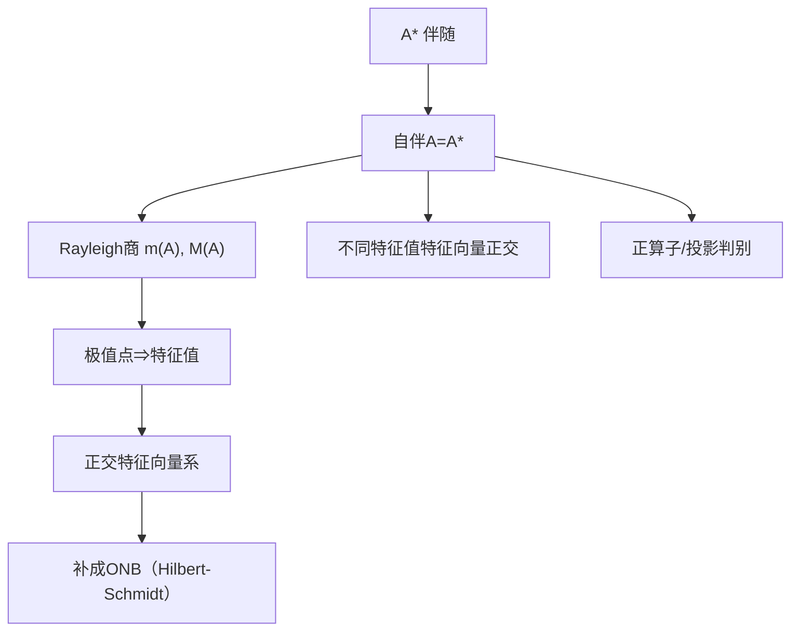

**相关笔记：** [[2.2 Riesz表示定理及其应用]]｜[[3.3 紧算子的谱理论]]｜[[3.5 对椭圆型方程的应用]]｜[[第03章 紧算子与Fredholm算子 — 章节汇总]]

> [!abstract] 概览
> 本节在 Hilbert 空间上研究“对称/自伴 + 紧”的算子：它们可被正交特征向量“对角化”，从而得到谱展开式（Hilbert–Schmidt 定理）。这把 3.3 的“非零谱点是特征值”进一步强化为：==存在正交规范基由特征向量组成==。
> - 关键条件：紧 + 自伴（缺一不可）
> - 关键输出：特征值全实、可数、只以 0 聚；特征向量可取正交 ONB；算子可写为谱级数
> - 应用接口：3.5 椭圆型方程把问题化为对称紧算子后，解结构与特征值问题可系统处理
> ^overview

---

# 1. 本节主题定位

- **本节的核心问题**
  1) 什么是伴随 $A^*$？什么是对称/自伴算子？  
  2) 为什么“自伴 + 紧”能推出“正交特征向量基”（对角化）？  
  3) 极值（Rayleigh 商）如何给出特征值与谱端点？  

- **本节在本章知识链中的位置**
  - 3.3：紧算子非零谱点为特征值（但不保证有 ONB）  
  - **3.4：加入自伴结构 ⇒ 可正交对角化（Hilbert-Schmidt）**  
  - 3.5：应用中常得到对称紧算子（能做谱分解）

- **依赖哪些前置概念/定理**
  - Hilbert 空间与 Riesz 表示（2.2）  
  - 紧算子与紧谱论（3.1/3.3）

- **为后续哪些内容铺路**
  - 椭圆型方程的特征值问题（3.5.2）

## 二、核心思想

> [!tip] 核心方法论
> 自伴算子最强的“可用结构”是 Rayleigh 商 $(Ax,x)/\|x\|^2$ 的极值原理：  
> - 先在单位球上找极值（紧性保证可取到/或可抽收敛子列），  
> - 极值点满足变分条件 ⇒ 特征方程。  
> 然后用“不同特征值对应特征向量正交”组织出正交系，最后补成 ONB。

---

# 2. 内容分层图

> [!quote] 原文直接信息（分层）
> - **概念层**：伴随 $A^*$；对称/自伴；正算子；正交投影  
> - **命题层**：自伴算子谱实；紧自伴必有非零特征值；Hilbert–Schmidt 定理（正交基分解）  
> - **方法层**：Rayleigh 商极值 + 正交分解；矩阵/级数表示（$\ell^2$ 上的核）  
> - **过渡层**：把“紧谱论”升级为“正交对角化”，为 PDE 应用提供可计算结构

---

# 3. 定义系统

## 3.1 伴随算子 $A^*$

> [!quote] 原文直接信息（定义）
> 设 $H$ 为复 Hilbert 空间，$A\in B(H)$。算子 $A^*$ 定义为满足
> $$\langle Ax,y\rangle=\langle x,A^*y\rangle\qquad(\forall x,y\in H)$$
> 的唯一算子。

- **条件作用**
  - Hilbert 内积结构保证存在且唯一（由 Riesz 表示）
- **初学者误区**
  - 把 $A^*$ 当成矩阵的转置：在复 Hilbert 中更像“共轭转置”

## 3.2 对称/自伴算子

> [!quote] 原文直接信息（定义）
> $A$ 称为对称（自伴），若 $A=A^*$（等价于 $\langle Ax,y\rangle=\langle x,Ay\rangle$）。

## 3.3 正算子（positive operator）

> [!quote] 原文直接信息（定义）
> $A$ 称为正算子，若
> $$\langle Ax,x\rangle\ge 0\qquad(\forall x\in H).$$

---

# 4. 定理/命题系统

## 4.1 紧自伴的谱分解（Hilbert–Schmidt 定理，主结论）

> [!quote] 原文直接信息（定理，信号式）
> 若 $A$ 为 Hilbert 空间上的紧自伴算子，则存在由 $A$ 的特征向量组成的正交规范基 $\{e_n\}$，以及实特征值序列 $\lambda_n\to 0$，使
> $$Ax=\sum_{n\ge 1}\lambda_n\langle x,e_n\rangle e_n\quad(\forall x\in H),$$
> 级数在 $H$ 中收敛。

- **条件逐条解释**
  - 紧：保证能抽取收敛子列/极值可取到，确保存在特征值链条  
  - 自伴：保证特征值为实、特征向量正交，从而可组织 ONB  
- **证明骨架（Step 1/2/3）**
  1) 用 Rayleigh 商在单位球上取极值，得到一个非零特征值与特征向量  
  2) 在正交补上迭代，得到一列正交特征向量与特征值  
  3) 证明正交系完备，并得到谱展开式
- **关键一跳**
  - “极值点满足变分条件 ⇒ Ax=\lambda x”

---

# 5. 例子与反例系统

- **关键例子：$\ell^2$ 上的平方可和矩阵（Hilbert-Schmidt）**
  - $\sum_{i,j}|a_{ij}|^2<\infty$ 定义算子 $Ax$，则 $A$ 紧；若 $a_{ij}=\overline{a_{ji}}$，则 $A$ 自伴紧（习题 3.4.9）
- **关键反例方向**
  - 紧但非自伴：仍可能有谱点，但不保证 ONB 对角化  
  - 自伴但不紧：谱可能包含连续谱（例如恒等算子谱为 $\{1\}$ 但仍非紧且无“趋零特征值列”结构）

---

# 6. 本节逻辑链复原

1) 先定义伴随 $A^*$，把 Hilbert 上的“转置”概念抽象化  
2) 定义自伴/正算子与正交投影，建立几何语言  
3) 用 Rayleigh 商引出谱端点并连接特征值  
4) 在“紧 + 自伴”框架下得到特征向量正交系并补成 ONB  
5) 把这一结构作为 3.5 PDE 应用的主工具

---

# 7. 本节高风险误区（≥5）

1) **误读**：紧就能对角化  
   - **正确理解**：一般需“自伴/正常”等额外结构；本节是“紧+自伴”
2) **误读**：对称等同于“矩阵对称”  
   - **正确理解**：复 Hilbert 中对应“共轭对称”（Hermitian）
3) **误读**：$(Ax,x)$ 实数 ⇒ $A$ 自伴  
   - **正确理解**：需对所有 $x$ 成立且再加极化恒等式才能推出自伴（习题 3.4.2 的味道）
4) **误读**：投影算子只需 $P^2=P$  
   - **正确理解**：正交投影还要自伴 $P=P^*$
5) **误读**：正算子与自伴无关  
   - **正确理解**：正算子必自伴（习题 3.4.7(1)）

---

# 8. 知识库拆分建议

- **A类：概念卡**
  - [[伴随算子]]、[[自伴算子]]、[[正算子]]、[[正交投影]]
- **B类：定理卡**
  - [[Hilbert-Schmidt定理]]（紧自伴谱分解）
  - “不同特征值特征向量正交”
- **C类：只保留在本节页**
  - Rayleigh 商极值法的做题模板
- **D类：专题综述候选**
  - “变分法→特征值”的统一套路页

---

# 9. 后续学习接口

- **证明可深化点**
  - Rayleigh 商极值的严谨性：为何能取到极值（紧性/弱收敛+强收敛）
  - ONB 完备性：为何正交补不能再有非零像
- **出题点**
  - 投影/正算子/自伴的等价刻画
  - Hilbert-Schmidt 核给紧性与自伴性判别
- **与上一节衔接**
  - 3.3 给“非零谱点是特征值”；3.4 给“正交特征向量基 + 展开式”

---

# 10. 自测问题

## 10.A 自测问题（由浅到深）
1) 写出伴随 $A^*$ 的定义，并解释为什么存在唯一。  
2) 证明自伴算子特征值为实的关键一跳是什么？  
3) 为什么紧自伴算子一定有非零特征值（若算子非零）？  
4) 正交投影算子与“自伴+幂等”有什么关系？  
5) 写出 Hilbert–Schmidt 定理的谱展开式，并解释 $\lambda_n\to 0$ 的来源。

## 10.B 习题（完整解答，按教材编号）

### 习题 3.4.1（伴随与范数性质）
> [!problem] 题目
> 设 $A\in B(H)$。求证：$A+A^*$、$AA^*$、$A^*A$ 都是自伴算子，并且
> $$\|AA^*\|=\|A^*A\|=\|A\|^2.$$

> [!solution]- 完整过程解答
> 自伴性：$(A+A^*)^*=A^*+A=A+A^*$；$(AA^*)^*=AA^*$；$(A^*A)^*=A^*A$。  
> 范数：对任意 $x$，
> $$\|Ax\|^2=\langle Ax,Ax\rangle=\langle A^*Ax,x\rangle\le \|A^*A\|\|x\|^2,$$
> 故 $\|A\|^2\le \|A^*A\|$。另一方面 $\|A^*A\|\le \|A^*\|\|A\|=\|A\|^2$（且 $\|A^*\|=\|A\|$），故 $\|A^*A\|=\|A\|^2$。同理 $\|AA^*\|=\|A\|^2$。

### 习题 3.4.2（由二次型控制算子范数）
> [!problem] 题目
> 设 $A\in B(H)$，并满足 $\langle Ax,x\rangle\in\mathbb{R}$（$\forall x$），且
> $$\langle Ax,x\rangle=0\Rightarrow x=0.$$
> 求证：
> $$\|Ax\|^2\le \|A\|\langle Ax,x\rangle\qquad(\forall x\in H).$$

> [!solution]- 完整过程解答
> 由极化恒等式可知“$\langle Ax,x\rangle$ 恒为实数”推出 $A$ 自伴。且题设给出二次型正定，因此 $A$ 为正算子并且 $\langle Ax,x\rangle>0$（$x\ne 0$）。  
> 对正算子可定义 $A^{1/2}$，并有 $\langle Ax,x\rangle=\|A^{1/2}x\|^2$。于是
> $$\|Ax\|=\|A^{1/2}(A^{1/2}x)\|\le \|A^{1/2}\|\|A^{1/2}x\|.$$
> 两边平方得
> $$\|Ax\|^2\le \|A^{1/2}\|^2\|A^{1/2}x\|^2=\|A\|\langle Ax,x\rangle.$$

### 习题 3.4.3（Rayleigh 商端点属于谱；紧时端点是特征值）
> [!problem] 题目
> 设 $A$ 为 Hilbert 空间上的有界自伴算子，令
> $$m(A)=\inf_{\|x\|=1}\langle Ax,x\rangle,\qquad M(A)=\sup_{\|x\|=1}\langle Ax,x\rangle.$$
> 求证：  
> (1) $\sigma(A)\subset[m(A),M(A)]$ 且 $m(A),M(A)\in\sigma(A)$；  
> (2) 若 $A$ 还是紧算子且 $m(A)\ne 0$，则 $m(A)\in\sigma_p(A)$；  
> (3) 若 $A$ 还是紧算子且 $M(A)\ne 0$，则 $M(A)\in\sigma_p(A)$。

> [!solution]- 完整过程解答
> (1) 若 $\lambda>M(A)$，则对 $\|x\|=1$，
> $$\langle (\lambda I-A)x,x\rangle=\lambda-\langle Ax,x\rangle\ge \lambda-M(A)>0.$$
> 由 Lax–Milgram 型估计可得 $\lambda I-A$ 单射且值域闭并有下界，进而可逆（细节：自伴给出谱实与最小模估计）。同理 $\lambda<m(A)$ 时可逆。故谱包含于区间。  
> 且 $\lambda>M(A)$ 属于预解集，故谱与预解集分界点 $M(A)$ 必在谱中；同理 $m(A)\in\sigma(A)$。  
> (2)(3) 若 $A$ 紧自伴，取单位球上使 $\langle Ax_n,x_n\rangle\to M(A)$ 的极大化序列。由紧性可取子列使 $Ax_{n_k}$ 收敛，再用自伴与极化可推出 $x_{n_k}$ 在弱意义收敛并最终得到极值点 $x$，满足变分条件 $Ax=M(A)x$，故 $M(A)$ 为特征值（$M(A)\ne 0$ 避免退化到 0）。$m(A)$ 同理。

### 习题 3.4.4（紧自伴非零必有非零特征值；不变子空间含特征元）
> [!problem] 题目
> 设 $A$ 为紧自伴算子。求证：  
> (1) 若 $A\ne 0$，则 $A$ 至少有一个非零特征值；  
> (2) 若 $M$ 为 $A$ 的非零不变子空间，则 $M$ 中必含 $A$ 的特征元。

> [!solution]- 完整过程解答
> (1) 取 $x$ 使 $\|x\|=1$ 且 $\|Ax\|>0$。考虑 $A$ 在单位球上的 Rayleigh 商 $r(x)=\langle Ax,x\rangle$，其上确界 $M(A)$ 满足 $M(A)\ne 0$（否则 $A=0$）。由 3.4.3(3) 得 $M(A)$ 为特征值。  
> (2) 在闭子空间 $M$ 上考虑限制算子 $A|_M$，它仍紧且自伴。若 $M$ 非零，则 $A|_M$ 非零或至少可在 $M$ 内重复(1)的极值论证，得到 $M$ 内存在特征向量。

### 习题 3.4.5（正交投影 ⇔ 自伴且幂等）
> [!problem] 题目
> 求证：$P\in B(H)$ 是正交投影算子当且仅当  
> (1) $P=P^*$；(2) $P^2=P$。

> [!solution]- 完整过程解答
> “⇒”：正交投影满足 $H=R(P)\oplus R(P)^\perp$，且 $P$ 在 $R(P)$ 上为恒等、在正交补上为 0，显然幂等；并由 $\langle Px,y\rangle=\langle x,Py\rangle$ 得自伴。  
> “⇐”：若 $P^2=P$，则 $H=R(P)\oplus N(P)$（一般投影分解）。再用 $P=P^*$ 推出 $N(P)=R(P)^\perp$：若 $x\in N(P)$、$y\in R(P)$，则 $\langle x,y\rangle=\langle x,Py\rangle=\langle P^*x,y\rangle=\langle Px,y\rangle=0$。反之若 $x\perp R(P)$，则对任意 $y$ 有 $\langle Px,y\rangle=\langle x,Py\rangle=0$，故 $Px=0$。因此 $N(P)=R(P)^\perp$，即为正交投影。

### 习题 3.4.6（投影的二次型刻画）
> [!problem] 题目
> 求证：$P\in B(H)$ 是正交投影当且仅当
> $$(Px,x)=\|Px\|^2\qquad(\forall x\in H).$$

> [!solution]- 完整过程解答
> 若 $P$ 为正交投影，则 $Px\perp (I-P)x$，于是
> $$\|x\|^2=\|Px\|^2+\|(I-P)x\|^2,$$
> 且 $(Px,x)=(Px,Px+(I-P)x)=\|Px\|^2$。  
> 反之若 $(Px,x)=\|Px\|^2$，则对任意 $x$，
> $$(Px,(I-P)x)=(Px,x)-(Px,Px)=0,$$
> 即 $Px\perp (I-P)x$。因此 $P$ 为正交投影到 $R(P)$（并可推出 $P^2=P$ 与自伴）。

### 习题 3.4.7（正算子的基本性质）
> [!problem] 题目
> 称 $A\in B(H)$ 为正算子若 $(Ax,x)\ge 0$。求证：  
> (1) 正算子必自伴；  
> (2) 正算子的一切特征值都是非负实数。

> [!solution]- 完整过程解答
> (1) 对任意 $x,y$，由极化恒等式
> $$4\langle Ax,y\rangle=\sum_{k=0}^3 i^k \langle A(x+i^k y),x+i^k y\rangle,$$
> 右边全由二次型决定且为实数的线性组合，因此可推出 $\langle Ax,y\rangle=\langle x,Ay\rangle$，即 $A$ 自伴。  
> (2) 若 $Ax=\lambda x$（$x\ne 0$），则
> $$\lambda\|x\|^2=\langle Ax,x\rangle\ge 0,$$
> 因此 $\lambda\in\mathbb{R}$ 且 $\lambda\ge 0$。

### 习题 3.4.8（子空间包含 ⇔ 投影差为正算子）
> [!problem] 题目
> 设 $L,M$ 为 $H$ 的闭线性子空间。求证：$L\subset M$ 当且仅当 $P_M-P_L$ 是正算子。

> [!solution]- 完整过程解答
> “⇒”：若 $L\subset M$，则 $P_M$ 在 $L$ 上为恒等，而 $P_L$ 也是恒等；并且 $R(P_M-P_L)\subset M\cap L^\perp$。对任意 $x$，
> $$\langle (P_M-P_L)x,x\rangle=\|P_Mx\|^2-\|P_Lx\|^2\ge 0,$$
> （因 $P_Lx$ 是 $P_Mx$ 在子空间 $L$ 上的投影，范数不增）。  
> “⇐”：若 $P_M-P_L\ge 0$，取 $x\in L$，则 $P_Lx=x$，且
> $$0\le \langle (P_M-P_L)x,x\rangle=\langle P_Mx,x\rangle-\|x\|^2\le \|P_Mx\|\|x\|-\|x\|^2\le 0,$$
> 得等号，推出 $\|P_Mx\|=\|x\|$ 且 $x=P_Mx\in M$，故 $L\subset M$。

### 习题 3.4.9（平方可和矩阵定义的算子是紧；对称则自伴紧）
> [!problem] 题目
> 设数列矩阵 $(a_{ij})$ 满足 $\sum_{i,j\ge 1}|a_{ij}|^2<\infty$。在 $\ell^2$ 上定义
> $$(Ax)_i=\sum_{j\ge 1}a_{ij}x_j.$$
> 求证：  
> (1) $A$ 是紧算子；  
> (2) 若 $a_{ij}=\overline{a_{ji}}$，则 $A$ 是紧自伴算子。

> [!solution]- 完整过程解答
> (1) 这是 Hilbert-Schmidt 算子：对任意 $x$，
> $$\|Ax\|_2^2=\sum_i\left|\sum_j a_{ij}x_j\right|^2\le \sum_i\left(\sum_j|a_{ij}|^2\right)\left(\sum_j|x_j|^2\right)=\left(\sum_{i,j}|a_{ij}|^2\right)\|x\|_2^2.$$
> 故 $A$ 有界。再用“截断矩阵”$A^{(N)}$（仅保留 $i,j\le N$）得到有限秩算子，且 $\|A-A^{(N)}\|_{HS}\to 0$，从而 $\|A-A^{(N)}\|\le \|A-A^{(N)}\|_{HS}\to 0$，因此 $A$ 为有限秩算子范数极限，故紧。  
> (2) 若 $a_{ij}=\overline{a_{ji}}$，则对任意 $x,y$，
> $$\langle Ax,y\rangle=\sum_{i,j}a_{ij}x_j\overline{y_i}=\sum_{i,j}x_j\overline{a_{ji}y_i}=\langle x,Ay\rangle,$$
> 因此 $A=A^*$，即自伴；并已知紧。

### 习题 3.4.10（用谱条件刻画紧性：自伴且“远离0只有限多谱点”）
> [!problem] 题目
> 设 $A$ 为 $H$ 上自伴算子，且存在由 $A$ 的特征元组成的正交规范基。并假设  
> (1) 对任意 $\lambda\in\sigma_p(A)\setminus\{0\}$，$\dim N(\lambda I-A)<\infty$；  
> (2) 对任意 $\varepsilon>0$，集合 $\sigma_p(A)\setminus[-\varepsilon,\varepsilon]$ 只有有限多个值。  
> 求证：$A$ 是紧算子。

> [!solution]- 完整过程解答
> 由题设 ONB 由特征向量组成，故存在正交基 $\{e_n\}$ 与对应实数 $\lambda_n$ 使 $Ae_n=\lambda_ne_n$。条件(1)(2) 等价于：除 0 外特征值可数且每个有限重数，并且非零特征值只能以 0 为聚点，即 $\lambda_n\to 0$。  
> 令 $A_N$ 为截断算子：
> $$A_Nx=\sum_{n=1}^N \lambda_n\langle x,e_n\rangle e_n,$$
> 则 $A_N$ 有限秩。对任意 $\|x\|=1$，
> $$\|(A-A_N)x\|^2=\sum_{n>N}|\lambda_n|^2|\langle x,e_n\rangle|^2\le \left(\sup_{n>N}|\lambda_n|\right)^2\sum_{n>N}|\langle x,e_n\rangle|^2\le \left(\sup_{n>N}|\lambda_n|\right)^2.$$
> 故 $\|A-A_N\|\le \sup_{n>N}|\lambda_n|\to 0$。因此 $A$ 为有限秩算子范数极限，故紧。

## 10.C 引用与原文 PDF（末尾嵌入）

> [!quote]- 参考（教材分片）
> 1. 张恭庆，《泛函分析讲义》，第 3 章 3.4。
> 2. 本节对应分片 PDF：![[00-Raw素材/泛函分析讲义_张恭庆/章节内容/第三章_紧算子与Fredholm算子/3.4_Hilbert-Schmidt定理.pdf]]

#学习/泛函分析/第03章

