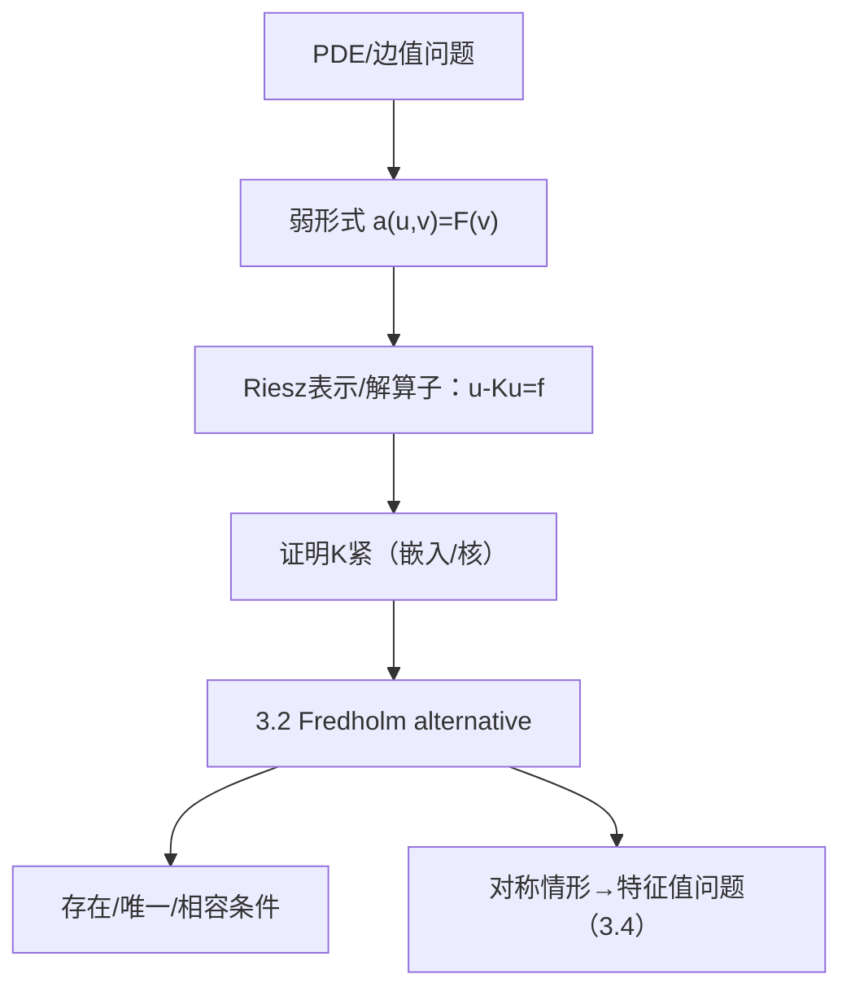

**相关笔记：** [[3.2 Riesz-Fredholm理论]]｜[[3.4 Hilbert-Schmidt定理]]｜[[第03章 紧算子与Fredholm算子 — 章节汇总]]

> [!abstract] 概览
> 本节展示“紧算子 + Fredholm alternative”如何进入 PDE：许多边值问题可被改写为
> $$(I-K)u=f,$$
> 其中 $K$ 是紧算子（来自紧嵌入、积分表示或解算子）。于是解的存在性/唯一性与“齐次解空间/相容条件”直接由 3.2 给出；而在对称情形下还可转成特征值问题（对接 3.4）。
> - 核心桥梁：把 PDE 变成算子方程（弱形式/积分形式）
> - 核心工具：3.2 的 Fredholm alternative
> - 核心风险：必须指出紧性来源（否则结论不成立）
> ^overview

---

# 1. 本节主题定位

- **本节的核心问题**
  1) 为什么椭圆型边值问题能写成“单位算子减紧算子”的形式？  
  2) 在这种形式下，可解性结构如何由 3.2 一键给出？  
  3) 何时会转成“特征值问题”（对称/自伴结构）？

- **本节在本章知识链中的位置**
  - 3.1–3.3：紧算子与紧谱论  
  - 3.4：Hilbert 情形对称紧算子对角化  
  - **3.5：把上述抽象结构落地到 PDE 的存在性/相容条件/特征值**

- **依赖哪些前置概念/定理**
  - 3.2 Riesz–Fredholm（解结构/相容条件）  
  - 2.2 Riesz 表示（把弱形式转成算子）  
  - 3.1 紧性工具（说明 $K$ 紧的来源）

- **为后续哪些内容铺路**
  - 以后遇到任何 “$Lu=f$ + 边界条件” 都可优先尝试：弱形式 → 算子方程 → 紧性 → Fredholm

## 二、核心思想

> [!tip] 这节真正要学的不是某个 PDE
> 而是“把 PDE 变成可用的算子框架”的流程：
> 1) 选对 Hilbert/Banach 空间（能量空间）  
> 2) 写弱形式（双线性型 + 线性泛函）  
> 3) 用 Riesz 表示得到算子（常见为 $I-K$）  
> 4) 指出 $K$ 的紧性来源  
> 5) 直接套 3.2 给出：唯一性/相容条件/解的结构

---

# 2. 内容分层图

> [!quote] 原文直接信息（分层）
> - **概念层**：弱解、能量空间、紧嵌入、解算子  
> - **命题层**：把问题写成 $u-Ku=f$；Fredholm alternative 给出可解性二选一；特征值问题  
> - **方法层**：弱形式 + Riesz 表示；紧性来自嵌入/积分核  
> - **过渡层**：把“PDE存在性”转为“紧算子谱/特征值”

---

# 3. 定义系统

## 3.1 弱解/能量空间（本节的“空间选择”）

> [!quote] 原文直接信息（信号式）
> 椭圆型方程通常在某个 Hilbert 空间（如 $H^1_0(\Omega)$）中定义弱解：$u$ 满足对一切测试函数 $v$ 有 $a(u,v)=F(v)$。

- **重要条件的作用**
  - “空间选得对”才能让 $a(\cdot,\cdot)$ 有界且强制/半强制；紧性也往往来自该空间到较弱空间的紧嵌入
- **最可能“看懂但不会用”的点**
  - 只会写弱形式，但不会指出“紧性从哪里来”（没有紧性就不能用 Fredholm）

---

# 4. 定理/命题系统

## 4.1 典型结构：$u-Ku=f$ 的 Fredholm 可解性

> [!quote] 原文直接信息（结论口径）
> 若能把问题写成 $u-Ku=f$ 且 $K$ 为紧算子，则由 3.2：
> - $N(I-K)$ 有限维；
> - $R(I-K)$ 闭且余维有限；
> - 非齐次可解性由有限个相容条件（来自 $N((I-K)^*)$）刻画。

- **条件逐条解释**
  - 关键不是 PDE 本身，而是“$K$ 紧”的来源（嵌入/积分核/解算子紧性）

## 4.2 对称情形：转为特征值问题

> [!quote] 原文直接信息（信号式）
> 若进一步得到对称/自伴结构（常见来自对称双线性型），则可用 3.4 的谱分解把可解性与特征值联系起来。

---

# 5. 例子与反例系统

- **关键例子（服务理解点：PDE→算子方程）**
  - 把某类边值问题通过 Green 函数/积分表示写成 $u-Ku=f$，其中 $K$ 为积分算子（核在 $L^2$ 或连续）
- **关键反例方向（服务理解点：紧性门槛）**
  - 若 $K$ 仅有界不紧，则“有限维相容条件”的结构可能失败（值域不闭、余核无限维等）

---

# 6. 本节逻辑链复原

1) 先给出 PDE 的弱形式（把“微分”转为“泛函/双线性型”）  
2) 用 Riesz 表示/算子理论把弱形式写成算子方程 $u-Ku=f$  
3) 指出 $K$ 的紧性来源（本节真正的关键条件）  
4) 直接套 3.2 得到存在/唯一/相容条件  
5) 若有自伴结构，进一步转入特征值与谱分解（3.4）

---

# 7. 本节高风险误区（≥5）

1) **误读**：只要写成 $u-Ku=f$ 就能用 Fredholm  
   - **正确理解**：必须明确 $K$ 紧；否则 3.2 不适用
2) **误读**：相容条件来自齐次解空间 $N(I-K)$  
   - **正确理解**：相容条件来自 $N((I-K)^*)$（Hilbert 情形可写成正交条件）
3) **误读**：弱解自动是强解  
   - **正确理解**：需要 PDE 正则性理论；本节的泛函分析部分只给弱解存在性框架
4) **误读**：对称双线性型就一定能用 3.4 对角化  
   - **正确理解**：还需对应算子紧自伴（紧性与自伴性都要点名）
5) **误读**：紧性来自“区域有界”这么一句话  
   - **正确理解**：紧性通常来自具体嵌入定理或核函数性质，需要明确写出引用与使用位置

---

# 8. 知识库拆分建议

- **A类：概念卡**
  - [[弱解]]、[[能量空间]]、[[紧嵌入]]、[[相容条件]]
- **B类：定理卡**
  - “$u-Ku=f$ 的 Fredholm alternative 版可解性”
- **C类：只保留在本节页**
  - “PDE→算子方程”流程清单
- **D类：专题综述候选**
  - “泛函分析在 PDE 中的标准模板：弱形式→紧性→Fredholm/谱”

---

# 9. 后续学习接口

- **证明可深化点**
  - $K$ 紧的严格来源（Sobolev 紧嵌入/积分核）  
  - 对偶相容条件如何在 Hilbert 情形变成正交条件
- **出题点**
  - 给出一个 PDE/积分方程，要求识别并证明对应 $K$ 紧  
  - 给定齐次解空间，写出非齐次可解的相容条件
- **与前一节衔接**
  - 3.4 给谱分解，3.5 把谱分解用于特征值型 PDE
- **与后一节衔接**
  - 3.6 将把 $I-K$ 的结构抽象为 Fredholm，给出指数与稳定性

---

# 10. 自测问题

## 10.A 自测问题（由浅到深）
1) 为什么椭圆型方程常在 Hilbert 空间里写弱形式？  
2) 把 “$Lu=f$” 写成 “$u-Ku=f$” 的关键步骤是什么？  
3) 在 Fredholm alternative 中，相容条件来自哪一个空间？  
4) 紧性在证明中具体用在“哪一步”？如果没有紧性会发生什么？  
5) 什么时候可以把可解性问题进一步转化为特征值问题？

## 10.B 习题（完整解答，按教材编号）

### 习题 3.5.1（Fredholm alternative：对称紧算子情形）
> [!problem] 题目
> 设 $A$ 为 Hilbert 空间 $H$ 上的紧自伴算子。求证：对任意 $f\in H$，方程
> $$x-Ax=f$$
> 只有下列两种情况之一：  
> (i) 对所有 $f$ 都存在唯一解；  
> (ii) 齐次方程 $x-Ax=0$ 有非零解，且非齐次方程可解当且仅当 $f$ 与齐次方程的所有解正交。

> [!solution]- 完整过程解答
> 令 $T=I-A$。由 3.2（Riesz–Fredholm）知：$N(T)$ 有限维、$R(T)$ 闭且余维有限，并且 Fredholm alternative 成立：  
> - 若 $N(T)=\{0\}$，则由 $\operatorname{codim}R(T)=\dim N(T)=0$ 得 $R(T)=H$，故对所有 $f$ 唯一可解。  
> - 若 $N(T)\ne\{0\}$，则解的存在性由相容条件决定：$f\in R(T)$ 当且仅当对所有 $y\in N(T^*)$ 有 $\langle f,y\rangle=0$。  
> 现在利用自伴性：$A=A^*$，故 $T^*=(I-A)^*=I-A=T$，于是 $N(T^*)=N(T)$。因此相容条件变为
> $$\langle f,y\rangle=0\qquad(\forall y\in N(T)),$$
> 即 $f\perp N(T)$。这就是(ii)的结论。

### 习题 3.5.2（特征值问题：存在非零解的充要条件）
> [!problem] 题目
> 设 $A$ 为 Hilbert 空间 $H$ 上紧自伴算子。求证：关于参数 $\lambda$ 的方程
> $$x-\lambda Ax=0$$
> 存在非零解当且仅当 $\lambda^{-1}$ 是 $A$ 的非零特征值（等价地：$\lambda\ne 0$ 且 $\lambda^{-1}\in\sigma_p(A)$）。

> [!solution]- 完整过程解答
> 若存在非零解 $x\ne 0$，则
> $$x=\lambda Ax\quad\Rightarrow\quad Ax=\lambda^{-1}x,$$
> 即 $\lambda^{-1}$ 是 $A$ 的特征值。  
> 反之若 $Ax=\mu x$（$x\ne 0$）且 $\mu\ne 0$，取 $\lambda=\mu^{-1}$，则 $x-\lambda Ax=x-\mu^{-1}\mu x=0$，存在非零解。  
> 因此“存在非零解” $\Longleftrightarrow$ “$\lambda^{-1}$ 是 $A$ 的非零特征值”。

## 10.C 引用与原文 PDF（末尾嵌入）

> [!quote]- 参考（教材分片）
> 1. 张恭庆，《泛函分析讲义》，第 3 章 3.5。
> 2. 本节对应分片 PDF：![[00-Raw素材/泛函分析讲义_张恭庆/章节内容/第三章_紧算子与Fredholm算子/3.5_对椭圆型方程的应用.pdf]]

#学习/泛函分析/第03章

