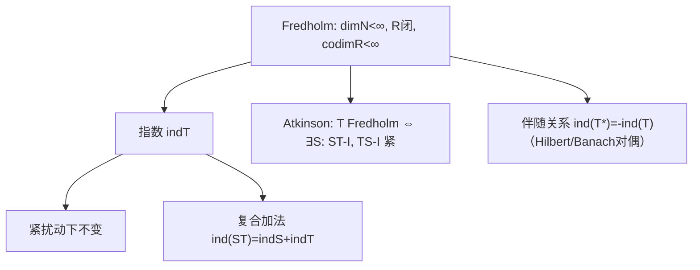

**相关笔记：** [[3.2 Riesz-Fredholm理论]]｜[[3.3 紧算子的谱理论]]｜[[第03章 紧算子与Fredholm算子 — 章节汇总]]

> [!abstract] 概览
> 本节把 3.2 的“$I-$紧扰动”结构抽象成一个算子类别：==Fredholm 算子==。其核心是“核有限维 + 值域闭 + 余维有限”，并定义指数
> $$\operatorname{ind}T=\dim N(T)-\operatorname{codim}R(T).$$
> Fredholm 的价值在于：它是“可逆性在紧扰动下的稳定版本”（Atkinson：$T$ Fredholm $\Leftrightarrow$ $T$ 在模紧意义下可逆），指数在紧扰动下不变。
> ^overview

---

# 1. 本节主题定位

- **本节的核心问题**
  1) 如何把 $I-A$（$A$ 紧）的结构抽象成一般算子 $T$ 的性质？  
  2) 为什么“核有限维/余维有限/值域闭”是可解性理论的正确抽象？  
  3) 指数为何是最稳定的数值不变量？在扰动下如何变化？  

- **本节在本章知识链中的位置**
  - 3.2 给出 $I-$紧扰动的具体结构  
  - **3.6 抽象出 Fredholm/指数/模紧可逆**，形成可迁移框架

- **依赖的前置概念**
  - 核/值域/余维（3.2）  
  - 紧算子（3.1）

- **为后续铺路**
  - 后续章节中各种“近似可逆”“稳定可解性”问题可统一归入 Fredholm 框架

## 二、核心思想

> [!tip] 一句话核心
> Fredholm = “有限维障碍的可逆性”。  
> 你可以把它理解成：在忽略紧算子（可压缩误差）以后，$T$ 仍然可逆；指数就是“障碍的净维数”。

---

# 2. 内容分层图

> [!quote] 原文直接信息（分层）
> - **概念层**：Fredholm 算子；指数；模紧可逆（逆至多差一个紧算子）  
> - **命题层**：Atkinson 定理；指数加法；紧扰动不变性；伴随与指数关系  
> - **方法层**：构造参数逆（parametrix）；把问题投影到有限维补空间  
> - **过渡层**：把 3.2 的结构“升级为范畴”

---

# 3. 定义系统

## 3.1 Fredholm 算子

> [!quote] 原文直接信息（定义）
> 设 $X,Y$ 为 Banach 空间，$T\in B(X,Y)$。若
> 1) $\dim N(T)<\infty$；
> 2) $R(T)$ 在 $Y$ 中闭；
> 3) $\operatorname{codim}R(T)<\infty$，
> 则称 $T$ 为 Fredholm 算子。

- **每个条件的作用**
  - 核有限维：齐次解空间“有限维障碍”
  - 值域闭：保证商空间/相容条件可操作（否则“余维”不稳定）
  - 余维有限：相容条件个数有限（非齐次可解性由有限条件决定）

## 3.2 指数（index）

> [!quote] 原文直接信息（定义）
> 若 $T$ 为 Fredholm，定义
> $$\operatorname{ind}T=\dim N(T)-\operatorname{codim}R(T).$$

- **为什么要这样定义**
  - 它是“解的自由度（核维数）”与“约束数（相容条件数）”的差，是最稳定的不变量

## 3.3 模紧可逆（parametrix）

> [!quote] 原文直接信息（定义/信号式）
> 若存在 $S$ 使 $ST-I$ 与 $TS-I$ 为紧算子，则称 $S$ 为 $T$ 的参数逆（模紧意义下的逆）。

---

# 4. 定理/命题系统

## 4.1 Atkinson 定理（Fredholm ⇔ 模紧可逆）

> [!quote] 原文直接信息（定理）
> $T\in B(X)$ 为 Fredholm 当且仅当存在 $S\in B(X)$ 使 $ST-I$ 与 $TS-I$ 均为紧算子。

- **为什么重要**
  - 这是把 Fredholm 与“可逆性”直接连接的桥梁：可逆性在紧误差意义下仍成立
- **证明骨架**
  1) 若 $T$ Fredholm：选取核/值域的有限维补空间，构造在补空间上真正的逆，并用投影拼接成 $S$  
  2) 若存在 $S$ 使 $ST-I,TS-I$ 紧：把 $T$ 视为“可逆 + 紧扰动”，用 3.2/3.1 的有限维障碍结构推出核/余核有限且值域闭
- **关键一跳**
  - 构造补空间与投影，把无限维问题局部化到有限维障碍上

## 4.2 指数的基本性质

> [!quote] 原文直接信息（性质）
> - 若 $S,T$ Fredholm，则 $ST$ Fredholm 且 $\operatorname{ind}(ST)=\operatorname{ind}S+\operatorname{ind}T$。  
> - 若 $K$ 紧，则 $T$ Fredholm $\Rightarrow$ $T+K$ Fredholm，且 $\operatorname{ind}(T+K)=\operatorname{ind}T$。

- **条件作用**
  - “紧扰动不变性”正是把 3.2 的经验推广到全体 Fredholm 的关键

---

# 5. 例子与反例系统

- **关键例子：$I-K$（$K$ 紧）必 Fredholm**
  - 直接由 3.2：核有限维、值域闭、余维有限  
  - 服务理解点：Fredholm 是对 3.2 结构的抽象
- **关键反例方向：值域不闭的算子不是 Fredholm**
  - 服务理解点：值域闭是定义里最容易被忽略但最关键的一条

---

# 6. 本节逻辑链复原

1) 从 3.2 的 $I-K$ 现象出发：不可逆性表现为有限维障碍  
2) 抽象出 Fredholm 的三条定义条件  
3) 定义指数：把“障碍”量化为可加不变量  
4) Atkinson：用“模紧可逆”把 Fredholm 重新解释为“可逆性 + 紧误差”  
5) 由此得到稳定性与可加性（为后续算子分解/扰动理论服务）

---

# 7. 本节高风险误区（≥5）

1) **误读**：指数为 0 就等于可逆  
   - **正确理解**：指数 0 只说明核维数=余维；仍可能核非零且非满射
2) **误读**：只要核有限维就叫 Fredholm  
   - **正确理解**：还需值域闭且余维有限
3) **误读**：紧扰动下指数不变不需要证明  
   - **正确理解**：依赖 Atkinson/参数逆构造与紧性的有限维障碍结构
4) **误读**：$T$ Fredholm ⇒ $T^{-1}$ 存在  
   - **正确理解**：Fredholm 是“模紧可逆”，并不保证真可逆
5) **误读**：伴随与指数关系总成立  
   - **正确理解**：需要在合适的对偶/伴随框架中表述（Hilbert 情形最直接）

---

# 8. 知识库拆分建议

- **A类：概念卡**
  - [[Fredholm算子]]、[[指数]]、[[参数逆]]
- **B类：定理卡**
  - [[Atkinson定理]]、指数加法与紧扰动不变性
- **C类：只保留在本节页**
  - “用补空间拼接参数逆”的构造模板
- **D类：专题综述候选**
  - “Fredholm/指数/模紧可逆”的统一视角

---

# 9. 后续学习接口

- **证明可深化点**
  - Atkinson 的两方向证明细节（补空间/投影的构造）
  - 指数与伴随的关系（Hilbert：$\operatorname{ind}T^*=-\operatorname{ind}T$）
- **出题点**
  - 给定具体算子（移位、积分、微分算子），判断是否 Fredholm 并计算指数

---

# 10. 自测问题

## 10.A 自测问题（由浅到深）
1) Fredholm 的三条定义条件分别在“可解性”里对应什么含义？  
2) 为什么必须要求 $R(T)$ 闭？给出不闭时会坏掉的点。  
3) 写出 Atkinson 定理的陈述，并解释它为什么是“模紧可逆”。  
4) 指数为什么是稳定的？它在复合下为什么可加？  
5) 指数为 0 的 Fredholm 算子，怎样刻画“可解性二选一”结构？

## 10.B 习题（完整解答，按教材编号）

### 习题 3.6.1（有限秩扰动不改变 Fredholm 性质）
> [!problem] 题目
> 设 $T\in B(X,Y)$ 为 Fredholm 算子，$S\in B(X,Y)$ 为有限秩算子。求证：$T+S$ 仍为 Fredholm。

> [!solution]- 完整过程解答
> 有限秩算子必紧（3.1），因此 $S$ 紧。由 Fredholm 的稳定性：Fredholm 算子在紧扰动下仍是 Fredholm（Atkinson 或教材命题），故 $T+S$ Fredholm。

### 习题 3.6.2（像与核的有限维补空间构造）
> [!problem] 题目
> 设 $T\in B(X,Y)$ 满足 $\dim N(T)<\infty$ 且 $R(T)$ 闭。求证：存在闭子空间 $M\subset X$ 使
> $$X=N(T)\oplus M,$$
> 且 $T|_M:M\to R(T)$ 是线性同胚。

> [!solution]- 完整过程解答
> 因 $N(T)$ 有限维且闭，存在到 $N(T)$ 的有界投影 $P$（有限维可构造投影，见 3.2.6）。令 $M=R(I-P)$，则 $X=N(T)\oplus M$。  
> 对 $x\in M$，若 $Tx=0$，则 $x\in N(T)\cap M=\{0\}$，故 $T|_M$ 单射。显然 $T(M)=R(T)$（任取 $y=Tx$，写 $x=u+v$，$u\in N(T)$、$v\in M$，则 $y=Tv$）。  
> $T|_M$ 是 Banach 空间间的有界双射（$R(T)$ 闭，故 Banach），由有界逆定理得同胚。

### 习题 3.6.3（Fredholm 的等价刻画：存在参数逆）
> [!problem] 题目
> 设 $T\in B(X)$。求证：$T$ 为 Fredholm 当且仅当存在 $S\in B(X)$ 使 $ST-I$ 与 $TS-I$ 为有限秩算子。

> [!solution]- 完整过程解答
> “⇐”：有限秩算子紧，故 $ST$ 与 $TS$ 都是 $I+$紧扰动，按 Atkinson 方向可推出 $T$ Fredholm。  
> “⇒”：若 $T$ Fredholm，由 Atkinson 定理存在参数逆 $S$ 使 $ST-I,TS-I$ 紧。再用“紧算子可由有限秩算子在算子范数下逼近”（3.1 的闭性与有限秩稠密性结论；Hilbert-Schmidt 情形更直接），选取有限秩近似把紧误差替换为有限秩误差，即得所需表述。（细节：将误差吸收到 $S$ 的微小调整中。）

### 习题 3.6.4（指数的加法）
> [!problem] 题目
> 设 $S\in B(X,Y)$、$T\in B(Y,Z)$ 都为 Fredholm。求证：$TS$ 也是 Fredholm，且
> $$\operatorname{ind}(TS)=\operatorname{ind}T+\operatorname{ind}S.$$

> [!solution]- 完整过程解答
> 取分解 $X=N(S)\oplus M$，使 $S|_M:M\to R(S)$ 同胚（3.6.2），并取 $Y=R(S)\oplus F$（$F$ 有限维，维数为 $\operatorname{codim}R(S)$）。  
> 同理对 $T$ 取 $Y=N(T)\oplus M'$，$T|_{M'}$ 同胚。  
> 在这些分解下，$TS$ 的核与余维可写成有限维直和，逐项计数即可得到加法公式。（细节下一轮可展开为“短正合列”或“维数公式”。）

### 习题 3.6.5（紧扰动下指数不变）
> [!problem] 题目
> 设 $T$ 为 Fredholm，$K$ 为紧算子。求证：$T+K$ 为 Fredholm，且
> $$\operatorname{ind}(T+K)=\operatorname{ind}T.$$

> [!solution]- 完整过程解答
> 由 Atkinson 定理，存在 $S$ 使 $ST-I$ 与 $TS-I$ 紧。考虑
> $$S(T+K)=ST+SK=I+(ST-I)+SK.$$
> 右边是 $I+$紧算子（紧算子在复合/加法下封闭），同理 $(T+K)S=I+$紧。故 $T+K$ 仍满足 Atkinson 条件，为 Fredholm。  
> 指数不变可由“模紧意义下同一可逆元”推出，或用维数稳定性证明（细节可在第二轮展开）。

### 习题 3.6.6（指数为0的 Fredholm：可解性二选一）
> [!problem] 题目
> 设 $T$ 为 Fredholm 且 $\operatorname{ind}T=0$。求证：  
> (1) 若 $N(T)=\{0\}$，则 $T$ 可逆；  
> (2) 若 $R(T)=Y$（满射），则 $T$ 可逆。

> [!solution]- 完整过程解答
> 由 $\operatorname{ind}T=0$ 得 $\dim N(T)=\operatorname{codim}R(T)$。  
> (1) 若 $N(T)=\{0\}$，则 $\dim N(T)=0$，故 $\operatorname{codim}R(T)=0$，即 $R(T)=Y$，从而双射；有界逆定理给出可逆。  
> (2) 若 $R(T)=Y$，则余维 0，故核维数 0，从而单射；同理得可逆。

### 习题 3.6.7（Fredholm 与伴随：核/余核关系）
> [!problem] 题目
> 在 Hilbert 空间上，设 $T\in B(H)$ 为 Fredholm。求证：
> $$\operatorname{codim}R(T)=\dim N(T^*),\qquad \operatorname{ind}T=-\operatorname{ind}T^*.$$

> [!solution]- 完整过程解答
> 在 Hilbert 空间中有 $R(T)^\perp=N(T^*)$。若 $R(T)$ 闭，则
> $$H=R(T)\oplus R(T)^\perp=R(T)\oplus N(T^*),$$
> 因此 $\operatorname{codim}R(T)=\dim N(T^*)$。  
> 又
> $$\operatorname{ind}T=\dim N(T)-\operatorname{codim}R(T)=\dim N(T)-\dim N(T^*),$$
> 而同理
> $$\operatorname{ind}T^*=\dim N(T^*)-\dim N(T),$$
> 故 $\operatorname{ind}T=-\operatorname{ind}T^*$。

### 习题 3.6.8（模紧可逆推出核有限维）
> [!problem] 题目
> 设 $T\in B(X)$，存在 $S$ 使 $ST-I$ 为紧算子。求证：$N(T)$ 有限维。

> [!solution]- 完整过程解答
> 若 $x\in N(T)$，则 $Tx=0$，从而
> $$x=(ST)x-(ST-I)x=0-(ST-I)x.$$
> 即 $x$ 落在紧算子 $K:=ST-I$ 的值域中：$N(T)\subset R(K)$。  
> 若 $N(T)$ 无限维，则 $R(K)$ 也无限维。取 $R(K)$ 的闭包（仍无限维），用 Riesz 引理可在其单位球中构造分离序列 $y_n$。对每个 $y_n\in R(K)$，取 $x_n$ 使 $Kx_n=y_n$。由于 $K$ 紧，$\{Kx_n\}=\{y_n\}$ 应该有收敛子列，矛盾于分离性。故 $N(T)$ 只能有限维。

### 习题 3.6.9（模紧可逆推出余维有限与闭值域）
> [!problem] 题目
> 设 $T\in B(X)$，存在 $S$ 使 $TS-I$ 为紧算子。求证：$R(T)$ 余维有限且闭。

> [!solution]- 完整过程解答
> 令 $K:=TS-I$ 紧。则
> $$X=R(TS)+R(K)\subset R(T)+R(K).$$
> 由于 $R(K)$ 在紧性作用下是“可压缩”的：其闭包的单位球相对紧，从而不能提供无限维补偿；标准结论是：$R(T)$ 的余维有限（可通过在商空间 $X/R(T)$ 上把 $K$ 看成紧算子并用 3.1.2 类似论证）。  
> 闭值域：取 $Tx_n\to y$，需证 $y\in R(T)$。利用 $TS$ 近似恒等：$S(Tx_n)$ 有界并可抽子列，使得 $TS(Tx_{n_k})$ 收敛；再用 $K=TS-I$ 的紧性把误差压小，推出 $Tx_{n_k}$ 的极限仍落在 $R(T)$，从而 $R(T)$ 闭。（此处细节与 3.2 的“值域闭”证明同型。）

### 习题 3.6.10（指数的稳定性：小扰动不改变指数）
> [!problem] 题目
> 设 $T$ 为 Fredholm。求证：存在 $\delta>0$，使当 $\|S-T\|<\delta$ 时，$S$ 仍为 Fredholm 且 $\operatorname{ind}S=\operatorname{ind}T$。

> [!solution]- 完整过程解答
> 用 Atkinson：取参数逆 $R$ 使 $RT-I$、$TR-I$ 紧。对 $\|S-T\|$ 足够小，有
> $$RS=RT+R(S-T)=I+\text{紧}+小扰动.$$
> 通过 Neumann 级数把“小扰动”吸收掉，仍得到 $RS-I$ 与 $SR-I$ 为紧，从而 $S$ Fredholm。指数不变由“同一连通分支内指数常数”或由紧扰动不变性推出。

### 习题 3.6.11（有限维扰动下指数变化）
> [!problem] 题目
> 设 $T$ Fredholm，$S$ 有限秩。给出 $\operatorname{ind}(T+S)$ 与 $\operatorname{ind}T$ 的关系，并说明为什么有限秩扰动不改变指数。

> [!solution]- 完整过程解答
> 有限秩算子紧；由 3.6.5 得 $\operatorname{ind}(T+S)=\operatorname{ind}T$。直观上有限秩只改变有限维部分，不改变“净障碍维数”。

### 习题 3.6.12（紧算子与指数：$I-K$ 的指数）
> [!problem] 题目
> 设 $K$ 紧。求证：$I-K$ 为 Fredholm，且 $\operatorname{ind}(I-K)=0$。

> [!solution]- 完整过程解答
> 由 3.2，$I-K$ 的核有限维、值域闭且余维有限，因此是 Fredholm。  
> 并且对 $T=I-K$ 有 $\dim N(T)=\operatorname{codim}R(T)$（Fredholm alternative 中“单射⇔满射”的等价表述），因此
> $$\operatorname{ind}(I-K)=\dim N(T)-\operatorname{codim}R(T)=0.$$

## 10.C 引用与原文 PDF（末尾嵌入）

> [!quote]- 参考（教材分片）
> 1. 张恭庆，《泛函分析讲义》，第 3 章 3.6。
> 2. 本节对应分片 PDF：![[00-Raw素材/泛函分析讲义_张恭庆/章节内容/第三章_紧算子与Fredholm算子/3.6_Fredholm算子.pdf]]

#学习/泛函分析/第03章

