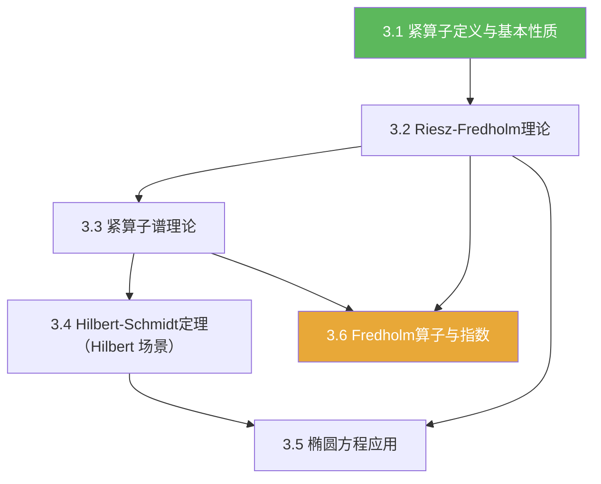

# 第03章 紧算子与Fredholm算子 — 章节汇总

**相关笔记：** [[第02章 线性算子与线性泛函 — 章节汇总]] | [[2.6 线性算子的谱]] | [[Hilbert空间]] | [[3.1 紧算子的定义和基本性质]] | [[3.2 Riesz-Fredholm理论]] | [[3.3 紧算子的谱理论]] | [[3.4 Hilbert-Schmidt定理]] | [[3.5 对椭圆型方程的应用]] | [[3.6 Fredholm算子]]

> [!abstract] 本章一句话
> 本章把“紧性”引入算子论：紧算子使谱结构接近线性代数，并导出 Riesz–Fredholm 理论与 Fredholm 算子/指数，从而把“可解性与相容条件”系统化。

^overview

## 一、知识结构总览

## 二、各节入口（学习路线）

| 节 | 主题 | 你应带走的“可复用结论” |
|---|---|---|
| [[3.1 紧算子的定义和基本性质]] | 紧算子定义/序列刻画 | 有界列像可抽收敛子列；有限秩算子紧 |
| [[3.2 Riesz-Fredholm理论]] | $I-K$ 结构 | 核/余核有限维 + Fredholm 替代 |
| [[3.3 紧算子的谱理论]] | 紧算子谱结构 | 非零谱点是特征值，有限重数，0 为唯一聚点 |
| [[3.4 Hilbert-Schmidt定理]] | Hilbert 场景谱分解 | 紧自伴算子可用正交规范基“对角化” |
| [[3.5 对椭圆型方程的应用]] | 应用套路 | 把 PDE 写成 $(I-K)u=f$ 并用 Fredholm 理论收尾 |
| [[3.6 Fredholm算子]] | Fredholm 与指数 | “离可逆只差有限维”，指数是稳定不变量 |

## 各节概览（嵌入聚合）

- ![[3.1 紧算子的定义和基本性质#^overview]]
- ![[3.2 Riesz-Fredholm理论#^overview]]
- ![[3.3 紧算子的谱理论#^overview]]
- ![[3.4 Hilbert-Schmidt定理#^overview]]
- ![[3.5 对椭圆型方程的应用#^overview]]
- ![[3.6 Fredholm算子#^overview]]

## 三、各节要点（速览）

### 3.1 紧算子的定义和基本性质
- 关键词：相对紧像、序列刻画、有限秩算子、范数闭性  
- 做题套路：证紧用“有界列像可抽收敛子列”；证非紧构造“分离序列”

### 3.2 Riesz-Fredholm理论
- 关键词：$I-K$、核有限维、值域闭、余核有限维、Fredholm alternative  
- 做题套路：把不可逆性写成“齐次方程有非零解 + 非齐次相容条件”

### 3.3 紧算子的谱理论
- 关键词：对 $\lambda\ne 0$，谱点=特征值；非零谱点离散；聚点只能是 $0$  
- 做题套路：$K-\lambda I$ 不可逆 $\Leftrightarrow I-\lambda^{-1}K$ 不可逆，然后调用 3.2

### 3.4 Hilbert-Schmidt定理
- 关键词：紧自伴、正交特征向量、ONB、谱展开式  
- 做题套路：先证自伴性，再用“不同特征值对应特征向量正交”组织正交系

### 3.5 对椭圆型方程的应用
- 关键词：弱形式、Riesz 表示、算子方程 $(I-K)u=f$、相容条件  
- 做题套路：三步法：选空间 → Riesz → 识别紧性来源 → Fredholm alternative 输出

### 3.6 Fredholm算子
- 关键词：核有限维、余核有限维、值域闭、指数与稳定性  
- 做题套路：把“可解性结构”编码成指数；紧扰动不改变指数（提示性结论）

## 四、跨章关联（你应看见的主线）

1) **从第02章谱论到第03章紧谱论**：  
在 [[2.6 线性算子的谱]] 里，谱/预解集/Neumann 级数提供一般框架；第03章的关键加料是“紧性”，它使很多结论回到线性代数形态。  

2) **核心变形**：对 $\lambda\ne 0$，
$$
K-\lambda I\ \text{不可逆}\ \Longleftrightarrow\ I-\lambda^{-1}K\ \text{不可逆},
$$
右边正是 3.2 的 $I-$ 紧扰动结构，因此 3.2 是 3.3 的发动机。

3) **从 $I-K$ 到一般 Fredholm**：  
3.2 研究 $I-K$ 的有限维障碍；3.6 把这种“有限维地失败”的现象抽象成 Fredholm 与指数（更适合应用与稳定性讨论）。

## 五、自测清单（复习时逐条打勾）

- [ ] 我能用一句话给出紧算子的定义，并写出序列刻画。  
- [ ] 我能快速构造“有界但非紧”的反例（恒等算子 + 分离序列）。  
- [ ] 我能复述 3.2 的证明骨架：Riesz 引理反证核无限维；值域闭的有界性+紧性抽子列。  
- [ ] 我能说明为什么紧算子对 $\lambda\ne 0$ 的谱点必须是特征值（用 $I-\lambda^{-1}K$）。  
- [ ] 我知道 0 的特殊性：可以是谱的聚点，但不一定是特征值。  
- [ ] 我能说清 Hilbert-Schmidt 定理需要“紧 + 自伴”，并写出谱展开式的样子。  
- [ ] 我能把应用题翻译成 $(I-K)u=f$ 并指出紧性来自哪一步。  
- [ ] 我能解释 Fredholm 指数的含义：“解的自由度”减去“相容条件的个数”。  

## 六、本章索引（Wiki 导航）

**节笔记：** [[3.1 紧算子的定义和基本性质]] | [[3.2 Riesz-Fredholm理论]] | [[3.3 紧算子的谱理论]] | [[3.4 Hilbert-Schmidt定理]] | [[3.5 对椭圆型方程的应用]] | [[3.6 Fredholm算子]]

**concepts：** [[紧算子]] [[有限秩算子]] [[相对紧集]] [[Fredholm算子]] [[Fredholm指数]] [[Hilbert-Schmidt算子]]

**theorems：** [[Riesz-Fredholm定理]] [[Fredholm选择定理]] [[紧算子谱定理]] [[Hilbert-Schmidt定理]]

**旧概念回链：** [[有界线性算子]] [[算子范数]] [[谱]] [[预解集]] [[谱半径]] [[Neumann级数]] [[Hilbert空间]]

## 七、补充理解与易混淆点

> [!info] 两条最常见“误区修正”
> 1) **紧算子一定有界，但有界算子未必紧**；紧性本质是“把有界集送到相对紧集”。  
> 2) 紧算子的谱在很多方面“像有限维”：**非零谱点都是特征值且有限重数**，而 $0$ 可能是唯一聚点；但 **$0$ 不一定是特征值**。  
>
> 做题提示：遇到形如 $ (I-K)u=f $ 且 $K$ 紧，优先套用 **Fredholm 替代**：核/余核有限维，解的存在性由有限个相容条件决定（见 [[Riesz-Fredholm定理]] / [[Fredholm选择定理]]）。
>
> > [!quote]- 参考（联网权威来源）
> > - [Compact operator (Wikipedia)](https://en.wikipedia.org/wiki/Compact_operator)
> > - [Fredholm alternative (Wikipedia)](https://en.wikipedia.org/wiki/Fredholm_alternative)
> > - [Operator Theory in Hilbert Spaces Lecture Notes (IITG, MA641)](https://fac.iitg.ac.in/rksri/MA641%20Operator%20Theory%20in%20Hilbert%20Spaces%20lecturenotes%202020.pdf)
> > - [Lecture Notes in Functional Analysis — Compact Operators](https://orthogonalpublishing.com/lnfa/html/compactoperators.html)

## 八、引用（PDF）

![[00-Raw素材/泛函分析讲义_张恭庆/章节内容/第三章_紧算子与Fredholm算子/3.1_紧算子的定义和基本性质.pdf]]
![[00-Raw素材/泛函分析讲义_张恭庆/章节内容/第三章_紧算子与Fredholm算子/3.2_Riesz-Fredholm理论.pdf]]
![[00-Raw素材/泛函分析讲义_张恭庆/章节内容/第三章_紧算子与Fredholm算子/3.3_紧算子的谱理论.pdf]]
![[00-Raw素材/泛函分析讲义_张恭庆/章节内容/第三章_紧算子与Fredholm算子/3.4_Hilbert-Schmidt定理.pdf]]
![[00-Raw素材/泛函分析讲义_张恭庆/章节内容/第三章_紧算子与Fredholm算子/3.5_对椭圆型方程的应用.pdf]]
![[00-Raw素材/泛函分析讲义_张恭庆/章节内容/第三章_紧算子与Fredholm算子/3.6_Fredholm算子.pdf]]
