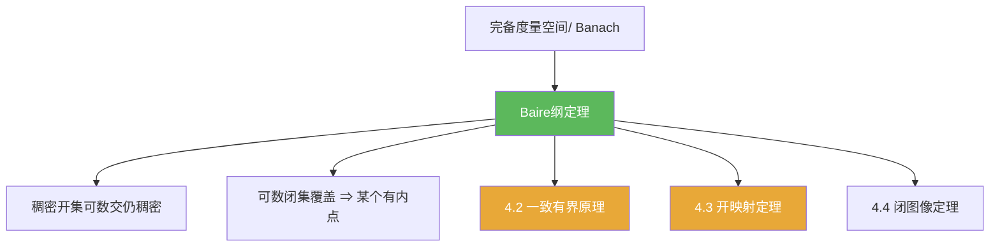

**相关笔记：** [[第03章 紧算子与Fredholm算子 — 章节汇总]] | [[3.6 Fredholm算子]] | [[4.2 一致有界原理]] | [[第04章 Baire纲定理的应用 — 章节汇总]] | 对照：[[2.3 纲与开映射定理]] | 预备：[[完备度量空间]] [[Banach空间]]

> [!abstract] 概览
> ==Baire 纲定理==把“完备性”变成一个极其强力的存在性工具：在完备度量空间里，“可数多个稀薄坏集”凑不成整个空间。  
> 你需要带走：
> - 两个常用表述：稠密开集可数交仍稠密；可数闭集覆盖则某个闭集有内点
> - 标准证明骨架：构造一列嵌套闭球并用完备性取极限点
> - 典型用法模板：把“坏性质”写成 $X=\bigcup_n F_n$（闭）或 $X=\bigcup_n A_n$（无处稠密），再用定理抽出一个“好球”
> - 下一节连接：一致有界原理/开映射/闭图像都是它的直接应用

^overview

---

## 一、知识结构总览

---

## 二、核心思想

> [!tip] 方法论：把“存在性”转成“找一个球”
> Baire 纲定理的证明与应用，几乎都围绕同一个动作：  
> **在一串稠密开集里选嵌套球** $\overline{B}(x_1,r_1)\supset \overline{B}(x_2,r_2)\supset\cdots$ 且 $r_n\to 0$，再用完备性得到极限点 $x$ 同时落在所有集合中。

### 1) 两种常用表述

> [!thm] Baire 纲定理（稠密开集交）
> 设 $X$ 为完备度量空间，$U_1,U_2,\dots$ 为 $X$ 中稠密开集，则
> $$
> \bigcap_{n=1}^\infty U_n
> $$
> 在 $X$ 中仍稠密（特别地：非空）。

> [!thm] Baire 纲定理（闭集覆盖版）
> 设 $X$ 为完备度量空间，$F_1,F_2,\dots$ 为闭集且 $X=\bigcup_{n=1}^\infty F_n$，则存在 $N$ 使得 $F_N$ 有非空内点（等价于：某个 $F_N$ 在某个球上“占满一块”）。

> [!def] 第一纲集 / 残余集（直觉版）
> - 第一纲集：可数个无处稠密集的并（“很稀薄”）。  
> - 残余集：第一纲集的补（“在 Baire 空间里很大”，典型是稠密的）。

### 2) 证明骨架（稠密开集交版）

> [!faq]- 证明骨架（记住 4 句就够用）
> 1) 取任意非空开球 $B_0$，目标是在 $B_0$ 里找到点落在所有 $U_n$。  
> 2) 由于 $U_1$ 稠密开，$B_0\cap U_1$ 非空开，取闭球 $\overline{B}(x_1,r_1)\subset B_0\cap U_1$。  
> 3) 递推：在 $\overline{B}(x_n,r_n)\cap U_{n+1}$ 里再取更小闭球 $\overline{B}(x_{n+1},r_{n+1})$，并令 $r_{n+1}<2^{-(n+1)}$。  
> 4) 由嵌套闭球与 $r_n\to 0$ 得到 $(x_n)$ 为 Cauchy，完备性给出极限点 $x$；再用闭球包含关系推出 $x\in \bigcap_n U_n\cap B_0$。

### 3) 应用写法模板（如何“套” Baire）

> [!tip] 模板 A：用“闭集覆盖 ⇒ 有内点”
> 你想证明“存在一个点/一个球满足某性质”。  
> 常把空间写成 $X=\bigcup_n F_n$（$F_n$ 闭），其中 $F_n$ 表示“坏程度 ≤ n”。  
> Baire 告诉你：某个 $F_N$ 有内点，因此在某个球上坏程度统一被 $N$ 控制（这就是 4.2 的核心结构）。

> [!tip] 模板 B：用“稠密开集交仍稠密”
> 你想证明“一类好对象很多（稠密/典型）”。  
> 把“好性质”写成 $\bigcap_n U_n$（每个 $U_n$ 都开且稠密），即可推出典型性。

---

## 三、补充理解与易混淆点

> [!info] 为什么“完备性”如此关键？
> 证明里需要从嵌套闭球中取一个共同点，这一步本质上是在取 Cauchy 列的极限；因此没有完备性就可能“极限跑出空间外”，定理失败。

> [!info] Baire 空间的常见例子
> - 任意完备度量空间都是 Baire 空间（最常用）。  
> - 任意局部紧 Hausdorff 空间也是 Baire（更一般但本书多用前者）。

> [!warning] 不要把“第一纲集”理解成“测度为 0”
> 范畴（category）与测度（measure）是两套“大小”概念：  
> 第一纲集可以有正测度，测度为 0 的集合也可能不是第一纲集。

> [!warning] “稠密”不等于“很大”
> 稠密集可以非常稀薄（例如有理数在 $\mathbb{R}$ 中稠密却可数）。Baire 说的是“可数稀薄坏集凑不满”，而不是“稠密就强大”。

> [!quote]- 参考（联网权威来源）
> - [Baire category theorem (Wikipedia)](https://en.wikipedia.org/wiki/Baire_category_theorem)
> - [Baire space (Wikipedia)](https://en.wikipedia.org/wiki/Baire_space)
> - [Baire category theorem notes (R. M. Dudley, MIT)](https://math.mit.edu/~rbm/18.155-F16/L5.pdf)

---

## 四、习题精选

> [!todo] 习题概览
> | 题号 | 核心考点 | 难度 |
> |---|---|---|
> | 4.1.A | 稠密开集交的应用（典型性） | ⭐⭐⭐ |
> | 4.1.B | 闭集覆盖版的应用（抽“好球”） | ⭐⭐⭐⭐ |
> | 4.1.C | 完备性不可少的反例意识 | ⭐⭐⭐ |

> [!problem] 练习 4.1.1（闭集覆盖版）
> 设 $X$ 为完备度量空间，$F_n$ 为闭集且 $X=\bigcup_n F_n$。证明：存在 $N$ 与某个开球 $B(x,r)$ 使得 $B(x,r)\subset F_N$。

> [!faq]- 提示
> 反证：若每个 $F_n$ 都无内点，则 $X\setminus F_n$ 为稠密开集；用稠密开集交版推出 $\bigcap_n (X\setminus F_n)$ 非空，从而与 $\bigcup_n F_n=X$ 矛盾。

> [!problem] 练习 4.1.2（典型性表述）
> 设 $X$ 为完备度量空间，$A_n$ 都是无处稠密集。证明：$X\setminus \bigcup_n A_n$ 稠密。

> [!faq]- 提示
> 注意 $U_n:=X\setminus \overline{A_n}$ 是稠密开集；用 Baire 定理得 $\bigcap_n U_n$ 稠密，并且 $\bigcap_n U_n\subset X\setminus\bigcup_n A_n$。

> [!problem] 练习 4.1.3（反例意识）
> 给出一个“非完备”的度量空间 $X$，使得 $X$ 可以写成可数个闭集的并，但每个闭集都没有内点（从而说明 Baire 定理要求完备性）。

> [!faq]- 提示
> 典型选择：$X=\mathbb{Q}$（继承 $\mathbb{R}$ 的度量）。  
> 利用：$\mathbb{Q}$ 是可数的，单点集闭且无内点。

---

## 五、引用

- 张恭庆《泛函分析讲义》第04章第1节  
- 分片 PDF：![[00-Raw素材/泛函分析/04_第4章_Baire纲定理的应用/4.1_Baire纲定理.pdf]]

## 参见 Wiki

- concepts：[[Baire空间]] [[第一纲集]] [[完备度量空间]] [[Banach空间]]  
- theorems：[[Baire纲定理]]
