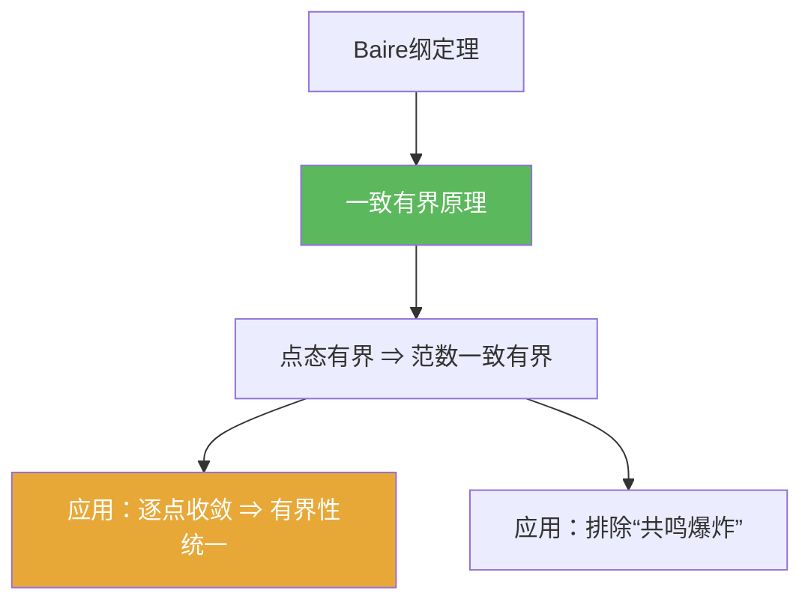

**相关笔记：** [[4.1 Baire纲定理]] | [[4.3 开映射定理]] | [[第04章 Baire纲定理的应用 — 章节汇总]] | 对照：[[2.3 纲与开映射定理]] | 预备：[[Banach空间]] [[有界线性算子]] [[算子范数]]

> [!abstract] 概览
> ==一致有界原理==把“逐点有界”升级为“范数一致有界”：在 Banach 空间上，若一族算子对每个点都不爆炸，则它们的算子范数不会整体爆炸。  
> 你需要带走：
> - 典型输入：对每个 $x$，$\sup_\alpha \|T_\alpha x\|<\infty$
> - 典型输出：$\sup_\alpha \|T_\alpha\|<\infty$
> - 证明套路：构造闭集 $E_n=\{x:\sup_\alpha\|T_\alpha x\|\le n\}$，用 Baire 抽出“好球”，再线性缩放推广
> - 题型信号：题目给“逐点收敛/逐点有界”，想要“算子范数有界/一致控制”，第一反应就是它

^overview

---

## 一、知识结构总览

---

## 二、核心思想

### 1) 定理表述

> [!thm] 一致有界原理（Banach–Steinhaus）
> 设 $X$ 为 Banach 空间，$Y$ 为赋范空间，$\{T_\alpha\}\subset B(X,Y)$。
> 若对每个 $x\in X$ 都有
> $$
> \sup_\alpha \|T_\alpha x\|<\infty,
> $$
> 则
> $$
> \sup_\alpha \|T_\alpha\|<\infty.
> $$

> [!example] 如何读这句话（把它变成“做题用语”）
> - 输入是“对每个固定 $x$ 都有界”（逐点/点态有界）  
> - 输出是“对所有 $x$ 同时被同一个常数控制”（一致有界 / 范数上界）

### 2) 证明骨架：$E_n$ + Baire + 缩放

> [!tip] 关键构造
> 定义
> $$
> E_n:=\{x\in X:\sup_\alpha \|T_\alpha x\|\le n\}.
> $$
> 观察：
> - 每个 $E_n$ 是闭集（用上确界 + 连续性）  
> - 假设给出 $\bigcup_{n=1}^\infty E_n=X$（点态有界意味着每个点属于某个 $E_n$）

> [!faq]- 证明骨架（四步）
> 1) 由点态有界，$X=\bigcup_n E_n$。  
> 2) 由 Baire 纲定理，存在 $N$ 与开球 $B(x_0,r)\subset E_N$。  
> 3) 于是对所有 $\|h\|\le r$，都有 $\sup_\alpha\|T_\alpha(x_0+h)\|\le N$。  
> 4) 用线性性消去 $x_0$，并缩放到单位球：得到存在常数 $C$ 使 $\sup_\alpha\|T_\alpha x\|\le C\|x\|$，从而 $\sup_\alpha\|T_\alpha\|\le C$。

> [!warning] “消去 $x_0$”是常见卡点
> 从 $x_0+h$ 的估计得到 $h$ 的估计，需要用线性性：
> $$
> T_\alpha h = T_\alpha(x_0+h)-T_\alpha x_0.
> $$
> 因为 $x_0\in E_N$，所以 $\sup_\alpha\|T_\alpha x_0\|\le N$ 也有界。

### 3) 两个常见输出模板

> [!tip] 模板 A：逐点收敛 ⇒ 范数一致有界
> 若 $T_nx\to Tx$（对每个 $x$）且每个 $T_n$ 有界，则先推出对每个 $x$，$\sup_n\|T_nx\|<\infty$，再用一致有界原理得 $\sup_n\|T_n\|<\infty$。

> [!tip] 模板 B：构造反例（“如果没有 Banach，会出事”）
> 很多经典反例都说明：若 $X$ 不完备，可能出现对每个点都不爆炸，但算子范数仍可爆炸；本质原因是 Baire 失效。

---

## 三、补充理解与易混淆点

> [!info] 这一定理的“逻辑地位”
> 它与开映射、闭图像一起被称为 Baire 三件套（很多教材把它们作为一章）。  
> 本质：Baire 提供“存在一个球上的统一控制”，线性缩放把局部统一升级为全局统一。

> [!info] “点态有界”比你想象的强
> 注意假设是“对每个点 $x$”，不是“对某个稠密集”。  
> 如果只在稠密子集上点态有界，结论未必成立（做题时要看清题设的量词）。

> [!warning] 不能把它当作“交换 sup 与 norm”
> 这里的结论不是从不等式直接推出来的“代数操作”，而是用 Baire 纲定理做的存在性提升；因此完备性是硬条件。

> [!quote]- 参考（联网权威来源）
> - [Uniform boundedness principle (Wikipedia)](https://en.wikipedia.org/wiki/Uniform_boundedness_principle)
> - [Banach–Steinhaus theorem notes (MIT 18.155)](https://math.mit.edu/~rbm/18.155-F16/L6.pdf)
> - [Uniform boundedness principle notes (UIUC)](https://faculty.math.illinois.edu/~r-ash/RealAnalysis/ubp.pdf)

---

## 四、习题精选

> [!todo] 习题概览
> | 题号 | 核心考点 | 难度 |
> |---|---|---|
> | 4.2.A | $E_n$ 构造与 Baire 关键步 | ⭐⭐⭐⭐ |
> | 4.2.B | 逐点收敛 ⇒ $\sup\|T_n\|<\infty$ | ⭐⭐⭐ |
> | 4.2.C | “量词陷阱”：稠密集上有界不够 | ⭐⭐⭐⭐ |

> [!problem] 练习 4.2.1（证明主骨架）
> 在定理假设下，按 $E_n$ 构造完成一致有界原理的证明。

> [!faq]- 提示
> 关键是：$E_n$ 闭、$\bigcup_n E_n=X$、Baire 抽出某个 $E_N$ 含球、再用线性缩放把“球上的统一控制”变成“单位球上的统一控制”。

> [!problem] 练习 4.2.2（逐点收敛推一致有界）
> 设 $X$ Banach，$Y$ 赋范。若 $T_n\in B(X,Y)$ 且对每个 $x$ 都有 $T_nx$ 收敛（因此有界），证明 $\sup_n \|T_n\|<\infty$。

> [!faq]- 提示
> 先用“收敛 ⇒ 有界”得到对每个 $x$，$\sup_n\|T_nx\|<\infty$，然后直接应用一致有界原理。

> [!problem] 练习 4.2.3（量词陷阱）
> 说明为什么“存在稠密子集 $D\subset X$ 使得对每个 $x\in D$ 有 $\sup_\alpha\|T_\alpha x\|<\infty$”不足以推出 $\sup_\alpha\|T_\alpha\|<\infty$。（不要求给出完整反例，给出思路/警告即可）

> [!faq]- 提示
> 关键在于：一致有界原理需要把 $X$ 写成 $\bigcup_n E_n$，而如果点态有界只在 $D$ 上成立，则你只能得到 $D\subset \bigcup_n E_n$，无法覆盖整个 $X$。

---

## 五、引用

- 张恭庆《泛函分析讲义》第04章第2节  
- 分片 PDF：![[00-Raw素材/泛函分析/04_第4章_Baire纲定理的应用/4.2_一致有界原理.pdf]]

## 参见 Wiki

- concepts：[[Banach空间]] [[有界线性算子]] [[算子范数]]  
- theorems：[[一致有界原理]] [[Baire纲定理]]
