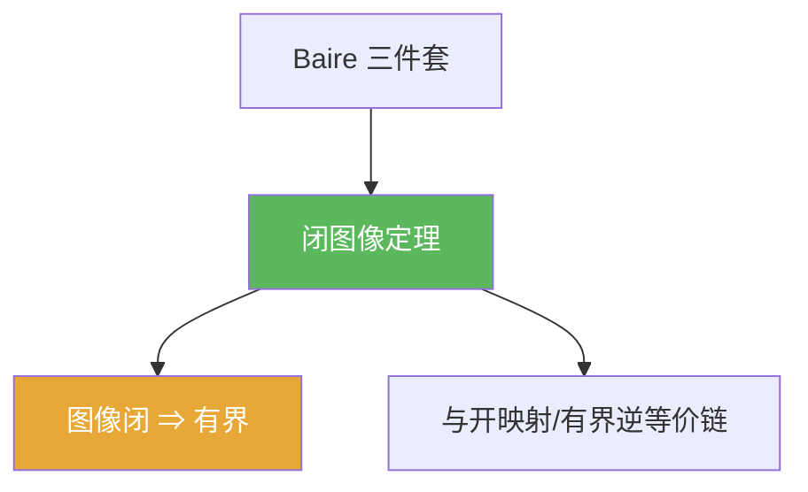

**相关笔记：** [[4.3 开映射定理]] | [[4.5 Besicovitch集]] | [[第04章 Baire纲定理的应用 — 章节汇总]] | 对照：[[2.3 纲与开映射定理]] | 预备：[[Banach空间]] [[线性算子]] [[有界线性算子]]

> [!abstract] 概览
> ==闭图像定理==提供一种极常用的“偷懒判别器”：当你很难直接估计 $\|Tx\|\le C\|x\|$ 时，只要能证明 $T$ 的图像在 $X\times Y$ 中是闭的，就能推出 $T$ 自动有界。  
> 你需要带走：
> - 图像闭：$x_n\to x$ 且 $Tx_n\to y$ ⇒ $y=Tx$
> - 在 Banach 框架下：闭图像 ⇒ 有界（连续）
> - 应用姿势：证明“定义上不显然连续”的算子实际上连续（微分/积分/级数交换等）
> - 与开映射/有界逆的关系：三件套互相可推

^overview

---

## 一、知识结构总览

---

## 二、核心思想

### 1) 图像与闭性

> [!def] 算子图像（graph）
> 对线性算子 $T:X\to Y$，其图像定义为
> $$
> G(T):=\{(x,Tx):x\in X\}\subset X\times Y.
> $$

> [!def] 图像闭（closed graph）
> 称 $T$ 的图像闭，是指：若 $x_n\to x$ 且 $Tx_n\to y$，则必有 $y=Tx$。

> [!warning] “图像闭”不是“值域闭”
> - 图像闭是 $X\times Y$ 中的闭集性质；  
> - 值域闭是 $Y$ 中子空间的闭性。二者不同，做题时要分清。

### 2) 闭图像定理

> [!thm] 闭图像定理
> 设 $X,Y$ 为 Banach 空间，$T:X\to Y$ 为线性算子且定义域为整个 $X$。若 $G(T)$ 在 $X\times Y$ 中闭，则 $T$ 有界（从而连续）。

> [!tip] 为什么需要“定义域为整个 $X$”
> 若 $T$ 只在稠密子空间上定义，则“图像闭”与“有界性”关系会变得更微妙（涉及闭算子理论）；本节只用“全定义”的版本。

### 3) 一条常用推导链：闭图像 ⇔ 开映射（在 Banach 框架下）

> [!info] 记住一个做题用的逻辑链
> 对 Banach 空间中的有界线性算子：
> - 开映射定理：满射 ⇒ 开  
> - 有界逆定理：双射 ⇒ 逆有界  
> - 闭图像定理：图像闭 ⇒ 有界  
> 很多教材会证明它们彼此等价或互推；实际做题时你只需会“选最顺手的那条”。

> [!faq]- 证明骨架（提示性）
> 常见证明把 $G(T)$ 看作 Banach 空间（$X\times Y$ 的闭子空间），再构造投影映射并使用开映射/有界逆定理推出 $T$ 有界。

---

## 三、补充理解与易混淆点

> [!info] 图像闭怎么证？（一行口诀）
> 只要你能把极限交换到 $T$ 里面：  
> “$x_n\to x$ 且 $Tx_n\to y$ ⇒ 由定义/性质推出 $y=Tx$”。  
> 典型场景：积分与极限交换、导数与极限交换、级数逐项操作的合法性。

> [!info] 应用：把“显然线性但不显然有界”的算子变成有界
> 例如：定义 $T$ 为“取导数”“取某种变换”“解某类方程得到的算子”。  
> 直接估计 $\|Tx\|\le C\|x\|$ 往往困难，但证明图像闭往往只需要做一个“极限传递”的论证。

> [!warning] 不能用在非 Banach 情形
> 缺少完备性时，图像闭不一定推出有界；这是 Baire 三件套共同的硬前提。

> [!quote]- 参考（联网权威来源）
> - [Closed graph theorem (Wikipedia)](https://en.wikipedia.org/wiki/Closed_graph_theorem)
> - [Closed graph theorem notes (MIT 18.155)](https://math.mit.edu/~rbm/18.155-F16/L8.pdf)
> - [Functional analysis notes: closed graph theorem (Cambridge)](https://www.dpmms.cam.ac.uk/~bjs57/FA/FA3.pdf)

---

## 四、习题精选

> [!todo] 习题概览
> | 题号 | 核心考点 | 难度 |
> |---|---|---|
> | 4.4.A | 用“图像闭”推出有界性 | ⭐⭐⭐⭐ |
> | 4.4.B | 练习图像闭的验证（极限传递） | ⭐⭐⭐ |
> | 4.4.C | 与开映射/有界逆的互推思路 | ⭐⭐⭐⭐ |

> [!problem] 练习 4.4.1（闭图像 ⇒ 有界：主结论）
> 设 $X,Y$ Banach，$T:X\to Y$ 线性且 $G(T)$ 闭。证明 $T$ 有界。

> [!faq]- 提示
> 可采用“等价链”思路：把 $G(T)$ 看作 $X\times Y$ 的闭子空间，从而也是 Banach；考虑投影映射 $P:G(T)\to X$，$(x,Tx)\mapsto x$，证明它是双射连续，再用有界逆定理推出 $P^{-1}$ 有界，从而得到 $T$ 有界。

> [!problem] 练习 4.4.2（图像闭的验证套路）
> 给出一个你熟悉的算子例子（如积分算子或某个简单变换），写出“若 $x_n\to x$ 且 $Tx_n\to y$，则 $y=Tx$”的验证流程（不必展开全部细节）。

> [!faq]- 提示
> 关键是说明：$Tx_n$ 的极限与定义中的运算可交换（例如：极限与积分交换）。

> [!problem] 练习 4.4.3（互推思路题）
> 说明：在 Banach 框架下，为什么“开映射定理/有界逆定理/闭图像定理”可以互相推出（给出逻辑链即可，不必写全证明）。

> [!faq]- 提示
> 常见链条：开映射 ⇒ 有界逆；有界逆用于证明图像闭的投影同构，从而推出闭图像；闭图像又可用于证明某些满射映射开放。

---

## 五、引用

- 张恭庆《泛函分析讲义》第04章第4节  
- 分片 PDF：![[00-Raw素材/泛函分析/04_第4章_Baire纲定理的应用/4.4_闭图像定理.pdf]]

## 参见 Wiki

- concepts：[[Banach空间]] [[线性算子]] [[有界线性算子]]  
- theorems：[[闭图像定理]] [[开映射定理]] [[有界逆定理]]
