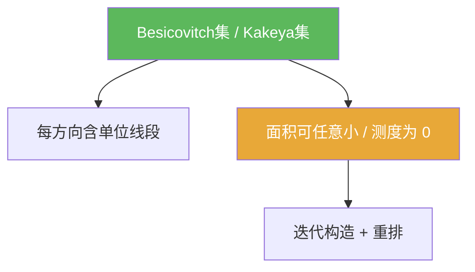

**相关笔记：** [[4.4 闭图像定理]] | [[4.6 习题]] | [[第04章 Baire纲定理的应用 — 章节汇总]] | 预备：[[紧集]] [[第一纲集]]

> [!abstract] 概览
> ==Besicovitch 集==（又称 Kakeya 集）是一类经典反直觉对象：在平面中存在面积可以做得任意小（甚至测度为 0）的集合，却仍然包含“每个方向的一条单位线段”。  
> 你需要带走：
> - 定义：对每个方向都含一条单位线段（方向全覆盖）
> - 主结论（本节核心）：存在测度为 0 的 Besicovitch 集（或“面积可任意小”的构造）
> - 证明骨架：迭代构造 + 几何重排（把“线段方向全”与“面积小”同时满足）
> - 地位：展示“几何直觉在无限过程/范畴方法下可以非常反直觉”

^overview

---

## 一、知识结构总览

---

## 二、核心思想

### 1) 定义与主定理

> [!def] Besicovitch 集（Kakeya 集，平面版）
> 集合 $E\subset \mathbb{R}^2$ 称为 Besicovitch 集，如果对任意方向（单位向量）$v$，存在一条长度为 1 的线段 $I_v$，使得 $I_v$ 平行于 $v$ 且 $I_v\subset E$。

> [!thm] Besicovitch 定理（存在性，提示性表述）
> 在 $\mathbb{R}^2$ 中存在 Besicovitch 集 $E$，其 Lebesgue 测度为 0（更弱但更直观的表述：对任意 $\varepsilon>0$，存在 Besicovitch 集 $E$ 使 $m(E)<\varepsilon$）。

> [!tip] 如何理解这个结论
> “方向全覆盖”听起来像必须占很大面积；但事实是可以通过高度重叠的方式把面积压到极小，同时仍让每个方向出现一条线段。

### 2) 证明骨架（只写可复用的结构，不写长计算）

> [!tip] 结构化骨架：从“很多线段”到“面积很小”
> 常见证明会包含三层构造思想：
> 1) **离散化方向**：先只要求有限多个方向各含一条线段，得到一个“线段森林”。  
> 2) **重排/折叠**：通过几何变换把许多线段尽量叠到一起，显著降低并集面积。  
> 3) **极限化**：让方向网格变得越来越细、面积上界越来越小，取极限得到对所有方向都满足且测度为 0 的集合。

> [!warning] 本节的“极限”是反直觉来源
> 每一步都是有限构造，直觉尚可；反直觉发生在取极限时：  
> 面积上界可以趋于 0，但“每个方向都有线段”通过稠密化方向集合被保留下来。

### 3) 做题时如何用（本节的可复用价值）

> [!info] 题型信号
> - “每个方向都出现” + “想让面积/测度尽量小”  
> - “存在极端反例/反直觉构造”  
> 这些通常提示你：应考虑 Besicovitch/Kakeya 型构造或其变体（即使题目不要求完整证明，也常需要你能描述构造框架）。

---

## 三、补充理解与易混淆点

> [!info] 范畴 vs 测度（再次提醒）
> Besicovitch 集主要是“测度意义下很小”；而 Baire 纲定理讨论的是“范畴意义下很薄”。  
> 它们是两套不同的“大/小”语言，本章把它们放在一起，是为了展示分析学中的两类强力存在性工具。

> [!info] 与 Kakeya 猜想的关系（只需知道名字）
> 高维 Kakeya 集与调和分析/偏微分方程中的 Kakeya 猜想、限制估计等深度问题相关。这里我们只用它作为反直觉示例，不深入。

> [!warning] 不要把本节当作“可计算题”
> 本节更像“结构题”：你要会说清楚对象定义、主结论、证明框架与极限步骤的逻辑，而不是把所有几何计算细节写完。

> [!quote]- 参考（联网权威来源）
> - [Kakeya set (Wikipedia)](https://en.wikipedia.org/wiki/Kakeya_set)
> - [Besicovitch set (Encyclopedia of Mathematics)](https://encyclopediaofmath.org/wiki/Besicovitch_set)
> - [A survey on Kakeya sets (T. Wolff, PDF)](https://www.math.ucla.edu/~tao/247a.1.06f/notes5.pdf)

---

## 四、习题精选

> [!todo] 习题概览
> | 题号 | 核心考点 | 难度 |
> |---|---|---|
> | 4.5.A | 定义的等价口径与基本性质 | ⭐⭐⭐ |
> | 4.5.B | “面积可任意小”版本推出“测度为 0”版本 | ⭐⭐⭐ |
> | 4.5.C | 构造框架复述（离散化→重排→极限） | ⭐⭐⭐⭐ |

> [!problem] 练习 4.5.1（等价口径）
> 说明：若对所有方向的稠密子集（例如有理斜率方向）都含单位线段，并且集合是闭的，那么它对所有方向也含单位线段。（写出理由即可）

> [!faq]- 提示
> 用方向的稠密性取一列方向逼近；闭性保证极限线段仍在集合中（把“逼近”转成“落在里面”）。

> [!problem] 练习 4.5.2（面积趋于 0 ⇒ 测度为 0）
> 设存在一列 Besicovitch 集 $E_n$ 满足 $m(E_n)<2^{-n}$。说明如何构造一个测度为 0 的 Besicovitch 集。

> [!faq]- 提示
> 取适当平移/缩放使“方向条件”保留，再考虑 $E=\bigcap_{k}\bigcup_{n\ge k}E_n$ 或直接取可数并并控制测度上界（注意：要确保“每个方向都有线段”的性质在构造中保留）。

> [!problem] 练习 4.5.3（构造框架复述）
> 用 5–8 句话复述 Besicovitch 集的典型构造思路：怎样同时保证“方向全覆盖”与“面积很小”。

> [!faq]- 提示
> 必须出现三个关键词：方向离散化、重排/折叠造成大量重叠、取极限使方向变稠密且面积上界趋 0。

---

## 五、引用

- 张恭庆《泛函分析讲义》第04章第5节  
- 分片 PDF：![[00-Raw素材/泛函分析/04_第4章_Baire纲定理的应用/4.5_Besicovitch集.pdf]]

## 参见 Wiki

- concepts：[[Besicovitch集]] [[第一纲集]]  
- theorems：[[Besicovitch定理]]
