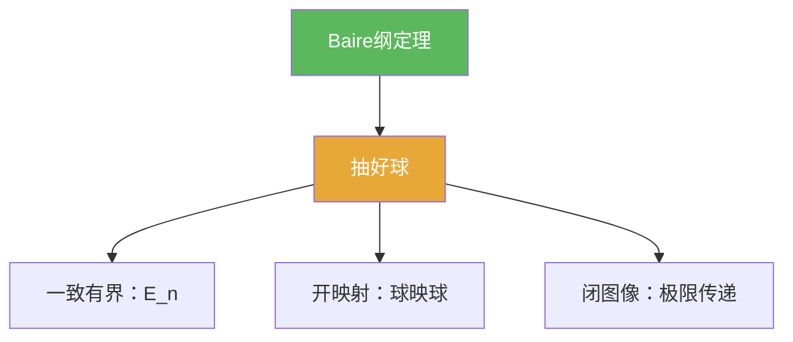

**相关笔记：** [[4.5 Besicovitch集]] | [[4.7 问题]] | [[第04章 Baire纲定理的应用 — 章节汇总]] | 回链：[[4.1 Baire纲定理]] [[4.2 一致有界原理]] [[4.3 开映射定理]] [[4.4 闭图像定理]]

> [!abstract] 概览
> 本节把第04章的“可复用套路”压缩成一页训练题：  
> - 用 Baire 抽“好球”  
> - 用 $E_n$ 构造做一致有界  
> - 用“球映球”做开映射/有界逆  
> - 用“极限传递”验图像闭  
> 目标是：看到题目时能立刻选对工具并写出骨架证明。

^overview

---

## 一、知识结构总览

---

## 二、核心思想（做题套路清单）

> [!tip] 题型 1：看见“可数并/闭集覆盖”就想 Baire
> - 写成 $X=\bigcup_n F_n$（闭）  
> - 推出某个 $F_N$ 有内点  
> - 在一个球上得到统一控制

> [!tip] 题型 2：看见“对每个点都不爆炸”就想一致有界
> - 定义 $E_n=\{x:\sup_\alpha\|T_\alpha x\|\le n\}$  
> - Baire 抽球 $B(x_0,r)\subset E_N$  
> - 线性缩放推 $\sup_\alpha\|T_\alpha\|<\infty$

> [!tip] 题型 3：看见“满射算子/逆算子估计”就想球映球
> - 用开映射定理得到 $T(B_1)\supset B_c$  
> - 直接推出逆有界或稳定常数

> [!tip] 题型 4：看见“定义不显然有界”就想闭图像
> - 证：$x_n\to x$ 且 $Tx_n\to y$ ⇒ $y=Tx$  
> - 得到 $T$ 有界

---

## 三、补充理解与易混淆点

> [!info] 练习的写作要求（按本库规范）
> 你不需要把长证明写完，但必须写出“关键构造 + 关键不等式/关键映射 + 推理链条”，使得读者能补全细节。

> [!warning] 不要跳过量词检查
> 尤其一致有界：题设是否真的是“对每个 $x$”而不是“对稠密集”？

> [!quote]- 参考（联网权威来源）
> - [Uniform boundedness principle (Wikipedia)](https://en.wikipedia.org/wiki/Uniform_boundedness_principle)
> - [Open mapping theorem (Wikipedia)](https://en.wikipedia.org/wiki/Open_mapping_theorem_(functional_analysis))

---

## 四、习题精选

> [!todo] 习题概览
> | 题号 | 覆盖内容 | 难度 |
> |---|---|---|
> | 4.6.A | Baire：闭集覆盖抽内点 | ⭐⭐⭐ |
> | 4.6.B | 一致有界：逐点有界推范数有界 | ⭐⭐⭐⭐ |
> | 4.6.C | 闭图像：用极限传递推有界 | ⭐⭐⭐⭐ |

> [!problem] 练习 4.6.1（Baire 抽好球）
> 设 $X$ 完备度量空间，$F_n$ 闭且 $X=\bigcup_n F_n$。证明存在 $N$ 与球 $B(x,r)$ 使 $B(x,r)\subset F_N$。

> [!faq]- 提示
> 用 4.1 的闭集覆盖版：若每个 $F_n$ 无内点，则补集为稠密开集，可得矛盾。

> [!problem] 练习 4.6.2（一致有界：从逐点收敛开始）
> 设 $X$ Banach，$Y$ 赋范，$T_n\in B(X,Y)$ 且对每个 $x$，$T_nx$ 收敛。证明：$\sup_n\|T_n\|<\infty$。

> [!faq]- 提示
> 收敛列必有界 ⇒ 对每个 $x$，$\sup_n\|T_nx\|<\infty$，然后直接套 4.2。

> [!problem] 练习 4.6.3（闭图像：极限传递）
> 设 $X,Y$ Banach，$T:X\to Y$ 线性。假设你能证明：若 $x_n\to x$ 且 $Tx_n\to y$，则必有 $y=Tx$。说明为什么这足以推出 $T$ 有界。

> [!faq]- 提示
> 这正是“图像闭”的定义；因此可直接调用闭图像定理。

---

## 五、引用

- 张恭庆《泛函分析讲义》第04章第6节  
- 分片 PDF：![[00-Raw素材/泛函分析/04_第4章_Baire纲定理的应用/4.6_习题.pdf]]

## 参见 Wiki

- theorems：[[Baire纲定理]] [[一致有界原理]] [[开映射定理]] [[闭图像定理]]
