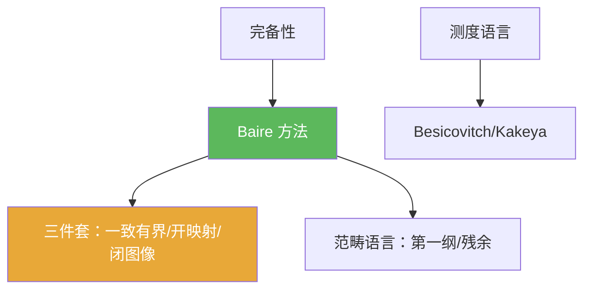

**相关笔记：** [[4.6 习题]] | [[第04章 Baire纲定理的应用 — 章节汇总]] | 回链：[[4.1 Baire纲定理]] [[4.2 一致有界原理]] [[4.5 Besicovitch集]]

> [!abstract] 概览
> 本节收集本章“开放性/延伸性”问题，用于检验你是否真正理解了 Baire 方法的边界与威力：  
> - 哪些结论的关键是“完备性”？  
> - 范畴与测度两套语言如何相互独立？  
> - Besicovitch/Kakeya 现象在更高维会怎样？  
> 这些问题通常不要求完整证明，但要求你能说清逻辑链与关键构造。

^overview

---

## 一、知识结构总览

---

## 二、核心思想（如何回答“问题”）

> [!tip] 回答结构建议
> 1) 先指出题目属于哪类工具（Baire / 测度 / 几何构造 / 反例）  
> 2) 写出关键构造或关键等价变形（例如：$E_n$、球映球、图像闭）  
> 3) 说明哪一步必须用完备性（或为何不需要）  
> 4) 若是反例题：说明反例的“爆点”在哪里（量词、完备性、闭性、稠密性）

---

## 三、补充理解与易混淆点

> [!info] “问题”与“习题”的区别
> 习题偏可计算与训练；问题偏结构理解与边界感。  
> 写作上允许更简短，但必须给出明确的逻辑链条与关键点。

> [!warning] 避免空泛结论
> 不要只写“因为完备所以成立”。至少要指出“完备用于：嵌套闭球取共同点 / Cauchy 列取极限 / Baire 的前提”等具体位置。

> [!quote]- 参考（联网权威来源）
> - [Baire category theorem (Wikipedia)](https://en.wikipedia.org/wiki/Baire_category_theorem)
> - [Kakeya set (Wikipedia)](https://en.wikipedia.org/wiki/Kakeya_set)

---

## 四、习题精选

> [!todo] 问题概览
> | 题号 | 方向 | 难度 |
> |---|---|---|
> | 4.7.A | Baire 失效的反例意识 | ⭐⭐⭐ |
> | 4.7.B | 范畴 vs 测度的独立性 | ⭐⭐⭐⭐ |
> | 4.7.C | Kakeya 现象的高维直觉 | ⭐⭐⭐⭐ |

> [!problem] 问题 4.7.1（Baire 的边界）
> 举出一个你认为“只差一步就能用 Baire”的命题，并说明它为何失败（指出失败点：空间不完备/集合非闭/量词不对等）。

> [!faq]- 提示
> 可以从“一致有界原理的量词陷阱”“非 Banach 的满射不开放”等角度切入。

> [!problem] 问题 4.7.2（范畴与测度的独立性）
> 说明你如何向别人解释：“第一纲集”与“测度 0”互不蕴含。请各给出一个典型例子或解释思路。

> [!faq]- 提示
> 目标不是给严密证明，而是给出可信的例子方向：  
> - 稠密可数集在范畴上很小但测度也为 0；  
> - 也存在范畴小但测度大（或反过来）的例子（可查典型构造名词）。

> [!problem] 问题 4.7.3（Kakeya 高维直觉）
> 解释：为什么“每个方向含单位线段”在高维仍然可能与“测度很小”共存？你认为困难点在哪里？

> [!faq]- 提示
> 关键词：高度重叠、极限构造、方向集合稠密化；高维的困难在于几何与测度估计更复杂。

---

## 五、引用

- 张恭庆《泛函分析讲义》第04章第7节  
- 分片 PDF：![[00-Raw素材/泛函分析/04_第4章_Baire纲定理的应用/4.7_问题.pdf]]

## 参见 Wiki

- concepts：[[Baire空间]] [[第一纲集]] [[Besicovitch集]]
- theorems：[[一致有界原理]] [[Baire纲定理]]
